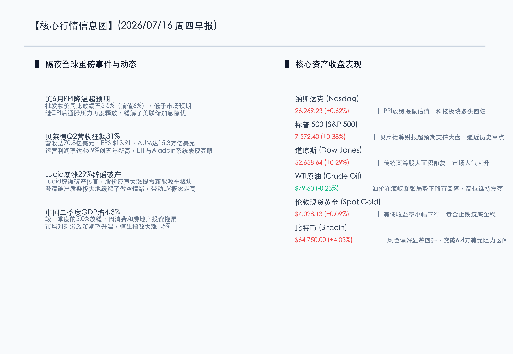

# 批发PPI超预期退潮释重负，贝莱德业绩狂飙引风潮，A股探底回升静待政策新风

**日期：2026年07月16日 (星期四)** &nbsp; **时段：早报 (常规交易日模式)**

> **核心摘要**：隔夜全球市场迎来通胀压力的再度消退。美国6月PPI环比超预期降温至5.5%，显现出通胀放缓的积极走势，极大地缓解了美联储中长期的加息隐忧，推升美债收益率下行并助推科技股与加密市场飙升，比特币突破6.4万美元关口。同时，全球资产管理巨头贝莱德（BlackRock）交出极其亮眼的Q2财报，营收同比增长31%至70.8亿美元，AUM攀升至15.3万亿美元，运营利润率创五年新高。新能源车企Lucid暴涨29%澄清破产谣言，提振电动车板块。国内方面，虽然中国二季度GDP同比增4.3%略逊于预期，但港股在政策预期加码的刺激下强劲反弹，今日A股将在GDP大考落定后，静待重磅政策出炉及分化行情的进一步推演。

## 核心行情复盘

隔夜美股三大股指涨跌互现，科技与金融板块合力托举，但IBM大跌拖累道指表现；大宗商品方面，黄金在美债收益率走低后筑底反弹，原油因地缘紧张情绪维持强势。

*   **纳斯达克指数**：收盘报 **26,269.23点**，上涨 **0.62%**。
*   **标普 500 指数**：收盘报 **7,572.40点**，上涨 **0.38%**。
*   **道琼斯指数**：收盘报 **52,658.64点**，上涨 **0.29%**。
*   **WTI原油**：收盘报 **79.60美元/桶**，下跌 **0.23%**。
*   **伦敦现货黄金**：收盘报 **4,028.13美元/盎司**，上涨 **0.09%**。
*   **10年期美债收益率**：收盘报 **4.545%**，下跌 **3.50个基点**（自4.580%回落）。
*   **比特币 (BTC)**：收盘报 **64,750.00美元**，上涨 **4.03%**（突破6.4万美元关口）。
*   **Lucid (LCID)**：收盘报 **1.82美元**（仅作参考），暴涨 **29.00%**。

在板块及核心个股方面：
*   **领涨板块（美股）**：加密货币及相关区块链概念板块强势反弹，受PPI降温及降息预期升温刺激，风险资产买盘汹涌；新能源车（EV）板块由于Lucid澄清破产传言暴涨而得到情绪修复；此外，金融及资产管理板块在贝莱德优异业绩的拉动下普涨。
*   **领跌板块（美股）**：传统能源及部分防御性板块。油价略有回落，且市场风险偏好明显转向科技与风险资产，防御性红利板块资金出现小幅净流出。

以下为核心行情信息图：

## 核心解读与市场逻辑

> **逻辑一：批发PPI超预期降温，美联储货币紧缩周期见顶的共识愈发牢固**
> 
> 继CPI数据超预期降温之后，美国6月PPI同比放缓至5.5%，明显低于前值的6.0%。这一批发层面通胀数据的下行不仅巩固了零售端通胀降温的趋势，也进一步削弱了美联储再次加息以遏制顽固通胀的逻辑基础。10年期美债收益率应声从4.580%退守至4.545%，给分母端（成长股及加密资产）带来了极大的估值弹性释放，推动比特币暴涨超4%并突破6.4万美元。

> **逻辑二：贝莱德业绩狂飙，ETF与金融科技系统释放出极强的盈利韧性**
> 
> 全球最大资管机构贝莱德Q2财报表现惊艳，其AUM冲至历史新高15.3万亿美元，季度净流入达1920亿美元，显示出强劲的机构投资与ETF配置需求。更引人瞩目的是其科技服务系统Aladdin的强劲表现以及创纪录的45.9%的调整后运营利润率。这显示出尽管宏观环境多变，但全球主流资金正加速通过规范化的金融衍生工具 and ETF涌入优质资产，资管龙头的业绩狂飙也为整个金融及大盘股筑牢了基本面防线。

> **逻辑三：中国Q2 GDP增速略逊预期，触发“坏消息即好消息”的逆向政策期许**
> 
> 7月15日国家统计局公布的二季度GDP同比增长4.3%，虽低于一季度的5.0%且略逊于4.5%左右的市场预期，暴露出当前国内消费偏弱以及房地产投资下行的结构性痛点。然而，市场走势并未出现崩盘，相反，A股探底回升，港股更是大幅上涨1.5%。这一走势清晰地表明，市场已将当前的宏观数据弱势完全定价，并寄希望于7月下旬召开的重磅 Politburo 会议出台力度更强的财政或货币刺激政策。

## 政策脉动

*   **美联储9月降息概率稳步上升**：在CPI与PPI双重降温的利好数据落地后，掉期交易商对美联储9月份降息的预期概率已经逼近70%。市场目前普遍认为，除非地缘危机引爆新一轮油价暴涨，否则通胀回落的下半场趋势已基本确立。
*   **国内政策加码呼声渐高**：随着二季度GDP数据尘埃落定（4.3%），为确保完成全年5%左右的经济增长目标，下半年宏观政策的容错空间在缩小。市场对于宽货币（如降准降息）及宽财政（如增发特别国债、地方债务化解等）的预期正在急速聚集。

## 最新机构观点

*   **高盛 (Goldman Sachs)**：**“PPI与CPI共振降温，风险资产性价比进一步凸显”**。高盛发表报告称，美国二次通胀的担忧已被两份超预期的通胀降温数据彻底驱散。在美债收益率下行的背景下，资金将从超配现金转向超配成长股、加密资产以及贝莱德等拥有强劲内生增长动力的大型金融资管龙头。
*   **摩根士丹利 (Morgan Stanley)**：**“关注海外流动性拐点与国内政策发力的共振效应”**。大摩指出，美联储降息周期的渐行渐近将缓解人民币的外部估值压力。结合中国二季度GDP走弱所激发的下半年强力刺激政策预期，中国资产（尤其是港股科技及A股硬科技）正在迎来极佳的战术性配置窗口。
*   **中信证券 (CITIC)**：**“GDP靴子落地，A股筑底完成并静待会议方向”**。中信证券表示，二季度GDP增速4.3%的落地为市场清除了最大的一块宏观不确定性“靴子”。当前A股估值已处于历史极低水平，悲观情绪充分释放。建议投资者重点关注后续稳增长政策的具体流向，并在配置上逐步从极致红利防御切换到“科技硬核”（AI芯片、半导体设备）与“政策驱动型成长”板块。

## 今日市场情绪：宏图既启，曙光破晓

今日市场呈现出极具张力的“宏图既启，曙光破晓”的情绪画面。一把巨大的、由绿底翡翠电子线路与亮丽金币构筑而成的巨型金融科技钥匙，正徐徐插进并转动着象征全球资本流动的宏伟库房大门；伴随着清脆的机括开启声，那扇冰冷的大理石库门轰然推开。门外，地平线上正冉冉升起一轮炽热而明亮的纯金朝阳，温暖的晨曦穿透了重重的数字迷雾，将原野上那些由翠绿霓虹灯带交织而成的K线“草坪”照耀得熠熠生辉。在天空中，一辆极具科幻感的流线型银色智能跑车仿佛挣脱了重力的束缚，在一片由微小数据光点构成的璀璨星云中平稳滑行，预示着风险资产正在破晓 the 曙光里迎来估值重构与澎湃的新生。

> Prompt: Surrealism style, Subject: A massive, glowing key made of green circuits and golden coins unlocking a giant marble gate of a treasury vault. Background: A warm golden sun rises, illuminating a landscape of green neon candlestick charts growing like grass. In the sky, a distant, sleek electric sports car is gliding through a cloud of sparkling data points. No humans. No text., masterpiece, high detail, intricate composition, cinematic lighting, 8k resolution

---

免责声明：内容仅供参考，不构成投资建议。
