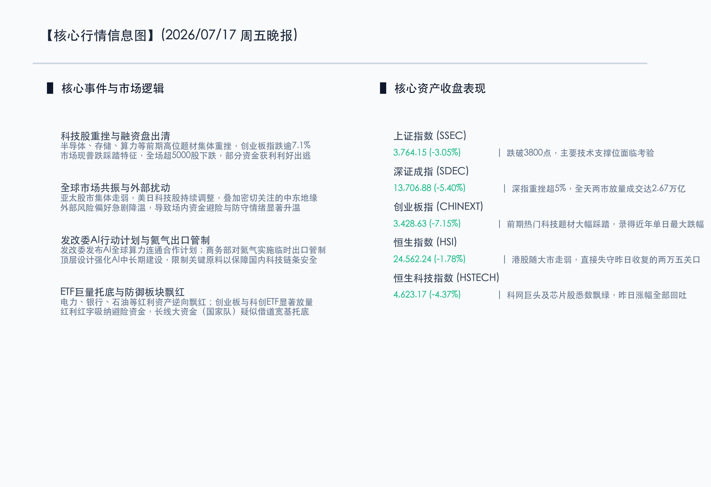

# A股科技重挫创业板大跌逾7%，防守情绪升温红利电力逆市飘红

**日期：2026年07月17日 (星期五)** &nbsp; **时段：晚报 (常规交易日模式)**

> **核心摘要**：今日国内A股市场遭遇深幅回调，创业板指大跌7.15%，科创题材与前期高位芯片、算力、存储等科技成长赛道遭遇获利回吐与融资盘出清的多重踩踏。两市成交额放大至2.67万亿元，呈现放量普跌态势。然而，电力、银行等防御型红利资产逆向吸纳资金防守走强，且多只宽基ETF盘中显著放量，大资金进场托底意图明显。港股恒指亦走弱，收跌1.78%失守两万五关口。

## 核心行情复盘

今日国内A股市场呈现深度调整。前期领涨的高位科技成长题材遭遇获利回吐与杠杆资金出清的双重打击，大盘指数大幅低开低走，但电力、银行等防御红利资产逆市飘红，宽基ETF午后放量明显。港股市场亦大幅回调。

*   **上证指数**：收盘报 **3764.15点**，下跌 **3.05%**。
*   **深证成指**：收盘报 **13706.88点**，下跌 **5.40%**。
*   **创业板指**：收盘报 **3428.63点**，下跌 **7.15%**。
*   **恒生指数**：收盘报 **24562.24点**，下跌 **1.78%**。
*   **恒生科技指数**：收盘报 **4623.17点**，下跌 **4.37%**。
*   **成交额**：沪深京三市合计成交额约为 **2.67万亿元**，较前一交易日放量约 **2500亿元**，显示恐慌盘与杠杆盘加速出清。

*   **领涨行业**：电力、银行、石油天然气等防御型红利资产逆市走强，承接了大量防守型避险资金。
*   **领跌行业**：半导体产业链、电子、通信、存储芯片、电脑硬件、生物科技及机器人等科技板块全线重挫。

## 核心解读与市场逻辑

> **逻辑一：科技成长板块拥挤度偏高，中报期业绩利好兑现触发融资盘踩踏出清**
> 
> 前期科技成长赛道（半导体、算力、存储等）在估值快速拉升后积累了较高的杠杆盘和成交拥挤度。适逢中报披露期，部分披露超预期业绩的企业反而遭遇“利好兑现”的抛售，最终形成多米诺骨牌效应，引发融资盘的主动与被动砍仓，拖累创业板指录得近年最大单日跌幅之一。但这并非产业逻辑的终结，而是慢牛行情中一次猛烈的高位估值清洗。

> **逻辑二：全球科技股共振重挫，外部宏观扰动进一步拉低市场风险偏好**
> 
> 日经225指数及韩股等亚太市场受美股科技股持续调整的影响普遍大幅下挫，形成全球层面的科技板块去杠杆共振。此外，中东地缘局势的再度紧绷也加剧了原油和避险资产的流动性担忧。内外部利空因素的叠加，致使场内风险偏好短期内骤然降低，资金全面倒向防守端。

> **逻辑三：宽基ETF盘中巨量托底，国家队与中长线资金进场保障系统性安全**
> 
> 尽管个股大面积惨烈调整，但今日多只创业板、科创板宽基ETF在午后明显放量逆市拉升，成交额甚至创下阶段新高。这一特征清晰指向以国家队为首的中长线大资金正借道ETF大举申购入市，为脆弱的市场注入关键的流动性护航，有效防范了系统性金融风险的蔓延。

## 政策脉动

*   **人工智能合作发力顶层设计**：国家发改委今日发布人工智能合作发展行动计划，明确指出要推动全球算力设施联通与数据跨境流动，为AI算力产业的长期规模化建设铺路。
*   **关键原料实施临时禁止出口**：商务部宣布对氦气实施临时禁止出口管理，旨在保护国内高端半导体制程及超导科研的供应链原材料安全，体现出对科技安全底线的坚决防守。
*   **ETF托底维护流动性**：监管层继续鼓励中长线资金、养老金、社保基金通过宽基ETF和指数化投资进场，稳定市场情绪。

## 最新机构观点

*   **中金公司 (CICC)**：**“技术性出清释放高位风险，长期看产业逻辑并未逆转”**。中金公司认为，今日大跌是前期拥挤度过高、杠杆资金出清所致。虽然短期承受压力，但AI算力和科技自强的成长逻辑依然成立，大资金ETF托底和中报业绩披露期，建议在波动中寻找估值合理的硬科技龙头。
*   **中信证券 (CITIC)**：**“全球科技共振走低，红利防御正当时”**。中信证券表示，受全球科技板块抛售和地缘局势影响，亚太市场遭遇普跌。在短期情绪敏感期，电力、银行等红利资产表现出较好的防御性。建议投资者短期可进行防御性风格平衡，等待外部流动性和内部杠杆出清后，再聚焦中长期科创板超跌机会。
*   **国泰君安 (GTJA)**：**“宽基ETF大额流入显现托底信号，中报季防守反击优选绩优标的”**。国泰君安指出，创业板和科创50 ETF的盘中显著放量，为市场注入了流动性定心丸。随着中报利好兑现产生的回调，估值将重新回到合理区间，在出清结束后，精选具备业绩确定性的行业核心龙头，开展防守反击。

## 今日市场情绪：电掣风雷，碧阁藏珍

今日的资本市场犹如一幅波澜壮阔而暗藏玄机的“电掣风雷，碧阁藏珍”意境图。虚无的数字高空中，乌云翻滚，深绿色的雷霆风暴裹挟着电路斑驳的数码代码（象征成长科技的大幅整理）狂暴劈下，将一座巍峨的青石古塔顶端击得石屑纷飞、碎影摇曳。古塔之下，波涛汹涌的碧色海洋剧烈翻滚（象征两市的放量震荡）。然而在这场风暴的核心，古塔内部依然隐隐透射出金碧辉煌的防御微光，那是一道坚韧的壁垒（象征ETF及红利板块的逆市托底）。雷暴与深海的交织，展现了成长题材释放估值压力时的惨烈，但也预示着在剧烈洗牌后，中坚价值的基石将更加稳固。

> Prompt: Surrealism style, Subject: A giant ancient stone tower built of code lines, but its top sections are breaking apart under a massive lightning strike. In the background: lightning bolts colored in deep green strike down from stormy dark clouds onto a turbulent teal sea. No humans. No text., masterpiece, high detail, intricate composition, cinematic lighting, 8k resolution

---

免责声明：内容仅供参考，不构成投资建议。
