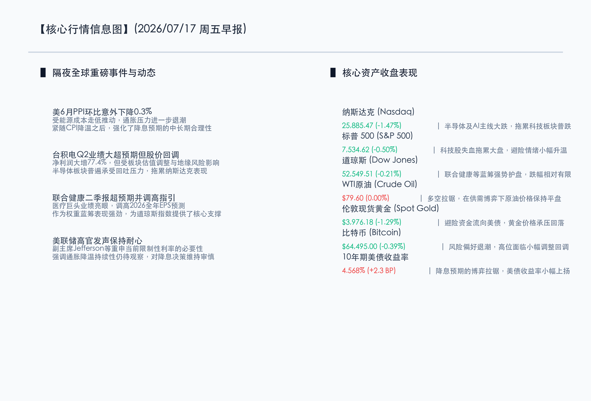
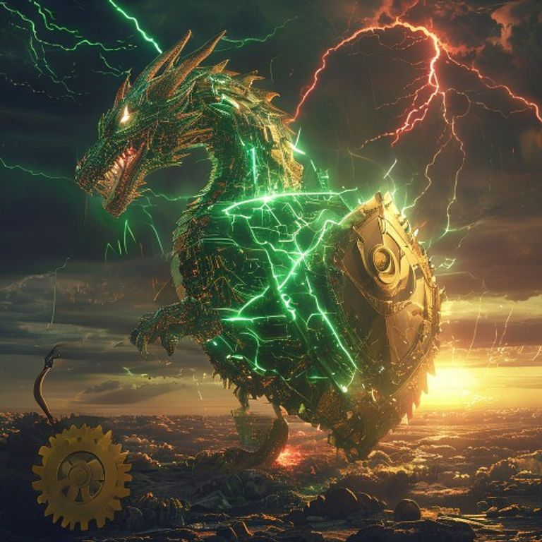

# 科技股回调拖累纳指，PPI超预期退潮缓解通胀，联合健康强势护盘道指显韧性

**日期：2026年07月17日 (星期五)** &nbsp; **时段：早报 (常规交易日模式)**

> **核心摘要**：隔夜全球金融市场呈现显著的分化格局。尽管美国6月PPI环比意外下降0.3%，进一步验证了CPI降温所展现的通胀放缓走势，但美联储高官（如副主席Jefferson）依然维持审慎态度，市场降息预期博弈拉锯，美债收益率小幅回升至4.568%。与此同时，台积电虽交出净利润同比大增77.4%的惊艳财报，仍未能阻挡科技和半导体板块的估值调整压力，纳指大跌1.47%。不过，道指受医疗巨头联合健康（UnitedHealth）绩优并调高指引的支撑，表现较为抗跌。今日A股及港股将在外部科技股承压与通胀放缓利好的交织影响下，延续分化磨底的整固走势。

## 核心行情复盘

隔夜美股三大股指集体收跌，科技主线领跌，而以金融与医疗为代表的传统蓝筹板块相对抗跌；大宗商品方面，黄金在美债收益率回升与避险资金分流作用下明显回调，原油市场多空拉锯，收盘基本持平。

*   **纳斯达克指数**：收盘报 **25,885.47点**，下跌 **1.47%**。
*   **标普 500 指数**：收盘报 **7,534.62点**，下跌 **0.50%**。
*   **道琼斯指数**：收盘报 **52,549.51点**，下跌 **0.21%**。
*   **WTI原油**：收盘报 **79.60美元/桶**，持平 **0.00%**。
*   **伦敦现货黄金**：收盘报 **3,976.18美元/盎司**，下跌 **1.29%**。
*   **10年期美债收益率**：收盘报 **4.568%**，上涨 **2.30个基点**（自4.545%回升）。
*   **比特币 (BTC)**：收盘报 **64,495.00美元**，下跌 **0.39%**。

在板块及核心个股方面：
*   **领涨板块（美股）**：医疗保健及防御性蓝筹板块。联合健康（UNH）因第二季度业绩超出市场预期并上调2026年全年调整后每股收益指引，股价逆势走强，提振了整个防御性红利板块；部分传统公用事业板块也出现避险资金流入。
*   **领退板块（美股）**：半导体与人工智能概念板块。尽管台积电Q2业绩大超预期，但由于前期估值偏高以及宏观不确定性，市场获利回吐压力汹涌，半导体代工及设备制造厂商股票普遍大跌，拖累科技板块全线走低。

以下为核心行情信息图：

## 核心解读与市场逻辑

> **逻辑一：PPI环比意外转降0.3%，批发端通胀退潮为政策宽松留出空间**
> 
> 继日前CPI超预期降温后，美国6月PPI环比出人意料地下降0.3%，主要是由于能源价格大幅回落。这一数据表明批发物价涨幅已降温，企业端的成本压力正在加速缓解，这将在未来数月内继续向下游消费端传导。虽然美联储目前依然保持警惕，但通胀实质性回落的大趋势已经基本明朗，为下半年货币政策的灵活转向奠定了坚实的基础。

> **逻辑二：台积电强劲财报遭遇“买事实”抛售，科技股估值重构步入深水区**
> 
> 台积电在第二季度实现了77.4%的利润同比增长，再次印证了全球AI硬件基础设施建设需求的旺盛。然而，其股价在业绩公布后不涨反跌，并拖累半导体指数大震荡。这表明在经历了长期且高幅度的拉升后，科技板块的估值已经透支了相当一部分业绩预期，市场对于潜在的地缘政治博弈及供应链安全性更加敏感，引发了资金阶段性的获利回吐与防御性切换。

> **逻辑三：传统巨头业绩韧性彰显，资金避险加速重估红利价值**
> 
> 医疗保健龙头联合健康通过强劲的二季度表现以及对全年指引的乐观修正，为道指成功起到了定海神针的作用。这反映出在科技股波动加剧、外部政策博弈未尘埃落定之前，市场资金的避险偏好正在从前期极致的弹性成长转向高确定性的防御蓝筹。这种高现金流、稳健增长的大型实体蓝筹股将成为震荡市中资金的重要避风港。

## 政策脉动

*   **美联储高官强调维持限制性利率的耐心**：美联储副主席Jefferson及多位联储官员在最新讲话中，虽然认可了CPI和PPI的温和表现，但仍然维持审慎基调，认为政策需要时间来进一步确保通胀能持续稳定回落至2%的目标。这一表态使债市在博弈中略显收紧，10年期美债收益率回升至4.568%。
*   **国内稳增长宏观预期积聚**：二季度GDP增速4.3%落地后，市场对宏观政策支持的讨论更加热烈。随着7月下旬关键政策窗口临近，市场对于降低实体融资成本、支持科技创新与扩大地方债发行的政策出台抱有较高预期，政策底部的支撑力量逐步显现。

## 最新机构观点

*   **高盛 (Goldman Sachs)**：**“半导体回调属健康的阶段性休整，AI硬件长期叙事并未改变”**。高盛最新的报告指出，台积电极其优异的财报表明AI需求依然十分紧俏。目前的科技股下跌主要是技术性回撤与地缘政治情绪的共振所致。随着通胀数据的实质性降温，流动性环境在下半年逐步转宽仍是大概率事件，建议在回调中寻找科技核心资产的布局机会。
*   **摩根士丹利 (Morgan Stanley)**：**“关注价值板块在轮动中的超额收益机会”**。大摩分析认为，成长股与价值股的估值差已处于历史高位，在联储政策博弈偏审慎、海外大选临近的复杂背景下，以医疗保健、金融和高分红公用事业为代表的防守型价值股将出现持续的资金流入，阶段性的“去高追低”轮动正在发生。
*   **中信证券 (CITIC)**：**“外部波动难改A股底部特征，耐心等待国内政策催化”**。中信证券表示，美股科技股的剧烈波动在短期内对A股科技硬件板块会带来一定情绪传染，但A股估值早已反映了悲观预期。在外部流动性大拐点确定、国内重磅政策窗口开启的背景下，A股指数筑底迹象清晰。应当坚定守住科技制造与大红利板块的均衡配置，静待政策靴子落地。

## 今日市场情绪：烈火真金，风云试炼

今日市场情绪呈现出“烈火真金，风云试炼”的深邃画卷。一只巨大的、由绿色和金色微芯片交织而成的科幻巨龙正昂首翱翔在风起云涌的天空中。它手中握有一面散发着明亮白色光辉的巨型水晶盾牌，将半空中劈落的赤红色闪电以及数字化的暴风雨悉数挡下。下方的荒野中，一杆巨大的黄金天平正静静伫立，左侧托盘上是一片代表通胀降温（PPI）的翠绿嫩叶，右侧则是沉重的金属齿轮，二者在平衡中暗暗角力。地平线尽头，一轮温暖的金阳从数字云层后徐徐升起，为这片被科技风云试炼的土地带来破晓的微光与新一天的希冀。

> Prompt: Surrealism style, Subject: A colossal silicon dragon made of glowing green and gold microchips is holding a giant shining crystal shield, deflecting jagged red lightning bolts under a dark stormy sky. On the ground below, a massive golden scale is balancing, with a glowing green leaf representing PPI cooling down on one side, and heavy gears on the other. Background: In the background, a warm golden sun is rising on the horizon, casting a soft morning light through the digital clouds. No humans. No text., masterpiece, high detail, intricate composition, cinematic lighting, 8k resolution

---

免责声明：内容仅供参考，不构成投资建议。
