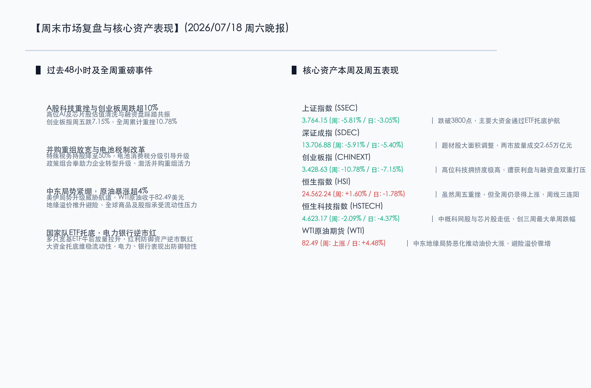
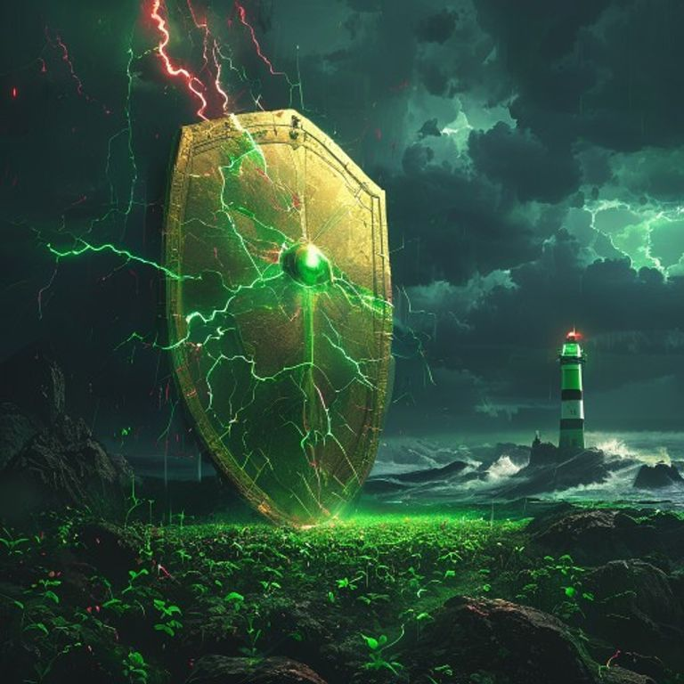

# 全球科技震荡压制成长赛道，大资金ETF托底与政策红利护航避险

**日期：2026年07月18日 (星期六)** &nbsp; **时段：晚报 (周末复盘模式)**

> **核心摘要**：本周全球金融市场遭遇科技与半导体板块的剧烈震荡，A股创业板指全周重挫10.78%，高位拥挤交易及融资盘在业绩期加速去杠杆出清。然而，以电力、银行为代表的防守型红利资产本周逆市飘红，且多只宽基ETF在周五尾盘显著放量，大资金进场托底意图明显。港股恒指虽然周五重挫但全周仍录得1.60%上涨。政策面上，并购重组特殊性税务门槛放宽至50%及电池消费税分级调整，为实体转型与市场活力注入暖意；中东地缘局势紧绷推升油价大涨逾4%，避险情绪有所升温。

## 核心资产周度/日度表现回顾

本周国内及全球主要股指在半导体与科技龙头的杀跌声中普遍承压，市场避险情绪高涨，原油等大宗商品因地缘政治风险溢价而显著拉升。

*   **上证指数**：收盘报 **3764.15点**，周五单日下跌 **3.05%**，全周累计下跌 **5.81%**。大资金通过宽基ETF托底，上证指数在3800点下方表现出较强的承接力量。
*   **深证成指**：收盘报 **13706.88点**，周五单日下跌 **5.40%**，全周累计下跌 **5.91%**。题材股大面积回调，两市合计成交额放大至2.65万亿元。
*   **创业板指**：收盘报 **3428.63点**，周五单日下跌 **7.15%**，全周累计重挫 **10.78%**。半导体、存储、算力等前期高位科技板块遭遇获利盘与融资盘双重踩踏出清。
*   **恒生指数**：收盘报 **24562.24点**，周五单日下跌 **1.78%**，但全周仍累计上涨 **1.60%**，日度走势高开低走，但周线录得三连阳。
*   **恒生科技指数**：收盘报 **4623.17点**，周五单日下跌 **4.37%**，全周累计下跌 **2.09%**。港股科网巨头与芯片概念股全周走弱，创下三周以来最大单周跌幅。
*   **WTI原油期货**：收盘报 **82.49美元/桶**，周五单日大涨 **4.48%**，全周录得显著上涨。中东美伊冲突升级威胁全球航道安全，原油地缘溢价骤增。

## 过去 48 小时重磅事件深度复盘

> **事件一：高位科技成长板块估值清洗，融资盘去杠杆引发踩踏**
> 
> 前期拥挤度偏高、资金介入极深的硬科技赛道（半导体、算力芯片、存储等）在半年报披露窗口遭遇“业绩利好兑现”的集中抛压。在获利了结情绪的扩散下，场内杠杆资金和融资盘加速出清，造成创业板指和科创50指数单日大跌超7%，这也是慢牛行情中一次必要的估值出清。但从长期看，国内科技自强和AI算力的基建逻辑依然未发生逆转。

> **事件二：并购重组税收新规发布，持股比例门槛降至50%**
> 
> 国家税务总局发布企业重组所得税征管新规，将适用特殊性税务处理的持股比例要求从100%大幅下调至50%。这一制度松绑极大地降低了企业并购重组过程中的财务与税务成本，对于当前需要通过并购重组实现做大做强、产业升级的硬科技及传统龙头企业而言，属于重磅政策利好，有助于激活二级市场存量资产整合。

> **事件三：财政部等三部门推电池消费税改革，分级税率引导绿色升级**
> 
> 财政部、税务总局和海关总署联合发布电池消费税分级调整政策，明确规定不同技术路线电池的税率差异，鼓励钠离子、固态电池等新型绿色电池的技术研发 and 应用，对于传统高污染或落后锂电产能进行引导规范。此举标志着新能源电池行业从单一规模扩张迈向高质量与核心技术竞争阶段。

> **事件四：地缘局势突变，美伊冲突升级威胁石油咽喉**
> 
> 过去48小时内，中东美伊局势剧烈恶化，局势升级直接威胁到霍尔木兹海峡等关键全球石油运输命脉。市场避险情绪骤然升温，国际金价在探底4000美元后获得强支撑，而原油市场则展现极强的爆发力，WTI与布伦特油价单日拉升超4.4%。地缘政治风险的传导加剧了全球资本市场的波动和对通胀再次回升的担忧。

## 下周全球宏观大事预警

*   **国内LPR利率报价**：下周一（7月20日）中国央行将公布新一期贷款市场报价利率（LPR）。由于央行在7月中国金融形势通报中继续强调“适度宽松”及“灵活高效”，市场对于结构性降息或LPR调整抱有一定预期。
*   **美联储降息预期再定价**：随着美国进口商品价格指数等通胀指标出现反复，加上地缘局势对能源价格的推升，下周美联储多位官员的公开表态将成为市场重新衡量9月降息幅度的关键窗口。
*   **半年报业绩密集披露**：A股将正式进入中报披露的最密集期，此前预增的科技和新能源细分龙头是否能兑现高增长，将是市场调整止跌的重要观察指标。

## 顶级机构周末策略内参摘要

*   **中信证券 (CITIC)**：**“量化平仓压力释放充分，科技成长调整步入尾声”**。中信证券认为，本周A股大跌是部分杠杆和量化多头策略在极端波动下的被动减仓。当前市场赚钱效应的收缩已趋于充分，AI和核心科技的长周期需求趋势依然明确。在中报业绩兑现期，市场将从概念炒作过渡到绩优股主导，科技板块的底部特征正逐步显现。
*   **中金公司 (CICC)**：**“三季度延续前攻后守，看好半导体细分与出海龙头”**。中金公司指出，当前大盘回调已过度反映了悲观预期。三季度前半段市场仍有政策落地和估值修复的契机，配置上建议攻守兼备，重点关注半导体、先进封装、创新药以及供需格局偏紧的化工等细分赛道，同时利用红利防御资产对冲地缘局势波动。
*   **申万宏源 (SWS)**：**“调整波段进入收尾，新一轮上涨行情徐徐图之”**。申万宏源表示，本轮超跌和动量收缩已较为彻底，下半年新行情将以产业重大趋势催化为基础。短期内，建议投资者不必恐慌盲目割肉，而应将目光移向中报确定性极高的先进制程半导体、AI服务器供应链等紧平衡方向，并结合并购重组新规精选有重组预期的科创标的。

## 今日市场情绪：金盾御雷，深渊重明

今日的市场情绪在超现实主义的画布上被完美呈现为一幅“金盾御雷，深渊重明”的壮烈景象。画面中央，一面由璀璨金币和绿色集成电路构成的巨型金色盾牌从翻滚的乌云中赫然浮现，迎着从天而降的赤红与深绿交织的数码雷霆（象征高位科技赛道雷霆万钧的筹码清洗与去杠杆），散发出坚韧温和的守护光华，下方的大片翠绿秧苗在盾牌的护佑下得以保全（象征国家队大资金申购ETF托底，呵护市场生态与底部流动性）。背景中，深邃黑暗的黑色油海在风暴中剧烈起伏，远处的石造灯塔闪烁着坚定不移的绿色光芒，撕裂了阴霾。这寓示着尽管短期遭遇了估值大洗牌和地缘局势的剧烈风暴，但有防守力量的托底和制度红利的护航，大盘系统性风险已基本被隔绝，黑夜深处正孕育着新的重明曙光。

> Prompt: Surrealism style, Subject: A colossal golden shield emerging from dark clouds to deflect bolts of green and red digital lightning, protecting a field of green seedlings. In the background: a turbulent dark ocean of black oil under a stormy sky, with a massive stone lighthouse casting a steady green beam of light. No humans. No text., masterpiece, high detail, intricate composition, cinematic lighting, 8k resolution

---

免责声明：内容仅供参考，不构成投资建议。
