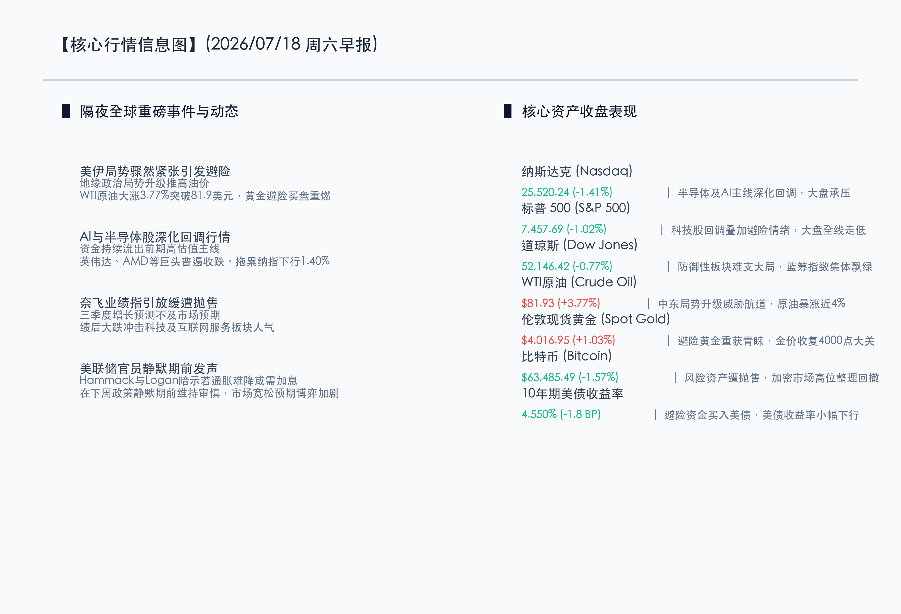
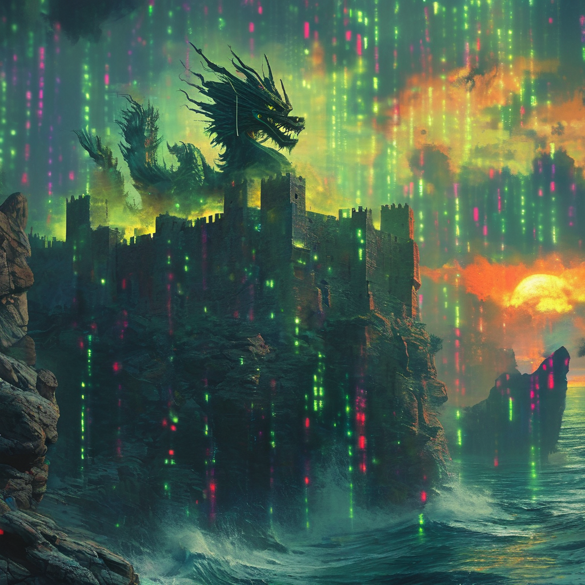

# 美伊冲突升级油价大涨，芯片及AI股延续调整，避险资金回流黄金美债

**日期：2026年07月18日 (星期六)** &nbsp; **时段：早报 (常规交易日模式)**

> **核心摘要**：隔夜全球金融市场呈现显著的地缘避险与板块分化特征。美伊局势骤然紧张引发避险资金大举流入，推动WTI原油暴涨3.77%突破81.9美元，伦敦现货黄金涨1.03%收复4000美元整数关口。与此同时，美股科技股的去估值压力仍在蔓延，英伟达、AMD等人工智能芯片主线继续承压，加之奈飞下季指引增长放缓令市场大失所望、绩后大跌，共同拖累纳指下跌1.41%，标普500下跌1.02%。美联储高官在政策静默期前夕维持审慎偏鹰立场，但美债受地缘避险买盘提振，10年期收益率小幅下行至4.550%。

## 核心行情复盘

隔夜全球市场在避险情绪与估值调整的共振下出现普跌。除黄金、原油因地缘冲突表现强劲外，权益类资产普遍承压，三大股指集体走低，尤以纳斯达克跌幅居前。

*   **纳斯达克指数**：收盘报 **25,520.24点**，下跌 **1.41%**。
*   **标普 500 指数**：收盘报 **7,457.69点**，下跌 **1.02%**。
*   **道琼斯指数**：收盘报 **52,146.42点**，下跌 **0.77%**。
*   **WTI原油**：收盘报 **81.93美元/桶**，上涨 **3.77%**。
*   **伦敦现货黄金**：收盘报 **4,016.95美元/盎司**，上涨 **1.03%**。
*   **10年期美债收益率**：收盘报 **4.550%**，下跌 **1.80个基点**（自4.568%回落）。
*   **比特币 (BTC)**：收盘报 **63,485.49美元**，下跌 **1.57%**。

在板块及核心个量方面：
*   **领涨板块（美股）**：能源、贵金属及传统防御性红利板块。受中东局势骤紧、美伊冲突升级影响，石油服务与勘探板块随油价飙升大幅走强；避险资金涌入令黄金采掘股逆势飘红；医疗保健、公用事业等传统高分红板块在市场重挫中展现防御韧性。
*   **领跌板块（美股）**：半导体芯片、人工智能及互联网服务板块。前期涨幅巨大的AI核心标的（如英伟达、超微半导体等）遭遇获利回吐的持续压力；互联网巨头奈飞（NFLX）虽然二季报超出预期，但由于对第三季度的收入和用户增长指引偏向放缓，导致股价绩后发生显著下挫，进一步拖累了科技股的整体市场情绪。

以下为核心行情信息图：

## 核心解读与市场逻辑

> **逻辑一：美伊冲突骤然升温，地缘博弈引爆原油与黄金双重避险买盘**
> 
> 隔夜中东地缘局势急剧升级，美伊冲突的正面摩擦威胁到了霍尔木兹海峡等全球关键能源航道的安全。这一突发的“地缘黑天鹅”迅速改变了市场短期风险偏好。WTI原油大涨近4%收复81.9美元，凸显了能源供应端的溢价压力。同时，伦敦现货黄金也在地缘摩擦带来的强劲避险需求支撑下重回4000美元大关上方。在外部政治冲突不确定的背景下，传统实物避险资产的避风港效能正在重新得到验证。

> **逻辑二：AI估值调整与互联网龙头业绩指引走弱产生共振，高成长板块轮动深化**
> 
> 本轮科技股的向下修正已进入深水区。一方面，市场对AI硬件设施的极高资本开支和短期投资回报率（ROI）的合理性产生了分歧，高估值的半导体板块承受了阶段性的“挤泡沫”过程。另一方面，奈飞作为互联网风向标，下季度增长指引放缓成为诱发软件与互联网服务板块大跌的导火索。这反映出在当前高利率环境下，市场对高成长型企业业绩弹性的容忍度正在明显走低，促使资金加速从弹性科技向稳定价值链条切换。

> **逻辑三：避险买盘推动美债收益率受避险买盘托底微降，静默期前夕宽松预期依然胶着**
> 
> 尽管在下周联储进入静默期前的最后发声阶段，多位美联储官员维持审慎态度，甚至暗示若通胀表现反复可能需要继续上调利率，但由于地缘政治危机升级，避险买盘涌入美国国债，导致10年期美债收益率收盘回落至4.550%。这反映出当前市场的多重博弈特征：地缘局势导致的流动性避险与联储降息周期的时点博弈正在暗暗角力，美债的短期避险属性主导了昨夜收益率的走低。

## 政策脉动

*   **美联储高官维持鹰派防御姿态**：克利夫兰联储主席Hammack在最新讲话中表示，从企业和消费端收到的反馈看，对抑制通胀的诉求依然迫切。达拉斯联储主席Logan更是重申，可能需要“适度更高的利率”才能让物价完全回归目标。这一行人在静默期前夜的密集偏鹰声浪，使得市场对9月及以后的降息预期在博弈中维持紧缩弹性。
*   **国内稳增长政策前瞻预期渐强**：虽然近期面临外部科技股大幅波动的压力，但国内宏观政策底的预期正在不断走高。随着7月下旬关键政治局会议窗口的临近，市场对于进一步降低中小企业融资成本、出台支持高科技制造业自主可控的政策、以及加快地方政府债券发行速度具有高度期待。这些增量政策若能落地，将为下半年内需 and 资本市场筑底提供强力催化。

## 最新机构观点

*   **高盛 (Goldman Sachs)**：**“AI基础设施的长期基本面依然稳固，近期震荡为良性洗牌”**。高盛最新的全球策略报告指出，AI硬件板块的这轮大跌主要是流动性轮动和地缘政治情绪的叠加影响，并非商业模式的破裂。相比dot-com时代，当前科技巨头均拥有丰厚现金流和明确的变现路线图。高盛建议投资者在回调的底部区域逐步建立AI核心硬科技资产的长线头寸。
*   **摩根士丹利 (Morgan Stanley)**：**“关注避险波动中防御红利资产的超额价值”**。大摩策略团队分析称，随着中东冲突加剧和科技巨头业绩指引透露出放缓迹象，价值股和红利板块的抗风险特性正得到体现。公用事业、大型医疗保健和消费红利公司将在这波高波动中获得明显的资金重配溢价。
*   **中信证券 (CITIC)**：**“海外波动难改A股筑底格局，均衡配置守住政策催化”**。中信证券表示，海外科技主线的回调短期对国内半导体和通信设备链条产生一定情绪共振，但A股市场已处于极低估值分位，对利空钝化明显。操作上应保持耐心，维持大红利与科技制造的均衡配置，静待7月下旬国内重磅稳增长政策的出台。

## 今日市场情绪：磐石御火，云破天光

在Surrealism超现实主义风格下，今日市场呈现出一幅“磐石御火，云破天光”的壮阔画面。在电闪雷鸣、绿光粼粼的代码暴雨天空中，一座饱经沧桑的古老石堡静静伫立在陡峭的悬崖峭壁之上。海面上怒涛汹涌，一条由翻滚的黑色原油和液态黑金凝聚而成的巨龙自海心腾空而起，正口吐炽热而明亮的金色烈焰。半空中，一面由纯粹白光编织而成的巨大光盾巍然耸立，将天空中倾泻而下的赤红色闪电和数字风暴悉数挡在城堡之外。而在海平线的尽头，一轮初升的晨曦正穿透重重数字云雾，将温暖而柔和的金芒洒在城堡的石墙与泛起微光的波涛上，带来破晓的希冀与安宁。

> Prompt: Surrealism style, Subject: An ancient stone fortress on a rocky cliff under a storm of neon green binary code rain. A majestic dragon made of glowing dark oil and liquid black gold rises from the ocean below, breathing warm golden fire. A giant luminous shield made of pure light deflects jagged red lightning bolts in the sky. Background: In the far distance, a warm morning sun is rising, casting golden light through the dark clouds. No humans. No text., masterpiece, high detail, intricate composition, cinematic lighting, 8k resolution

---

免责声明：内容仅供参考，不构成投资建议。
