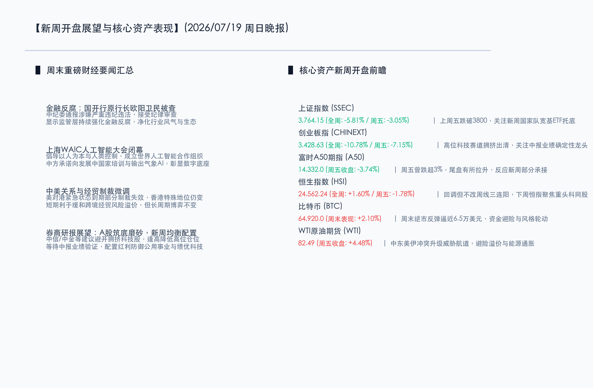

# 金融反腐强力清风开局，智能大合唱筑梦WAIC，新周磨底静待配置均衡

**日期：2026年07月19日 (星期日)** &nbsp; **时段：晚报 (新周展望模式)**

> **核心摘要**：本周末，国内金融监管领域迎来重磅反腐重拳，国开行原行长欧阳卫民接受审查调查，彰显监管层肃清行业生态与信用体系的坚决态度；2026上海世界人工智能大会（WAIC）顺利闭幕，中方推动成立“世界人工智能合作组织”，倡导以人为本与多边安全合作。经历上周A股在科技股高位去杠杆冲击下的深幅调整后，各大机构普遍认为当前市场已处于恐慌底部区间，新周LPR利率报价及密集披露的中报业绩将是多空博弈的关键变量。周末比特币逆市反弹逼近6.5万美元，中东地缘局势仍支撑原油高位运行，建议开盘后采取均衡防御策略，向低估值红利及绩优成长分流。

## 周末财经要闻终极汇总

本周末，全球与国内宏观政策、金融反腐以及前沿科技合作领域均有重磅消息落地。市场流动性预期的调整和避险资产的活跃，对新一周A股与港股开盘情绪构成错综复杂的支撑。

*   **金融反腐重磅落地**：7月19日，中央纪委国家监委官方通报，国家开发银行原党委副书记、副董事长、行长欧阳卫民涉嫌严重违纪违法，目前正接受纪律审查和监察调查。监管风暴的持续深入，有助于从根本上净化实体融资的信用链条，利好中长期金融市场的健康稳定运行。
*   **2026世界人工智能大会（WAIC）闭幕**：大会在上海顺利落下帷幕。中国在此次大会期间联合28个国家成立了“世界人工智能合作组织”（总部设在上海），并向发展中国家承诺提供5000个AI培训机会及提供“妈祖”气象AI服务。中方着重倡导“以人为本”与“人类控制”理念，显示出在AI全球治理和技术标准制定中的主导权。
*   **中美对港制裁微调**：美国对港国家紧急状态声明到期失效，解除了部分前期无关大局的行政制裁，不过整体撤销香港特殊待遇的法案仍在运行。该事件的微调在边际上略微舒缓了近期紧绷的地缘风险溢价。
*   **富时中国A50期指宽幅震荡**：上周五富时中国A50期指在经历盘中重挫超3%的考验后强劲反弹，收盘报 **14332.0点**，跌幅收窄至 **3.74%**。反映出大资金在低位有较强的心态托底。
*   **比特币（BTC）逆市回升**：比特币在周末表现强劲，累计上涨约 **2.10%**，最高价格逼近 **65,000美元**，显示出高风险偏好的全球流动性仍在寻找波动机会，市场避险情绪在向加密资产轮动。
*   **WTI原油期货**：上周五收盘暴涨 **4.48%**，报 **82.49美元/桶**。中东美伊冲突升级威胁全球航道安全，原油地缘溢价骤增，需警惕后续通胀预期的反复对降息的掣肘。

## 新一周市场核心博弈逻辑

*   **逻辑一：融资盘去杠杆后的宽基ETF托底效应**
    上周A股各大股指，特别是创业板指（全周跌幅-10.78%）遭遇科技题材股估值大清洗与融资平仓踩踏。然而，周五尾盘多只宽基ETF（沪深300、上证50）显著放量，大资金进场呵护底部流动性的底牌已现。新一周开盘，市场首要博弈点在于这股托底资金能否有效平抑题材股的二次杀跌，并引导指数在底部稳步筑底。
*   **逻辑二：中报业绩期验证与估值修正的博弈**
    高位AI硬件与半导体板块在情绪退潮后泥沙俱下，但科技自强的底层逻辑并未发生逆转。随着下周正式中报披露进入密集期，市场将从前期的概念乱战走向“业绩硬碰硬”的阶段。只有拥有确定性订单、高景气度兑现能力的科技细分龙头才可能率先止跌反弹，成为新一轮行情的领头羊。
*   **逻辑三：输入性通胀与外部加息周期的制约**
    美伊局势恶化使得原油暴涨超4%，大宗商品的死灰复燃无疑加剧了全球抗通胀的难度。新一周市场需要关注油价对海外央行利率态度的边际影响。若原油持续在高位站稳，可能拖累降息进度，压制跨境资产的估值上限。

## 本周重磅经济数据与会议前瞻

*   **7月20日（周一）：中国最新LPR报价公布**
    周一开盘前，中国央行将公布最新一期贷款市场报价利率（LPR）。在近期多次强调“适度宽松”及“灵活高效”的货币政策背景下，市场对于央行通过利率微调来托底内需、激发信贷活力的呼声极高。若LPR出现结构性下调，将成为A股及港股筑底反弹的强力引擎。
*   **A股中报业绩披露迎来关键洪峰**：多只硬科技（半导体、光通信、服务器设备）及顺周期龙头将于本周内披露中报详情，市场将在业绩高增长兑现与不及预期的多空拉锯中确认底部支点。
*   **美联储降息预期再定价**：下周多位美联储决策官员将进行公开讲话，这通常是美联储7月议息会议前的核心发声期，对于跨境流动性风向至关重要。

## 头部券商/投行开盘策略点睛

*   **中信证券 (CITIC)**：**“融资盘被动平仓接近尾声，超跌反弹一触即发”**。中信证券认为，上周A股大跌是极端波动下的交易结构崩塌与被动平仓共振，而非基本面恶化。随着大资金通过宽基ETF持续买入，A股的底部区间已经确立，新的一周市场将逐步消化反腐等周末消息，并在中报绩优成长股的带领下重构上行通道。
*   **中金公司 (CICC)**：**“在均衡配置中等待出击，看好红利托底与科技出海”**。中金公司指出，国内经济基本面虽有波折但政策方向坚定，短期市场受外部地缘和内部拥挤度制约。操作上建议开盘后保持均衡仓位，一手防守以银行、公用事业为代表的高股息资产，一手进攻重点筛选中报高增长、受益于AI出海的绩优科技标的。
*   **申万宏源 (SWS)**：**“悲观情绪已释放充分，围绕业绩主线逢低精选”**。申万宏源表示，本轮去杠杆出清十分彻底，不必在低位盲目割肉。新一周开盘，建议多看少动，密切关注具备并购重组预期和中报高兑现度的科技、高端装备方向，这些品种在此轮杀跌中被错杀，已具备极高的长期配置性价比。

## 今日市场情绪：清风净殿，绿林锁金

今日的市场情绪在超现实主义的画布上被呈现为一幅“清风净殿，绿林锁金”的洗涤与生机图景。画面中央，一座宏伟的白色大理石金融神殿矗立于天地间，一股强劲澄澈的清风正将天空中滚滚而来的暗红色金融雷暴乌云彻底吹散，露出背后的深邃蓝天（象征金融反腐重拳落地，涤荡行业污垢，净化信用风气）。在神殿身旁，一棵由绿色半导体集成电路与金币交织而成的巨型科技之树拔地而起，粗壮的根系深深地锁入大地泥土中，散发着沉稳的温润绿光（象征大资金申购ETF托底，大盘牢固锁住底部流动性，防守反击正在孕育）。背景中，一轮温暖巨大的金色朝阳从地平线冉冉升起，大群洁白的神圣飞鸽带着绿色的橄榄枝飞向朝阳（象征WAIC顺利闭幕及多边智能合作组织起航，新的一周在底部孕育着合作与重生的希望）。

> Prompt: Surrealism style, Subject: A serene white marble temple of finance stands tall, with a strong, clean breeze blowing away dark red storm clouds. Beside the temple, a colossal tree woven from green circuit boards and golden coins extends deep roots to anchor into the earth. In the background: a massive golden sun rises over the horizon, casting warm light. A flock of glowing white doves fly towards the sun, carrying green olive branches. No humans. No text., masterpiece, high detail, intricate composition, cinematic lighting, 8k resolution

---

免责声明：内容仅供参考，不构成投资建议。
