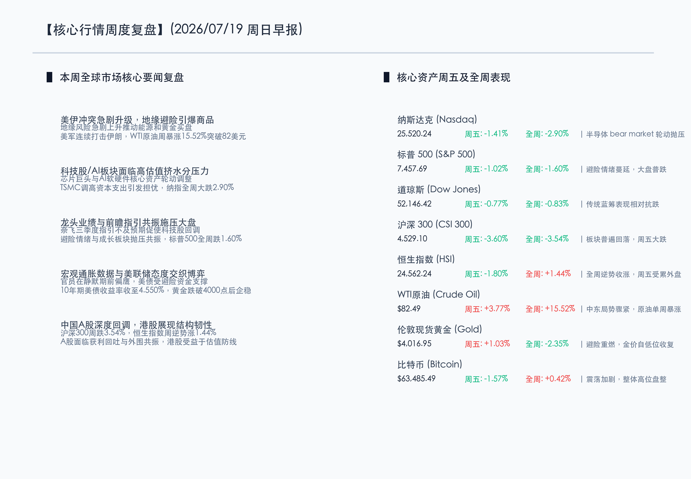
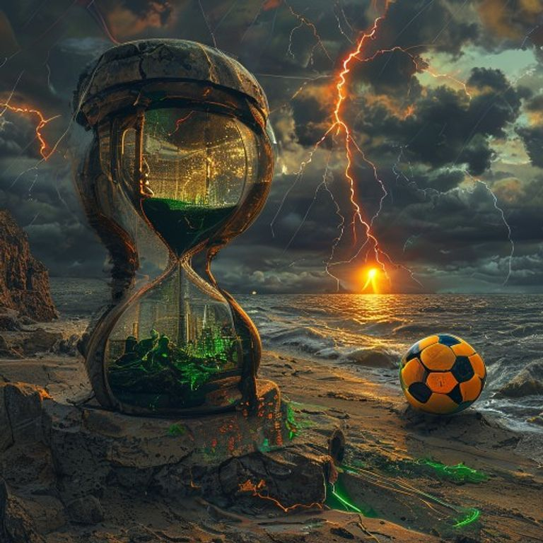

# 地缘烽烟骤起黑金飙涨，科技主线深幅修正去估值，新周开启静待政策与财报检验

**日期：2026年07月19日 (星期日)** &nbsp; **时段：早报 (周末复盘模式)**

> **核心摘要**：本周全球金融市场展现出剧烈的避险与结构分化特征。美伊冲突急剧恶化导致海湾地缘局势爆表，引爆大宗商品溢价，WTI原油单周暴涨15.52%突破82.49美元/桶，创下近年最大单周涨幅。与此同时，全球科技板块迎来深幅调整，由于TSMC调高资本支出指引引发设备成本与毛利率担忧，叠加奈飞下季度指引表现不佳，科技股“估值挤水分”踩踏加剧，费城半导体指跌入技术性熊市，拖累纳指全周大跌2.90%，标普500跌1.60%。国内A股市场共振回调，沪深300指数单周重挫3.54%，而港股恒生指数则逆势展现出较强的结构韧性，全周收涨1.44%。新一周市场将迎来欧洲央行利率决议及中国LPR等重磅事件考验，多空博弈依然胶着。

## 核心资产周度/日度表现回顾

本周在全球地缘风险爆发与科技板块去杠杆去估值的双重共振下，权益类资产整体呈现回调走势，尤以纳斯达克及中国A股主板跌幅较深。商品市场则因地缘博弈爆发了史诗级的能源大涨，黄金亦展现避险韧性。

*   **纳斯达克指数 (Nasdaq)**：收盘报 **25,520.24点**，周五单日下跌 **1.41%**，全周累计下跌 **2.90%** 🟢。
*   **标普 500 指数 (S&P 500)**：收盘报 **7,457.69点**，周五单日下跌 **1.02%**，全周累计下跌 **1.60%** 🟢。
*   **道琼斯指数 (Dow Jones)**：收盘报 **52,146.42点**，周五单日下跌 **0.77%**，全周累计下跌 **0.83%** 🟢。
*   **沪深 300 指数 (CSI 300)**：收盘报 **4,529.10点**，周五单日下跌 **3.60%**，全周累计下跌 **3.54%** 🟢。
*   **恒生指数 (HSI)**：收盘报 **24,562.24点**，周五单日下跌 **1.80%**，全周累计上涨 **1.44%** 🔴。
*   **WTI 原油 (Crude Oil)**：收盘报 **82.49美元/桶**，周五单日上涨 **3.77%**，全周累计上涨 **15.52%** 🔴。
*   **伦敦现货黄金 (Gold)**：收盘报 **4,016.95美元/盎司**，周五单日上涨 **1.03%**，全周累计下跌 **2.35%** 🟢。
*   **比特币 (Bitcoin)**：收盘报 **63,485.49美元**，周五单日下跌 **1.57%**，全周累计上涨 **0.42%** 🔴。

以下为核心行情信息图：

## 过去 48 小时重磅事件深度复盘

> **事件一：美伊冲突与海湾地缘政治危机急剧升级，能源溢价爆表**
> 
> 过去48小时内，中东局势的恶化对全球商品市场产生了历史性的冲击。美军连续多晚对伊朗境内目标发起军事打击，作为反击，伊朗军方对美军多处基地进行了猛烈回应。美军在约旦抵御袭击期间已有两名人员阵亡，另有一人失踪。霍尔木兹海峡及海湾航道的安全性面临近年来最严峻考验，能源供应风险溢价迅速被市场计入。WTI原油单周狂飙逾15%，再次表明商品市场的地缘博弈已成为当下左右通胀和宏观流动性预期的关键变量。

> **事件二：半导体估值修正与巨头业绩指引失速产生共振，科技拥挤筹码加速出清**
> 
> 本周全球硬科技与AI产业链遭遇阶段性“寒流”。尽管台积电（TSMC）公布了强劲的季度业绩，但其宣布大幅提升2026年资本开支至600-640亿美元，令市场担忧昂贵的半导体设备成本将对未来毛利率及资本回报率（ROI）构成挤压。同时，中国初创企业月之暗面推出“Kimi K3”模型，引发市场对“未来先进AI应用是否需要如预期般庞大算力支撑”的讨论。在海外科技巨头奈飞（Netflix）对三季度增长给出偏弱的前瞻指引后，获利回吐引发踩踏，费城半导体指数自高点已回调20%，标志着AI硬件产业链拥挤筹码正加速出清。

> **事件三：中国数据基础建设稳步提速，大飞机首航出海迈向新里程碑**
> 
> 在产业与技术层面，国内新质生产力建设在周末传来利好。中国已建成高质量数据集达12万个，总体量超过1565PB，数据标注及AI基建产业链的规模化发展正为国产人工智能演进夯实底座。此外，我国成功发射了首批太空计算卫星，开启太空算力网络的商业运行。在高端制造方面，C919国产大飞机确定将于8月12日首飞北京至乌兰巴托的国际商业航线，柬埔寨国家航空亦宣布大规模采购C909，国产民航客机的商业国际化进程进入加速阶段。

> **事件四：周末焦点要闻与社会关切**
> 
> 2026年美加墨世界杯决赛将于今日（7月19日）打响，由西班牙队决战阿根廷队，全球政要及球迷目光均投向美国决赛现场。在国内方面，针对重庆彭水县山体崩塌灾害，国务院已派出工作组赶赴现场指导搜救和应急处置。在文化艺术界，著名作曲家、小提琴协奏曲《梁祝》主要创作者之一陈钢先生于7月18日凌晨逝世，享年91岁，其卓越的艺术成就为后人留下了宝贵精神财富。

## 下周全球宏观大事预警

新一周市场将迎来欧洲央行利率决议及多个主要经济体通胀数据的洗礼，同时美股Q2财报季逐步步入深水区。

*   **周一 (7月20日)**：
    *   **中国**：中国人民银行将公布最新贷款市场报价利率（LPR）。在稳增长政策预期强烈的背景下，市场密切关注本次LPR的报价动向。
    *   **美国**：公布6月谘商会领先指标（LEI），用于研判美股与美国经济的动能。
    *   **加拿大与新西兰**：公布最新CPI通胀数据，对各自央行的降息预期进行纠偏。
*   **周二 (7月21日)**：
    *   **英国**：发布6月劳动力市场报告。
    *   **欧元区**：欧央行发布第二季度银行借贷调查（BLS），为周四的利率政策决议提供关键线索。
*   **周三 (7月22日)**：
    *   **英国**：公布6月核心及未季调输入CPI年率，评估英国央行的抗通胀进展。
*   **周四 (7月23日)**：
    *   **欧元区**：**欧洲央行 (ECB) 宣布最新利率决议**。这是下周最具影响力的全球央行大事，市场密切关注拉加德对于三季度降息路径的暗示。
    *   **日本**：公布6月全国核心CPI数据，事关日本央行常态化货币政策的推进。
*   **周五 (7月24日)**：
    *   **全球**：美、欧、英等主要经济体将密集公布7月S&P Global采购经理人指数（PMI）初值。该数据是衡量下半年全球经济景气度的最直接指标。
    *   **企业财报**：下周包括通用汽车（GM）、3M、诺华制药（Novartis）、英特尔（Intel）在内的传统价值蓝筹及科技巨头将陆续披露季报，财报业绩及指引将直接决定板块的轮动方向。

## 顶级机构周末策略内参摘要

*   **高盛 (Goldman Sachs)**：**“科技股拥挤交易局部出清，高波环境中关注传统价值与能源”**。高盛最新的周末策略报告指出，本周费半指数的重挫是典型的过度拥挤导致的去杠杆与估值重置，并非AI基本面的逆转。然而，鉴于中东冲突升级对全球通胀预期的传导，以及10年期美债收益率的再度反弹，高盛建议投资者短期在投资组合中增配传统能源及公用事业等红利价值股，以缓释科技股波动带来的净值冲击。
*   **摩根士丹利 (Morgan Stanley)**：**“地缘政治风险溢价重构，降息博弈偏向审慎偏鹰”**。大摩策略团队认为，美伊冲突导致WTI原油本周暴涨15%，极易引发输入型通胀复苏，进而对欧美的降息空间形成边际挤压。在这种宏观天花板受到压制的背景下，防御性现金流和能源红利资产（石油、煤炭、电力）成为本周资金的配置高地。策略上，在科技筹码换手完成前，高息公用事业股仍有出色的安全边际。
*   **中信证券 (CITIC)**：**“外部波动与杠杆出清构成共振，坚守业绩与大盘红利底仓”**。中信证券表示，A股大盘及创业板在周五遭遇较大跌幅，主要是全球科技股调整共振、中报期部分高位股利好兑现以及融资盘出清带来的多重影响。当前A股整体估值分位数已处于绝对低位，ETF在盘中的巨额托底已展现系统性防线。建议投资者在新一周博弈中维持耐心，以业绩确定性高、估值底盘扎实的红利资产作为防守重心，并静待稳增长政策的进一步落地。

## 今日市场情绪：烽烟落子，绿茵晨曦

在超现实主义风格下，今日市场呈现出一幅“烽烟落子，绿茵晨曦”的奇幻画卷。一片广袤的海岸沙滩上，矗立着一座巨大的裂纹玻璃沙漏。沙漏之中流淌的不是沙子，而是翻滚的黑色原油，正逐渐吞没一块黯淡的翠绿色芯片电路板（象征本周WTI暴涨与科技股去估值的剧烈冲突）。而在沙漏之旁，一颗由纯金与霓虹绿线编织而成的巨大足球巍然静置于古老的石质底座之上，折射出大奖赛决赛前夕的狂热与希冀。天空中，赤红色的地缘惊雷劈开滚滚乌云，而在海平线的尽头，一轮初升的旭日正冲破黑暗，洒下温暖而柔和的金芒，预示着风险出清后新一周的博弈与希望。

> Prompt: Surrealism style, Subject: A giant cracked sand hourglass on a coast. Inside the hourglass, thick dark crude oil flows downward, submerging a decaying green digital circuit board. In the background: a massive golden soccer ball decorated with glowing neon green lines sits on a stone pedestal. Jagged red lightning strikes down from dark storm clouds, but a warm morning sun is rising in the far distance, casting golden rays. No humans. No text., masterpiece, high detail, intricate composition, cinematic lighting, 8k resolution

---

免责声明：内容仅供参考，不构成投资建议。
