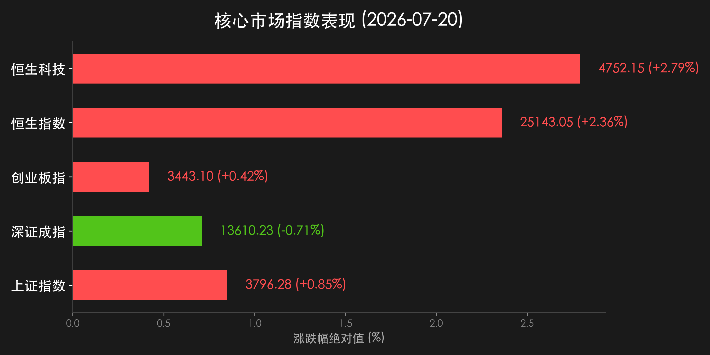

# A股震荡分化沪指与创业板收涨，港股狂飙超2%红利防守强劲

**日期：2026年07月20日 (星期一)** &nbsp; **时段：晚报 (常规交易日模式)**

> **核心摘要**：今日国内A股市场呈现深幅震荡与结构分化走势，沪指收涨0.85%升至3796.28点，创业板指盘中深V翻红微涨0.42%，全天成交额达2.72万亿元。石油天然气、煤炭、电力及金融等防御型红利资产强劲拉升，承接防守资金；而芯片、半导体及PCB等高位科技板块延续去杠杆与调整压力。港股市场强势大反攻，恒生指数狂飙2.36%，恒生科技大涨2.79%。央行公布7月LPR保持不变，展现宏观政策定力，长线大资金逆周期配置托底底座稳固。

## 核心行情复盘

今日国内A股与港股市场呈现明显分化与修复格局。A股在经历前期高位科技股回调后，主力资金流向呈现避险与红利资产倾斜，沪指在重估资产带动下红盘高走，创业板指成功下探回升。港股科网与创新药全面爆发。

*   **上证指数**：收盘报 **3796.28点**，上涨 **0.85%** (+32.13点)。
*   **深证成指**：收盘报 **13610.23点**，下跌 **0.71%**。
*   **创业板指**：收盘报 **3443.10点**，上涨 **0.42%**。
*   **恒生指数**：收盘报 **25143.05点**，上涨 **2.36%** (+580.81点)。
*   **恒生科技指数**：收盘报 **4752.15点**，上涨 **2.79%** (+128.98点)。
*   **成交额与资金流向**：沪深京三市合计成交额达 **27183亿元**（约2.72万亿元）。主力资金全天净流出 **609.01亿元**，其中紫光股份、宁德时代、利通电子、海光信息及紫金矿业获主力资金大幅逆市净流入。

*   **领涨行业**：石油天然气、煤炭、电力、保险、白酒及港股互联网科技与创新药概念板块集体强势。
*   **领跌行业**：电子元器件、PCB、存储芯片、半导体产业链及部分高估值硬件板块跌幅居前，全市场跌多涨少，个股分化明显。

## 核心解读与市场逻辑

> **逻辑一：LPR报价按兵不动展现政策定力，稳息差与观望基本面成为宏观主调**
> 
> 央行公布最新一期LPR数据，1年期与5年期以上品种均与上月持平，符合市场主流预期。政策保持定力表明高层在当前复杂宏观与外部金融扰动下，更倾向于保持流动性合理充裕并兼顾银行息差稳定，为后续可能的降息降准保留工具箱空间，奠定了大盘中长期稳健运行的基础。

> **逻辑二：高低切换与结构避险同步展开，石油电力红利成为避风港**
> 
> 前期拥挤度偏高、获利盘丰厚的科技成长股遭遇持续出清与消化，场内资金自发向低估值、高股息、强现金流的传统能源与防御红利资产（石油、煤炭、电力、金融）转移。资金的高低切换有效对冲了科技砸盘对上证指数的拉低效应，支撑沪指反弹重回3790点上方。

> **逻辑三：港股估值修复大爆发，海外流动性共振预期回暖**
> 
> 港股恒生指数与恒生科技指数当日出现单日强力大反攻（分别大涨2.36%和2.79%）。外资机构近期连续上调中国资产评级，在经历海外流动性扰动后，低估值兼具高弹性的港股科技股与创新药标的展现极强估值修复弹性，吸引国际长线资金加速回流。

## 政策脉动

*   **央行LPR利率保持稳定**：中国人民银行授权全国银行间同业拆借中心公布，2026年7月20日LPR为：1年期3.0%，5年期以上3.5%，均与上期持平。
*   **长线资金逆周期配置护航**：监管部门继续引导保险资金、国家队及养老金等中长线资金通过宽基ETF加大对科技成长与红利资产的均衡配置，太保等头部险资明确表态长期看好中国权益市场。
*   **科技与产业政策引导**：多部门明确将继续加大对传统制造业绿色升级与新型电力系统建设的融资支持，推动能源重仓资产与科技基础设施的协调发展。

## 最新机构观点

*   **花旗集团 (Citi)**：**“上调中国股票配置评级，看好涨势扩展下的全面受益”**。花旗认为随着全球资产再平衡及中国市场涨势范围的显著拓宽，中国股票已进入极具吸引力的战略配置区间，低估值与基本面韧性将推动资金持续涌入。
*   **中金公司 (CICC)**：**“LPR持平符合预期，市场进入阶段性结构盘整与估值修复期”**。中金表示，A股基本面稳固并没有改变，短期波动源于前期拥挤度释放与海外共振。建议重点关注业绩确定性高的硬科技龙头以及具备防御属性的高股息红利。
*   **中信证券 (CITIC)**：**“避险资金承接有力，结构分化后等待新一轮主线明朗”**。中信证券分析指出，今日石油电力等板块的拉升凸显了避险力量的坚韧，科技股筹码在震荡后渐趋健康。随着下半年政策宽松窗口的打开，市场整体风险偏好有望再度回升。

## 今日市场情绪：金秤立基，红利护航

今日的资本市场犹如一幅“金秤立基，红利护航”的超现实图景。在蔚蓝平静的海面上，黑色的原油岛屿与闪耀的煤炭基石拔地而起，一座散发着璀璨金光的巨型天秤稳稳立于其上（象征红利防御资产与重估价值的定海神针）。天秤周围，红色与绿色的K线光柱交错交织（象征场内多空资金的剧烈博弈与高低切换）。远方的地平线上，数码网格渐变为温暖的光芒，预示着在经历风雨洗礼与结构洗牌后，市场终将迎来更加稳健与理性的价值复苏之路。

> Prompt: Surrealism style, Subject: A glowing golden scale standing firm on an island of black oil and glittering coal, surrounded by towering red and green candlestick pillars rising from a calm ocean under a clear dawn sky. In the background: distant digital grid lines fading into warm light. No humans. No text., masterpiece, high detail, intricate composition, cinematic lighting, 8k resolution

---

免责声明：内容仅供参考，不构成投资建议。
