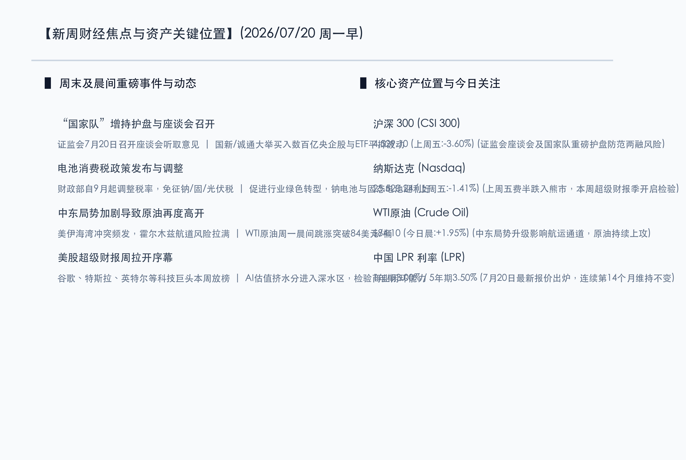

# 国家队重磅入场托底信心，电池税改落地利好新能车，超级财报周拉开AI价值检验大幕

**日期：2026年07月20日 (星期一)** &nbsp; **时段：早报 (新周展望模式)**

> **核心摘要**：新周伊始，国内市场迎来密集信心护盘信号。证监会于今日（7月20日）召开座谈会听取稳定市场意见，国新投资及中国诚通大举买入央企股票与ETF，释放强力稳市预期；同时，电池产品消费税调整新规落地，钠离子及固态电池免税促进行业绿色转型。然而全球市场仍面临考验，中东美伊冲突恶化推动 WTI 原油晨间跳涨突破 84 美元，费半指数跌入技术性熊市后，本周将迎来谷歌、特斯拉等美股科技巨头二季报放榜，AI估值出清正步入深水期。

## 周末财经要闻终极汇总

周末至今日晨间，全球宏观及产业层面涌现一系列重大政策与事件，将对新一周开盘及各板块走势产生主导作用。

### 1. 证监会今日召开座谈会，“国家队”百亿资金持续增持护盘
> **事件原因与核心解读**：多家市场机构及上市公司收到通知，定于7月20日参加证监会专题座谈会，就促进资本市场平稳健康发展建言献策。与此同时，“国家队”护盘资金实质性流入：国新投资已动用超500亿元再贷款及配套资金增持央企股票，中国诚通亦累计买入近百亿元股票与ETF，并表示将继续增持。针对市场关注的两融集中爆仓传言，多家券商出面澄清未现大规模平仓，风险整体可控。监管层与“国家队”的双重护盘动作有效稳定了市场底线情绪。

### 2. 三部门调整电池消费税，免征钠离子与固态电池税目
> **核心解读与市场洞察**：财政部、海关总署、税务总局发布公告，自2026年9月1日起分步调整电池消费税，对钠离子电池、固态电池、燃料电池及部分光伏电池免征消费税。这一税改动作精准指向我国新能源电池供应链升级的薄弱环节，为具备高景气预期、但尚未完全量产的钠离子与固态电池产业链腾出了宝贵的盈利空间，开盘后新能源、电池化学材料、光伏板块有望迎来景气重估。

### 3. 中东局势重燃油价高开，WTI原油周一晨间上攻突破 84 美元
> **事件背景与宏观影响**：美伊在海湾及霍尔木兹海峡冲突升级，地缘避险买盘再度被点燃。周一开盘后，WTI原油及布伦特原油大宗商品期货持续走强，WTI原油冲冲冲破84美元/桶关口。原油上涨利好石油、煤炭、公用事业等能源价值资产，但也导致全球输入性通胀压力隐现，进一步加剧了美联储下半年货币政策的复杂博弈。

### 4. 2026 WAIC闭幕与美的斥资 67 亿回购，美股科技巨头进入财报周
> **行业与公司动态**：2026世界人工智能大会于今日在上海闭幕，期间算力与大模型落地成为焦点。美的集团披露其已支付67.16亿元回购注销，反映出行业巨头回购托底的确定性。此外，美股超级财报周本周开启，谷歌（Alphabet）、特斯拉、英特尔等科技领头羊将陆续披露业绩，在费半跌入熊市的背景下，这将成为检验全球AI产业链商业落地和盈利能力的试真石。

## 新一周市场核心博弈逻辑

> **博弈点 A：“国家队”增持配合监管座谈会，A股情绪底能否完成实质确认？**
>
> 随着证监会召开座谈会，国新投资与中国诚通等“国家队”以百亿资金表态增持，市场在前期大幅回调后，技术性与情绪性底部已愈发清晰。本周博弈在于两融爆仓传言澄清后，空头筹码是否出清完毕，被错杀的绩优大盘股与高分红红利资产能否完成第一波反弹，托底大盘指数重回稳态。

> **博弈点 B：AI估值“挤水分”遭遇超级财报周，科技主线如何分化？**
>
> 上周全球硬科技板块在TSMC资本开支引发毛利率忧虑和美股科技回撤的共振下深度补跌。本周博弈核心在于美股谷歌、特斯拉、英特尔的财报数据及业绩指引能否重新证明AI资本开支的商业ROI（投资回报率）。如果财报指引超预期，AI软硬件产业链有望重归主线；否则，科技股估值仍将继续向周期性均值收敛，促使资金向防御赛道分流。

> **博弈点 C：电池税改细节落地，新能源高新产业是否迎来“红五月”式补涨？**
>
> 钠离子、固态电池免征消费税政策对新能源汽车和新型储能具有长周期产业催化作用。随着中报业绩亮点逐步展现，且电池产业受政策红利支撑，新能源与传统燃油汽车产业链可能出现估值剪刀差。高确定性的绿色低碳转型龙头有望获得超额溢价，成为科技成长赛道中的避风港。

## 本周重磅经济数据与会议前瞻

*   **周一 (7月20日)**：
    *   **中国7月LPR报价出炉**：央行最新授权公布，1年期LPR为3.00%，5年期以上LPR为3.50%，连续14个月维持不变，宏观信贷维持平稳基调。
    *   **日本股市休市**：日本因“海洋日”休市一天。
    *   **国际要闻**：安迪·伯纳姆（Andy Burnham）宣誓就任英国首相；德国公布6月PPI，加拿大公布6月CPI数据。
*   **周四 (7月23日)**：
    *   **欧洲央行 (ECB) 利率决议**：欧央行即将公布最新决议，市场预期其维持利率不变，关注拉加德对于9月降息的最新指引。
    *   **全球PMI初值发布**：美、欧、英等主要经济体将密集公布7月S&P Global采购经理人指数（PMI）初值，用于衡量全球下半年的实际景气度。
*   **本周财报聚焦**：
    *   美股谷歌（Alphabet）、特斯拉、IBM、德州仪器、英特尔等科技巨头本周放榜，是新一周全球硬科技及AI算力市场的最核心变数。
*   **政策前瞻**：
    *   市场密切关注7月下旬即将召开的中共中央政治局会议，尤其是对下半年宏观流动性、绿色转型及先进制程产业政策的最新定调。

## 头部券商/投行开盘策略点睛

*   **中信证券 (CITIC)**：**“高位科技补跌临近尾声，聚焦红利价值与估值收敛”**。中信证券最新的周度策略认为，科技板块补跌已令市场短期情绪出清接近尾声。短期内，北美AI链受月底云厂商（CSP）财报指引的影响极大。策略上，建议聚焦三个维度的估值收敛：AI硬件与下游应用超额收益的收敛、国产科技与传统非科技红利的收敛，并积极配置受益于月底政治局会议稳增长预期的内需消费与核心红利底盘。
*   **中金公司 (CICC)**：**“市场已处悲观预期底部，中报绩优公司率先破局”**。中金指出，A股估值分位数已处于年内历史极低位置，是很好的布局窗口。重点应关注中报业绩确定性高的行业，如科技硬件、电力设备等，以及本周受电池消费税调整利好的钠离子、固态电池等新能车产业链龙头。对于房地产和消费，景气度正底部企稳，坚守估值底部的龙头是当前较好策略。
*   **高盛 (Goldman Sachs)**：**“维持中国股市‘超配’，长期AI与电网基础设施逻辑未变”**。高盛策略指出，下半年中国股市的盈利增长依然可期。即便全球科技板块短期因Meta、台积电的消息发生波动，AI与电网电力等新型基础设施的长期 Capex 逻辑并未动摇。在稳增长与“国家队”托底的前提下，红利价值股与高确定性的先进制程依然是中国资产配置的最优组合。

## 今日市场情绪：金盾护体，翠芯纳福

在超现实主义风格下，今日市场绘制出一幅“金盾护体，翠芯纳福”的奇幻图景。半空中悬浮着一面巨大的黄金盾牌，绽放出璀璨的神圣光芒，阻挡着虚空中落下的雷暴，象征“国家队”与监管座谈会给市场带来的强力护盘与底线托底。而在盾牌之下，一片肥沃的电磁沙地上，翠绿色的钠离子与固态电池电芯如破土的幼苗般整齐排列，闪烁着代表绿色希望 of 荧光，预示着税改红包对新能车先进产业链的润泽。在遥远的背景中，一轮红色的油海波涛汹涌，K线图闪电在空中劈过，但地平线尽头一轮万丈金光的旭日正徐徐升起，将新一周博弈的曙光洒满大地。

> Prompt: Surrealism style, Subject: A massive golden shield floats protectively above a field of glowing green battery cells. In the background: a turbulent dark sea of crude oil under a stormy sky with a rising red line on a giant virtual display, but a warm golden sun is rising on the horizon, casting bright rays. No humans. No text., masterpiece, high detail, intricate composition, cinematic lighting, 8k resolution

---

免责声明：内容仅供参考，不构成投资建议。
