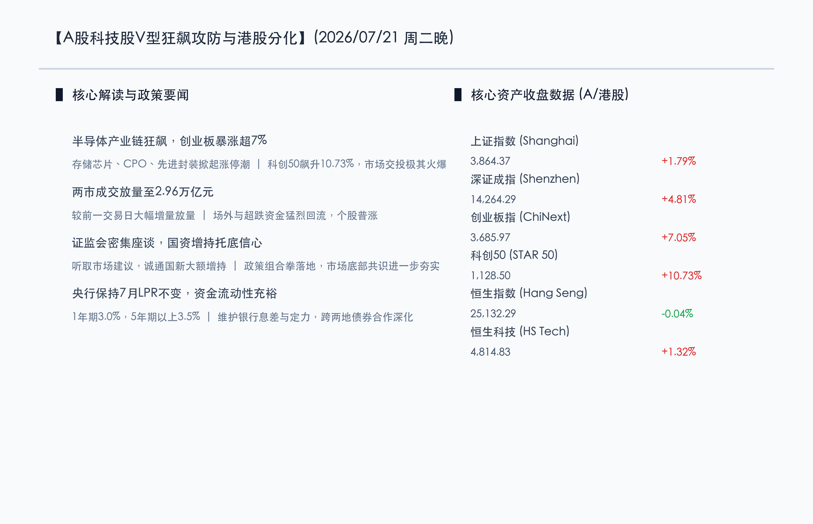

# A股深V狂飙创业板暴涨超7%领涨全球，芯片全线爆发两市成交逼近3万亿

**日期：2026年07月21日 (星期二)** &nbsp; **时段：晚报 (常规交易日模式)**

> **核心摘要**：今日国内A股市场迎来深“V”强劲反攻与科技股单日爆发，创业板指狂飙7.05%创阶段新高，科创50指数暴涨10.73%，上证指数升至3864.37点（涨1.79%）。半导体、存储芯片、CPO及先进封装等全线爆发掀起百股涨停潮，沪深两市全天成交显著放量至2.96万亿元。港股方面，恒生科技指数反弹1.32%，恒指震荡收微跌0.04%。证监会密集召开座谈会听取意见及国家队大额增持，加之央行维持LPR稳定与充裕流动性支持，市场多头共识强劲汇聚。

## 核心行情复盘

今日国内A股市场走出深“V”强劲大反攻行情，三大股指集体高开高走，以科创板和创业板为代表的硬科技板块全面爆发，市场赚钱效应极大释放。港股市场呈现震荡分化格局，恒生科技指数震荡走高。

*   **上证指数**：收盘报 **3864.37点**，上涨 **1.79%** (+68.09点)。
*   **深证成指**：收盘报 **14264.29点**，上涨 **4.81%** (+654.06点)。
*   **创业板指**：收盘报 **3685.97点**，上涨 **7.05%** (+242.87点)。
*   **科创50指数**：收盘报 **1128.50点**，暴涨 **10.73%**。
*   **恒生指数**：收盘报 **25132.29点**，微跌 **0.04%** (-10.76点)。
*   **恒生科技指数**：收盘报 **4814.83点**，上涨 **1.32%** (+62.68点)。
*   **成交额与资金动向**：沪深两市全天成交总额猛增至 **2.96万亿元**（约29571亿元），较前一交易日大幅放量。全市场上涨个股超3100只，逾百只个股封禁涨停板。资金面呈现场外与超跌资金猛烈回流科技主线的特征。

*   **领涨行业**：半导体产业链全线大爆发，存储芯片、CPO光模块、先进封装、AI硬件、次新股及光通信概念板块涨幅居前。
*   **领跌行业**：电池、石油天然气、内房股、内银股及传统高股息防守板块相对偏弱，资金出现明显的由高位防守向高弹性科技主线的高低轮动。

## 核心解读与市场逻辑

> **逻辑一：半导体与硬科技产业盈利预期共振，自主可控催化科技大爆发**
> 
> 在全球大模型持续升级与AI算力需求持续旺盛背景下，国内半导体与存储产业链二季度业绩向好趋势得以明确验证。随着国产替代与自主可控逻辑在政策和订单端双重落地，硬科技龙头公司估值与胜率出现显著改善，驱动杠杆资金与观望资金加速入场涌入算力及芯片板块。

> **逻辑二：监管组合拳与“国家队”增持护航，市场底部信心显著增强**
> 
> 证监会于7月20日密集召开投资者座谈会，倾听市场诉求以提振资本市场信心；中国诚通、中国国新等央企通过自有资金及股票回购增持专项再贷款，大额增持国资央企和科技企业股票及 širo-broad ETF。监管与国家队协同托底，消解了此前市场对高位回落的担忧，形成强有力的多头共识。

> **逻辑三：LPR利率维持稳定显宏观定力，流动性宽裕支撑放量反弹**
> 
> 7月20日公布的1年期及5年期以上LPR均按兵不动（分别保持在3.0%和3.5%），显示货币政策保持战略定力、兼顾稳息差与蓄力长效工具。央行通过逆回购维系市场流动性充裕，叠加两地债券市场电子合作深化，整体金融环境为两市近3万亿的放量天量换手提供了充裕的流动性土壤。

## 政策脉动

*   **证监会召开投资者座谈会**：证监会领导听取了市场主要机构与个人投资者关于促进资本市场平稳健康发展的意见建议，明确将持续优化交易机制、提升上市公司质量、引入中长期资金。
*   **央企“国家队”增持落地**：中国诚通及中国国新宣布继续使用大额专项再贷款资金增持科技企业及央企相关股票和宽基ETF，凸显国有资本护航示范效应。
*   **货币政策定力与流动性充裕**：7月LPR保持不变符合预期；央行表示将灵活运用多种工具维系银行体系流动性合理充裕，保障实体经济与金融市场稳健运行。
*   **深水区金融合作新进展**：中国人民银行、香港金管局及香港证监会共同欢迎共建香港电子固定收益及货币交易平台，进一步巩固香港国际金融中心地位并拓宽跨境资金渠道。

## 最新机构观点

*   **高盛集团 (Goldman Sachs)**：**“中国硬科技产业链迈入估值与业绩双击通道”**。高盛策略团队指出，随着全球AI资本开支提速以及中国半导体本地化采购率提升，中国科技板块具备极强的阿尔法收益，维持对中国A股与港股科技股的“超配”建议。
*   **中金公司 (CICC)**：**“2.96万亿放量确立科技主线，市场反弹空间进一步打开”**。中金公司认为，当前放量大涨表明资金风险偏好迎来深刻扭转，政策组合拳与盈利回暖构成双重支撑，看好半导体、AI硬件及核心成长标的的确定性机会。
*   **中信证券 (CITIC)**：**“风格轮动加速完成，关注胜率改善下的结构性进攻机会”**。中信证券分析，今日创业板与科创50的报复性反弹宣告前期去杠杆调整基本结束，市场正从“博弈高赔率”切换至“拥抱高胜率”，科技龙头公司将主导下一阶段的反弹走势。

## 今日市场情绪：芯片狂飙，凤舞九天

今日的资本市场犹如一幅“芯片狂飙，凤舞九天”的赛博朋克壮丽画面。由发光的硅晶圆与激光电路交织构成的赛博机甲凤凰在金融数据天际线之上展翅高飞，周身喷射出璀璨的电光能量，将红绿相间的K线柱阵列彻底点亮。背景深处，璀璨的星空下悬浮着“2.96万亿”的巨大全息数字，彰显出资本狂潮在科技潮头汹涌澎湃的雄浑伟力。

> Prompt: Cyberpunk style, Subject: A futuristic cybernetic phoenix forged from glowing silicon wafers and laser circuits soaring high above a digital stock exchange grid, igniting green and red candlestick pillars with intense electric blue energy. In the background: massive holographic numbers of 2.96 Trillion floating in the starry digital sky. No humans. No text., masterpiece, high detail, intricate composition, cinematic lighting, 8k resolution

---

免责声明：内容仅供参考，不构成投资建议。
