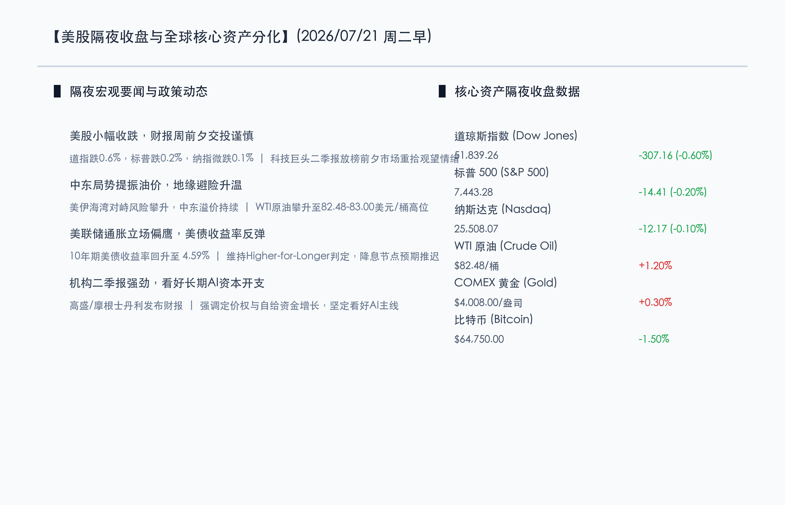
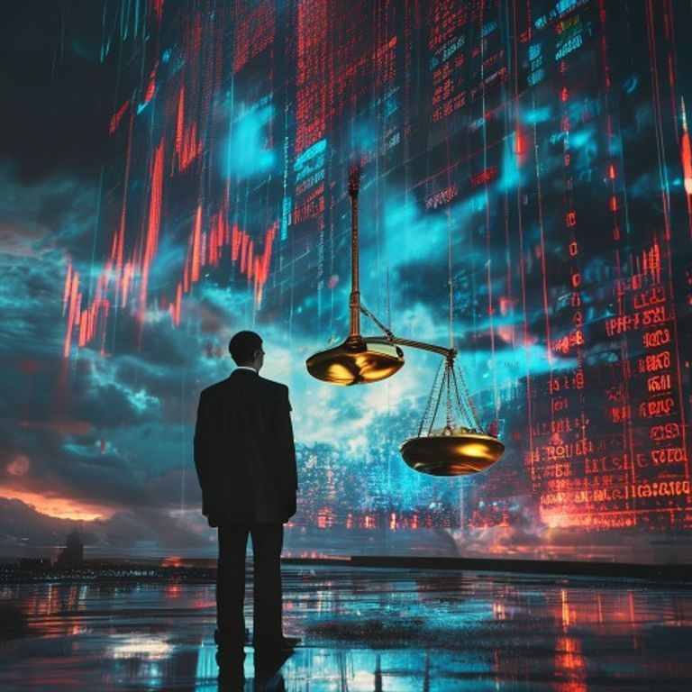

# 财报周前夕隔夜美股震荡走低，地缘风暴拉升原油，美联储鹰派预期下市场紧盯科技巨头ROI

**日期：2026年07月21日 (星期二)** &nbsp; **时段：早报 (模式 A)**

> **核心摘要**：隔夜美股三大指数集体收跌，道指领跌0.6%，市场在超级财报周拉开帷幕前夕趋于观望。中东地缘局势恶化推升WTI原油至82.48美元高位，通胀担忧与美联储维持高利率（Higher-for-Longer）立场导致10年期美债收益率反弹至4.59%。尽管短期估值面临承压，高盛与摩根士丹利等顶级机构最新二季报与策略均指出，AI资本开支与具备定价权的质优企业仍是中长期资金配置的核心锚点。

## 核心行情复盘

*   **道琼斯工业指数**：收于 **51,839.26** 点，下跌 **307.16** 点（**-0.60%**），受周期股与金融股回调拖累。
*   **标普 500 指数**：收于 **7,443.28** 点，微跌 **14.41** 点（**-0.20%**），盘中振幅收窄。
*   **纳斯达克综合指数**：收于 **25,508.07** 点，微跌 **12.17** 点（**-0.10%**），大型科技股呈现强抗跌性。
*   **大宗商品与能源**：**WTI 原油** 主力合约上涨 **1.20%**，收于 **$82.48**/桶；**COMEX 黄金** 期货上涨 **0.30%**，报 **$4,008.00**/盎司。
*   **美债与加密资产**：**10年期美债收益率** 攀升 3 个基点至 **4.59%**；**比特币 (BTC)** 下跌 **1.50%**，报 **$64,750.00**。

## 核心解读与市场逻辑

> **核心解读**：美股隔夜的震荡走弱体现了“财报窗口前夕谨慎”与“中东地缘通胀再起”的双重共振。随着美联储重申抗通胀尚未结束，市场对年内降息的乐观预期进一步收敛，推动美债收益率反弹。另一方面，尽管地缘避险资金推高油价和黄金，但硬科技板块在经历前期挤水分后，已展现出较强的下行抵抗力，资金正密切等待本周谷歌、特斯拉等重磅科技股财报给出的真实 ROI 答案。

## 政策脉动

> **政策动态**：美联储多位官员最新表态维持鹰派基调，指出在缺乏连续放缓的通胀数据支撑前，维持高利率（Higher-for-Longer）仍是基准路径。国际方面，随着美伊海湾地缘风险升温，美商务部与财政部正在密切评估能源供应链稳定性，宏观政策博弈复杂性上升。

## 最新机构观点

*   **高盛 (Goldman Sachs)**：**“二季报强劲奠定基石，长期坚守 AI Capex 与风险资产超配”**。高盛最新二季度财报创下历史新高，其资产管理团队在最新策略中指出，虽然短期估值高企带来波动，但由 AI 推动的资本开支周期并未中断，建议在市场回调中继续超配科技基础设施与具有强劲现金流的企业。
*   **摩根士丹利 (Morgan Stanley)**：**“高利率延续环境下，聚焦定价权与自给资金增长”**。摩根士丹利策略分析师指出，Higher-for-Longer 利率格局提升了高估值故事股的贴现难度，当前环境下应偏好具有强定价能力、能通过自身经营现金流支持研发增长的避风港龙头。
*   **中金公司 (CICC)**：**“全球AI算力链扩容需求明确，中企海外二次上市迎来契机”**。中金公司在最新研报中表示，尽管海外股市短期存在宏观偏见与通胀波扰，但全球 AI 硬件设施扩容的确定性仍然稳固，科技供应链龙头企业积极通过港股等市场进行二次融资，将为亚洲及全球资本市场注入充沛流动性。

## 今日市场情绪：油火秤高，天机沉潜

在超现实主义风格下，一位身着暗色西装的交易员肃立于巨幅全息图景之前，眼前是微跌的股市大盘与跃动的原油红色数字。背景中，一座巨大的金色天平悬浮于阴郁的雷雨夜空下，一端是不断滴落黑金的原油桶，另一端则是散发幽蓝光芒的 AI 芯片。地缘风险与通胀风暴在天平两侧撕扯，而市场正静候科技巨头财报的揭晓。

> Prompt: Surrealism style, A human trader (real person) in a dark suit standing before a massive holographic display showing falling stock indices and rising red crude oil tickers. In the background, a giant golden balance scale balances a dripping black oil drum against a bright blue AI silicon chip under a turbulent sky., masterpiece, high detail, intricate composition, cinematic lighting, 8k resolution

---

免责声明：内容仅供参考，不构成投资建议。
