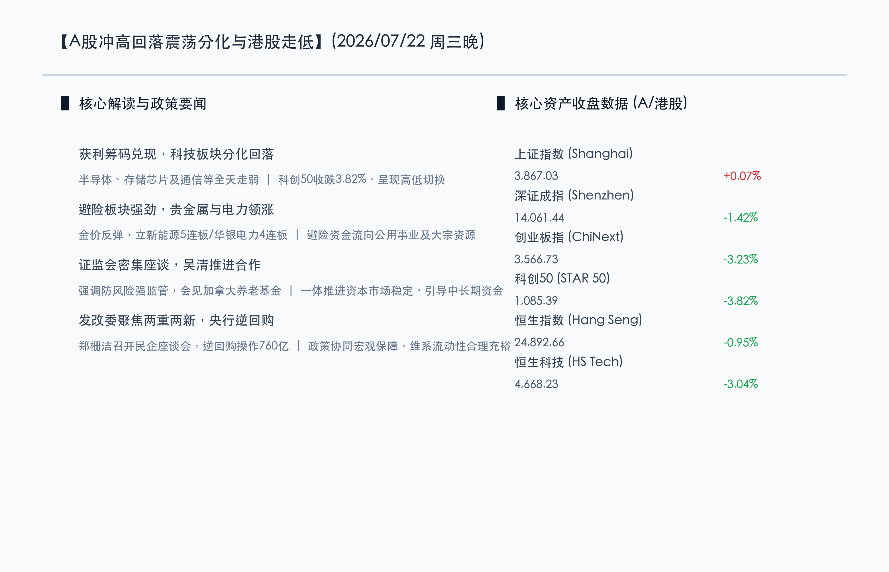

# A股冲高回落创指收跌超3%，避险资产全线大涨，贵金属与电力板块强势护盘

**日期：2026年07月22日 (星期三)** &nbsp; **时段：晚报 (常规交易日模式)**

> **核心摘要**：今日国内A股市场呈现冲高回落、缩量调整态势。在经历昨日的强劲反弹后，获利盘兑现压力显现，三大股指集体回撤，创业板指大跌3.23%领跌，科创50指数亦收跌3.82%，上证指数小幅收涨0.07%报3867.03点。盘面上呈现明显的高低切换与防守态势，黄金/贵金属、电力公用事业及石油板块强势爆发，避险资金积极涌入，而半导体、存储芯片及通信等前期强势科技股出现获利回退。两市全天成交缩量至2.65万亿元。港股方面，恒生指数与恒生科技指数亦走弱。证监会继续推进一体防风险、强监管，央行开展760亿元逆回购维系宏观流动性充裕。

## 核心行情复盘

今日国内A股市场在昨日大涨后呈现明显的震荡分化与高低轮动，三大股指冲高回落，前期领涨的硬科技板块全面分化，市场转入防御。港股市场亦震荡下行，恒生科技指数回调显著。

*   **上证指数**：收盘报 **3867.03点**，上涨 **0.07%** (+2.66点)。
*   **深证成指**：收盘报 **14061.44点**，下跌 **1.42%** (-202.85点)。
*   **创业板指**：收盘报 **3566.73点**，下跌 **3.23%** (-119.24点)。
*   **科创50指数**：收盘报 **1085.39点**，下跌 **3.82%** (-43.11点)。
*   **恒生指数**：收盘报 **24892.66点**，下跌 **0.95%** (-239.63点)。
*   **恒生科技指数**：收盘报 **4668.23点**，下跌 **3.04%** (-146.60点)。
*   **成交额与资金动向**：沪深两市全天合计成交额有所收窄至 **2.65万亿元**，较前一交易日减少约3100亿元。这表明昨日大幅反弹后，多头追高意愿有所减退，短线获利筹码积极兑现，资金在科技成长股之间进行调仓，部分向避险红利资产和公用事业防御方向转移。全市场下跌个股超3800只。

*   **领涨行业**：避险与公用事业红利板块强劲爆发。贵金属/有色金属全天表现最强（赤峰黄金、招金矿业、山金国际、兴业银锡等领涨）；电力板块在高温和避险情绪下逆势活跃，立新能源（5连板）与华银电力（4连板）展现强烈的连板效应；算力/超节点概念股盘中反复走强（美利云3连板、共进股份涨幅居前）；石油石化板块亦受地缘及能源价格推动表现偏强（中曼石油涨停）。
*   **领跌行业**：硬科技成长方向出现显著回落。通信设备板块领跌两市（长飞光纤、长盈通、新易盛等跌幅居前）；昨日大涨的半导体及存储芯片板块大幅回调，部分超涨个股（如德明利）跌停；印制电路板（PCB）、游戏、影视传媒及部分汽车零部件板块跌幅居前。

## 核心解读与市场逻辑

> **逻辑一：报复性大涨后筹码结构再平衡，短期缩量良性修复**
> 
> 在周二A股市场经历深V暴涨之后，短线积累了较为丰厚的获利筹码。在缺乏持续增量资金配合的背景下，今日市场出现缩量技术性调整。科创板和创业板领跌，显示科技股在前期大涨后出现筹码松动与获利了结，但上证指数依然小幅收红，表明大盘的筹码结构正向红利和防御性资产进行再平衡。

> **逻辑二：避险情绪升温，金价反弹与电力公用事业承接防御资金**
> 
> 国际金价的低位反弹以及地缘局势的潜在扰动，使得资金的风险偏好再度回落。以黄金为代表的贵金属和具备强分红、稳现金流属性的电力板块受到市场大单资金追捧，显示出公用事业及大宗资源作为底仓品种在震荡市中的护盘防守属性，帮助市场对冲科技板块的剧烈震荡。

> **逻辑三：证监会强化稳市信号与国际合作，央行逆回购维系流动性**
> 
> 监管层近期密集召开座谈会，听取多方关于防风险、强监管的建议，且在22日会见国际养老基金推进金融合作，持续传递引导中长期资金入市、一体推进资本市场稳定运行的信心。央行开展760亿元7天逆回购操作，操作利率维持在1.40%的低位，释放了平抑市场流动性波动的积极信号，为市场构筑了坚实的政策底。

## 政策脉动

*   **证监会党委座谈会防风险强监管**：证监会领导班子近期密集召开座谈会倾听各方诉求，吴清主席强调证监会将一体推进资本市场防风险、强监管、促高质量发展，全力维护市场平稳运行。监管层重点回应了加强逆周期调节、引导中长期资金入市、规范量化交易等关切，全力增强市场内在稳定性。
*   **证监会主席吴清推进国际金融合作**：7月22日，证监会主席吴清会见了加拿大养老基金投资公司（CPPIB）总裁兼首席执行官格雷厄姆，持续推进国际金融合作，展示出中国资本市场对外开放和引入海外长期资金的坚定态度。
*   **国家发改委聚焦“两重”“两新”及民营经济**：发改委郑栅洁主任主持召开民营企业座谈会，听取经济形势建议。发改委强调将发挥存量政策和增量政策的集成效应，重点支持国家重大战略与大规模设备更新等，护航实体经济高质量运行。
*   **央行开展760亿元逆回购操作**：中国人民银行于7月22日以固定利率、数量招标方式开展了760亿元7天期逆回购操作，利率为1.40%，继续实施支持性货币政策，保持金融体系流动性合理充裕。

## 最新机构观点

*   **中信证券 (CITIC)**：**“近期调整属于筹码结构再平衡，A股中长期仍具韧性”**。中信证券研报指出，市场的阶段性调整属于上涨后的筹码结构重新分配，而非基本面或产业趋势的逆转。展望2026年下半年，红利资产有望进入估值修复区间，国产算力产业链也将随着全链条协同而维持高景气度，建议在科技弹性与红利防御之间均衡配置。
*   **中金公司 (CICC)**：**“市场已反映悲观预期，年内二次买点或已到来”**。中金公司策略团队认为，引发本轮调整的短期利空因素已得到充分消化，市场此前存在过度悲观情况，不必过度担忧短期回撤，当前是具备性价比的建仓窗口，建议逢低布局盈利前景明确的行业。
*   **华泰证券 (Huatai Securities)**：**“市场低位震荡属技术修复，关注存储与半导体设备低吸机会”**。华泰证券分析，当前市场情绪回落至历史低位，今日回调属于报复性反弹后的良性整理。随着宽基ETF持续流入与政策呵护，大盘底部扎实，短期建议低吸具备盈利上行动能的存储、半导体设备与材料。

## 今日市场情绪：金鹿御风，古木逢春

今日市场在昨日暴涨后迎来分化震荡。科技股虽有获利回吐，但贵金属与公用电力板块表现抢眼，如同暴风雨洗礼的K线森林中，一只周身环绕温暖金光的巨鹿巍然屹立，它的角散发着柔和而坚定的光芒，照亮了由红绿K线柱构成的复杂数字格网，将避险资金的坚韧与定力诠释得淋漓尽致。

> Prompt: Surrealism style, Subject: A majestic, glowing golden stag standing calmly in a dark, stormy forest of towering digital green and red K-line candlestick charts. A vortex of red lightning and code wind swirls around, but the stag's antlers glow with a warm, steady golden light, casting a protective halo. No humans. No text., masterpiece, high detail, intricate composition, cinematic lighting, 8k resolution

---

免责声明：内容仅供参考，不构成投资建议。
