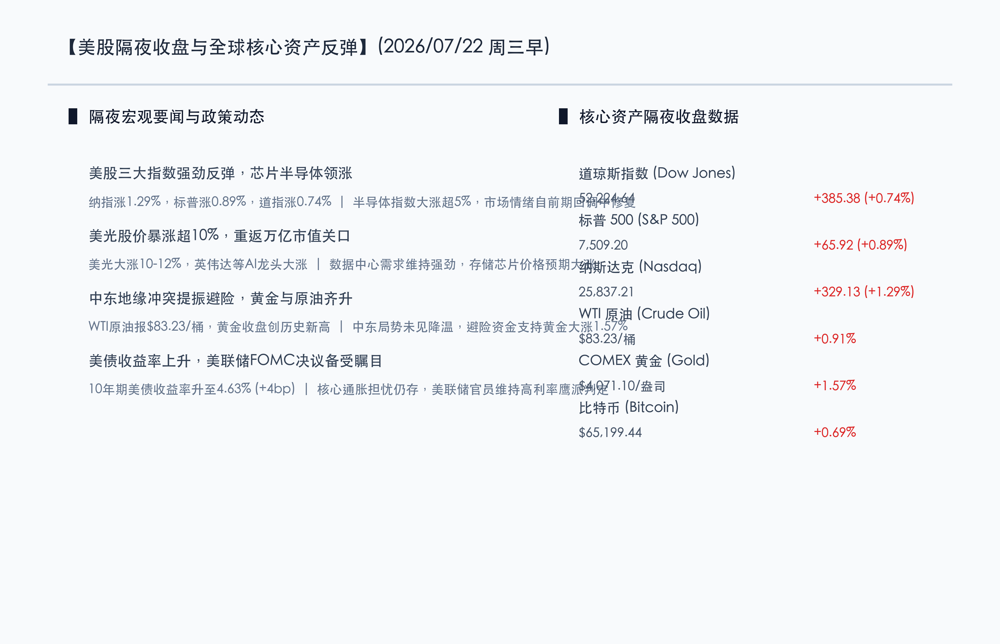
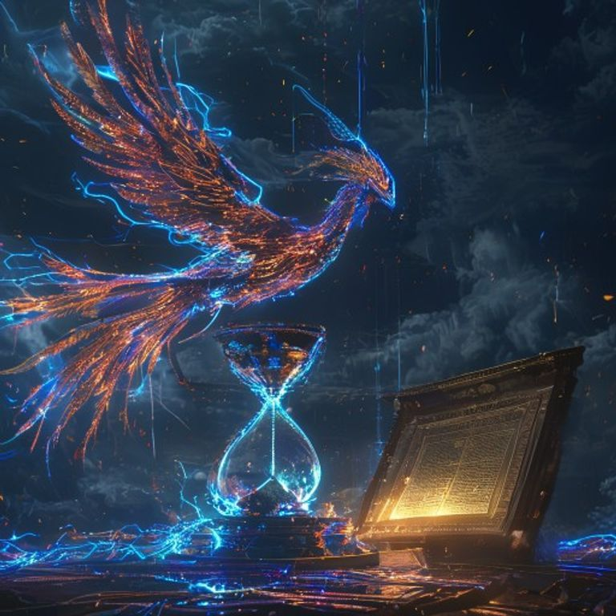

# 芯片龙头暴涨引爆隔夜美股强势反弹，地缘溢价支撑黄金原油居高不下，市场静候美联储政策指引

**日期：2026年07月22日 (星期三)** &nbsp; **时段：早报 (模式 A)**

> **核心摘要**：隔夜美股三大指数强劲反弹，纳指大涨1.29%，费城半导体指数狂飙超5%，受美光科技暴涨超10%重回万亿美元市值及英伟达大涨带动，科技股情绪全面修复。中东地缘局势未见降温，地缘溢价支撑WTI原油升至83.23美元，COMEX黄金收盘大涨1.57%创下历史新高。尽管通胀担忧推升10年期美债收益率至4.63%，但机构观点普遍认为AI算力与存储芯片需求强劲，市场在下周美联储FOMC决议前维持震荡上行格局。

## 核心行情复盘

*   **道琼斯工业指数**：收于 **52,224.64** 点，上涨 **385.38** 点（**+0.74%**），成分股中工业与金融蓝筹普遍回暖。
*   **标普 500 指数**：收于 **7,509.20** 点，上涨 **65.92** 点（**+0.89%**），科技板块贡献主要涨幅。
*   **纳斯达克综合指数**：收于 **25,837.21** 点，大涨 **329.13** 点（**+1.29%**），大型科技与半导体个股领涨。
*   **大宗商品与能源**：**WTI 原油** 主力合约上涨 **0.91%**，收于 **$83.23**/桶；**COMEX 黄金** 期货大涨 **1.57%**，收于 **$4,071.10**/盎司，创盘中与收盘历史新高。
*   **美债与加密资产**：**10年期美债收益率** 攀升 4 个基点至 **4.63%**；**比特币 (BTC)** 上涨 **0.69%**，报 **$65,199.44**。

> **行业板块表现**：半导体及半导体设备板块表现最为亮眼，费城半导体指数（SOX）大涨逾5%。存储芯片龙头美光科技（MU）跳空暴涨超10%，重回万亿美元市值，带动英伟达、超微电脑等AI算力股集体反弹。大宗商品中黄金、原油受中东美伊地缘局势升温及避险买盘推动持续走强。相比之下，部分公用事业和高红利防守板块涨幅落后。

## 核心解读与市场逻辑

> **核心解读**：隔夜市场的强势拉升体现了“AI科技需求强劲”对宏观利率上行 and 地缘担忧的对冲。此前半导体板块因筹码拥挤与宏观获利回吐经历了一轮急跌，但本次美光科技等大厂大涨说明AI服务器及数据中心对高带宽内存（HBM）的拉动效应依然真实存在，资金趁回调重新回补科技龙头。另一方面，中东局势的僵持使原油和黄金的地缘风险溢价无法消退，美债收益率升至4.63%也反映出市场对核心通胀粘性的警惕。总体来看，美股已在超级财报周到来前重构攻防平衡，市场焦点正逐步转向下周的美联储决议。

## 政策脉动

> **政策动态**：美联储理事会于7月21日举行闭门会议，重点讨论了金融市场、金融机构与基础设施的运营稳定和潜在风险。鉴于核心通胀放缓步伐受阻，多位联储官员此前表达了谨慎立场。目前市场普遍预计，美联储在7月28-29日的FOMC会议上将维持基准利率在3.50%-3.75%的区间不变，继续观察通胀和就业数据的发展。

## 最新机构观点

*   **高盛 (Goldman Sachs)**：**“全球宏观韧性稳健，下半年超配AI基础设施与优质盈利股”**。高盛策略团队在最新报告中指出，预计2026年全球GDP将保持2.8%的稳健增长，美国经济在税改及宽松预期下表现强劲。尽管科技股集中度处于高位，但这是由强劲的企业盈利支撑的。他们建议在市场震荡中继续坚守AI硬件基础设施、电力设备等具备确定性开支的行业。
*   **摩根士丹利 (Morgan Stanley)**：**“存储芯片进入黄金 entry point，看好Q3价格强劲回升”**。摩根士丹利发布最新行业研报表示，近期半导体板块的回调为投资者提供了极佳的买入窗口。因AI算力中心对于大容量DRAM及高带宽内存（HBM）需求持续暴涨，预计第三季度存储芯片市场价格将环比大涨25%，维持对存储产业链核心龙头的超配评级。

## 今日市场情绪：硅凤涅槃，暗流汹涌

在超现实主义风格下，一只由闪烁的硅片和幽蓝激光组成的机械凤凰在空中涅槃飞翔，代表着芯片股与AI科技的强劲反弹。在暴风雨般的夜空背景下，一端是不断滴落黑色原油的暗红色巨大沙漏，另一端是散发金色光芒的法典，在雷云中浮沉。这象征着在地缘政治危机与通胀压力的暗流之中，科技大潮依然以无可阻挡之势冲破迷雾。

> Prompt: Surrealism style, A mechanical phoenix constructed from shimmering silicon wafers and neon blue laser beams soaring majestically. In the background, a giant dark red oil hourglass and a glowing golden law book float under a turbulent stormy night sky with dark thunder clouds, masterpiece, high detail, intricate composition, cinematic lighting, 8k resolution

---

免责声明：内容仅供参考，不构成投资建议。
