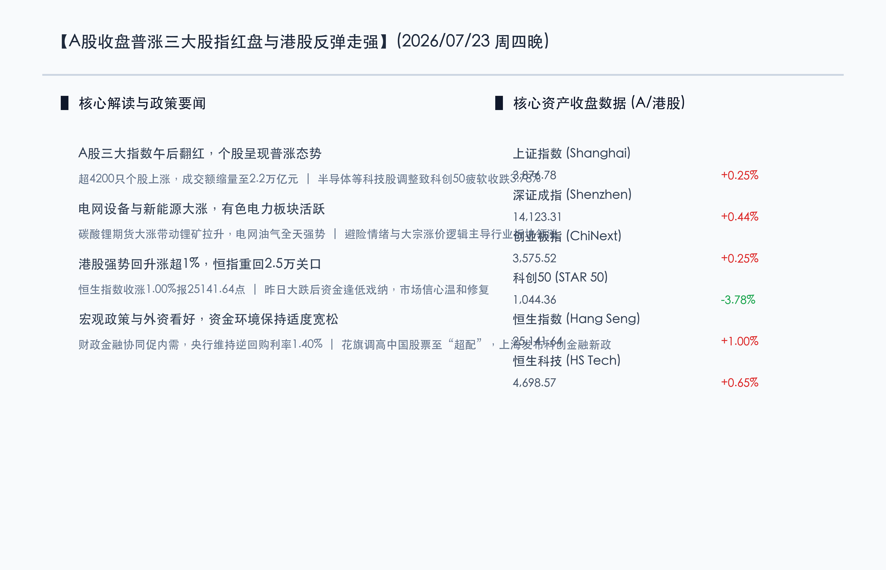

# A股午后翻红三大股指小幅收涨，港股大涨超1%站上2.5万点，电网设备与锂矿板块领涨，科技股持续震荡调整

**日期：2026年07月23日 (星期四)** &nbsp; **时段：晚报 (常规交易日模式)**

> **核心摘要**：今日国内A股市场全天缩量震荡，午后集体翻红收涨，科创50则表现相对疲软跌超3.7%。上证指数收报3876.78点，上涨0.25%；深证成指与创业板指分别收涨0.44%与0.25%。盘面上行业板块呈普涨态势，超4200只个股上涨，电网设备、锂矿、电力及有色金属等板块领涨；半导体等科技板块则受短线避险资金撤离影响持续回调。两市全天成交额缩量至2.2万亿元。港股今日走强，恒生指数上涨1.00%报25141.64点，恒生科技指数收涨0.65%。宏观政策面，财政部强调财政金融协同促内需，央行维持逆回购利率，证监会持续推进稳市，外资机构花旗调高中国股票评级至超配。

## 核心行情复盘

今日国内A股三大指数全天缩量震荡，午后集体翻红收涨，全场超4200只个股上涨。科创50指数则因半导体等科技成长板块回调而表现疲软。港股在经历昨日大跌后今日明显走强，恒生指数收涨1.00%，站稳25000点整数关口。

*   **上证指数**：收盘报 **3876.78点**，上涨 **0.25%** (+9.75点)。
*   **深证成指**：收盘报 **14123.31点**，上涨 **0.44%** (+61.87点)。
*   **创业板指**：收盘报 **3575.52点**，上涨 **0.25%** (+8.79点)。
*   **科创50指数**：收盘报 **1044.36点**，下跌 **3.78%** (-41.03点)。
*   **恒生指数**：收盘报 **25141.64点**，上涨 **1.00%** (+248.98点)。
*   **恒生科技指数**：收盘报 **4698.57点**，上涨 **0.65%** (+30.34点)。
*   **成交额与资金动向**：沪深两市全天合计成交额有所收窄至 **2.2万亿元**，较前一交易日减少约4500亿元。这显示在经历前期的剧烈调整 and 昨日的大幅波动后，多空双方趋向谨慎，今日大盘呈缩量震荡修复态势。全市场上涨个股超4200只，展现出较好的普涨个股效应，说明中小盘股的流动性与情绪有明显复苏。

*   **领涨行业**：电网设备及新能源产业链表现极为亮眼。受碳酸锂期货大涨带动，锂矿板块午后强势拉升；电力与有色金属板块也在避险情绪和供需基本面提振下逆势走强；油气概念等亦因中东局势升级、原油价格高企而表现活跃。
*   **领跌行业**：科技类成长板块（特别是半导体、存储芯片及光通信等前期强势科技股）出现持续震荡调整，由于部分短线获利资金及避险资金流出，对科创板及创业板权重股形成了一定压制。

## 核心解读与市场逻辑

> **逻辑一：缩量震荡重回普涨，中小盘股流动性迎喘息窗口**
> 
> 在昨日冲高回落的科技股获利兑现后，今日两市成交额收窄至2.2万亿元，呈现缩量整理。然而，全市场超4200只个股收涨，国证2000上涨0.78%，显示出在权重股和科技主线退潮调整期间，中小盘股和超跌板块迎来了宝贵的流动性喘息与估值修复期，市场呈现出缩量普涨的健康轮动格局。

> **逻辑二：碳酸锂期货大涨带动新能源反弹，中东局势与高温提振传统资源与公用电力**
> 
> 商品与权益市场形成联动，碳酸锂期货价格的大幅反弹刺激了锂矿及新能源板块的午后拉升。此外，受中东紧张局势及布伦特原油站稳90美元/桶上方的地缘政治因素催化，油气开采、有色金属等大宗商品板块表现活跃；而国内高温天气的持续则继续提振电力和公用事业板块，防御性资金和商品涨价逻辑依然是当前资金配置的重点。

> **逻辑三：财政金融协同政策筑底，花旗等外资调高评级引领情绪修复**
> 
> 宏观政策层面继续释放暖意。财政部发文强调财政金融协同促内需，央行副行长重申适度宽松的货币政策和充足的降准降息空间，为市场流动性与基本面构筑了坚实的政策底部。同时，花旗等外资投行将中国股票评级上调至“超配”，认为其是新兴市场资本轮动的首选，有助于提振外资及本土中长期资金的入市信心。

## 政策脉动

*   **财政部强调财政金融协同促内需**：财政部部长在《人民日报》撰文指出，要实施更加积极有为的宏观政策，强化财政与金融政策的协同效应，以更大力度落实一揽子促内需政策，从而稳定社会预期、增强发展信心。
*   **央行维持逆回购利率，前瞻性货币政策仍有空间**：中国人民银行于7月23日开展2040亿元7天期逆回购操作，中标利率维持在1.40%不变。央行副行长邹澜表示，下一步将继续加大逆周期和跨周期调节力度，分析指出，下半年降准降息空间依然存在，货币政策环境将保持适度宽松。
*   **上海发布科技金融新政，助力科创板深化改革**：上海市印发若干措施，旨在发挥直接融资功能，支持人工智能、低空经济、可控核聚变等新兴科技企业上市融资，推动资本市场更好地为实体科技创新服务。
*   **证监会提升外资便利度，引导长期资金入市**：证监会主席吴清会见加拿大养老基金投资公司总裁，表达了中国资本市场将持续提升外资参与便利度、欢迎国际机构扩大在华投资的积极态度，同时监管层正通过座谈会集思广益，一体推进防风险、强监管和市场稳定运行。

## 最新机构观点

*   **花旗集团 (Citi)**：**“上调中国股票评级至超配，中国市场为新兴市场轮动首选”**。花旗最新策略报告指出，随着中国宏观政策协同效应释放和估值吸引力凸显，中国股市在下半年的表现值得看好。尤其是红利板块及部分具备核心竞争力的消费与科技龙头，是外资配置的首选，因而调高中国股票评级。
*   **中信证券 (CITIC)**：**“关注超跌电子板块及AI Agent带动的计算力重估”**。中信证券分析，在科技成长股经历短期调整后，电子及半导体板块的估值性价比已逐步显现。随着AI Agent等端侧AI技术的爆发，相关CPU与硬件需求将迎来系统性重估，同时应密切关注生猪等周期性行业的景气回升机会。
*   **野村证券 (Nomura)**：**“AI产业链投资回报率将是未来博弈焦点，保持谨慎乐观”**。野村证券研报认为，当前全球AI核心产业链的需求依旧强劲，科技巨头的资本开支尚未出现放缓迹象，但市场已开始更加关注AI投资的实际回报率（ROI）。建议在半导体装备与下游应用之间进行均衡配置，规避估值过高的纯概念股。

## 今日市场情绪：锂火金光，电网织锦

今日市场呈现缩量普涨，新能源、电网设备与资源板块表现强势。在由发光电网与金色电流编织的未来织锦上，一只由绿色晶体与翡翠光能构成的凤凰展翅翱翔，象征着绿色能源与电网设备的崛起。远处的机械科技高塔正在逐渐冷却并散发微光，将科技股的休整与能源股的绽放完美融合。

> Prompt: Surrealism style, Subject: A majestic phoenix made of vibrant green crystalline energy and glowing light filaments soaring gracefully over a complex grid network of shining electric lines. The grid lines glow with golden and emerald currents. In the background, dark metal futuristic towers are cooling down under a calm evening sky. No humans. No text., masterpiece, high detail, intricate composition, cinematic lighting, 8k resolution

---

免责声明：内容仅供参考，不构成投资建议。
