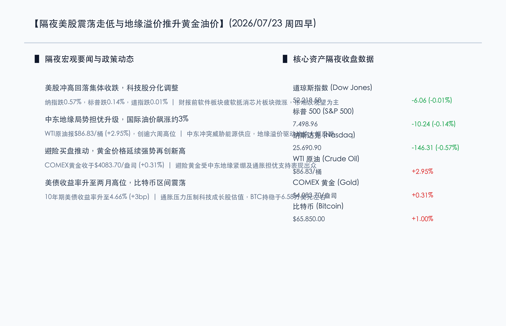

# 隔夜美股高位震荡微跌，中东局势升级推动油价飙升3%创阶段新高，黄金价格再攀巅峰

**日期：2026年07月23日 (星期四)** &nbsp; **时段：早报 (常规交易日模式)**

> **核心摘要**：隔夜美股三大股指冲高回落集体收窄，纳斯达克指数下跌0.57%，标普500指数下跌0.14%，道指基本收平。在超级科技股财报周公布前夕，市场避险与观望情绪升温，软件板块普遍疲软抵消了半导体板块（费城半导体收涨0.44%）的部分涨幅。同时，中东地区地缘冲突的突然升级引发投资者对供应链安全的深切担忧，WTI原油期货暴涨2.95%创逾六周新高，避险黄金期货价格继续扬升收于4083.70美元/盎司的历史新高。受通胀隐忧重燃提振，10年期美债收益率攀升至两个月高点4.66%，比特币窄幅震荡运行于6.58万美元附近。

## 核心行情复盘

隔夜美股市场在经历了前一日的反弹后呈现窄幅整理，三大股指盘中冲高回落。地缘冲突升级推升大宗商品市场，油价与金价双双显著走强。

*   **道琼斯工业指数**：收盘报 **52218.58点**，下跌 **0.01%** (-6.06点)。
*   **标普 500 指数**：收盘报 **7498.96点**，下跌 **0.14%** (-10.24点)。
*   **纳斯达克综合指数**：收盘报 **25690.90点**，下跌 **0.57%** (-146.31点)。
*   **大宗商品与能源**：**WTI 原油** 期货结算价大涨 **2.95%**，收于 **$86.83**/桶，创六周以来的最高位；**COMEX 黄金** 期货收盘大涨 **0.31%**，报 **$4083.70**/盎司，继续创下历史新高。
*   **美债与加密资产**：**10年期美债收益率** 攀升 3 个基点至 **4.66%**；**比特币 (BTC)** 小幅上扬，报 **$65,850.00**。

*   **行业板块表现**：半导体及半导体设备板块表现相对坚挺，费城半导体指数（SOX）收涨0.44%。但由于市场正处于美股科技巨头财报发布前的静默和观察期，科技股（特别是软件及互联网应用板块）表现整体疲软。大宗商品受中东地缘局势恶化、能源供应担忧升温的影响全线爆发，油价、金价显著冲高。

## 核心解读与市场逻辑

> **核心解读一：科技财报静默期资金防御性换手，软件疲软芯片维持韧性**
> 
> 随着美股科技股超级财报周临近，市场资金在获利了结与财报质量的检验中进入观望模式。尽管半导体板块受昨日反弹惯性及国产芯片链条景气度支撑在盘中录得小幅上涨，但软件板块的普遍回调拖累了纳指和标普的整体表现。这说明在美联储FOMC决议及巨头财报落地前，资金追高热度受制，防御性特征较强。

> **核心解读二：中东地缘冲突加剧威胁供应，油价大涨复燃通胀警惕**
> 
> 隔夜国际油价的飙涨是由于中东地缘局势的升级直接刺激了能源供应链中断预期。原油创六周新高（WTI逼近87美元），引发了投资者对核心通胀重陷“易涨难跌”境地的担忧，从而进一步限制了美联储下半年大幅降息的空间。

> **核心解读三：美债利率处于两个月高点压制估值，黄金创历史新高夯实防守共识**
> 
> 10年期美债收益率继续攀升至4.66%，直接对科技成长股的估值形成无形压制。然而，在此背景下黄金期货仍创下4083.70美元的历史新高，折射出避险情绪正在宏观多重摩擦下加速形成共识，黄金与美债收益率的同涨正展现出宏观防御特性的新平衡。

## 政策脉动

*   **地缘局势与美联储决策的天平**：国际油价暴涨再度引发多位美联储官员的警惕。若地缘溢价长期固化为输入性通胀，可能会显著延缓下半年美联储启动降息的步伐。目前市场主流预期下周的FOMC会议将继续按兵不动。
*   **全球宏观政策统筹与集成效应**：发改委等机构继续推进存量政策与增量政策的集成效应，引导中长期资金配合产业转型以对冲外部宏观波动。

## 最新机构观点

*   **中信证券 (CITIC)**：**“海外地缘溢价推升红利资产，大宗商品仍是重要对冲工具”**。中信证券分析，隔夜美股的走势印证了海外宏观环境的不确定性，大宗商品与能源价格的上涨将加大下半年抗通胀难度，重申对红利资产与资源性商品的看好。
*   **中金公司 (CICC)**：**“科技股财报前夕良性震荡，AI核心算力溢价将提供强支撑”**。中金团队认为，近期纳斯达克的冲高回落是财报披露前的防御性整固。AI芯片以及高带宽内存（HBM）的超预期开支将被大厂财报证实，半导体核心资产仍是回踩建仓的最佳方向。
*   **华泰证券 (Huatai Securities)**：**“美债收益率高企压制估值，金价新高折射多头防守底色”**。华泰证券指出，10年期美债收益率升至4.66%反映了对下半年通胀的重估。黄金顶住利差压力再创新高，显示全球大类资产正在对地缘冲突与去美元化宏观进行深度定价。

## 今日市场情绪：黑金怒涛，金乌破云

隔夜市场受中东局势与油价飙升推动，黑金怒涛翻滚。在超现实主义的画面中，一座由黑色原油怒涛托起的宏大古老石制拱门矗立于天地之间，代表着原油市场的巨大冲击。然而，透过这道拱门，一颗散发着温润而夺目光辉的金乌破云而出，洒下金色的万丈光辉，将黑暗的海面彻底染成金色，不仅象征着避险黄金无畏风雨再创新高，更彰显了市场在动荡之中的防御韧性与破局希望。

> Prompt: Surrealism style, Subject: A colossal, ancient stone archway standing in the middle of a dark, turbulent sea of liquid black crude oil under a stormy sky. Through the archway, a radiant, warm golden sun rises, casting bright golden reflections on the dark waves. High-tech white digital doves constructed from microchip patterns are flying towards the horizon. No humans. No text., masterpiece, high detail, intricate composition, cinematic lighting, 8k resolution

---

免责声明：内容仅供参考，不构成投资建议。
