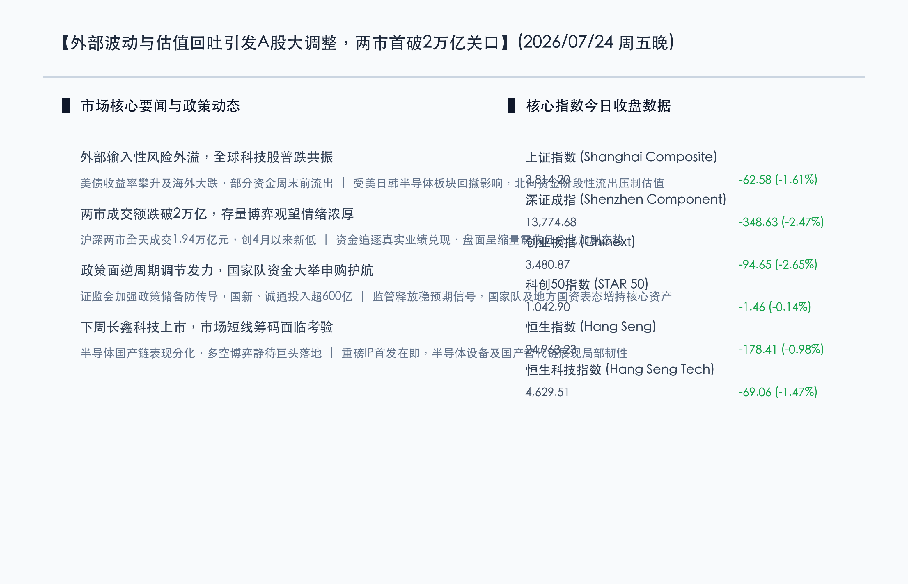

# 全球科技股震荡叠加获利回吐，A股及港股全线回调，成交额首度跌破2万亿，半导体设备及国产链午后逆市活跃

**日期：2026年07月24日 (星期五)** &nbsp; **时段：晚报 (常规交易日模式)**

> **核心摘要**：今日国内A股与港股市场在外部输入性风险和前期科技板块获利回吐的双重压力下全线走弱，上证指数收盘下跌1.61%报3814.20点，深证成指与创业板指分别下跌2.47%与2.65%。沪深两市全天成交额缩量至1.94万亿元，自4月7日以来首次跌破2万亿大关。港股同样承压，恒生指数失守25000点，大市成交平淡。监管层继续释放精准逆周期调节和政策储备等稳市预期，中国国新等国家队资金已斥资超600亿入市护航。盘面上，算力与电力跌幅居前，而受下周长鑫科技上市预期及国产替代逻辑支撑，半导体设备及至纯科技等概念在午后展现出较强局部韧性。

## 核心行情复盘

今日国内A股三大指数全天震荡走弱，沪深两市出现显著缩量，成交额自今年4月7日以来首次跌破2万亿整数关口。港股在海外科技股调整浪潮中亦全线承压，恒生指数今日失守25000点。

*   **上证指数**：收盘报 **3814.20点**，下跌 **1.61%** (-62.58点)。
*   **深证成指**：收盘报 **13774.68点**，下跌 **2.47%** (-348.63点)。
*   **创业板指**：收盘报 **3480.87点**，下跌 **2.65%** (-94.65点)。
*   **科创50指数**：收盘报 **1042.90点**，下跌 **0.14%** (-1.46点)。
*   **恒生指数**：收盘报 **24963.23点**，下跌 **0.98%** (-178.41点)。
*   **恒生科技指数**：收盘报 **4629.51点**，下跌 **1.47%** (-69.06点)。
*   **成交额与资金动向**：沪深两市全天合计成交额收窄至 **1.94万亿元**，较前一交易日明显缩量，自4月7日以来首度失守2万亿元。这表明受外部波动及下周重磅国产半导体巨头长鑫科技上市前的观望情绪影响，存量博弈特征显著，多头入场意愿明显受限。北向资金呈现阶段性流出状态，对权重股形成一定估值压制。

*   **领涨行业**：半导体设备及国产链概念表现活跃，午后至纯科技、托伦斯等相关概念股逆市拉升。在外部制约背景下，下周长鑫科技上市成为市场博弈的催化剂，国产替代和自主可控核心主线展现局部避险韧性。此外，部分香港本地银行股逆市走高，显示防御性资金的仓位调整。
*   **领跌行业**：电力、贵金属、有色金属等前期强势板块跌幅居前。算力租赁、服务器等科技成长板块亦因海外人工智能产业链“资本开支回报”的负面叙事影响，加剧了短期筹码松动，导致微观结构走弱。

## 核心解读与市场逻辑

> **逻辑一：两市成交首破2万亿，缩量蓄势静待短线筹码转换**
> 
> 今日全市场成交额缩量至1.94万亿元，失守自4月以来保持的2万亿高景气线。这反映出市场在经历快速上攻和近期外部动荡后，投资人防御性观望情绪浓厚。特别是在下周一重磅国产芯片龙头长鑫科技正式挂牌前，多头博弈资金趋于谨慎，资金选择在周末前减仓避险，市场缩量属于筹码良性整理，等待下周上市靴子落地。

> **逻辑二：外部风险跨境传导，科技硬件获利回吐加剧短期分化**
> 
> 美债利率与美元指数的走强对全球成长类资产估值形成压制，美股及日韩半导体板块共振大跌，导致北向资金被动流出，并连带引发A股与港股大型科技股的补跌。然而，在半导体国产替代的政策 and 产业逻辑支撑下，设备端和芯片国产替代链条午后率先反弹。这种“外部利空-内部替代”的结构分化，凸显了资金对于“真业绩、强国产”硬核资产的抱团。

> **逻辑三：国家队超600亿增持提供安全边际，逆周期调节政策加码筑牢估值底**
> 
> 尽管股指短期调整，但政策稳市信号愈发强劲。中国国新、中国诚通等国有资本运营公司以及北京国资的表态，增持规模已逾600亿元，为市场提供了强力的基本面支撑和充裕的资金底座。证监会定调精准有效的逆周期调节和应对外部跨境风险的政策储备，使当前A股的调整“下有支撑”，属于技术层面的结构整理。

## 政策脉动

*   **证监会表态精准有效实施逆周期调节**：证监会强调，针对近期全球市场的波动，已做好了防范外部风险跨境传导的政策储备。证监会主席吴清近期主持召开座谈会听取各方代表建议，表明监管层正在合力一体推进防风险、强监管和引导中长期资金入市等政策组合。
*   **国家队与地方国资增持规模突破600亿**：中国国新、中国诚通相继宣布大举增持A股，北京国管也跟进表态通过自有资金增持。国家队真金白银入市，为核心上市资产提供了坚实的政策底和资金护栏，有力维护了估值稳定。
*   **上半年GDP同比增长4.7%彰显基本面韧性**：国家统计局发布的宏观数据显示，上半年中国GDP同比增长4.7%，经济基本面修复平稳。结合7月份以来有关资本市场制度改革和IPO节奏常态化的推进，为A股和港股提供了良性的外部宏观与制度生态。

## 最新机构观点

*   **中金公司 (CICC)**：**“科技硬件微观结构调整，市场回归业绩兑现窗口期”**。中金公司指出，科技成长板块近期受到海外风险偏好的跨境传染影响，且前期交易热度过高，今日大跌属于技术性的微观结构整理。后市建议聚焦具备真实业绩支撑的半导体、算力硬件等龙头股。
*   **海通国际 (Haitong International)**：**“调整‘似危实机’，港股与A股硬核资产迎来左侧布局机会”**。海通国际认为，外部扰动导致的估值下修并不改变国内核心资产长期向好的趋势。建议投资者保持定力，在杠杆出清后，关注具备估值性价比的科技及大金融核心标的。
*   **国信证券 (Guosen Securities)**：**“非基本面因素主导短期跌势，券商及低估值权重股具备安全边际”**。国信证券分析称，券商等方向目前估值处于历史绝对低位，与国家队大手笔护航逻辑形成共振，短期逆势抗跌，震荡过后有望迎来估值修复。

## 今日市场情绪：石门锁浪，硅匙启新

今日市场整体在外部阴霾下经历调整，成交量创4月以来新低，呈现谨慎的蓄势状态。在象征市场磨砺的灰色花岗岩古石门前，一把由闪烁绿色光芒的晶圆电路和金色微芯片铸成的未来钥匙正在门锁中缓缓旋转，正欲开启自主可控的国产半导体新篇章。门外狂风暴雨的暗黑海面上，由红烛K线交织的波涛正汹涌澎湃，而一轮温暖的金色朝阳已悄然在乌云裂缝中升起，暗示着蓄势震荡后的新一轮转机。

> Prompt: Surrealism style, Subject: A massive ancient stone gate made of grey granite standing on the shore of a dark digital sea. A key made of glowing green silicon circuits and gold microchips is inserted into the gate, turning. Background: In the background, the sea has turbulent red waves of stock charts under a stormy dark sky, with a warm golden sun starting to break through the clouds. No humans. No text., masterpiece, high detail, intricate composition, cinematic lighting, 8k resolution

---

免责声明：内容仅供参考，不构成投资建议。
