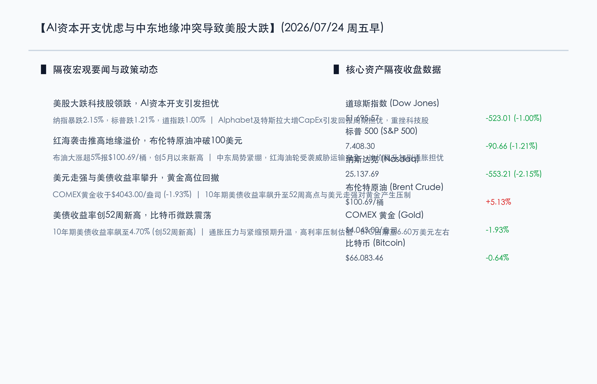
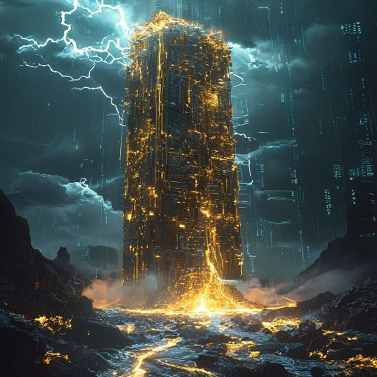

# 科技巨头CapEx扩张引发回报周期担忧，美股大跌纳指暴跌超2%，地缘局势推升布油冲破百元大关

**日期：2026年07月24日 (星期五)** &nbsp; **时段：早报 (常规交易日模式)**

> **核心摘要**：隔夜美股三大股指遭遇重挫，纳斯达克指数暴跌2.15%，标普500指数下跌1.21%，道琼斯指数下跌1.00%。Alphabet等科技巨头大幅上调2026年及2027年AI资本开支预算，引发投资者对高额资本投入与盈利回报周期的深切忧虑，特斯拉因利润下滑及开支庞大加剧了科技股的调整压力。与此同时，红海油轮再度受袭推动布伦特原油暴涨至100.69美元/桶，创下今年5月以来新高，通胀重燃风险促使10年期美债收益率攀升至52周新高4.70%，压制高估值成长股。避险情绪下黄金价格有所回踩至4043.00美元/盎司，比特币微跌收于6.60万美元附近。

## 核心行情复盘

隔夜全球市场大震荡，美股科技板块大跌，而大宗商品因地缘摩擦出现剧烈分化，油价飙升重返百元大关，而金价受利率与美元施压高位回落。

*   **道琼斯工业指数**：收盘报 **51695.57点**，下跌 **1.00%** (-523.01点)。
*   **标普 500 指数**：收盘报 **7408.30点**，下跌 **1.21%** (-90.66点)。
*   **纳斯达克综合指数**：收盘报 **25137.69点**，下跌 **2.15%** (-553.21点)。
*   **大宗商品与能源**：**布伦特原油 (Brent Crude)** 期货大涨 **5.13%**，收于 **$100.69**/桶，创今年5月以来新高；**COMEX 黄金** 期货下跌 **1.93%**，收报 **$4043.00**/盎司，从历史高位显著回落。
*   **美债与加密资产**：**10年期美债收益率** 上涨至 **4.70%** (创下52周新高)；**比特币 (BTC)** 下跌 **0.64%**，报 **$66,083.46**。

*   **行业板块表现**：美股大型科技板块（Mag 7）全线走弱，半导体及人工智能算力链条跌幅居前。Alphabet大跌，特斯拉因盈利不及预期领跌科技股。然而，受地缘局势恶化推动，传统能源板块（石油天然气）表现强劲，逆市收涨。

## 核心解读与市场逻辑

> **核心解读一：AI“吞金兽”CapEx预期再扩张，市场拷问商业回报周期**
> 
> Alphabet财报超出预期，却将2026年资本开支预期大幅上调至1950-2050亿美元，并表态2027年开支将继续显著增长；特斯拉马斯克亦声称2026年为“高强度资本投入年”。这一轮科技巨头由算力基建驱动的疯狂扩表，不仅没有得到“AI变现效率”的即时应答，反而引发了市场对于“AI产能泡沫” and “边际回报率下滑”的普遍担忧，重挫科技股估值。

> **核心解读二：红海油轮遇袭红线引爆油价，布油重返百元点燃通胀引信**
> 
> 中东冲突激化及红海运输通道再遇袭，直接推动布伦特原油在短时间内暴涨逾5%至100.69美元/桶，刷新5月以来位。作为“商品之王”的原油重回三位数大关，强烈刺激了全球通胀预期，这为全球利率政策的“长期高企（Higher for longer）”提供了最直接的依据。

> **核心解读三：10年期美债收益率创52周新高，金价回撤折射利率压制**
> 
> 随着油价暴涨强化通胀隐忧，10年期美债收益率狂飙至4.70%的52周高点，这使得无息资产黄金和成长性科技股的估值折现率面临巨大考验。即便在地缘极度动荡背景下，黄金也因美元指数攀升和实际利率上升而出现单日近2%的明显回撤，表明资产逻辑已从地缘避险过度至利率高企的压制定价。

## 政策脉动

*   **美联储与利率政策前景**：尽管金融市场在美股科技暴跌后急需流动性呵护，但高企的油价和4.70%的美债收益率使得降息天平愈发失衡。摩根士丹利经济学家Michael Gapen团队表示，由外部地缘冲突导致的“输入性通胀”以及高位震荡的紧缩环境已等同于被动加息，美联储在2026年内大概率将保持利率不变。
*   **中国央行与证监会组合拳护航**：中国人民银行于7月23日开展2040亿元7天逆回购（利率1.40%），并宣布在7月24日（今日）进行5000亿元的加量续作1年期MLF（净投放1000亿元），有力配合了国债发行节奏并呵护流动性。证监会于同日召开工作座谈会，定调“精准逆周期调节”，加强应对全球市场波动和风险跨境传传导的政策储备，以提升A股市场估值底座。

## 最新机构观点

*   **摩根士丹利 (Morgan Stanley)**：**“紧缩环境等同于加息，美联储2026年或将维持利率走廊不变”**。大摩指出，近期由于中东局势升级推升原油等输入性通胀压力，虽然科技板块出现大跌，但抗通胀仍是第一位，市场不应对年内降息抱有过度幻想。
*   **高盛 (Goldman Sachs)**：**“AI资本密集型转型已是确定趋势，波动中看好拥有高进入门槛的资源型实体资产”**。高盛分析师表示，巨头的资本开支大涨表明AI底层竞争已成重资产军备竞赛，短期拥挤交易解平导致股价剧烈调整，但具有电力、芯片原材料等实体资源的头部企业仍具有抗震性。
*   **中金公司 (CICC)**：**“大跌主因在于高位拥挤度释放，中报期关注资本开支确定的算力基建和AI终端普及”**。中金认为，Alphabet和特斯拉的高开支虽然引发周期忧虑，但实质上证实了上游算力产业链的需求持续景气。A股投资者可利用此次全球大跌引发的回调，积极布局光通信、存储和电力基础设施等高壁垒紧缺环节。

## 今日市场情绪：金阁凌空，黑水围城

今日市场情绪：金阁凌空，黑水围城。在荒凉而深邃的超现实主义场景中，一座由无数闪闪发光的微型金芯片与服务器机架搭建而成的巨大摩天尖塔，巍然耸立于天际。尖塔下方，一圈漆黑、黏稠的原油江河犹如护城河般疯狂翻滚咆哮，掀起滚滚黑色浪花。暗淡的天空中划过数道刺目的白色闪电，将暴雨云层撕裂，映射出空中飞舞的由发光算力光路编织而成的机械飞鸟。虽然尖塔周围阴云密布、黑水环绕，但其核心金光在黑夜中闪耀不息，暗示着即便遭遇AI泡沫的拷问与地缘冲突的围困，科技与基建的漫长建构依然坚定耸立。

> Prompt: Surrealism style, Subject: A colossal, half-built golden tower made of glowing silicon chips and server racks under a dark, stormy sky. At the base of the tower, a rapid, turbulent river of liquid black crude oil flows fiercely. Lightning bolts strike in the background, illuminating digital numbers floating in the air. No humans. No text., masterpiece, high detail, intricate composition, cinematic lighting, 8k resolution

---

免责声明：内容仅供参考，不构成投资建议。
