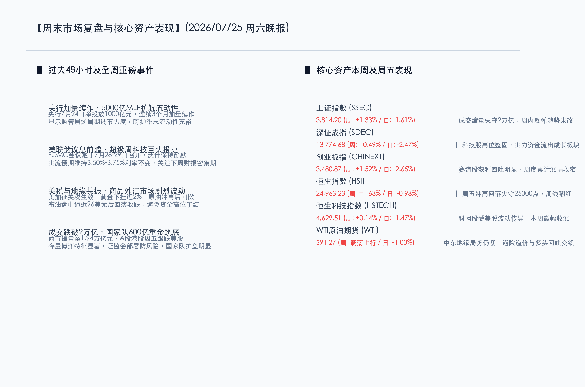

# 政策加力护航流动性，核心资产周线迎集体反弹；美联储议息前瞻及科技超级周将至，两市缩量盘整静待方向抉择

**日期：2026年07月25日 (星期六)** &nbsp; **时段：晚报 (周末复盘模式)**

> **核心摘要**：本周国内A股与港股在监管层密集释放稳市信号、国家队大手笔护航以及央行MLF加量续作等利好支撑下全线飘红。尽管周五受外围市场波动波及出现显著回调，且沪深两市成交额自4月以来首度跌破2万亿元，但全周各大主要指数仍实现集体上涨，其中上证指数全周上涨1.33%，创业板指上涨1.52%。港股同样录得周线翻红。过去48小时内，央行开展5000亿元MLF操作实现流动性净投放，而美国新关税生效和中东局势升级加剧了全球大宗商品与外汇市场的波动。展望下周，美联储议息会议和美股科技巨头财报密集期将成为全球风险资产方向决战的关键，国内长鑫科技挂牌上市亦将成为市场博弈的焦点。

## 核心资产周度/日度表现回顾

本周国内及全球核心资产在政策暖风与外部扰动交织的影响下呈现“宽幅震荡、重心上移”的格局。虽然周五市场因存量博弈观望情绪转浓而大幅缩量，但全周来看，宽基指数底部支撑强劲，录得良好的累计表现。

*   **上证指数 (SSEC)**：周五收报 **3814.20点** (周: **+1.33%** / 日: **-1.61%**) 🔴。成交缩量失守2万页，但周内反弹趋势未改。
*   **深证成指 (SDEC)**：周五收报 **13774.68点** (周: **+0.49%** / 日: **-2.47%**) 🔴。科技股高位整固，主力资金流出成长板块。
*   **创业板指 (CHINEXT)**：周五收报 **3480.87点** (周: **+1.52%** / 日: **-2.65%**) 🔴。赛道股获利回吐明显，周度累计涨幅收窄。
*   **恒生指数 (HSI)**：周五收报 **24963.23点** (周: **+1.63%** / 日: **-0.98%**) 🔴。周五冲高回落失守25000点，周线顺利翻红。
*   **恒生科技指数 (HSTECH)**：周五收报 **4629.51点** (周: **+0.14%** / 日: **-1.47%**) 🔴。科网股受美股波动传导，本周微幅收涨。
*   **WTI原油期货 (WTI)**：周五收报 **$91.27/桶** (周: **震荡上行** / 日: **-1.00%**) 🔴。中东地缘局势仍紧，避险溢价与多头回吐交织。

## 过去 48 小时重磅事件深度复盘

> **事件一：央行超额续作5000亿MLF，逆周期调节力度不断加大**
> 
> 7月24日，中国人民银行开展了5000亿元的1年期中期借贷便利（MLF）操作，中标利率维持不变。鉴于当日有4000亿元MLF到期，央行在此次操作中实现流动性净投放1000亿元。这已经是央行连续第3个月加量续作MLF，充分显示出监管层呵护金融机构流动性合理充裕的决心。配合此前落地的隔夜逆回购等新型政策工具，央行正在通过价格与数量的双重精准调控，夯实实体经济企稳回升的基础，为资本市场平稳运行提供了充裕的保障。

> **事件二：美国新一轮关税政策生效，全球商品与避险资产剧烈震荡**
> 
> 美国政府宣布对包括中国、墨西哥、加拿大及欧盟在内的多个国家和地区加征10%至12.5%关税的措施于美国东部时间7月24日正式生效。这一政策的落地引发了全球金融市场对“二次通胀”的担忧，美元指数表现坚挺。受此影响，国际现货黄金盘中遭遇获利盘大规模了结，大幅下跌1.95%收于4049.26美元/盎司，上海黄金交易所Au9999亦收跌1.52%。同时，中东地缘局势升级刺激布伦特原油和WTI原油盘中宽幅震荡，WTI在触及高位后转跌收于91.27美元/桶，显示出市场在关税阴霾和避险买盘之间的高度博弈。

> **事件三：存量博弈特征显著，两市成交量创4月以来新低**
> 
> 本周五沪深两市全天合计成交仅1.94万亿元，为自4月7日以来首次失守2万亿元关口。成交额的迅速收缩表明，在全球科技股大震荡以及下周一系列重磅靴子落地前，市场存量博弈情绪浓厚。多头主力在经历周初的反弹后转向观望，部分资金出于周末规避地缘与跨境风险的考虑而减仓。尽管如此，以中国国新、中国诚通等国家队资金已累计斥资超600亿入市托底，为指数构筑了坚实的支撑防线。

## 下周全球宏观大事预警

*   **美联储7月议息会议（7月28-29日）**：美联储将召开联邦公开市场委员会（FOMC）会议。虽然受地缘局势和通胀担忧影响，降息预期有所推迟，但目前主流预期仍是维持3.50%-3.75%的基准利率区间不变。需重点防范新任主席凯文·沃什（Kevin Warsh）在新闻发布会上释放出偏向鹰派的言论。
*   **全球科技巨头超级财报周**：微软、Meta、苹果、亚马逊、AMD等AI产业链核心巨头将在下周密集披露财报。其资本开支（Capex）计划和AI业务的盈利表现将直接重塑AI产业的估值叙事，其波动亦将通过跨境传染机制直接波及A股及港股科技板块。
*   **国产半导体巨头长鑫科技上市**：长鑫科技预计于下周正式挂牌上市。作为国内存储器国产化链条上的硬核资产，其上市后的定价与炒作热度将成为下周半导体及自主可控板块的风向标，极易引发科技产业链的局部异动。

## 顶级机构周末策略内参摘要

*   **中金公司 (CICC)**：**“中报披露期关注业绩兑现度，科技板块从主题炒作转向利润支撑”**。中金公司策略报告指出，当前两市成交缩量至2万亿以下，反映出市场从前期的贝塔（Beta）普涨行情进入到阿尔法（Alpha）业绩验证期。建议投资者在震荡中逐步调整仓位，聚焦在AI产业链中具备真实中报利润支撑的软件及硬件细分环节，以及具备逆周期特征的大金融和低估值公用事业。
*   **高盛集团 (Goldman Sachs)**：**“全球资本开支周期并未终结，维持中国股市超配评级”**。高盛发表策略观点称，短期科技板块的震荡主要源于交易拥挤和获利盘回吐，并非AI基础设施建设需求的下滑。随着全球通胀与关税政策靴子落地，中国在半导体设备自主可控以及能源设备出海领域的龙头公司将展现出极强的抗风险韧性，维持对A股及港股核心硬核资产的“超配”建议。
*   **海通证券 (Haitong Securities)**：**“政策护栏与大资金托底无忧，下周市场有望缩量企稳”**。海通证券分析认为，国家队与地方国资超600亿的真金白银买盘，已经为市场探明了底座。本周末市场的调整属于技术性的“回踩确认”，在MLF流动性充裕的背景下，下周随着外部议息会议及财报季尘埃落定，市场有望在3800点上方完成缩量企稳并重拾升势。

## 今日市场情绪：睿鸮瞩风，金曦迎新

周末市场在外部关税加征与地缘博弈的阴霾中缩量调整，但全周反弹重心依然上移。在堆叠着闪烁铜金色与翠绿色微芯片、电路板及金币的未来金融台座上，一只由精细机械齿轮和精密钟表发条构成的智慧机械鸮（Owl）正静静伫立，其蓝光闪烁的双眼警惕地凝视着远方地缘风暴中红绿K线交织的闪电。而在地缘暴风雨密布的乌云背后，一轮温暖且光芒万丈的金色朝阳已悄然升起，将温和的光芒洒向大地，昭示着积蓄力量后的市场将在震荡后拨云见日，迎来破局。

> Prompt: Surrealism style, Subject: A giant mechanical clockwork owl sitting on a pile of golden coins and circuits, its glowing eyes watching a storm on the horizon where red and green lightning flashes. A golden sun rises from behind the clouds, casting a warm light on the scene. No humans. No text., masterpiece, high detail, intricate composition, cinematic lighting, 8k resolution

---

免责声明：内容仅供参考，不构成投资建议。
