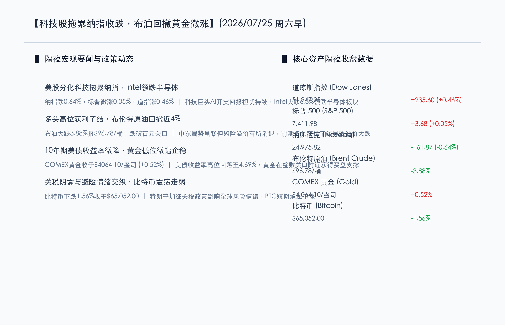

# 科技股拖累纳指收跌，布油回撤失守百元大关，美债收益率高位微降黄金低位企稳

**日期：2026年07月25日 (星期六)** &nbsp; **时段：早报 (常规交易日模式)**

> **核心摘要**：隔夜美股收盘涨跌不一，科技板块的持续走弱继续拖累纳斯达克指数收跌0.64%，而标普500指数微涨0.05%，道琼斯指数在金融与实体板块支撑下逆市收涨0.46%。英特尔（Intel）因盈利前景及资本开支隐忧暴跌6.5%，领跌半导体及芯片算力板块。商品市场方面，地缘溢价有所降温，加上前期多头高位获利了结，布伦特原油大跌3.88%至96.78美元/桶，跌破百元大关。10年期美债收益率从高位微幅回落至4.69%，给无息资产带来喘息机会，COMEX黄金收涨0.52%报4064.10美元/盎司。比特币则在特朗普政府征收新关税的阴霾下震荡走低，下跌1.56%至65,052.00美元。

## 核心行情复盘

隔夜全球市场呈现分化态势，美股科技股的弱势依然是主要拖累，但传统实体与金融板块表现较好。商品市场中油价高位回吐，黄金在整数支撑位附近微幅企稳。

*   **道琼斯工业指数**：收盘报 **51947.25点**，上涨 **0.46%** (+235.60点)。
*   **标普 500 指数**：收盘报 **7411.98点**，上涨 **0.05%** (+3.68点)。
*   **纳斯达克综合指数**：收盘报 **24975.82点**，下跌 **0.64%** (-161.87点)。
*   **大宗商品与能源**：**布伦特原油 (Brent Crude)** 期货大跌 **3.88%**，收于 **$96.78**/桶，失守百元大关；**COMEX 黄金** 期货小幅反弹 **0.52%**，收报 **$4064.10**/盎司，展现出一定的低位企稳迹象。
*   **美债与加密资产**：**10年期美债收益率** 微幅回落至 **4.69%**；**比特币 (BTC)** 下跌 **1.56%**，报 **$65,052.00**。

*   **行业板块表现**：美股大型科技板块（Mag 7）继续震荡整理，半导体及人工智能链条表现偏弱。英特尔大跌6.5%领跌半导体，美光科技与博通等芯片股普遍收低。然而，房地产、金融服务及传统工业板块展现了较强韧性，领涨大市，反映了市场资金在板块间的轮动。

## 核心解读与市场逻辑

> **核心解读一：科技股财报后遗症延续，英特尔暴跌加剧半导体担忧**
> 
> 英特尔尽管在部分指标上超出预期，但因未来的资本支出负担和代工业务的不确定性导致股价暴跌6.5%。这表明市场对AI硬科技领域的期望极高，任何细节上的不及预期或过于庞大的资金投入都会被解读为负面信号。科技股的估值继续面临“大笔花钱却见效慢”的严格审视，科技板块内部的筹码出清与分化仍在进行中。

> **核心解读二：避险溢价暂时消退，原油多头获利了结跌破百元**
> 
> 虽然红海地缘局势和中东对峙依然偏紧，但因缺乏新的冲突升级刺激，原油多头高位了结意愿强烈。布伦特原油从100美元上方回撤近4%至96.78美元/桶。油价的快速回落缓解了市场对“输入性通胀”的短期恐慌，也是隔夜美股道琼斯指数和标普500指数能够企稳微涨的重要背景。

> **核心解读三：收益率微降黄金企稳，新关税政策阴霾压制比特币**
> 
> 随着油价回吐涨幅，10年期美债收益率从52周高点4.70%微降至4.69%，黄金价格在前期大跌后迎来技术性修复，微涨0.52%重返$4060上方。然而，加密资产受到的宏观压制更为显著，特朗普政府对60个交易伙伴加征10%-12.5%新关税的政策动向导致全球风险资产偏好回落，比特币震荡下挫1.56%至$65,052.00，资金避险重回传统资产。

## 政策脉动

*   **美联储与利率政策路径**：由于油价短期跌破百元且美债收益率稍有缓和，美联储的政策张力略有减轻。然而，粘性通胀依旧是央行的主要痛点。高盛宏观研究团队指出，目前大宗商品的调整给政策制定者带来了一定观察窗口，但加征关税等贸易政策的潜在推进可能再度推升通胀预期，美联储年内仍大概率将维持偏鹰派的“Higher for longer”观望态度。
*   **中国政策层面稳流动性**：中国人民银行于7月24日如期开展加量MLF操作，有效平抑了国债发行和跨月流动性压力。同时，证监会持续推进逆周期调节和上市公司分红回购指导，有助于引导本土中长期资金入市，防范外部市场波动带来的输入性回撤。

## 最新机构观点

*   **摩根士丹利 (Morgan Stanley)**：**“板块轮动正在悄然发生，防守型实体资产具备吸引力”**。大摩策略分析师表示，当前高估值的算力科技股正在挤出泡沫，资金开始向地产、金融以及稳定现金流的红利板块回流。只要通胀和美债收益率不出现失控式暴涨，这种健康的分化轮动有助于大盘筑底。
*   **高盛 (Goldman Sachs)**：**“AI军备竞赛逻辑未变，关注具备产业链定价权的核心龙头”**。高盛指出，英特尔等芯片股的重挫并不代表行业需求的见顶，而是对过度乐观预期的修正。在重资产AI开支时代，具有极高技术壁垒、能源壁垒的领头企业仍是长线配置的首选。
*   **中金公司 (CICC)**：**“全球波动加剧，A股防守反击聚焦高股息与国产基建”**。中金建议，在关税风险和美股估值调整的背景下，国内投资者应将重点放在受外部影响较小、且有政策保障的领域。具备稳定现金流的央国企红利股，以及国内AI芯片代工、算力服务器等具备自主可控逻辑的科技板块是较佳的避险港湾。

## 今日市场情绪：铜羽归巢，金秤稳立

今日市场情绪：铜羽归巢，金秤稳立。在古老而宁静的灰色石质神殿图书馆中，一尊由发光银齿轮与精细金导线交织而成的巨大机械猫头鹰，安详地停歇在布满青苔的断壁石柱上。神殿的穹顶窗外，暗红色的风暴雷云正逐渐散去，取而代之的是一抹雨后初晴的柔和蓝色天光。无数翠绿色的发光微型芯片零星洒落在布满历史痕迹的石板路面上。神殿中央，一杆巨大的金色天平稳稳立于晨曦中，一侧承载着一把散发微光的黄金古钥匙，另一侧则是空无一物的黑色原油容器，象征着原油退潮与利率稍息后，理性与定价机制的短暂回归。

> Prompt: Surrealism style, Subject: A majestic, giant mechanical clockwork owl made of glowing silver gears and gold circuits is perched on a cracked marble column in an ancient, serene temple library. In the background: a stormy sky outside is turning from dark red to soft blue, with falling neon green microchips scattered on the ground, while a warm golden sun rises on the horizon casting a steady light on a golden scale that balances a small golden key and an empty black oil vessel. No humans. No text., masterpiece, high detail, intricate composition, cinematic lighting, 8k resolution

---

免责声明：内容仅供参考，不构成投资建议。
