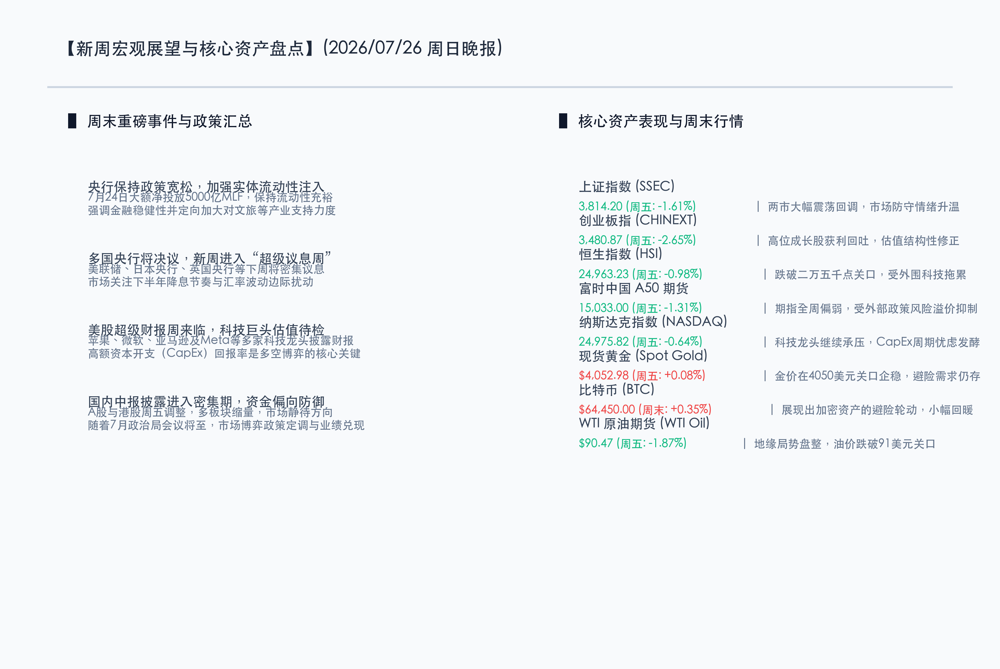

# 决战超级议息与科技财报周，央行流动性精准呵护，市场缩量磨底静待政策新风

**日期：2026年07月26日 (星期日)** &nbsp; **时段：晚报 (新周展望模式)**

> **核心摘要**：本周末，国内宏观流动性精准发力，央行通过大额MLF净投放与后续隔夜逆回购安排，为市场平稳运行保驾护航，同时联合文旅部出台加大实体产业支持的重磅金融政策；全球金融市场进入下半年最重要的“超级决战周”，下周美联储、日本央行、英国央行将密集公布最新利率决议，且苹果、微软、亚马逊及Meta等科技巨头中报集中披露，AI高额资本支出的业绩兑现率面临关键大考。在经历上周五A股与港股在缩量中筑底调整后，多空双方在重磅政策与数据发布前维持偏防御的均势，新周市场情绪预计在政策博弈与业绩验证的交织中逐步确认中长期底部。

## 周末财经要闻终极汇总

本周末，宏观政策暖风频吹，央行流动性保障扎实落地，而外围市场则因为即将到来的“央行超级周”和“美股科技财报周”进入高度紧绷的静默期。

*   **央行流动性大额投放与操作微调**：7月24日，中国人民银行开展了 **5000亿元** 中期借贷便利（MLF）操作，期限为1年，实现大额净投放，充分满足了金融机构对中长期流动性的需求，稳定跨月资金面。同时，央行公告表示为更好匹配银行短期流动性需求，将于7月29日至31日及8月3日开展隔夜逆回购操作，展现了政策精细化调控的艺术。
*   **重点行业支持政策重磅出炉**：中国人民银行联合文化和旅游部印发通知，要求金融机构加大对文旅企业的信贷支持力度，明确提出不得盲目限贷、抽贷、断贷，对受短期地缘或周期扰动的文旅项目实施精准纾困，有助于激发微观主体活力，呵护消费复苏。
*   **数字经济部际联席会议制度获批**：国务院办公厅日前同意建立由国家发改委牵头的数字经济发展部际联席会议制度，成员包括央行、证监会等20个部门。这意味着数字经济的顶层设计和政策合力进一步强化，为科技自强与数字化转型保驾护航。
*   **A50指数期货周末窄幅震荡**：富时中国A50指数期货在上周五收报 **15033.0点**，跌幅为 **1.31%**。在经历了连续大跌后，期指主力合约在当前点位呈现出较强的左侧筑底意愿，存量资金在政策底附近博弈加剧。
*   **比特币震荡回暖**：比特币（BTC）在周末表现平稳，价格在 **64,300 - 64,550美元** 区间窄幅波动，24小时涨幅约为 **0.35%**，高风险偏好的全球流动性在前期抛压释放后，于此点位进行筹码沉淀。
*   **外围大宗商品弱势整理**：上周五纽约商品交易所WTI原油期货收跌 **1.87%**，报 **90.47美元/桶**，地缘溢价小幅回撤；COMEX黄金期货微涨 **0.14%**，收报 **4055.70美元/盎司**，在4050美元关口上方继续呈现防御型偏强震荡。

## 新一周市场核心博弈逻辑

*   **逻辑一：全球“央行超级周”的流动性定价重构**
    下周四（7月30日）美联储将公布利率决议，市场将高度关注其对9月份是否重启加息或继续降息的措辞指引。与此同时，日本央行与英国央行的议息决议亦步亦趋。多国央行政策姿态的边际变化，将直接决定全球跨境资本流向与汇率波动的上限，也是跨境资产在底部重新定价的催化剂。
*   **逻辑二：美股科技巨头“财报大决战”与AI估值泡沫验证**
    美股三大科技巨头苹果、微软、亚马逊以及Meta将在下周集中披露中报业绩。在上周科技股因为“CapEx（资本开支）回报周期拉长”遭遇大面积杀跌后，本轮中报披露是AI概念从“估值泡沫”走向“业绩兑现”的终极大考。若大厂业绩能超预期验证，将有效扭转前期科技股的恐慌回撤情绪，否则可能带来二次去估值踩踏。
*   **逻辑三：国内7月政治局会议政策预期与缩量博弈的平衡**
    上周五A股和港股全线回调，两市成交额萎缩至 **1.93万亿**元。这种极度缩量的格局通常意味着场内悲观动能已经接近释放尾声。新的一周，市场核心博弈点在于即将召开的7月下旬政治局会议。若会议对“更加积极的财政政策”和“适度宽松的货币政策”给予强力且明确的定调，大资金有望通过宽基ETF托底，掀起一轮强力的估值修复行情。

## 本周重磅经济数据与会议前瞻

*   **7月27日-28日**：国内中报业绩披露进入洪峰期，重点关注高端制造、半导体、医药等细分龙头业绩暴雷与超预期的博弈。
*   **7月30日（周四）**：
    *   **02:00** 美联储公布利率决议，随后美联储主席召开新闻发布会，对跨境流动性预期起到决定性定价作用。
    *   美股 **微软（Microsoft）、苹果（Apple）、亚马逊（Amazon）、Meta** 集中公布季度财务报告。
*   **7月31日（周五）**：日本央行利率决议及前景展望报告；中国官方制造业PMI数据公布，验证内需复苏动能。

## 头部券商/投行开盘策略点睛

*   **中信证券 (CITIC)**：**“极端交易出清已接近尾声，中报绩优成长将是反弹先锋”**。中信证券分析指出，近期A股震荡幅度加大，两市成交量急剧萎缩至2万亿以下，这标志着前期高位杠杆和获利盘的出清已进入后期阶段。周末央行精准MLF操作与行业利好频现，随着7月政治局会议预期逐渐升温，市场底部已经确立，反弹将由中报具备订单确定性、出海景气度高的半导体、电网设备及高股息红利标的率先打响。
*   **中金公司 (CICC)**：**“在震荡筑底中精细布局，采取防御红利与科技出海双轮驱动”**。中金公司认为，外围“超级大考”和国内中报披露期重叠，短期市场情绪较为敏感。开盘操作建议以均衡偏防御为主，稳健配置银行、电力等现金流充裕的高股息红利板块作为防御底座，同时在科技板块大跌后，逢低筛选三季度订单飽满、在AI硬科技和智能制造出海中占优的细分龙头。
*   **申万宏源 (SWS)**：**“悲观预期释放充分，紧扣业绩兑现期持股待涨”**。申万宏源表示，不要在极度缩量的地量区间盲目恐慌。本周是美股大厂财报与多国央行政策落地的暴风眼，建议投资者保持定力。新周开盘应重点关注并购重组预期升温以及中报高增长、低估值的错杀品种，耐心等待政策新风和业绩底部共振的到来。

## 今日市场情绪：金秤启扉，绿荫纳潮

今日的市场情绪在超现实主义的画布上被呈现为一幅“金秤启扉，绿荫纳潮”的深邃图景。画面中央，一座以金秤为造型的宏伟黄金大门在由深色波涛组成的海面上缓缓敞开，从门内射出的一道夺目璀璨的翡翠绿光冲上云霄，在天空中映照出一面代表多国央行的巨型发光时钟（象征央行超级议息周将至，时间之针正扣动全球流动性的心弦）。大门两侧，一片由闪烁着金黄脉络的绿色电路板树木组成的森林在海岸边静静延伸，它们粗壮的枝干稳稳地纳取着海潮的起伏（象征虽然市场缩量盘整，但稳健的基础设施与国家流动性注入为大盘筑牢了防守底线）。背景中，一抹温暖柔和的金色旭日正从海平线上喷薄而出，将原本笼罩在天际的暗红色雷暴与K线乌云渐渐驱散（象征在新周重磅财报与政策会议来临之际，市场在底部孕育着云开雾散的破局希望）。

> Prompt: Surrealism style, Subject: A colossal golden gateway shaped like a balance scale stands open on a sea of dark waves. From the gateway, a brilliant beam of emerald light projects into the sky, revealing a giant glowing clock face showing central bank names. Background: A dark storm of red neon candlestick lines is receding, and a warm sunrise illuminates a calm horizon of glowing circuit-board trees. No humans. No text., masterpiece, high detail, intricate composition, cinematic lighting, 8k resolution

---

免责声明：内容仅供参考，不构成投资建议。
