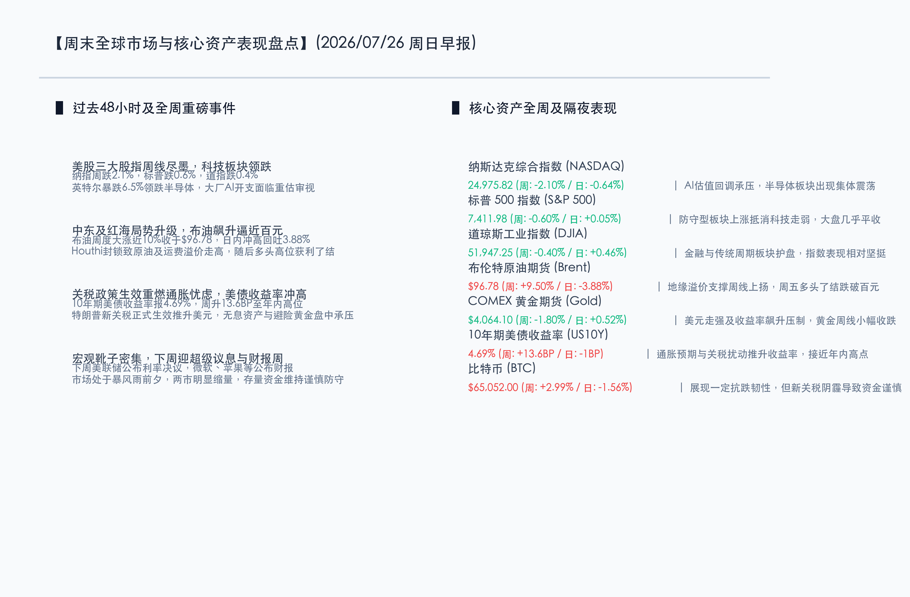

# 全球科技重估压制周线，地缘突袭推升布油逼近百元；下周迎美联储议息与科技巨头财报“决战超级周”

**日期：2026年07月26日 (星期日)** &nbsp; **时段：早报 (周末复盘模式)**

> **核心摘要**：本周全球核心资产呈现显著分化。受大厂AI资本开支受审及英特尔暴跌6.5%影响，美股科技股持续回调，纳指周跌2.1%，拖累全球科技板块震荡整固；而中东及红海局势在Houthi突袭沙特阿美炼厂后骤然升级，布伦特原油全周暴涨近10%逼近百元关口。展望下周，美联储7月议息决议与微软、苹果等科技巨头超级财报披露将成为市场方向决战的关键，关税政策生效后全球二次通胀预期将受到密切关注。

## 核心资产周度/日度表现回顾

本周全球金融市场在复杂的地缘冲突、关税博弈以及科技股估值重塑的多重力量拉扯下宽幅震荡。美股科技板块持续释放风险拖累指数，但传统防御和能源板块周内表现出较强韧性。

*   **纳斯达克综合指数 (NASDAQ)**：收报 **24975.82点** (全周: **-2.10%** / 周五单日: **-0.64%**) 🟢。受半导体与算力大厂开支预期受审拖累，连续两周录得下跌。
*   **标普 500 指数 (S&P 500)**：收报 **7411.98点** (全周: **-0.60%** / 周五单日: **+0.05%**) 🟢。科技股回吐的负面影响部分被防御与周期板块企稳抵消，单日基本持平。
*   **道琼斯工业指数 (DJIA)**：收报 **51947.25点** (全周: **-0.40%** / 周五单日: **+0.46%**) 🟢。金融、房地产及工业蓝筹板块盘中护盘，指数表现相对坚挺。
*   **布伦特原油期货 (Brent)**：收报 **$96.78/桶** (全周: **+9.50%** / 周五单日: **-3.88%**) 🔴。中东地缘溢价推升周线上扬，周五因高位获利了结跌破百元大关。
*   **COMEX 黄金期货 (Gold)**：收报 **$4064.10/盎司** (全周: **-1.80%** / 周五单日: **+0.52%**) 🟢。受美债收益率飙升和美元强势压制，周线小幅收跌，周五出现技术性修复。
*   **10年期美债收益率 (US10Y)**：收报 **4.69%** (全周: **+13.6BP** / 周五单日: **-1BP**) 🔴。关税扰动与通胀预期重燃推升收益率至接近年内高点。
*   **比特币 (BTC)**：收报 **$65,052.00** (全周: **+2.99%** / 周五单日: **-1.56%**) 🔴。展示出一定抗跌韧性，但在宏观新关税政策阴霾下依然承压震荡。

## 过去 48 小时重磅事件深度复盘

> **事件一：中东红海局势升级，Houthi突袭沙特阿美炼厂**
> 
> 过去48小时内，中东地缘局势骤然紧绷。7月25日，也门胡塞武装宣布对沙特红海港口城市延布（Yanbu） and 吉赞（Jazan）的沙特阿美（Aramco）炼油厂实施无人机与导弹突袭，这是自2022年以来该类设施首次遭到直接攻击。此前一天，一艘沙特运营的油轮 NCC MASA 也在红海遇袭受损。中东海运与能源通道的“三 chokepoint（霍尔木兹、红海、苏伊士）”危机同时紧缩，推动布伦特原油价格周中一度飙升超过100美元。尽管周五因多头高位了结大跌3.88%，但地缘风险溢价已在中期为原油构筑强力底座，推升全球二次通胀预期。

> **事件二：美国新一轮对多国关税正式生效，美债收益率录得年内高位**
> 
> 美国政府此前宣布对包括中国、欧盟等60多个贸易伙伴加征10%-12.5%关税的操作已于美东时间7月24日正式生效。这一政策的落地，导致市场对全球供应链重组与美国通胀反弹的担忧加剧。受此影响，10年期美债收益率本周暴涨13.6个基点至4.69%，逼近年度最高水平。美元指数的持续坚挺对无息资产黄金构成沉重打压，伦敦现货黄金与COMEX黄金全周累计下跌1.8%，黄金多头在历史高位附近出现大面积兑现。

> **事件三：大厂AI资本开支遭严格审视，科技板块面临估值出清**
> 
> 本周美股超级财报季拉开序幕，但Alphabet和特斯拉等巨头财报后透露出庞大的AI资本开支（Capex）计划，令市场开始怀疑其短期盈利兑现速度。英特尔（Intel）因盈利前景及资本开支担忧周五暴跌6.5%，领跌整个半导体与芯片算力板块。科技巨头“大笔花钱却见效慢”的隐忧，使得纳斯达克指数全周下跌2.1%，科技赛道筹码的局部松动与估值回调成为拖累全球市场的主要原因。

## 下周全球宏观大事预警

*   **美联储7月议息会议（7月28-29日）**：美联储定于下周二至周三召开FOMC会议，并将于美东时间7月29日14:00公布利率决议，新任主席凯文·沃什（Kevin Warsh）将主持新闻发布会。主流预期仍是维持利率区间在3.50%-3.75%不变，但由于地缘局势恶化和关税生效，沃什对未来通胀路径与政策方向的表态将是全场焦点，市场正严阵以待其潜在的鹰派立场。
*   **超级科技巨头财报决战周**：微软、Meta、苹果、亚马逊等万亿级AI巨头将于下周密集发布Q2财报。在当前科技板块面临估值调整的关口，这些巨头对于下半年AI资本支出的指引将直接决定AI芯片、算力服务器及软件应用板块的存亡，也是跨境资金重新配置的关键风向标。
*   **美国核心经济数据密集披露**：下周四将公布美国二季度GDP初值及6月核心PCE物价指数。作为美联储最关注的通胀指标，若PCE数据因油价和关税表现出顽固粘性，将彻底浇灭年内降息预期，给股市带来新一轮压力。

## 顶级机构周末策略内参摘要

*   **高盛集团 (Goldman Sachs)**：**“AI基础设施建设周期尚未终结，黄金依然是结构性避险资产”**。高盛宏观与大宗商品研究团队表示，虽然英特尔等个股重挫拉低了科技股情绪，但全球AI算力开支的硬性需求未变，预计下周微软与亚马逊的财报将提供支撑。同时，尽管美债收益率飙升导致黄金短线回撤，但由于全球地缘紧张局势加剧以及央行潜在的多元化储备需求（中国等央行实际购金可能高于官方数据），黄金结构性上行通道依然稳固。
*   **摩根士丹利 (Morgan Stanley)**：**“关税靴子落地导致板块分化，防御型及传统红利资产更显抗风险优势”**。大摩策略团队指出，美国加征关税的正式生效对跨国供应链构成了短期冲击，在下周美联储议息会议和巨头财报明朗前，市场资金避险情绪浓厚。建议投资者向现金流稳定、负债率低且受地缘和关税波动影响较小的传统工业、大金融及高股息防御板块轮动。
*   **中金公司 (CICC)**：**“全球波动率抬升，国内配置聚焦独立逻辑与宏观防御”**。中金认为，随着美债收益率冲高以及美股科技链条调整，全球风险资产波动率已显著抬升。在国内宏观政策暖风频吹（期待7月下旬政治局会议）的背景下，A股与港股展现出一定的防守反击韧性。建议短线配置聚焦在独立性强、有政策加持的AI国产自主可控（如长鑫科技挂牌预期带动的存储链）及具备红利属性的高股息央国企。

## 今日市场情绪：沧海扬帆，晨曦破晓

今日市场情绪：沧海扬帆，晨曦破晓。一艘由洁白大理石与黄金集成电路交织构成的精美古老帆船，在由闪烁着红绿微光、如山丘般起伏的K线图波浪组成的海面上破浪前行。在狂风肆虐的海面上，地缘风暴与关税雷电正在散去。背景中，在远处高耸如峭壁的黑色服务器机架上，一尊巨大的发光蓝色灯塔正投射出一道温暖的金色光束，穿透层层乌云，牢牢地照亮着地平线尽头正在冉冉升起的一轮万丈朝阳，昭示着经历震荡与洗礼后的全球金融船只，终将破浪前行，迎来破局的曙光。

> Prompt: Surrealism style, Subject: A beautiful ancient sailing ship made of white marble and golden integrated circuits is sailing through a stormy sea with waves composed of glowing red and green K-line candlestick charts. In the background: a massive glowing blue lighthouse stands on a towering black server cliff, casting a warm golden beam of light that cuts through dark storm clouds and digital lightning, illuminating a brilliant golden sun rising on the horizon. No humans. No text., masterpiece, high detail, intricate composition, cinematic lighting, 8k resolution

---

免责声明：内容仅供参考，不构成投资建议。
