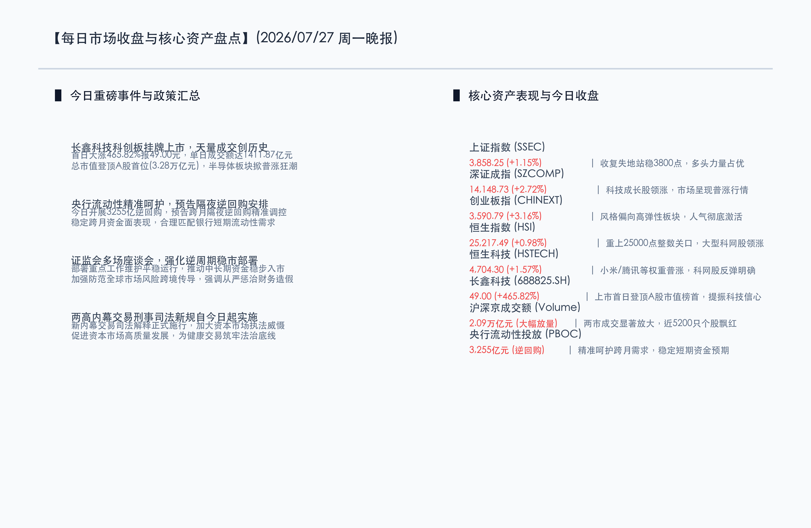

# 长鑫科技天量上市登顶A股榜首，政策护航稳市，市场普涨回暖迎来反弹破局

**日期：2026年07月27日 (星期一)** &nbsp; **时段：晚报 (常规交易日模式)**

> **核心摘要**：今日A股与港股迎来极为强劲的普涨反弹，沪指大涨1.15%收复3800点，深成指与创业板指涨幅分别达2.72%和3.16%。超级巨头长鑫科技首日挂牌上市，以1411.87亿元的创纪录成交量及3.28万亿元的市值登顶A股首位，彻底引爆科技与半导体产业链。政策面上，央行大额逆回购与后续隔夜逆回购预期稳定流动性，两高最新内幕交易司法解释今日正式施行，证监会稳市座谈会密集召开，共同为市场筑牢法治与流动性双重底座。随着极端交易出清完毕，市场阶段性底部基本确立，8月修复行情有望提前开启。

## 核心行情复盘

今日A股与港股在利好共振下呈现出单边拉升的普涨行情，两市量能急剧放大，全市场上涨个股数逼近5200只，多头情绪显著回暖。

*   **上证指数 (SSEC)**：收报 **3858.25点**，涨幅为 **+1.15%**。大盘今日成功收复前期跌幅，站稳3800点关键关口，技术面重回多头主导。
*   **深证成指 (SZCOMP)**：收报 **14148.73点**，大涨374.06点，涨幅达 **+2.72%**。
*   **创业板指 (CHINEXT)**：收报 **3590.79点**，大涨109.92点，涨幅达 **+3.16%**。高弹性成长板块展现出极强的向上动能。
*   **恒生指数 (HSI)**：收报 **25217.49点**，上涨254.26点，涨幅为 **+0.98%**。成功重回25000点整数关口。
*   **恒生科技指数 (HSTECH)**：收报 **4704.30点**，涨幅为 **+1.57%**。小米、美团、腾讯等科网巨头普遍飘红。
*   **两市成交额**：沪深京三市今日合计成交达 **2.09万亿元**，较上一个交易日急剧放量，显示增量资金在底部区域积极建仓。
*   **行业板块动向**：
    *   **领涨行业**：受长鑫科技上市首日暴涨带动，半导体及电子元器件、电池产业链爆发，脑机接口、人形机器人等前沿科技板块涨幅居前。
    *   **领跌行业**：前期作为避险通道的油气、保险、煤炭等高股息红利板块出现小幅回调，资金呈现明显的“防守转进攻”迹象。

## 核心解读与市场逻辑

*   **长鑫科技史诗级上市，点燃半导体科技牛市星火**
    今日上交所科创板迎来超级独角兽长鑫科技（688825.SH）挂牌上市。该股首日收盘价报 **49.00元/股**，单日涨幅达 **+465.82%**，全天成交额高达 **1411.87亿元**，一举打破A股个股单日历史最高成交纪录。上市首日，其总市值达到 **3.28万亿元**，超越其他权重，登顶A股总市值榜首。长鑫科技的强势表现，彻底激活了全市场对半导体芯片、先进制程、材料设备以及下游AI算力的想象空间，科技成长板块在增量资金涌入下全线爆发。
*   **赚钱效应爆发，两市超过5000只个股上涨，筑底反弹破局确立**
    今日两市在天量成交额的配合下，个股呈现出极端普涨特征，上涨个股数接近5200只。这种极致的赚钱效应是在前期经历缩量磨底后多头力量的集中释放。主力资金一改此前的被动防御姿态，通过宽基ETF和科创板龙头进行坚决的左侧建仓，说明市场在极度出清后已确认了阶段性底部，行情正式由“磨底”转入“反弹”阶段。

## 政策脉动

*   **央行流动性精准呵护，隔夜逆回购机制落地稳定预期**
    今日中国人民银行开展了3255亿元7天期逆回购操作，精准平抑短期跨月波动。同时，央行预告将于7月29日至31日每日开展6000亿元、8月3日开展3000亿元的隔夜逆回购操作，通过固定利率、数量招标方式微调银行体系流动性。此举极大平复了市场对跨月资金面趋紧的担忧，彰显了监管层精准调控与防范流动性风险的决心。
*   **证监会多场座谈会部署稳市重点，中长期资金入市提速**
    证监会近日密集召开座谈会，强调要更加精准有效实施逆周期调节，综合施策维护资本市场平稳运行。会议明确提出要推动中长期资金稳步入市，加强应对全球市场波动和风险跨境传导的政策储备，并继续从严监管、重拳查处财务造假等违法行为。监管层的态度为市场注入了强心针，中长期资金入市通道将进一步拓宽。
*   **司法防线升级，两高内幕交易刑事司法新规今日起正式实施**
    最高人民法院、最高人民检察院联合修订的《关于办理内幕交易、泄露内幕信息刑事案件具体应用法律若干问题的解释》于今日（2026年7月27日）起正式施行。新规从严惩治内幕交易犯罪，提高资本市场违法违规成本，在制度上维护交易公平性。这与证监会“严监管”形成合力，为本次底部的法治化与健康交易环境提供了坚实保障。

## 最新机构观点

*   **中信证券 (CITIC)**：**“极端交易出清已步入尾声，8月轮动修复窗口期已确立”**。中信证券分析指出，市场前期在缩量调整中逐步化解了杠杆与地缘风险溢价。随着长鑫科技上市引爆科技偏好，加上央行精准逆回购操作以及7月下旬政治局会议稳增长预期的重磅发酵，市场最困难的磨底时刻已经过去。8月A股将迎来普遍的估值轮动修复，建议积极配置以AI链条上游半导体、国产算力以及出海制造为代表的成长主线，同时逐步收敛科技与低位非科技板块的估值价差。
*   **中金公司 (CICC)**：**“科技创新与稳市政策双轮驱动，逢低布局高弹性科技龙头”**。中金公司认为，今日长鑫科技挂牌展现了国家支持硬科技与战略新兴产业的决心，科技自强成为最明确的资产定价主线。随着两高司法解释落地及证监会稳市部署，市场的监管防线和制度预期更加明晰。操作上，建议在保持红利价值股作为防守底座的同时，将超配额度果断切向半导体设备、人形机器人及脑机接口等高景气、高弹性方向。

## 今日市场情绪：凤舞九天，金钥启扉

今日的市场情绪在超现实主义的画布上被呈现为一幅“凤舞九天，金钥启扉”的宏伟图景。画面中央，一只由璀璨的翡翠绿半导体芯片和金色集成电路板组成的巨型机械凤凰在交易大厅中振翅高飞，洒下无数耀眼的绿色科技光芒（象征长鑫科技上市点燃半导体及科创板的普涨狂潮）。在背景中，一座巨大的金色国库宝库大门在晨曦中稳稳屹立，散发着厚重温暖的保护性光环，将四周原本席卷而来的红绿色市场波动乌云悉数融化驱散（象征央行流动性大额注入与证监会监管司法新规为市场铸牢了安全稳定的底部底座）。整幅画面充满着新生与希望，预示着市场在底部蓄势完成，迎来强势的反弹破局。

> Prompt: Surrealism style, A colossal phoenix made of glowing emerald semiconductor chips and golden circuitry rises from a grand trading floor. In the background: a massive golden gate of a treasury vault stands firm, casting a warm protective shield that dissolves dark clouds of market volatility. No humans. No text., masterpiece, high detail, intricate composition, cinematic lighting, 8k resolution

---

免责声明：内容仅供参考，不构成投资建议。
