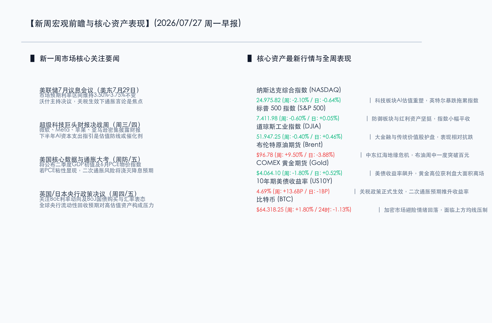

# 关税重压与二次通胀阴霾笼罩，本周迎来央行超级决议与科技巨头财报“终极审判”

**日期：2026年07月27日 (星期一)** &nbsp; **时段：早报 (新周展望模式)**

> **核心摘要**：本周全球金融市场将迎来下半年最关键的“超级决议与财报周”。在全球新一轮关税政策落地生效及布伦特原油价格高位震荡的背景下，10年期美债收益率已攀升至4.69%的年内高位。面对通胀粘性反弹与估值出清，科技板块持续面临重塑。本周微软、Meta、苹果、亚马逊的资本开支指引，以及美联储、英国央行和日本央行的政策走向，将是全球资产价格破局的核心。

## 周末财经要闻终极汇总

本周全球宏观格局在贸易壁垒、地缘摩擦以及产业巨头调整的共振中进入高度不确定期：

*   **美国新一轮对多国关税政策正式生效**：此前宣布的对约60个贸易伙伴加征10%-12.5%的关税于美东时间7月24日正式落地。同时，针对欧盟对美科技巨头的高额罚款，美方威胁将加大反制力度。全球供应链重组与美国二次通胀忧虑迅速拉升，推高美债收益率。
*   **中东红海地缘危机持续紧绷**：也门胡塞武装对吉赞及延布的沙特阿美炼厂发起无人机与导弹突袭。地缘风险溢价大幅收窄了布油周五的获利回调空间，全周油价大涨近10%，为能源成本与通胀反弹构筑了高基底。
*   **跨国工业巨头启动深度收缩与重组**：德国汽车巨头大众汽车（VW）披露其最新季度净利润大幅下滑35.7%，并有消息传出可能在全球裁员达10万人。传统制造业面临的供应链成本和电动化转型阵痛进一步凸显。

**全球核心资产最新收盘与表现回顾**：
*   **纳斯达克综合指数 (NASDAQ)**：收报 **24975.82点** (周度: **-2.10%** / 周五: **-0.64%**) 🟢。AI变现速度受审，半导体大厂资本支出重估导致科技板块遭遇筹码松动。
*   **标普 500 指数 (S&P 500)**：收报 **7411.98点** (周度: **-0.60%** / 周五: **+0.05%**) 🟢。科技股回调压力被大金融、传统防御板块的买盘所部分抵消。
*   **道琼斯工业指数 (DJIA)**：收报 **51947.25点** (周度: **-0.40%** / 周五: **+0.46%**) 🟢。受新关税政策生效后的价值板块防御配置影响，道指盘中获得明显支撑。
*   **布伦特原油期货 (Brent)**：收报 **$96.78/桶** (周度: **+9.50%** / 周五: **-3.88%**) 🔴。胡塞武装袭击沙特阿美炼厂，地缘溢价推升周线上冲，周五多头了结跌破百元。
*   **COMEX 黄金期货 (Gold)**：收报 **$4064.10/盎司** (周度: **-1.80%** / 周五: **+0.52%**) 🟢。美债收益率冲高令黄金承压震荡，但地缘避险属性仍提供下方支撑。
*   **10年期美债收益率 (US10Y)**：收报 **4.69%** (周度: **+13.6BP** / 周五: **-1BP**) 🔴。美国关税政策正式落地生效，通胀担忧推动收益率逼近年内新高。
*   **比特币 (BTC)**：收报 **$64,318.25** (周度: **+1.80%** / 日度: **-1.13%**) 🔴。市场避险情绪自高位回落，加密货币承压于上方均线阻力。

## 新一周市场核心博弈逻辑

*   **AI高资本开支与实际盈利转换的“终极审判”**：上周Alphabet与特斯拉财报后由于AI支出高企而见效较慢，引发了纳斯达克的估值回撤。本周微软、Meta、苹果、亚马逊密集发布财报，其资本开支（Capex）计划及下半年盈利展望，将决定科技板块泡沫是会面临更大范围的挤压还是会迎来反弹。
*   **关税博弈与全球二次通胀预期**：新一轮关税已落地，且红海地缘危机在中期内推高运价与油价，市场对二次通胀的担忧加剧。这直接反映在10年期美债收益率攀升至4.69%上。高收益率对权益资产估值分母端形成压制，无息资产黄金亦受到美元升值的挤压。
*   **资金从“高成长科技”到“红利与价值”的防御性腾挪**：市场整体波动率大幅回升，资金表现出明显的避险意愿。在大盘科技龙头盘整期间，具备稳定现金流、低负债、高股息的大金融、公用事业及受贸易保护政策直接影响较小的本土防御资产成为资金避风港。

## 本本周重磅经济数据与会议前瞻

新一周的财经日历被超级央行决议和核心宏观指标所填满，具体时间表及预期如下：

*   **美联储7月利率决议（美东时间7月29日）**：市场一致预期本次会议将维持利率在3.50%-3.75%的水平不变。但随着关税落地和油价反弹，新任美联储主席凯文·沃什（Kevin Warsh）在新闻发布会上对于未来通胀路径的研判与前瞻指引将受到严密审视，谨防其超预期的鹰派表态。
*   **英国与日本央行政策会议（7月30-31日）**：英国央行（BoE）利率决议面临两难，而日本央行（BoJ）将公布最新的买债规模缩减方案及利率决议。若日本央行货币政策超预期收紧，可能引发日元套利交易进一步拆仓，波及全球资产流动性。
*   **核心经济数据密集出炉（7月30-31日）**：
    *   **周四**：美国第二季度GDP初值（市场预期年化增长2.3%）、美国6月核心PCE物价指数（美联储最青睐的通胀指标，关税与油价表现将决定数据粘性）。
    *   **周五**：中国7月官方PMI数据（研判下半年国内需求走势的关键指标）、欧元区7月CPI初值。
*   **科技巨头财报披露日程**：
    *   **7月29日（周三）**：微软、Meta
    *   **7月30日（周四）**：亚马逊、苹果

## 头部券商/投行开盘策略点睛

*   **高盛集团 (Goldman Sachs)**：**“AI长线趋势不改，短期需忍受业绩过渡期的宽幅波动”**。高盛研究部强调，尽管英特尔大跌等个案拖累了市场对AI硬件链的信心，但北美云巨头（Hyperscalers）在算力基建上的硬性投资仍是长期趋势。本周微软、亚马逊对云计算及AI开支的最新指引将成为科技板块的中流砥柱。此外，全球关税生效带来的供应链摩擦升温，使得黄金的中期抗通胀避险仓位配置依然具有强吸引力。
*   **摩根士丹利 (Morgan Stanley)**：**“新关税全面落地，建议在核心决议明朗前锁定传统红利与防御配置”**。大摩策略团队警告，关税落地对跨国制造业和科技供应链将带来实质性的成本上调。在本周美联储决议、超级财报及GDP/PCE等关键宏观靴子落地前，不建议盲目抄底高估值科技股，应优先配置于现金流稳健、股息收益率高的价值蓝筹、传统公用事业以及大金融板块。
*   **中金公司 (CICC)**：**“海外重估抬升全球波动率，国内市场聚焦政策预期与国产替代”**。中金认为，随着美债收益率冲高以及美股科技链条调整，全球风险资产波动率已显著抬升。在国内宏观政策暖风频吹的背景下，A股与港股展现出一定的防守反击韧性。建议配置上聚焦在独立性强、有政策加持的AI国产自主可控以及具备红利属性的高股息央国企。

## 今日市场情绪：乾坤流转，静候破局

新一周全球市场处于“暴风雨前的静默”状态。巨大的机械星盘在深邃的数字化大地上流转，齿轮咬合代表着各大央行利率决议与科技财报的最终决战时刻。虽然地缘与关税的重压仍如天边翻滚的乌云，但金色的晨曦已从地平线升起，温暖地照亮整个金融星盘，预示着市场在历经高波动性的洗礼后，终将拨云见日，迎来破局的曙光。

> Prompt: Surrealism style, Subject: A towering mechanical celestial clockwork mechanism sitting on a dark digital landscape, with its gears and dials made of glowing blue and gold circuitry. In the background: thick storm clouds are parted by massive beams of light from a bright rising sun, illuminating a path forward. Floating around the clockwork are delicate, glowing crystal spheres representing key financial assets like gold, oil, and cryptocurrency. No humans. No text., masterpiece, high detail, intricate composition, cinematic lighting, 8k resolution

---

免责声明：内容仅供参考，不构成投资建议。
