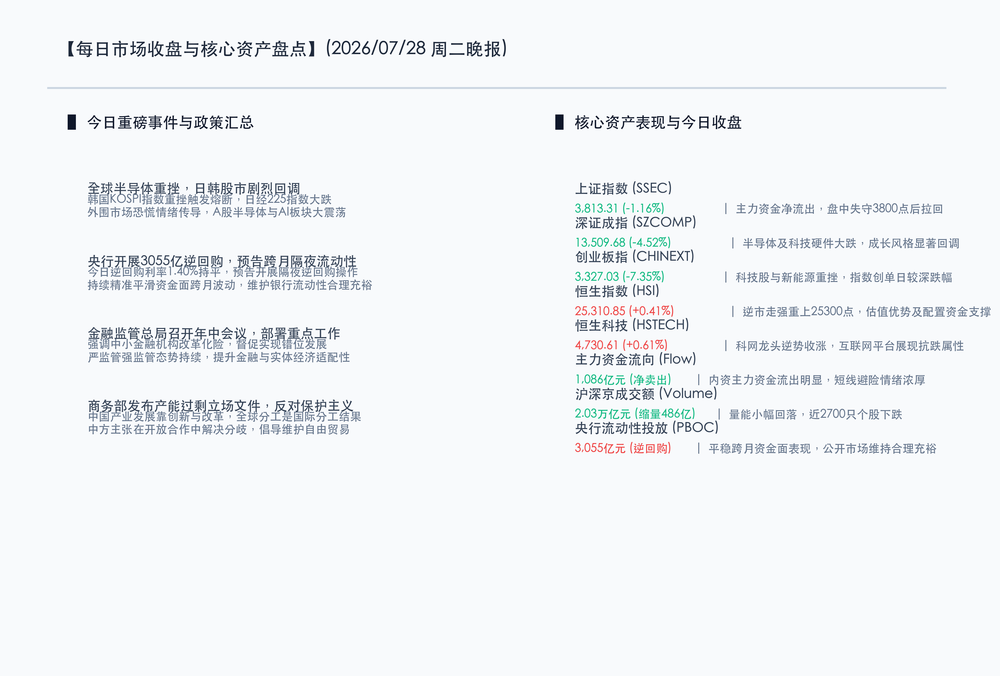

# 全球半导体重挫传导，A股科技成长剧烈回调，港股逆市走强与防御板块筑底回暖

**日期：2026年07月28日 (星期二)** &nbsp; **时段：晚报 (常规交易日模式)**

> **核心摘要**：今日受外围日韩等半导体与AI市场重挫及地缘局势变化的多重联动影响，全球科技板块重挫，引发A股科技成长板块剧烈回调，创业板指大跌7.35%，科创50指数重挫6.33%。与此同时，市场呈现明显的“弃科技抱防御”高低切换，白酒、食品饮料及银行等板块相对抗跌，主力资金涌入寻求避险。港股表现出极强韧性，恒指逆势微涨0.41%，恒生科技微涨0.61%。政策面上，央行大额公开市场操作稳定跨月预期，金融监管年中会议与商务部产能过剩声明共同筑牢实体与政策根基。

## 核心行情复盘

今日国内市场在利空共振下呈现出剧烈的结构性分化行情。受外围大跌影响，科技硬件产业链全线回调，而白酒与银行等防御蓝筹则挺身而出，平抑大盘波动，恒生指数亦逆势微涨。

*   **上证指数 (SSEC)**：收报 **3813.31点**，跌幅为 **-1.16%**（-44.93点）。沪指早盘跳空低开，盘中一度失守3800点关键支撑位，午后防御板块拉升带动指数有所回升。
*   **深证成指 (SZCOMP)**：收报 **13509.68点**，跌幅为 **-4.52%**（-639.05点）。成长风格资产估值压力阶段性释放。
*   **创业板指 (CHINEXT)**：收报 **3327.03点**，跌幅为 **-7.35%**（-263.76点）。科技权重占比过高导致指数在抛售潮中受到较大冲击。
*   **恒生指数 (HSI)**：收报 **25310.85点**，上涨103.67点，涨幅为 **+0.41%**。表现远胜A股，显现出较强的底部估值吸引力。
*   **恒生科技指数 (HSTECH)**：收报 **4730.61点**，上涨28.56点，涨幅为 **+0.61%**。网易、京东等互联网平台企业走势活跃。
*   **两市成交额**：沪深京三市今日合计成交达 **2.03万亿元**，较上一个交易日缩量约 **486亿元**，个股呈现跌多涨少态势。
*   **行业板块动向**：
    *   **领涨行业**：白酒与食品饮料等防御性板块相对抗跌，低估值的银行板块备受青睐（主力资金净流入超15亿元）。部分光刻机概念股在早盘呈现逆市活跃。
    *   **领跌行业**：受全球半导体与AI行业竞争担忧的联动影响，半导体、存储芯片及AI算力等板块领跌，光通信、CPO、铜缆高速连接等跌幅居前，兆易创新等多只行业龙头股触发跌停。

## 核心解读与市场逻辑

*   **外围日韩市场剧烈共振，AI与科技信仰短期承压**
    今日A股及全球科技板块大幅下挫，直接诱因是韩国KOSPI指数暴跌触发熔断，以及美日半导体龙头大跌带来的联动效应。在地缘局势震荡背景下全球资金流向进行仓位调整，使得前期高昂的AI溢价和半导体成长预期受到阶段性重估。短线获利资金集中了结，导致科创板及创业板出现拥挤度出清与流动性反噬的特征。
*   **资金高低切换明显，防御型板块及港股抗跌性突显**
    在科技硬件板块全面退潮的同时，市场避险情绪迅速升温。以贵州茅台为首的白酒、食品饮料以及传统金融银行板块展现出了优秀的防御属性。同时，港股恒生指数与恒生科技指数逆市走红，表明外资与低吸资金在港股估值低洼区积极配置，互联网平台龙头的抗跌性为市场整体情绪提供了一定支撑。

## 政策脉动

*   **央行流动性平稳跨月，隔夜逆回购大额工具落地**
    今日中国人民银行以固定利率、数量招标方式开展了3055亿元7天期逆回购操作，中标利率1.40%保持不变。针对跨月流动性平稳需求，央行前期预告的2.1万亿元隔夜逆回购大额流动性管理保障稳定了银行间市场利率预期。
*   **金融监管总局年中会议部署，中小金融机构化险提速**
    国家金融监督管理总局年中工作会议强调深化严监管强监管态势，督促中小金融机构错位发展，加快改革转型，稳步推进重点领域风险化解，确保金融体系与当前经济结构转型升级的深度适配。
*   **商务部就所谓“产能过剩”发表中方立场**
    商务部于7月28日发表《关于所谓“产能过剩”问题的中方立场》文件，指出产业发展核心在于创新驱动与深化改革，全球分工是市场规律的客观选择，主张在开放合作中解决分歧，坚决反对贸易保护主义行为。

## 最新机构观点

*   **招商证券 (China Merchants Securities)**：**“白酒行业步入周期底部，中长期配置价值显现”**。招商证券指出，当前低利率环境下，居民资产结构性搬家和配置难的困境依然突出。白酒板块近期表现出较好的抗跌防御属性，当前估值已进入历史底部区域。随着渠道情绪和经销商预期的逐步修复，行业中长期配置的性价比极具吸引力。
*   **中信证券 (CITIC Securities)**：**“全球科技定价锚点发生偏移，地缘与能源风险压制短期偏好”**。中信证券认为，今日A股半导体与AI赛道的剧烈调整，主要受到日韩等外围市场重挫的联动冲击，特别是韩国股市触发熔断，动摇了此前市场对科技无上限扩张的信仰。随着地缘局势、能源供应等多重变量交织，全球定价锚点正在发生偏移。短期建议收敛过度拥挤的科技算力头寸，逢低吸纳基本面扎实、具备业绩支撑的宽基ETF及银行等红利资产，待情绪面出清后重新评估科技龙头的左侧机会。

## 今日市场情绪：负隅坚盾，玉露新萌

今日的市场情绪在暴风雨与防线的对峙中被生动呈现。画面中，一座古老的石制天平在深色汹涌的巨浪中巍然伫立。天平的一侧，无数散发着翡翠色光芒的GPU芯片和集成电路板正在遭受绿色的狂暴闪电劈打，不断碎裂并沉入海底，象征着半导体及AI算力板块在日韩暴跌震荡中遭遇了严酷的情绪杀跌；而天平的另一侧，一柄巨大的金色钥匙和一只精美的羊脂白玉净瓶（盛满着晶莹的玉液，象征白酒与传统价值防线）正在稳稳上升，闪耀着温暖的金光。背景深处，一扇由央行与监管政策化身的黄金拱门撑开了一道明亮的保护结界，将原本席卷而来的红绿色市场波动乌云尽数融化阻隔，展现出市场在极度震荡中以坚固防御等待新周期的不屈斗志。

> Prompt: Surrealism style, A colossal stone scale balance in a turbulent dark ocean. On one side of the scale, glowing emerald microchips are cracking and sinking under a violent storm of green lightning. On the other side of the scale, a massive golden key and an elegant white jade flask filled with clear liquid rise steadily. In the background, a huge golden portal of a treasury shines with a warm, protective barrier that dissolves dark clouds of market volatility. No humans, no text., masterpiece, high detail, intricate composition, cinematic lighting, 8k resolution

---

免责声明：内容仅供参考，不构成投资建议。
