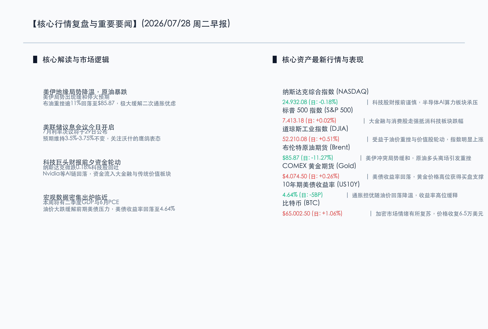

# 美伊局势降温原油暴跌11%，美债收益率高位回落，超级财报与议息会议前夕资金转入防御

**日期：2026年07月28日 (星期二)** &nbsp; **时段：早报 (常规交易日模式)**

> **核心摘要**：美伊冲突局势缓和，导致布伦特原油重挫11%回吐前期涨幅，极大缓解了全球对二次通胀的忧虑，推动10年期美债收益率回落至4.64%。美联储7月议息会议开启前夕，市场维持观望情绪，资金从高估值科技板块轮动至大金融及传统价值股，美股三大指数涨跌互现。

## 核心行情复盘

隔夜全球金融市场在重大政策决议及巨头财报前夕表现分化。地缘风险溢价的快速回吐成为主导大宗商品与债券市场的主要力量，进而驱动权益市场的板块轮动。

*   **纳斯达克综合指数 (NASDAQ)**：收报 **24932.08点** (日度: **-0.18%**) 🟢。科技股财报前谨慎，半导体AI算力板块承压，英伟达等高估值芯片龙头回吐。
*   **标普 500 指数 (S&P 500)**：收报 **7413.18点** (日度: **+0.02%**) 🔴。大金融与消费板块走强，抵消了科技股下跌对指数的拖累，微幅收涨。
*   **道琼斯工业指数 (DJIA)**：收报 **52210.08点** (日度: **+0.51%**) 🔴。受益于油价重挫减轻企业成本压力以及价值股轮动，指数明显走强。
*   **布伦特原油期货 (Brent)**：收报 **$85.87/桶** (日度: **-11.27%**) 🟢。美伊局势传出停火和谈预期，前期溢价快速回吐，多头获利了结导致暴跌。
*   **COMEX 黄金期货 (Gold)**：收报 **$4074.50/盎司** (日度: **+0.26%**) 🔴。随着美债收益率从高位回落，金价获得支撑并小幅走高。
*   **10年期美债收益率 (US10Y)**：收报 **4.64%** (日度: **-5BP**) 🟢。原油价格暴跌极大缓解了二次通胀预期，收益率高位释压回落。
*   **比特币 (BTC)**：收报 **$65002.50** (日度: **+1.06%**) 🔴。加密市场情绪有所复苏，价格企稳并收复6.5万美元关口。

在权益市场内部，领涨板块主要集中在**大金融（摩根大通、高盛等）、公用事业、传统消费及航空航天**，这些板块受益于原油成本下降及避险资金流入。而领跌板块则是**半导体及硬科技算力链**，市场对本周即将公布的微软、Meta、苹果、亚马逊的资本支出（Capex）指引持有戒备态度，Nvidia等AI芯片巨头在获利盘打压下小幅走低。

## 核心解读与市场逻辑

*   **地缘局势“降温”打破二次通胀叙事**：美伊局势出现停火预期，原油价格暴跌超过11%回到$85.87/桶，回吐了自地缘摩擦爆发以来的全部涨幅。由于能源是通胀的领先指标，油价暴跌迅速减轻了市场的通胀压力，导致10年期美债收益率从高位滑落至4.64%，缓解了资产估值分母端的重压。
*   **超级科技巨头财报“大考”前的防御轮动**：微软和Meta本周将率先公布财报。在前有Alphabet财报因AI支出高企而受审的背景下，资金普遍在“终极审判”前采取防御姿态，暂时流出高估值的算力板块，流向现金流稳定、估值较低的红利与传统防御板块，导致纳斯达克与道指走势分化。
*   **美联储7月会议与降息博弈**：美联储为期两天的利率会议今日正式启动。虽然本次维持利率在3.50%-3.75%区间不变是共识，但油价的暴跌无疑为美联储后续的鸽派表态提供了底气。市场正在密切观望新任美联储主席凯文·沃什（Kevin Warsh）在新闻发布会上对未来降息门槛的最新指引。

## 政策脉动

*   **央行流动性维护与汇率微调**：7月27日，中国人民银行（PBOC）将人民币兑美元中间价设为6.7911，较上一交易日的6.7939略有升值。同时，央行通过逆回购和MLF操作继续净投放资金，表明在保持汇率基本稳定的前提下，国内政策保持“适度宽松”以支持实体经济。
*   **长线资金入市与监管红线**：证监会（CSRC）继续加大力度引导中长期资金入市。与此同时，监管红线依然紧绷。7月27日，香港证监会（SFC）对国信证券（香港）资管处以罚款；同时富途控股（Futu Holdings）因涉嫌未 compliance CSRC 要求在境内无照运营面临集体诉讼，凸显了跨境金融监管的持续收紧。
*   **科创板重磅IPO点燃科技热情**：7月27日，国产存储芯片巨头长鑫存储（CXMT）在上海证券交易所科创板首发上市，首日股价大涨。此举极大地鼓舞了A股科技板块的信心，市场普遍认为这是科技国产替代与科创板结构性牛市的强烈信号。受此推动，昨日上证指数上涨1.15%，恒生指数上涨0.98%。

## 最新机构观点

*   **高盛集团 (Goldman Sachs)**：**“原油暴跌缓解通胀焦虑，美债收益率回落有助于科技股中期企稳”**。高盛研究部分析，地缘危机降温带来的油价大跌是近期最重要的宏观利好，它不仅降低了企业生产的能源成本，更锁定了美债收益率的上行空间。尽管科技巨头财报前市场情绪偏向防御，但一旦微软、亚马逊等企业在财报中展现出AI基建开支带来的实质收入增长，算力板块将迅速迎来修复。
*   **摩根士丹利 (Morgan Stanley)**：**“油价下跌利好消费与价值，但在联储决议落地前仍需坚守红利资产”**。大摩策略团队认为，虽然通胀风险有所减弱，但美联储7月决议和下半年经济数据（GDP、PCE）尚未出炉。在政策靴子落地之前，建议投资者继续在能源成本下降受益的交运、零售以及大金融板块进行防御性配置，不要过早、过高地押注高Beta的半导体成长股。
*   **中金公司 (CICC)**：**“国内政策底与长鑫存储IPO共振，看好A股与港股的防守反击”**。中金认为，随着长鑫存储IPO的顺利破局以及监管层对中长期资金入市的政策储备，国内市场的估值底和政策底正在得到双重确认。海外波动虽然仍有溢出效应，但人民币汇率企稳及国内宽松流动性环境将使A股和港股成为全球震荡中的“避风港”，建议聚焦AI自主可控和高股息央国企的双主线。

## 今日市场情绪：油雾散尽，天朗气清

随着美伊地缘局势的降温，笼罩在市场头顶的油价阴霾迅速退去。巨大的水晶沙漏在数字化的大地上矗立，黑色的石油正在迅速流尽，露出了内部象征平衡的金色天平。10年期美债收益率的指标正在天平上温和下降，背后的数字风暴乌云正在散开，温暖的金色晨曦照亮了科技与价值交织的金融星盘。虽然科技股在超级财报周前略显局促，但通胀焦虑的缓解已为市场铺平了更加稳健的复苏道路。

> Prompt: Surrealism style, Subject: A giant, crystal-clear hourglass standing on a digital landscape. The sand flowing inside the hourglass is thick, black crude oil, but it is rapidly draining away, revealing a shining, golden scale that is slowly balancing. One side of the scale holds a glowing green 10-year Treasury note (US10Y) that is gently descending to a safe level. In the background: dark stormy clouds of geopolitics are parting to reveal a bright, rising sun, casting warm golden rays. Some delicate, glowing green circuitry leaves representing tech stocks drift in the air, with a few of them glowing red as they settle. No humans. No text., masterpiece, high detail, intricate composition, cinematic lighting, 8k resolution

---

免责声明：内容仅供参考，不构成投资建议。
