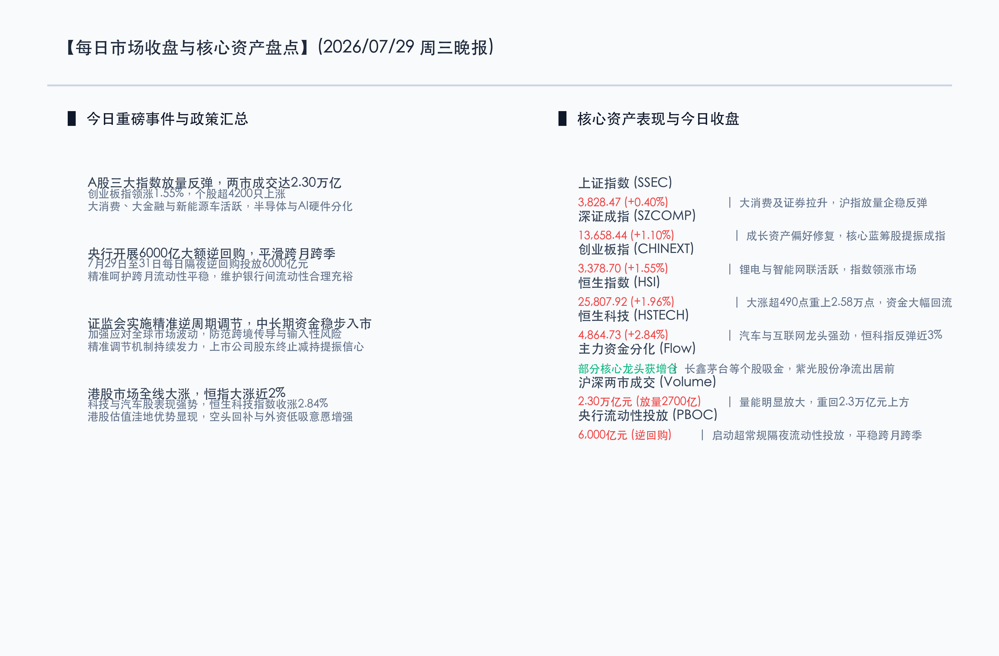

# 估值洼地引资金回流与大消费拉升，A股两市放量普涨，港股恒指大涨近2%

**日期：2026年07月29日 (星期三)** &nbsp; **时段：晚报 (常规交易日模式)**

> **核心摘要**：今日国内市场迎来强劲的量价齐升反弹行情。受证监会精准逆周期调节和央行大额隔夜流动性平稳跨月预期的提振，A股三大指数集体大涨，沪深两市全天成交额达2.30万亿元，显著放量超2700亿元，个股呈普涨格局。港股市场反弹更为猛烈，恒指大涨497点重上25800点，恒生科技指数大涨2.84%。大消费、券商、地产及新能源汽车产业链全线活跃，AI与半导体产业链出现分化回调。市场呈现明显的低位资产回补与“高低切换”特征。

## 核心行情复盘

今日国内市场在多重利好支撑下展开强势反弹，市场信心明显回暖，全天超过4200只个股上涨。

*   **上证指数 (SSEC)**：收报 **3828.47点**，涨幅为 **+0.40%**（+15.16点）。沪指早盘探底后在证券、消费等权重板块拉升下翻红，放量企稳收复失地。
*   **深证成指 (SZCOMP)**：收报 **13658.44点**，涨幅为 **+1.10%**（+148.76点）。核心蓝筹股回暖显著，有效平抑了半导体板块的调整压力。
*   **创业板指 (CHINEXT)**：收报 **3378.70点**，涨幅为 **+1.55%**（+51.67点）。锂电池及智能网联汽车产业链等成长权重表现活跃，领涨主要宽基指数。
*   **恒生指数 (HSI)**：收报 **25807.92点**，大涨497.07点，涨幅为 **+1.96%**。恒指逆转前期颓势实现放量突破，估值低洼引得全球配置资金和空头回补大举买入。
*   **恒生科技指数 (HSTECH)**：收报 **4864.73点**，上涨134.12点，涨幅为 **+2.84%**。科网及汽车龙头股表现极度强势，领跑离岸市场。
*   **两市成交额**：沪深两市今日合计成交达 **2.30万亿元**，较上一个交易日显著放量 **2700亿元**，场外增量资金与观望资金进场抢筹意愿上升。
*   **行业板块动向**：
    *   **领涨行业**：大消费板块（乳业、食品饮料、零售）表现抢眼，影视院线股受暑期档利好拉升，券商、地产及新能源汽车产业链（锂电池、智能网联汽车）全线走强。
    *   **领慢行业**：半导体及算力硬件产业链等硬科技板块整体回调，资金出现部分获利了结与高低切换迹象。

## 核心解读与市场逻辑

*   **估值“洼地”效应显现，港股承接全球资产高低切换**
    今日港股市场表现显著强于A股，反映出外资与南向资金在低估值板块的配置意愿大增。随着全球定价锚点调整，资金开始由高拥挤交易（如前期获利颇丰的全球半导体/AI链）流向估值处于严重低位、且基本面稳固的中国资产。港股互联网平台龙头与汽车股的强劲表现，成为本次市场防御与反弹切换的重要承载方向。
*   **资金高低切换风格再平衡，消费锂电低位龙头获买入**
    今日A股呈现典型的“量价齐升”与“高低切换”共振。长鑫科技、贵州茅台等个股获得主力资金显著增持，显示出主力资金对基本面扎实、估值偏低的蓝筹资产青睐有加。相反，紫光股份、阳光电源等个股主力资金呈现流出。市场正在从中期的单纯“炒主题”向兼顾业绩与估值性价比的方向过渡。

## 政策脉动

*   **央行超常规投放平稳跨月，日均6000亿隔夜工具出炉**
    为平滑跨月资金面波动，满足银行体系短期流动性需求，中国人民银行已宣布在7月29日至31日及8月3日期间开展隔夜逆回购操作，其中7月29日至31日每日投放规模达6000亿元。这表明了央行在关键节点维护市场流动性合理充裕、平稳跨月的政策决心。
*   **证监会精准逆周期调节，中长期资金入市与减持监管双管齐下**
    监管层强调精准有效实施逆周期调节，加强对全球市场波动和风险跨境传导的防范，推动中长期资金稳步入市。同时，多家A股上市公司股东主动终止减持计划或作出“锁仓”承诺，有效减轻了二级市场供求压力，夯实了市场底部基石。

## 最新机构观点

*   **中信证券 (CITIC Securities)**：**“全球配置聚焦港股估值切换，硬科技半导体周期韧性不改”**。中信证券建议通过资金流入强度与市场涨跌幅筛选港股机会，指出港股具备估值优势、资金结构改善和空头回补空间，是全球避险资金切换的主要流向。对于半导体及AI，认为虽然短期受地缘 and 融资环境讨论扰动而有获利回吐，但长期产业需求依然强劲，不应视为基本面恶化，逢低吸纳基本面扎实、具备业绩支撑的宽基ETF及银行等红利资产依然是理性的选择。
*   **中金公司 (CICC)**：**“IPO承销领先地位稳固，证券板块集中度提升强化马太效应”**。中金公司分析指出，2026年上半年港股IPO市场的复苏为投行及承销业务回暖带来支撑。作为承销榜首的头部机构，随着两地市场政策逆周期调节推进和市场交易活跃度维持高位，头部券商的确定性将显著增强，当前券商板块处于历史估值低位，配置性价比极高。

## 今日市场情绪：金龙腾舞，翠凤鸣新

今日的市场情绪在利好释放与信心回补中被生动呈现。画面中，一条由无数闪烁的金币与绿色美玉组成的华丽金龙，以及一只由绿色荧光藤蔓与散发能量的电池电路织成的祥瑞翠凤，正协同振翅，从红绿交织、惊涛骇浪渐息的K线峡谷中冲天而起，扶摇直上。在它们的龙爪与羽翼中，一颗由央行流动性凝聚而成的璀璨珍珠散发着源源不断的温暖光晕。背景深处，一扇宏伟的黄金国库大门赫然敞开，散发出灿烂如黎明的防御结界，将原本席卷而来的暗淡去风险乌云彻底消融阻隔，展现出市场在流动性与监管呵护下重拾升势的澎湃动力与坚定防线。

> Prompt: Surrealism style, Subject: A majestic golden dragon made of shiny gold coins and green jade, and a soaring phoenix woven from green neon vines and glowing battery circuits rising together from a deep valley. The dragon holds a glowing pearl of a treasury vault. Background: In the background, a giant golden gate of a treasury vault shines brightly, emitting a warm protective barrier that calms a turbulent ocean of red and green K-line waves. No humans. No text., masterpiece, high detail, intricate composition, cinematic lighting, 8k resolution

---

免责声明：内容仅供参考，不构成投资建议。
