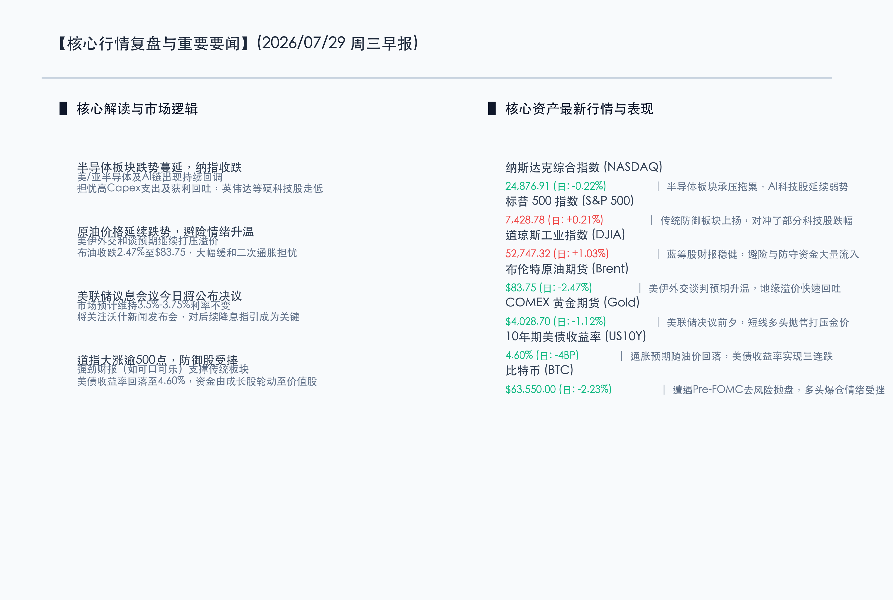

# 科技股回调拖累纳指，避险轮动道指大涨500点，美联储利率决议前夕原油美债齐跌

**日期：2026年07月29日 (星期三)** &nbsp; **时段：早报 (常规交易日模式)**

> **核心摘要**：美联储7月议息决议公布前夕，市场避险情绪升温，资金加速从高估值半导体和AI算力板块流出，转向防御性传统价值股。强劲的蓝筹股财报提振道琼斯工业指数大涨逾500点，而纳指受芯片股拖累微跌。美伊和谈预期推动布伦特原油持续下跌，10年期美债收益率实现三连跌降至4.60%，比特币由于Pre-FOMC去风险抛售跌破6.4万美元。

## 核心行情复盘

隔夜全球金融市场在重大政策决议及巨头财报前夕表现分化。半导体板块的跌势自亚洲蔓延至美股，拖累科技板块；而避险资金则流入大金融与消费等价值股，支撑大盘。

*   **纳斯达克综合指数 (NASDAQ)**：收报 **24876.91点** (日度: **-0.22%**) 🟢。半导体及AI算力链回调，资金从成长板块流出，纳指承压收跌。
*   **标普 500 指数 (S&P 500)**：收报 **7428.78点** (日度: **+0.21%**) 🔴。传统行业与防守型消费股走高，有效对冲科技股跌势，指数温和收涨。
*   **道琼斯工业指数 (DJIA)**：收报 **52747.32点** (日度: **+1.03%**) 🔴。受成份股强劲财报（如可口可乐等）提振，防守资金大举流入，大涨逾530点。
*   **布伦特原油期货 (Brent)**：收报 **$83.75/桶** (日度: **-2.47%**) 🟢。美伊外交和谈预期继续发酵，红海地缘危机溢价加速退去，油价三连跌。
*   **COMEX 黄金期货 (Gold)**：收报 **$4028.70/盎司** (日度: **-1.12%**) 🟢。美联储7月决议前夕，短线多头出现获利了结与锁定利润抛售。
*   **10年期美债收益率 (US10Y)**：收报 **4.60%** (日度: **-4BP**) 🟢。原油持续下跌缓解长期通胀担忧，收益率延续回落势头，创三连跌。
*   **比特币 (BTC)**：收报 **$63550.00** (日度: **-2.23%**) 🟢。受FOMC会议前的去风险抛压和 spot ETF 净流入减缓拖累，价格回落至6.4万美元下方。

在权益市场内部，领涨板块主要集中在**大金融、必需消费（如可口可乐等）、医药健康与航空航天**，这些板块在避险情绪中充当了坚固的防护墙。而领跌板块则是**半导体及硬科技算力链**，主要是市场对于即将出炉的科技巨头财报中有关AI资本支出（Capex）回报的担忧。

## 核心解读与市场逻辑

*   **半导体板块跌势蔓延与高Capex的理性审视**：亚洲芯片制造巨头（如SK海力士、三星）大跌，加剧了市场对AI及半导体硬件投资是否过热的担忧。在微软、Meta等超级科技巨头财报发布前夕，市场对巨大资本支出（Capex）与实际AI商业化变现之间的距离进行审慎评估，导致半导体和芯片设计巨头（如英伟达等）遭遇筹码松动和获利回吐。
*   **美伊和谈外交预期促使原油跌破84美元**：美伊局势向好演化，有关外交斡旋和停火的预期大幅冲淡了中东地缘的供应溢价。布油进一步跌至$83.75/桶，为本周即将出炉的通胀指标（如核心PCE）奠定了下行基调，也为全球紧缩的货币政策减负。
*   **美联储决议前夕的避险配置与资金大轮动**：美联储为期两天的会议将于今日收尾并公布决议。尽管市场普遍预计凯文·沃什将宣布利率按兵不动，但在关键政策靴子落地之前，大笔避险资金正撤离高估值的成长型科技股，转入红利、防御性传统价值股。强劲的传统公司财报（如可口可乐的超预期业绩）进一步巩固了这一防御姿态，促成道琼斯指数收涨超1%。

## 政策脉动

*   **国内逆周期调节与防范外部冲击**：中国证监会（CSRC）在前期调研基础上，进一步探讨引导中长期资金入市的具体实施路径。在外部市场波动率攀升、多国关税落地的背景下，监管部门明确将加强跨境风险防范和稳定市场预期，并继续通过人民银行（PBOC）维护合理充裕的流动性，支撑实体经济韧性。
*   **宏观政策以稳为主与防范化解金融风险**：权威财经报道显示，尽管面临地产等传统行业的融资承压，国内高层并不倾向于采取大规模短期的“大水灌灌”式刺激，而是聚焦在科创板国产替代和结构性政策优化上。市场普遍关注后续重要高层会议对财政和货币政策的最新定调。
*   **全球央行超级周的预期博弈**：除美联储外，英国央行和日本央行本周亦将举行重要会议。市场在观望美联储降息指引的同时，亦对日本央行潜在的量化紧缩（QT）措施持谨慎态度，防范日元套利交易平仓对全球流动性产生连锁冲击。

## 最新机构观点

*   **高盛集团 (Goldman Sachs)**：**“AI资本支出仍是未来竞争的入场券，科技股短期宽幅震荡是极佳的长期布局点”**。高盛维持对科技巨头的长期看好，认为虽然目前算力板块由于财报前防御性轮动而回调，但云厂商的Capex依然是硬性支撑。油价和美债收益率的回落为估值分母端减压，一旦后续微软或Meta在财报中证实AI正向贡献云服务收入增长，纳指将快速企稳。
*   **摩根士丹利 (Morgan Stanley)**：**“红利资产和价值股的性价比凸显，在美联储沃什新闻会前保持防御姿态”**。大摩表示，在美联储对降息路径作出清晰表态前，通胀和关税政策的实际代价依然悬在跨国企业头上。油价下跌为交运和消费行业释放了利润空间，结合可口可乐等公司亮眼的业绩，建议短期坚守红利和传统避险板块，不宜急于抄底高估值的芯片半导体龙头。
*   **中金公司 (CICC)**：**“外部波动倒逼国内资产溢价，关注科创国产替代与红利国企双主线”**。中金分析，海外科技股的动荡和美联储议息前的减仓，正将全球资金推向估值底部的安全地带。随着PBOC持续护航流动性及A股政策底确立，科创板的半导体替代概念与高股息央国企的防守功能将持续受市场资金关注。

## 今日市场情绪：数码绿叶，盘石为基

在科技巨头财报披露和美联储决议的暴风雨前夕，市场选择退守安全防线。数字大地上，巨大的晶圆之树上，象征高估值算力芯片的金色叶片正轻轻飘落；然而，树旁的一根古老而坚固的石柱却在防御性绿藤的缠绕下屹立不倒，代表着传统蓝筹价值股为大盘筑起的防线。天空中，泛着绿光的美联储决策之钟在迷雾般分合的云雾中指引着时间，而远处流淌的石油小溪已逐渐干涸。这幅超现实画面展现了资金在宏观决战前夜从进攻转向全面防御的审慎博弈。

> Prompt: Surrealism style, Subject: A giant, glowing circuit board tree on a digital landscape with a few golden chip leaves falling to the ground. Next to it, a massive, ancient stone pillar stands firmly as defensive green vines grow up its side. In the background: a giant, glowing clock representing the Federal Reserve meeting looms behind parting storm clouds, casting a warm light. A thin stream of black oil is drying up in the distance. No humans. No text., masterpiece, high detail, intricate composition, cinematic lighting, 8k resolution

---

免责声明：内容仅供参考，不构成投资建议。
