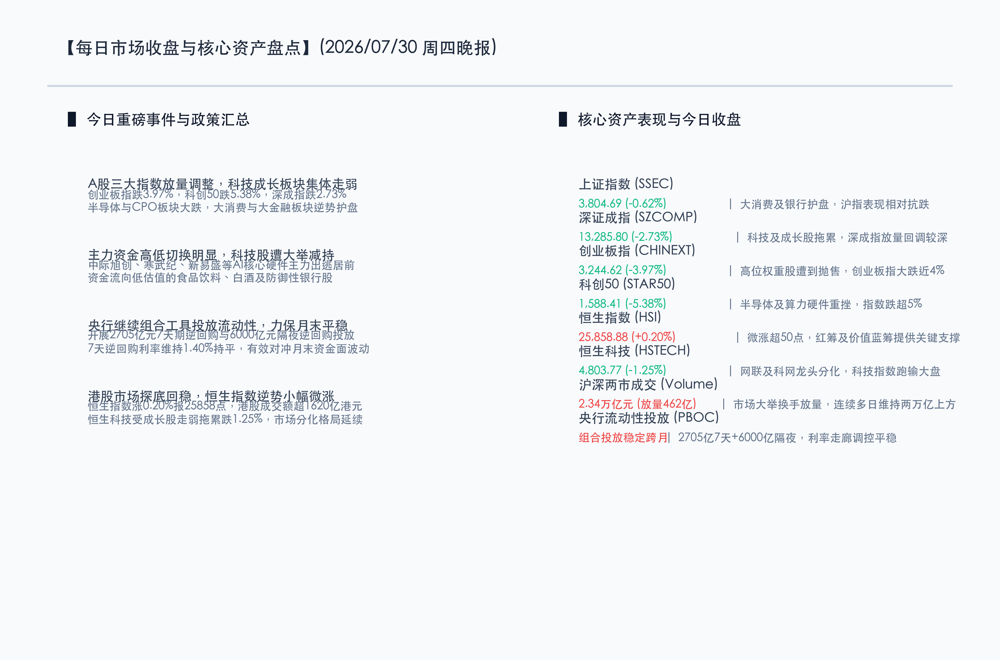
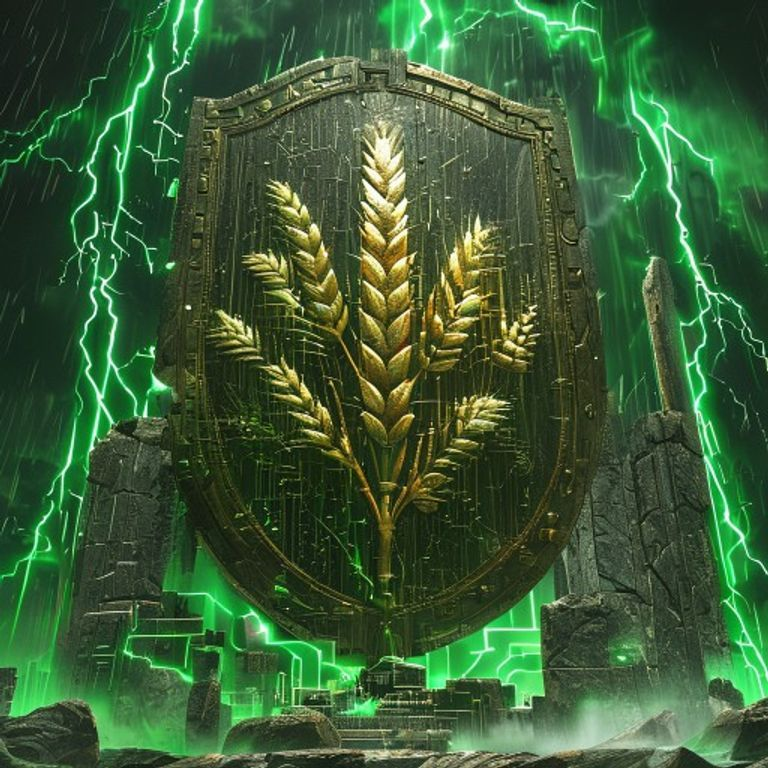

# 科技板块大幅回调拖累创业科创，大消费大金融强力支撑，A股两市连续放量调整

**日期：2026年07月30日 (星期四)** &nbsp; **时段：晚报 (常规交易日模式)**

> **核心摘要**：今日国内市场呈现显著的结构性调整与分化。受主力资金从高位科技赛道集中撤出影响，创业板指大跌近4%，科创50指数重挫超5.3%，半导体与CPO板块遭遇抛售。然而，大消费与大金融板块逆势走强，发挥了关键的护盘作用，平抑了上证指数的跌幅。沪深两市全天成交总额达2.34万亿元，继续放量，显示市场大举换手。港股表现出更强的防御韧性，恒生指数微幅上涨0.2%，重上25800点。

## 核心行情复盘

今日市场呈现“高低切换”与“防御升级”的态势。前期热门的硬科技板块集体深度回调，而低估值、高分红的蓝筹及大消费板块逆势反弹。

*   **上证指数 (SSEC)**：收报 **3804.69点**，跌幅为 **-0.62%**（-23.78点）。在银行、白酒和食品饮料等权重板块的积极拉升下，沪指盘中探底回升，表现相对抗跌。
*   **深证成指 (SZCOMP)**：收报 **13285.80点**，跌幅为 **-2.73%**（-372.64点）。受深市高权重科技股调整影响，成指放量回调较为明显。
*   **创业板指 (CHINEXT)**：收报 **3244.62点**，跌幅为 **-3.97%**（-134.08点）。半导体、算力租赁等板块权重股跌幅居前，导致创业板指大跌近4%。
*   **科创50 (STAR50)**：收报 **1588.41点**，跌幅为 **-5.38%**。半导体及算力硬件（如CPO、端侧AI）遭主力抛售，科创50指数跌幅最大。
*   **恒生指数 (HSI)**：收报 **25858.88点**，涨幅为 **+0.20%**（+50.96点）。红筹及高分红价值蓝筹提供关键支撑，港股展现出较强的韧性。
*   **恒生科技 (HSTECH)**：收报 **4803.77点**，跌幅为 **-1.25%**（-60.96点）。互联网龙头与科网成分股发生分化，拖累科技指数表现。
*   **沪深成交额**：沪深两市全天合计成交额为 **2.34万亿元**，较前一交易日（2.30万亿元）小幅放量 **462亿元**。市场已连续287个交易日成交额破万亿元，伴随着剧烈的资金流向大调整。
*   **主力资金与行业动向**：
    *   **领涨行业**：大消费板块（白酒、食品饮料）表现强势，银行、非银金融等大金融板块逆市走强，发挥主力护盘作用。
    *   **领跌行业**：硬科技产业链遭遇大幅回调，半导体、CPO、端侧AI、存储芯片等板块领跌。中际旭创、寒武纪、新易盛等高位硬科技股遭主力资金集中减持。

## 核心解读与市场逻辑

*   **获利盘集中兑现导致高低切换，资金防守意愿强烈**
    > 今日科技成长板块的深度调整，本质上是前期拥挤交易的获利盘回吐。受外围科技股波动和地缘政治担忧影响，主力资金开始主动“向内寻求防守”，将资金仓位从高估值、高波动的科技硬件板块（如半导体设备、算力硬件）切向低位、具备防御属性的大消费和高分红大金融板块。这种风格的剧烈切换直接导致了科创50与上证指数的分化表现。
*   **放量调整显示筹码大幅换手，中期科技主线仍具韧性**
    > 两市合计成交额再度扩大至2.34万亿元，表明有大量承接盘在低位接盘，市场大举换手。尽管科技赛道短期情绪遇冷，但以兆易创新注销式回购（最高20亿元）为代表的上市公司自救与回购举措，以及AI中长期产业趋势的催化，将有助于高景气科技板块在中期修复中重回稳健轨道。

## 政策脉动

*   **央行灵活开展“7天+隔夜”逆回购，平抑月末资金面波动**
    > 7月30日，中国人民银行（央行）在公开市场开展了2705亿元7天期逆回购操作（操作利率维持1.40%持平），并继续投放6000亿元隔夜逆回购。此举旨在精准对冲月末跨月资金面需求，发挥“削峰填谷”作用，引导市场短端利率在政策利率附近平稳运行，保持银行体系流动性合理充裕。
*   **跨境监管成效显著，证监会持续强化市场规范运行**
    > 香港证监会于7月30日宣布冻结与IPO欺诈有关的约1.25亿港元资产，显示两地在资本市场跨境监管和防范金融风险跨境传导方面执行力度不断加强，致力于切实维护“三公”市场秩序，为中长期资金稳步入市提供透明合规的制度屏障。

## 最新机构观点

*   **中信证券 (CITIC Securities)**：**“把握地缘政治扰动后的产业布局，高景气赛道逢低配置”**。中信证券分析指出，近期全球半导体及AI板块波动主要归因于特朗普关于对地缘冲突的言论引发的地缘政治与融资担忧，而非美联储的政策转向或AI产业基本面恶化。当前部分国产算力、超节点连接芯片、MaaS平台等硬科技优质标的已进入估值洼地，伴随WAIC 2026的政策支持与产业催化，建议投资者在恐慌回调中适度逢低布局基本面扎实的核心资产。
*   **中金公司 (CICC)**：**“关注中报披露期的业绩确定性，防御性价值资产重获青睐”**。中金公司策略团队认为，随着A股与港股正式进入中报披露窗口，市场偏好正从单纯的“主题炒作”转向更看重基本面逻辑与业绩兑现。在全球宏观政策不确定性上升的背景下，建议向内寻求防御属性强、确定性高的资产，如大消费（白酒、食品饮料底部配置性价比极高）和资源领域（如具备量价齐升预期的钨产业链龙头）。

## 今日市场情绪：金甲执盾，微芒消冰

今日的市场情绪在科技股巨浪扑打与价值防御筑墙中被生动呈现。画面中，一面由庄重古朴的青石与灿烂黄金编织而成的宏伟巨盾屹立在风暴中央，盾面上雕刻着丰茂的金黄麦穗与银行宝库的坚固石柱。在巨盾前方，无数由翠绿霓虹灯管与硅片电路构成的机器断肢和碎裂芯片正化为绿色的粉尘，纷纷扬扬地飘落，代表着科技板块经历的剧烈洗盘。背景深处，暗绿色的数字雨如暴雨般倾泻，并伴随着由绿K线组成的闪电，在昏暗的天空下交织轰鸣。然而，巨盾边缘散发出的暖金色光芒，正像晨曦般消融着四周的坚冰，象征着大消费和大金融为整场市场防守战注入的坚实能量。

> Prompt: Surrealism style, Subject: A colossal, ancient stone shield embossed with traditional golden wheat sheaves and solid pillars, standing firm in the center. In front of the shield, fractured neon circuits and glowing green computer chips are breaking apart and dissolving into stardust. Background: In the background, a dark storm with green digital rain and jagged green K-line lightning bolts. No humans. No text., masterpiece, high detail, intricate composition, cinematic lighting, 8k resolution

---

免责声明：内容仅供参考，不构成投资建议。
