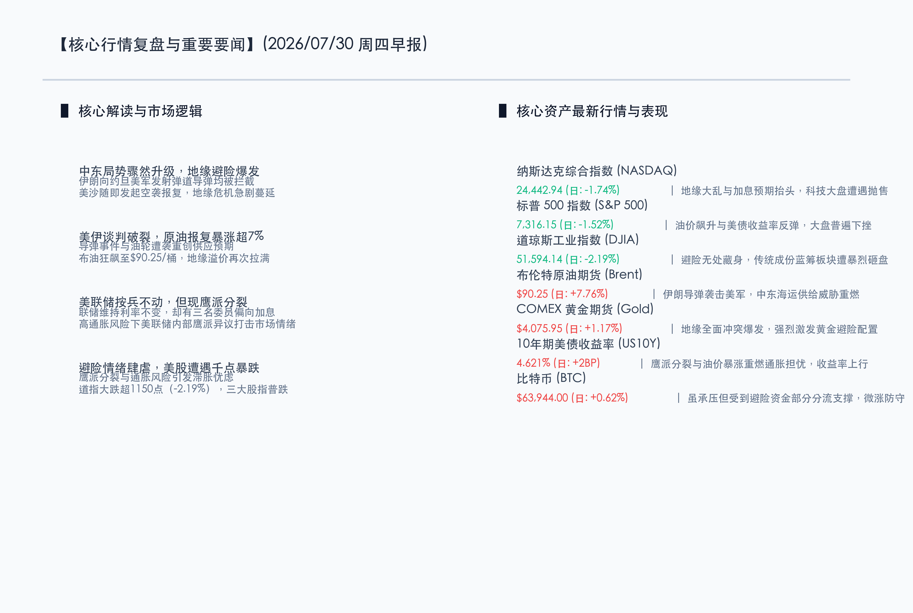

# 地缘烽火重燃原油暴涨超7%，美联储鹰派分裂惊扰市场，美股遭遇重挫道指暴跌千点

**日期：2026年07月30日 (星期四)** &nbsp; **时段：早报 (常规交易日模式)**

> **核心摘要**：中东地缘局势急剧恶化与美联储内部的鹰派分裂，给全球金融市场带来剧烈震荡。伊朗袭击美军及美沙反击导致美伊和谈预期破裂，布油狂飙逾7.7%重返90美元之上，点燃通胀担忧。美联储虽维持利率不变，但三名委员 dissent 偏向加息，释放强烈鹰派信号。受滞胀风险重燃打击，美股遭遇大范围抛售，道指暴跌逾1150点，资金加速涌入黄金等避险资产，比特币微升防守。

## 核心行情复盘

在突发地缘军事冲突与美联储政策鹰派分裂的双重重击下，隔夜全球金融市场出现恐慌性资产抛售。原油暴涨重燃通胀忧虑，资金加速从股票市场出逃，流向黄金及美债等避险资产。

*   **纳斯达克综合指数 (NASDAQ)**：收报 **24442.94点** (日度: **-1.74%**) 🟢。地缘大乱与加息预期抬头，高估值科技板块承受显著估值压力。
*   **标普 500 指数 (S&P 500)**：收报 **7316.15点** (日度: **-1.52%**) 🟢。油价飙升重燃通胀忧虑，大盘蓝筹与成长股呈普跌态势。
*   **道琼斯工业指数 (DJIA)**：收报 **51594.14点** (日度: **-2.19%**) 🟢。避险情绪肆虐下传统工业成份股惨遭资金抛售，大跌逾1150点。
*   **布伦特原油期货 (Brent)**：收报 **$90.25/桶** (日度: **+7.76%**) 🔴。约旦美军基地遇袭引发中东局势骤然升级，地缘溢价报复性重燃。
*   **COMEX 黄金期货 (Gold)**：收报 **$4075.95/盎司** (日度: **+1.17%**) 🔴。战争阴云与全球滞胀担忧激发极端强烈的黄金避险配置。
*   **10年期美债收益率 (US10Y)**：收报 **4.621%** (日度: **+2BP**) 🔴。鹰派分裂的表决结果与原油反弹加剧了通胀前景不确定性，收益率上行。
*   **比特币 (BTC)**：收报 **$63944.00** (日度: **+0.62%**) 🔴。受整体流动性收紧与风险规避情绪双重夹击，微涨防守于6.3万美元上方。

在权益市场内部，领涨板块主要集中在**上游油气开采、煤炭等传统能源板块**（油价大涨直接受益）以及**黄金开采等贵金属板块**（受益于避险资金疯狂买入）。而领跌板块则是**航空运输、汽车制造以及高成长性科技软件**，这些板块在能源成本激增与利率被迫维持高位（滞胀环境）的预期下受到最沉重的打击。

## 核心解读与市场逻辑

*   **中东地缘全面升级与供应链恐慌**：伊朗突然向约旦的美军基地发射数十枚弹道导弹（虽被拦截但意义极其恶劣），随后美沙联军迅速空袭反击，此前备受期待的美伊外交和谈化为泡影。更严重的是，多艘油轮及埃及港口的天然气船遭遇无人机和导弹袭击，使得红海及霍尔木兹海峡的油运通道再次命悬一线。布油单日狂飙超过7.7%，重新收复90美元大关，供应链危机再度点燃了市场对全球二次通胀的极度恐慌。
*   **美联储维持利率不变，但遭遇罕见的鹰派分裂**：联邦公开市场委员会（FOMC）投票决定将联邦基金利率维持在3.5%-3.75%的水平。然而，本次会议却投出了9对3的非一致性选票，三位委员（Hammack、Kashkari 和 Logan）罕见地投出反对票，他们明确支持加息25个基点。这表明美联储内部对于顽固通胀的容忍度已降至冰点，这种鹰派撕裂粉碎了市场对今年下半年宽松周期的幻想。
*   **“滞胀”警报拉响，避险资金大轮动**：地缘战火、鹰派联储以及高企的原油形成了“三重奏”，令全球投资者对经济陷入“高通胀、低增长”的滞胀深感忧虑。道指创下近月来最大单日跌幅，暴跌超1150点。资金慌不择路撤离成长型和周期性资产，转而抢购黄金及抗通胀的美债产品。而比特币虽受流动性收紧压制，但也受到部分去中心化避险买盘的支撑，表现相对抗跌。

## 政策脉动

*   **美联储将地缘局势正式列入通胀不确定性范畴**：在最新的利率决议声明中，决策层明确警示“中东局势的演化及随之而来的大宗商品价格波动是阻碍通胀回落至2%目标的核心变量”。这一罕见的定调意味着美联储后续的利率路线将极大程度受制于不可控的地缘风险，货币政策空间被动收窄。
*   **国内多部门护航流动性，防范外部剧烈传导**：面对全球避险情绪推动美元走强、外部市场剧烈动荡的局面，国内央行（PBOC）与证监会（CSRC）正强化逆周期调节。监管部门表态将密切监控跨境资本和异常套利平仓动向，坚决稳定人民币汇率预期。同时，国内宏观政策依然维持“以我为主”的定力，继续引导中长期资金投向科创板等高硬科技与国产替代领域，确保国内产业链和金融体系免受外部大宗商品及利率冲击的影响。

## 最新机构观点

*   **高盛集团 (Goldman Sachs)**：**“地缘引起的通胀重燃仅是短期供应波动，无须过度悲观，成长股暴跌后将提供更具性价比的左侧买点”**。高盛分析指出，由地缘冲突和油价突发飙升导致的股票市场收缩通常是短暂的，一旦美国及中东盟友的实质性军事防线稳定，油价将重回合理区间。尽管美联储内部鹰派异议增加，但科技和AI基础设施的核心资本支出仍将持续，这将在分母端压力释放后拉动科技股快速反弹。
*   **摩根士丹利 (Morgan Stanley)**：**“三票鹰派 dissent 是无可争议的危险信号，高利率环境将维持得更久，防守是当前唯一解”**。大摩表示，在美联储内部对于通胀和地缘带来的大宗商品压力展示出如此强烈的分歧后，市场必须打消任何对年内降息的期待。在滞胀危机与地缘冲突并发的背景下，高油价和强势美债收益率将持续压低成长性板块的估值乘数，建议继续配置现金、高股息红利股以及实物黄金。
*   **中金公司 (CICC)**：**“外部动荡推升避险属性，重点关注国内高股息红利与核心半导体国产替代”**。中金认为，随着美联储转向鹰派且外部地缘冲突不断，全球资金的风险偏好正急剧回落。这虽然会从情绪上波及A股等新兴市场，但由于国内宏观流动性保持充裕且估值较低，国内抗风险主线表现出极强的防御特征。继续推荐以高股息央国企为避风港，同时在科技赛道中精选政策护航、受地缘制约较小且拥有国产化硬逻辑的半导体龙头。

## 今日市场情绪：黑金怒涛，天秤倾侧

在中东战火突燃与美联储鹰派分裂的暴风雨中，市场信心遭遇重创。画面中，漆黑如墨的石油巨浪在血红雷电的照耀下翻滚怒号，一尊由白石雕琢的宏伟棋盘正面临开裂与下沉，象征着昔日稳定繁荣的交易体系在多重冲击下摇摇欲坠。在波涛的中心，一杆巨大的黄金天平极度倾斜，左盘承载着燃起熊熊烈火的油桶，右盘则是散发着血色幽光的联储鹰派决议书，暗示着通胀与高息的无形拉扯。这是一幅展现资金在双重宏观巨震前惊恐避险、价值体系重组的末世交响。

> Prompt: Surrealism style, Subject: A storm-tossed sea of thick black oil under a dark, thundering sky with red lightning. On the sea, a colossal cracked white marble chessboard is sinking, with green and red chess pieces floating away. In the center, a golden scales of justice is heavily tilted, holding a glowing red Fed policy document on one side and a flaming oil barrel on the other. Background: In the background, a massive glowing red neon K-line graph plunges down from the storm clouds into the ocean. No humans. No text., masterpiece, high detail, intricate composition, cinematic lighting, 8k resolution

---

免责声明：内容仅供参考，不构成投资建议。
