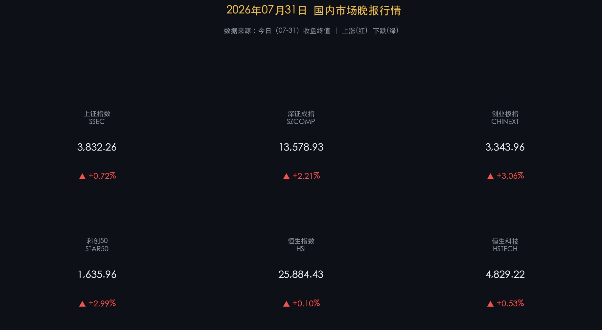

# 政治局会议提振信心，科技板块全线爆发，A股放量大涨迎“七月收官”

**日期：2026年07月31日 (星期五)** &nbsp; **时段：晚报 (常规交易日模式)**

> **核心摘要**：今日国内市场呈现强劲反弹态势，科技板块成为领涨的核心引擎。中共中央政治局会议关于“提升资本市场韧性和信心”及“加大逆周期调节力度”的表态显著提振了市场情绪，两市及北交所约4700只个股上涨，成交额大幅放量至2.54万亿元。港股整体震荡微涨，恒指微涨0.10%收于25884点之上，科技巨头表现分化。

## 核心行情复盘

今日市场呈现“多头反扑”与“高景气成长引爆”的态势。前期回调调整的科技板块全面爆发，市场成交量极速放大。

*   **上证指数 (SSEC)**：收报 **3832.26点**，涨幅为 **+0.72%**（+27.57点）。在政策底与科技行情的共振下，沪指放量回升，平稳收官七月。
*   **深证成指 (SZCOMP)**：收报 **13578.93点**，涨幅为 **+2.21%**（+293.13点）。受科技股与半导体产业链全线大涨拉升，成指表现亮眼。
*   **创业板指 (CHINEXT)**：收报 **3343.96点**，涨幅为 **+3.06%**（+99.34点）。半导体、算力硬件与AI题材龙头股集体暴涨，带领创业板指大涨超3%。
*   **科创50 (STAR50)**：收报 **1635.96点**，涨幅为 **+2.99%**（+47.55点）。AI硬件与国产算力芯片全天大受主力追捧，科创50反弹明显。
*   **恒生指数 (HSI)**：收报 **25884.43点**，涨幅为 **+0.10%**（+25.55点）。红筹蓝筹与大金融板块盘中有所整理，港股微幅收涨。
*   **恒生科技 (HSTECH)**：收报 **4829.22点**，涨幅为 **+0.53%**（+25.45点）。科技指数成分股震荡分化，但最终平稳收红。
*   **沪深成交额**：沪深两市全天合计成交额为 **2.54万亿元**，较前一交易日（2.34万亿元）大幅放量 **2000亿元**，表明市场交投情绪极速升温。
*   **主力资金与行业动向**：
    *   **领涨行业**：科技板块全面爆发，半导体、通信、电子元器件、软件及互联网等板块涨幅居前。其中半导体板块领涨全场，板块整体涨幅一度接近8%，存储芯片、半导体设备等方向表现尤为活跃，多只个股涨停。多模态AI、Kimi概念、光模块、算力硬件等题材同样迎来爆发式反弹，成为反弹先锋。此外，人形机器人、固态电池、传媒板块也表现活跃。
    *   **领退行业**：前期作为防御方向的银行、食品饮料及煤炭等红利板块表现不振，出现回调，资金呈现明显的“防御向进攻”的顺周期资产切换。

## 核心解读与市场逻辑

*   **政治局会议表态超预期，政策强心剂提振风险偏好**
    > 7月30日中共中央政治局会议对经济工作的定调起到了决定性的市场提振作用。会议提出的“提升资本市场韧性和信心”以及“加大逆周期调节力度，及时谋划出台务实管用的增量政策”的指示，扫除了前期市场资金的观望情绪。内外资在此预期下信心大增，促使资金迅速完成“高低切换”，并大举流入高弹性的半导体及数字基建板块。
*   **放量暴涨确立底部重组，AI与半导体景气周线向上**
    > 两市合计成交额大举放大至2.54万亿元，表明在政策与外围科技股反弹共振的背景下，场外资金正以极大意愿入市抄底。本轮半导体板块（如存储芯片、封测设备等）的大涨不仅是地缘博弈下的国产替代加速，更是全球AI大模型训练/推理硬件及新型数据中心建设订单爆发所带来的产业链景气度提升，科技主线的长期逻辑在此轮筹码换手后更加巩固。

## 政策脉动

*   **政治局会议部署下半年工作，定调加大逆周期调节与推出增量政策**
    > 7月30日召开的中共中央政治局会议明确要求加大宏观政策调控力度，及早谋划出台务实管用的增量政策，并指出要增强资本市场韧性、提振市场信心。这一权威定调对于稳定宏观经济基本盘、推动中长期资金入市并提振实体信心提供了实质性的制度保障。
*   **数字中国底座提速，多部委推进“六张网”基础设施建设**
    > 针对新质生产力、算力网、新型电网、水网、通信网、城市管网、物流网等“六张网”基础设施的建设政策正不断细化落实。官方引导资金优先支持核心技术国产化与基础设施建设，特别是全国算力节点与算力通道建设，为科技及AI硬件板块的长足发展构筑起坚实壁垒。

## 最新机构观点

*   **中信证券 (CITIC Securities)**：**“把握银行红利平衡，布局AI基础设施主线”**。中信证券分析认为，虽然银行板块受前期市场极致分化影响有所盘整，但近期在风格均衡博弈下正迎来修复。在科技成长方向，建议关注AI基础设施（Infra）、国产算力产业链、AI应用及行业生态协同，特别在经历了前期深度回调后，核心硬科技资产的估值安全边际已经显著提升。
*   **中金公司 (CICC)**：**“A股慢牛条件正逐步稳固，拥抱AI革命与国际秩序重构双主线”**。中金公司首席经济学家缪延亮指出，A股目前较历史上任何时期都更有希望构建健康的“慢牛”格局，投资者应淡化外部事件带来的短期扰动，认清长期趋势。真正决定资产中长线方向的仍将是AI科技革命和国际秩序重构，建议坚守具备中报业绩确定性强的科技硬件、算力与出海先锋。

## 今日市场情绪：赤龙腾空，破云迎曦

今日的市场情绪在科技股全线爆发的红色巨澜中被生动呈现。画面中，一条由璀璨的红色激光线条与纵横交错的电路板路径编织而成的宏伟巨龙从地平线腾空而起，带着不可阻挡的力量，以雷霆之势冲破了密布的深灰色风暴云层。在巨龙冲天掠过的轨迹后方，金灿灿的太阳光芒如利剑般撕裂了残余的云霭，将温暖的晨曦洒向大地。与之相对的是，代表过去陈旧、低效生产力的破损机器齿轮与零落的旧设备，正化作无数微小的绿色荧光尘埃，在空气中纷纷扬扬地飘落，代表着资金完成了从保守防御向新质生产力高地的华丽转身。

> Prompt: Surrealism style, Subject: A massive, majestic dragon made of glowing red laser lines and circuit pathways, soaring upwards into the sky. It is breaking through dark grey storm clouds. Background: In the background, golden sunbeams break through the dispersing dark clouds. Tiny glowing green sparks of old machinery are falling down. No text. No humans., masterpiece, high detail, intricate composition, cinematic lighting, 8k resolution

---

免责声明：内容仅供参考，不构成投资建议。
