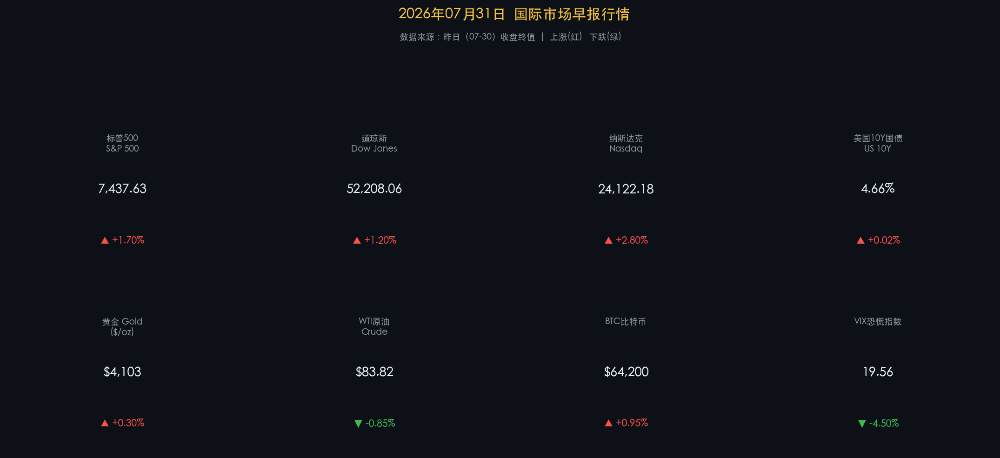

# 🌐 2026年07月31日 国际市场早报

**日期：2026年07月31日 (星期四)** &nbsp; **时段：早报（国际市场）**

> **核心摘要**：美联储7月29日会议以9:3投票维持利率于3.5%-3.75%不变，三位鹰派委员主张加息，令9月会议加息预期升温；受此政策信号提振，美股昨日全线大涨，纳斯达克领涨+2.8%，标普500创近期新高至7437点；与此同时，中东地缘紧张局势推升油价后小幅回调，比特币在$64,000附近震荡整理。

---

## 核心行情复盘

### 美国股市（07-30 收盘终值）

* **标普500 (S&P 500)**：**7,437.63** ▲ **+1.70%**
* **道琼斯工业指数 (Dow Jones)**：**52,208.06** ▲ **+1.20%**
* **纳斯达克综合指数 (Nasdaq)**：**24,122.18** ▲ **+2.80%**（领涨，科技权重股全面爆发）

> 美股昨日迎来久违的全面反弹。纳斯达克以+2.8%的涨幅领跑，主因为美联储维持利率不变消除了短期加息落地风险，市场风险偏好快速修复。科技、AI板块是昨日最强推手——叠加多家大型科技企业Q2财报超预期，买盘情绪极为旺盛。

**行情数据卡片：**

### 债券与利率

* **美国10年期国债收益率**：**4.66%** ▲ +2BP（收益率小幅走高，反映鹰派分歧投票的加息预期升温）
* **VIX 恐慌指数**：**19.56** ▼ **-4.50%**（市场情绪明显修复，恐慌程度大幅下降）

> 债券与股票出现了"股债双跌"的矛盾走势，即股市大涨但国债同样遭抛售。核心逻辑在于：3位鹰派委员的异见票让市场重新对9月加息定价，国债承压；而股市则更聚焦于"当下不加息"的利好，忽略了这一潜在尾部风险，形成情绪驱动的短线背离。

### 大宗商品

* **黄金 (Gold)**：**$4,103/盎司** ▲ +0.30%（美联储按兵不动后一度冲高，随后高位整理）
* **WTI 原油**：**$83.82/桶** ▼ **-0.85%**（在前日大涨后获利回吐，但中东风险溢价仍支撑价格区间）
* **布伦特原油**：**$89.45/桶** ▼ -0.37%

> 原油的逻辑主线是中东局势与霍尔木兹海峡的运输风险。昨日的下跌属于短期技术性回调，而非趋势逆转——中东供应扰动风险升水尚未消退。黄金同样受益于地缘不确定性，在美元相对强势的压力下维持高位韧性，显示出避险需求与通胀预期双重支撑。

### 加密货币

* **比特币 (BTC)**：**$64,200** ▲ +0.95%
* 市场情绪：整体偏谨慎震荡，地缘风险与美联储鹰派声音压制了进一步上攻动能。Strategy Inc.（前MicroStrategy）披露Q2持仓已增至**84.6万枚BTC**，机构持仓信心坚定。

---

## 核心解读与市场逻辑

### 焦点一：美联储7月会议——鹰鸽分歧是最大变量

> 美联储主席 Kevin Warsh 主导的第二次利率决议，以**9比3**投票维持利率区间于 **3.5%-3.75%**。三位异见者（Hammack、Kashkari、Logan）明确主张加息25BP，这是近年来罕见的高分歧信号。联储声明重申"通胀仍高于2%目标"，并指出中东地缘冲突带来的能源冲击是主要供给侧变量。

**核心逻辑链**：
- 鹰派三票 → 9月加息概率升温 → 美债收益率走高（4.66%）
- 但"当下不加息"落地 → 市场松一口气 → 科技股风险偏好回归 → 纳指 +2.8%
- 矛盾共存：短期情绪利多 VS 中期加息尾险

### 焦点二：AI CapEx 争议——市场的最大分歧点

> 高盛与摩根士丹利对AI资本开支的分歧是当前市场核心张力。高盛估算AI相关投入已达约**美国GDP的1.5%**，且得到企业盈利支撑，认为这是可持续牛市的基础。而摩根士丹利则警示：若大型科技公司出现CapEx收缩信号，将对估值形成严重冲击。SK Hynix财报中对AI芯片需求前景的保守预期已引发半导体板块的"涟漪效应"，值得高度关注。

---

## 政策脉动

* **美联储（Fed）**：7月29日维持利率3.5%-3.75%不变（9:3）；声明强调通胀高于目标，为9月保留加息选项。
* **美国财政部（Treasury）**：当前财政立场配合AI/基建财政刺激，税收改革仍在推进。
* **加密监管**：数字货币集团（DCG）等机构积极游说通过"CLARITY Act"，推动加密资产清晰立法，国会休会前窗口关键。

---

## 最新机构观点

* **高盛（Goldman Sachs）**：维持全球股票建设性立场，预计美股全年涨幅约+6%。认为AI投入规模庞大但由企业盈利支撑，与互联网泡沫有本质区别，当前调整是"健康的重置"而非信仰崩塌。预计美联储2026年全年维持利率不变，若通胀数据进一步软化可提供降息缓冲。

* **摩根士丹利（Morgan Stanley）**：对"夏季反弹"持审慎立场，识别三大障碍：① 市场波动率居高不下；② 科技/AI头寸过度拥挤的"集体平仓"风险；③ Q2财报或显示AI相关支出犹豫迹象。预计2026年AI CapEx从8000亿美元增至2027年的1.2万亿美元，但强调选股而非买大盘。

* **摩根士丹利（Morgan Stanley）**：同步推荐防御+高确定性赛道，包括消费饮料（可口可乐）和国防/航空（RTX），这些板块展示了在宏观不确定性中的盈利韧性。

---

## 今日市场情绪：鹰影下的科技狂欢

> Prompt: A massive golden scale stands at a cosmic crossroads. On one side, a luminous AI pillar shoots upward through stock charts glowing green. On the other side, three iron hawks clutch Federal Reserve seals, pulling the balance down. In the background, oil fires rage on a distant horizon beneath a crescent moon, symbolizing Middle East tensions. The scene blends Wall Street and mythology in a surreal dusk sky.

---

*免责声明：内容仅供参考，不构成投资建议。*
