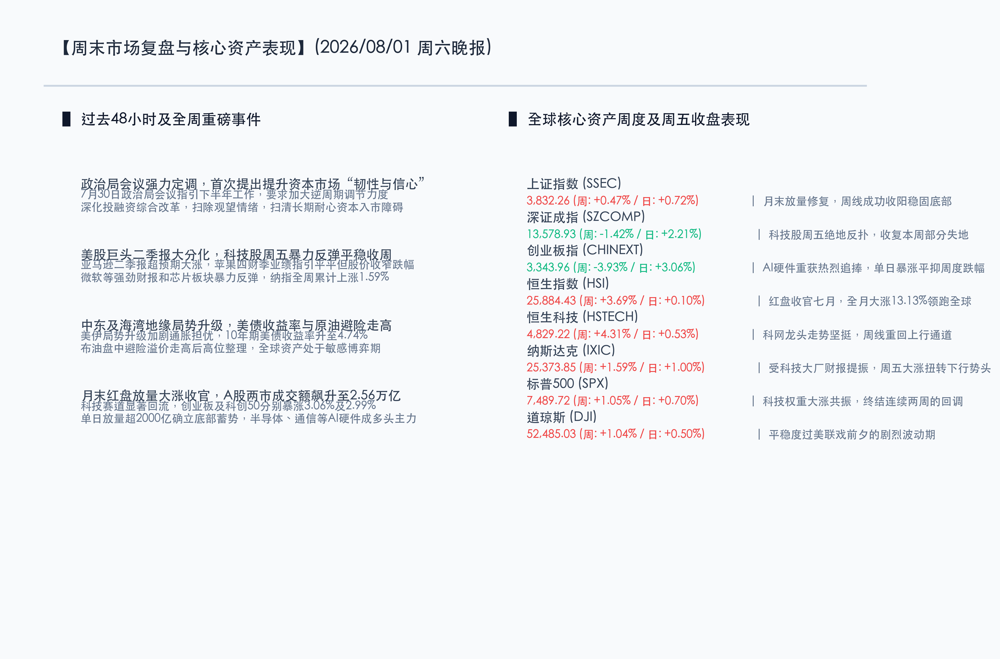

# 政治局会议提振信心，全球科技股反弹共振，A股放量大涨迎周末复盘

**日期：2026年08月01日 (星期六)** &nbsp; **时段：晚报 (周末复盘模式)**

> **核心摘要**：本周全球金融市场在经历巨幅震荡后迎来显著反弹，科技板块成为平稳跨周的中流砥柱。国内方面，中共中央政治局会议历史性地提出“深化资本市场投融资综合改革，提升资本市场韧性和信心”，大幅提振了市场风险偏好。周五A股两市放量大涨，成交额狂飙至2.56万亿元，创业板与科创50引领反弹。港股恒生指数本周表现卓越，累计大涨3.69%，平稳收官七月，七月累计涨幅达13.13%领跑全球。

## 核心资产周度/日度表现回顾

本周全球资产在震荡中确立底部。周五国内市场迎来多头集中爆发，A股与港股双双收红；海外市场受科技大厂财报提振也企稳反弹。

*   **上证指数 (SSEC)**：周五收报 **3,832.26点**，单日涨幅 **+0.72%**（+27.57点）。全周累计上涨 **+0.47%**。沪指在月末放量修复，周线成功收阳，逐步稳固底部支撑。
*   **深证成指 (SZCOMP)**：周五收报 **13,578.93点**，单日涨幅 **+2.21%**（+293.13点）。全周累计下跌 **-1.42%**。周五科技股绝地反扑，收复了本周前期的部分失地。
*   **创业板指 (CHINEXT)**：周五收报 **3,343.96点**，单日涨幅 **+3.06%**（+99.34点）。全周累计下跌 **-3.93%**。半导体与AI硬件产业链重获资金热烈追捧，单日暴涨平抑了周度大部分跌幅。
*   **恒生指数 (HSI)**：周五收报 **25,884.43点**，单日涨幅 **+0.10%**（+25.55点）。全周累计上涨 **+3.69%**。港股7月红盘收官，全月大涨 **13.13%**，在主要国际市场中表现突出。
*   **恒生科技 (HSTECH)**：周五收报 **4,829.22点**，单日涨幅 **+0.53%**（+25.45点）。全周累计上涨 **+4.31%**。科网龙头走势坚挺，周线重回上行通道。
*   **纳斯达克 (IXIC)**：隔夜收报 **25,373.85点**，单日涨幅 **+1.00%**（+251.68点）。全周累计上涨 **+1.59%**。受科技大厂财报提振，扭转了先前的震荡回调势头。
*   **标普500 (SPX)**：隔夜收报 **7,489.72点**，单日涨幅 **+0.70%**（+52.09点）。全周累计上涨 **+1.05%**。终结了连续两周的调整，科技权重与大盘共振反攻。
*   **道琼斯 (DJI)**：隔夜收报 **52,485.03点**，单日涨幅 **+0.50%**（+276.97点）。全周累计上涨 **+1.04%**。平稳度过美联储议息前夕的剧烈波动期。

## 过去 48 小时重磅事件深度复盘

*   **政治局会议定调逆周期调节，首次提出提升资本市场“韧性与信心”**
    > 7月30日中共中央政治局会议研究部署下半年经济工作，政策基调显著偏暖。会议要求“加大逆周期调节力度”并“及时谋划出台务实管用的增量政策”，财政金融协同发力促内需。针对资本市场，会议历史性地首次提出“深化资本市场投融资综合改革，提升资本市场韧性和信心”。这一权威表态为耐心资本、中长期资金入市扫清了制度障碍，彻底扫除了前期市场的观望情绪，促成周五两市爆发2.56万亿级别的超级放量行情。
*   **美股巨头财报密集发布，AI基础设施建设ROI博弈加剧**
    > 本周美股科技股经历大洗牌。亚马逊发布的二季度财报表现强劲，股价显著大涨；尽管苹果对第四财季的业绩指引略显平淡拖累盘中表现，但在整体科技股反弹中跌幅收窄。微软等科技巨头在AI领域的资本开支及变现能力（ROI）继续成为市场定价核心，半导体及AI硬件板块在周中大跌后，周五迎来大举反弹，带领纳指平稳跨周。
*   **中东地缘局势恶化，通胀预期抬升推高国债收益率与油价**
    > 中东局势波澜再起，地缘政治溢价再次涌入商品和债券市场。美伊关系紧张导致避险资金回流，WTI原油及黄金本周震荡偏强，同时市场对全球能源供应链稳定性和长期高通胀（Higher-for-Longer）的担忧再起，促使美国10年期国债收益率攀升至4.74%的高位，限制了成长型估值资产短期内过度扩张。

## 下周全球宏观大事预警

下周全球市场将迎来密集宏观数据和企业中报的双重考验：

*   **8月3日 (周一)**：中国7月财新制造业PMI，以及欧美主要国家7月制造业PMI终值将陆续公布。市场将重点评估全球制造业基本面的复苏成色。
*   **8月5日 (周三)**：美国7月ADP就业报告（“小非农”）及7月ISM非制造业PMI数据发布。此外，SpaceX（上市后首份财报）、AMD将发布业绩，第27届电子封装技术国际会议（ICEPT）也将于当日开幕，关注先进封装与储能板块的产业催化。
*   **8月7日 (周五)**：**美国7月非农就业报告（超级非农）**重磅落地。作为美联储政策路径的关键锚点，失业率和薪资增速将直接决定市场对9月是否重回降息或维持高利率的定价。同日，伯克希尔·哈撒韦将公布中报。

## 顶级机构周末策略内参摘要

*   **中信证券 (CITIC Securities)**：**“发力提效定调积极，增量政策将加力促内需”**。中信证券认为，本次政治局会议定调极其积极，不仅重提“逆周期调节”，而且强调“及时谋划增量政策”，预计下半年财政支出及债券发行速度将显著加快。在资本市场端，随着投融资综合改革落地，市场抗风险能力及风险偏好均将获得系统性提升。建议布局具备中报业绩支撑的AI硬件基础设施、出海先锋以及部分超跌的核心成长板块。
*   **中金公司 (CICC)**：**“信心与韧性并重，估值中枢有望稳步抬升”**。中金公司策略团队分析指出，“韧性”侧重于制度保障和防范非理性波动，“信心”则是提振交投情绪的药引。政治局会议为下半年资本市场注入了强心剂。尽管宏观环境仍具复杂性，但A股放量反弹确立了底部的有效性，港股更是跨过250天牛熊线确立了慢牛基础。策略上建议坚守“新质生产力”及“AI科技革命”双主线。

## 今日市场情绪：固海金舟，破浪迎曦

今日的市场情绪在政策暖风与资金大举涌入的宏景中得以体现。画面中，一座宏伟且散发着璀璨光芒的蓝色结晶堡垒屹立在海边的悬崖上，代表着政治局会议提出的资本市场“韧性与信心”。在暴雨初霁、乌云正在消散的背景下，一艘艘挂着金色船帆的木质大船满载着资金，破开残存的波浪，平稳而有序地驶入风平浪静的港湾。海平面上，一轮金灿灿的太阳正从海天交接处缓缓升起，将万道金光投射在波光粼粼的海面上，代表着场外流动性正在全面回流，全球科技股及国内多头力量在绝地反击后迎来了明朗的曙光。

> Prompt: Surrealism style, Subject: A majestic glowing crystalline fortress standing on a cliff by the sea, with a fleet of elegant wooden ships with glowing golden sails sailing into a calm harbor. Background: In the background, dark storm clouds are parting, revealing a radiant rising sun casting golden light over the ocean. No humans, no text., masterpiece, high detail, intricate composition, cinematic lighting, 8k resolution

---

免责声明：内容仅供参考，不构成投资建议。
