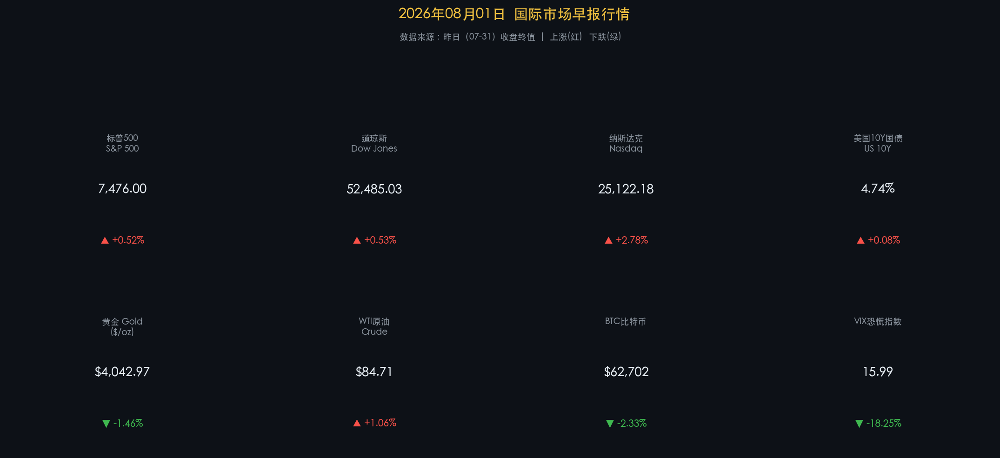
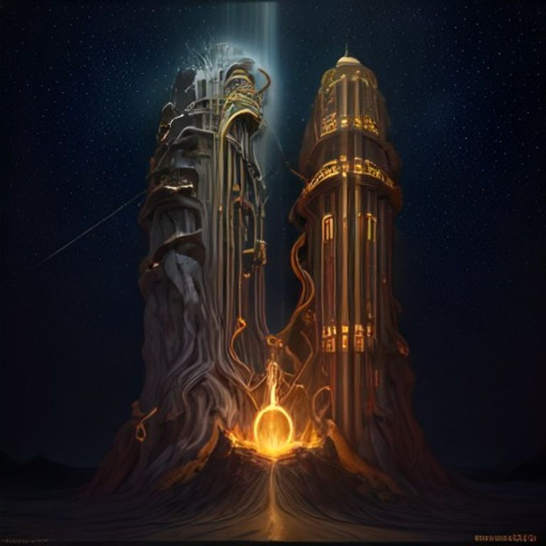

# 🌐 2026年08月01日 国际市场早报

**日期：2026年08月01日 (星期六)** &nbsp; **时段：早报 (国际市场)**

> **核心摘要**：美股周五收高，纳指在亚马逊超预期财报及云增长提振下领涨+2.78%，但苹果疲弱展望限制了硬件板块；受中东地缘局势升级影响，油价日内大幅震荡，WTI原油微涨收报$84.71/桶；美债收益率因通胀粘性隐忧飙升至4.74%，显示出降息预期继续受压，全球市场呈现科技大厂季报分化与宏观债市重压并存格局。

---

## 核心行情复盘

### 美国股市（07-31 收盘终值）

* **标普500 (S&P 500)**：**7,476.00** ▲ **+0.52%**
* **道琼斯工业指数 (Dow Jones)**：**52,485.03** ▲ **+0.53%**
* **纳斯达克综合指数 (Nasdaq)**：**25,122.18** ▲ **+2.78%** (纳指领涨，科技巨头业绩分化，但亚马逊云与AI开支信心稳固)

> 周五美股经历宽幅震荡后收高，纳斯达克指数大幅领涨，主要得益于亚马逊靓丽财报对云计算和AI开支主线的信心修复。然而，苹果对下一季度的谨慎展望拖累了硬件与消费电子产业链，导致大盘全天承压，直至尾盘买盘才将大盘全面推高。尽管周五反弹，由于七月内外部政策扰动不断，美股三大指数全月仍以微弱跌幅收官。

**行情数据卡片：**

### 债券与利率

* **美国10年期国债收益率**：**4.74%** ▲ +8BP (通胀粘性顽固，国债继续承压，收益率创近期新高)
* **VIX 恐慌指数**：**15.99** ▼ **-18.25%** (美股大反弹，避险买盘暂时退场，恐慌程度大幅回落)

> 债市在周五遭遇明显抛压，10年期美债收益率上升8个基点至4.74%。这反映了在粘性通胀数据压力下，市场重新考量美联储的长期高利率立场（High for Longer）。股债再次显现出背离——股市情绪由科技股盈利驱动，而债市更敏感于宏观层面的通胀顽固性。

### 大宗商品

* **黄金 (Gold)**：**$4,042.97/盎司** ▼ **-1.46%** (获利了结与美元相对坚挺令金价从历史高位回落)
* **WTI 原油**：**$84.71/桶** ▲ **+1.06%** (中东地缘紧张局势加剧推升原油风险升水)
* **布伦特原油**：**$88.00/桶** ▼ **-1.62%** (油价波动加剧，布油尾盘微幅回调)

> 商品市场焦点依旧聚焦于中东地缘博弈（特别是涉及伊朗的地缘摩擦）。原油价格由于潜在的供应链中断担忧依然享有风险溢价，但油市内部多空分歧巨大，布伦特原油在盘中摸高至$90.24后出现多头获利平仓。黄金价格则在前期录得历史新高后进行健康修正。

### 加密货币

* **比特币 (BTC)**：**$62,702** ▼ **-2.33%**
* 市场情绪：比特币未能守住$64,000关口。美债收益率走高与流动性偏紧的担忧限制了无风险资产的回报弹性，机构投资者在周末前选择轻仓平盘，短期价格呈现缩量回调走势。

---

## 核心解读与市场逻辑

### 焦点一：亚马逊 vs. 苹果——Big Tech 的 AI CapEx 与需求分水岭
> 本次科技财报周以亚马逊与苹果的强力对决画下句点。亚马逊因云计算业务（AWS）在AI投入下的高速增长和超预期利润暴涨，成为驱动纳指反弹的引擎。相比之下，苹果因供应链重组与新机需求疲软导致的谨慎指引，反映出终端消费硬件的压力。市场对于“高额AI资本开支能否带来现金回流”的争议在亚马逊财报中得到了正面反馈，消除了部分对于互联网泡沫破裂的担忧。

**核心逻辑链**：
- 亚马逊AWS高增长 → 证明AI资本开支（CapEx）转化为实际云业务收入 → 科技软硬件信心回升
- 苹果展望疲软 → 显示宏观消费信心不足与硬件换机周期延长 → 传统手机供应链承压
- 强弱相抵：纳指虽大涨，但科技板块内部分化严重，选股逻辑进一步从“大盘蓝筹”转向“盈利确定性”。

### 焦点二：通胀粘性持续，降息预期再度被推迟
> 周五的数据进一步确立了美国通胀的结构性顽固。特别是在二次通胀（Tariff Concerns）和能源供给压力下，债券市场开始定价年内无进一步降息的剧本。4.74%的10年期美债收益率反映出美联储政策转向在第三季度缺乏基本面支撑，而这构成了大盘上方最主要的估值压制器。

---

## 政策脉动

* **美联储（Fed）**：在7月利率决议维持基准利率不变后，多名官员暗示虽然通胀依然高企，但决策者正为9月提供灵活选项；然而债市的利率表现偏向鹰派防守。
* **中东局势**：美伊局势传闻不断，霍尔木兹海峡防务升级推动油价溢价长期化，供给侧危机仍是全球宏观通胀的最大隐忧。

---

## 最新机构观点

* **高盛（Goldman Sachs）**：维持全球股票长期建设性立场。预计AI基础设施投入在2026年继续保持扩张，短期大厂财报的分化属于高估值重估中的“健康重置”。虽然降息可能推迟，但坚实的盈利增长将成为美股指数向上的主要引擎。
* **摩根士丹利（Morgan Stanley）**：对于“科技狂欢”持谨慎中立态度。强调在科技巨头经历大幅反弹后，头寸仍显拥挤。大摩建议在投资组合中加大防御性大消费与特种军工等硬资产的配置，以对冲因地缘及二次通胀带来的美债高收益率重压。
* **摩根大通（JPMorgan）**：指出高通胀粘性是2026年的主线。尽管科技巨头财报为市场提供了支撑，但美国经济在长期高利率环境下陷入“软着陆困难”的可能性依然不容低估，预计资产波动率在下半年仍将处于较高区间。

---

## 今日市场情绪：金钥启城，分歧共生

今日的国际市场情绪呈现出盈利提振与宏观警示并存的复杂景象。画面中，一把由纵横交错的电路板路径与发光集成电路编织而成的巨大金色钥匙，正插入并解锁一座高耸入云的冰冷数字要塞大门。随着大门缓缓敞开，一道温暖、耀眼的橙色光芒喷薄而出，撕裂了虚拟空间的黑暗。然而，在要塞大门的阴影背景中，一只泛着冷冽银色金属光泽的苹果，表面带有一道细微但清晰的裂痕，静静地卧在废墟之上；一根蜿蜒盘旋的黑色原油管道在陡峭的崖壁上延伸，其末端正燃烧着地缘风险的暗红烈火，在深邃的夜空中显得格外醒目。这幅画面深刻揭示了亚马逊以云计算实力解锁科技大盘上涨，而苹果增长乏力以及地缘大宗危机仍暗流涌动的分歧现状。

> Prompt: Subject: A massive glowing golden key of integrated circuits is unlocking a towering digital fortress gateway, casting a radiant warm orange beam of light. In the background: a silver metallic apple with a subtle hairline crack lies in the shadows, while a winding pipeline of blazing dark oil flows down a steep rocky cliff under a dark starry sky. No humans. No text., masterpiece, high detail, intricate composition, cinematic lighting, 8k resolution

---

*免责声明：内容仅供参考，不构成投资建议。*
