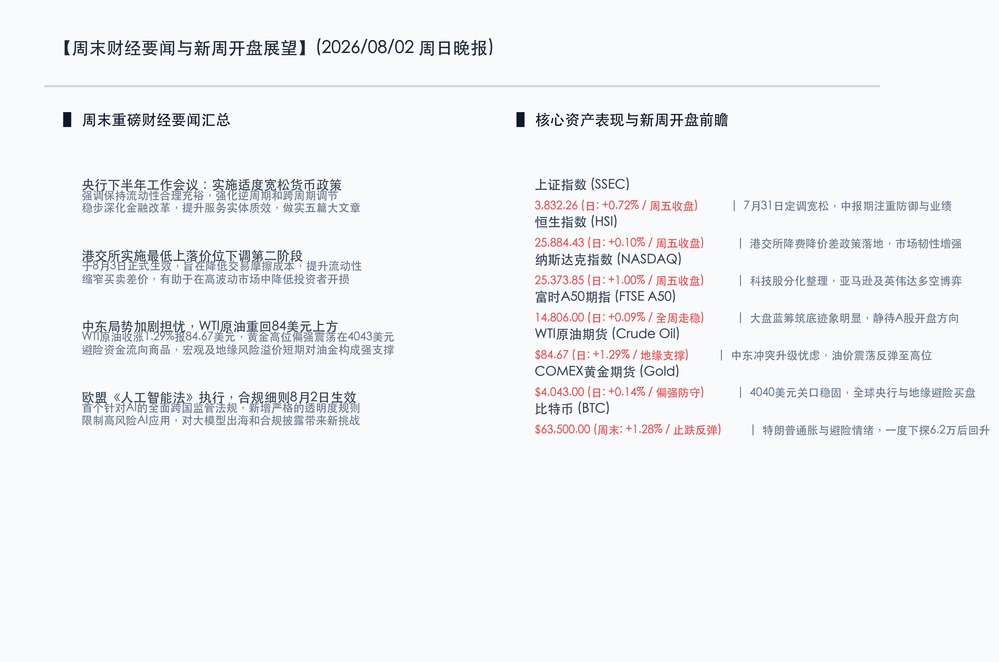

# 央行工作会释“适度宽松”暖意，港交所新规激活效率，市场蓄势中报期业绩破局

**日期：2026年08月02日 (星期日)** &nbsp; **时段：晚报 (新周展望模式)**

> **核心摘要**：本周末，国内政策与制度改革齐发力。中国人民银行2026年下半年工作会议明确提出继续实施“适度宽松的货币政策”，为宏观经济复苏提供充足流动性保障；香港交易所自8月3日起实施下调股票最低上落价位新规，旨在收窄买卖差价并大幅降低交易摩擦成本。外围市场随着欧盟《人工智能法》正式生效，AI行业合规性面临重塑，而中东局势的持续紧绷则支撑原油和黄金价格高位震荡。在A股与美股均进入中报业绩最密集验证期之际，市场风格预计将以“防御与业绩为王”为主线，静待政策与流动性共振带来的估值修复行情。

## 周末财经要闻终极汇总

本周末，国内宏观流动性预期显著改善，资本市场微观交易机制迎来重要调整，外围市场合规与地缘风险亦在交织中演进：

*   **央行工作会议定调适度宽松，流动性环境持续向好**：中国人民银行于8月1日召开2026年下半年工作会议，会议要求继续实施好**适度宽松的货币政策**，保持流动性合理充裕。这一表态为下半年货币政策的定调释放了强烈的积极信号，有助于强化逆周期和跨周期调节，支持科技金融、绿色金融等重点实体领域的发展，夯实国内市场的资本托底信心。
*   **港交所降低最低上落价位，激活市场流动性效率**：香港交易所宣布自8月3日（周一）起，正式实施下调香港证券市场部分股票最低上落价位的第二阶段安排。此举旨在通过缩窄买卖差价，降低投资者的交易摩擦成本，提高报价活跃度与盘口深度，预计将极大增强港股市场的流动性和在高波动环境下的抗风险韧性。
*   **中东地缘局势持续紧绷，大宗商品维持偏强防御格局**：受地缘冲突风险溢价支撑，大宗商品在上周五收盘和周末整体维持强势。WTI原油期货收涨1.29%至 **84.67美元/桶**；COMEX黄金期货在4040美元上方偏强整理，收报 **4043.00美元/盎司**。避险资金流向资源品，对下半年的通胀预期与资产定价构成了重要的外部宏观约束。
*   **欧盟《人工智能法》细则生效，AI出海与合规要求升级**：全球首部全面监管AI的法律——欧盟《人工智能法》的相关规定于8月2日正式生效。法案不仅明确限制了高风险AI应用，还对大模型厂商在透明度、版权保护和合规披露上提出了极为严格的规定。这对于全球科技巨头以及寻求出海的中国人工智能企业来说，合规成本将显著上升，AI板块的估值逻辑正经历新一轮重构。
*   **比特币呈现探底反弹，高风险资产筹码沉淀**：受地缘摩擦缓解以及流动性预期调整影响，比特币（BTC）在周末经历窄幅波动。价格在下探至62,200美元后震荡回升，截至周日下午稳定在 **63,500美元** 附近。全球避险偏好虽有反复，但加密市场在前期抛压释放后，正于关键水位进行底部沉淀。

## 新一周市场核心博弈逻辑

*   **逻辑一：中报业绩期洪峰将至，市场风格从“情绪驱动”转向“业绩证真”**
    新的一周，A股、港股和美股中报披露将进入最密集的“洪峰期”。随着科技股和部分周期股此前经历了一轮估值挤压，市场的博弈焦点将不再局限于故事和宏观预期，而是彻底转向对CapEx回报率以及企业订单真实兑现度的检验。具备业绩确定性、出海订单饱满的半导体、电网设备细分龙头有望迎来错杀修复，而业绩暴雷的品种将加速去泡沫。
*   **逻辑二：适度宽松政策底进一步夯实，缩量磨底后静待存量资金回补**
    上周五A股大盘呈现修复之势，上证指数收涨0.72%报3832.26点，市场筑底企稳的信号较为明确。周末央行下半年工作会释放的“适度宽松”暖意，将有效缓解此前市场对流动性边际收紧的担忧。在市场悲观情绪释放充分、杠杆筹码出清接近尾声后，政策暖风将吸引前期观望的宽基ETF及外资存量资金重新回补，推动指数级别企稳反弹。
*   **逻辑三：港交所交易新规落地与美联储降息指引的全球资金流向博弈**
    8月3日港交所第二阶段最低上落价位调降生效，将直接对港股的高频交易及盘口流动性产生正向刺激。同时，市场正密切前瞻美联储在下半年进一步降息的时点。两地流动性政策的错配与重塑，在当前港股估值处于相对偏低位置的背景下，或将加速海外长期资本回流港股，形成新一轮“中资核心资产”的重定价窗口。

## 本周重磅经济数据与会议前瞻

*   **8月3日（周一）**：港交所实施最低上落价位下调新规，交易成本大幅度优化。
*   **8月5日（周三）**：
    *   中国公布7月财新服务业PMI，验证微观主体复苏动能。
    *   美国公布7月ISM非制造业PMI，为全球服务业景气度与降息时点提供关键指引。
*   **8月7日（周五）**：
    *   中国公布7月外汇储备数据，验证跨境资金流动与人民币汇率底座。
    *   美国公布7月失业率及非农就业人口变动，该数据将成为检验美联储货币政策转向速度的核心试金石。

## 头部券商/投行开盘策略点睛

*   **中信证券 (CITIC)**：**“风险偏好回落接近尾声，8月普遍轮动修复开启”**。中信证券分析认为，虽然中东局势升级在短期降低了市场风险偏好，但A股出清已经进入后期阶段。随着央行工作会议定调适度宽松，流动性充裕环境有望延续。8月市场进入普遍轮动修复的概率很大，建议围绕“三大收敛方向”进行精细布局：一是关注AI上游硬件向其他成长板块的收敛；二是国内非AI工业龙头相对于海外公司的估值修复；三是科技与非科技板块的均衡化配置，重点精选绩优白马股持股待涨。
*   **中金公司 (CICC)**：**“筹码压力释放充分，中期慢牛格局依然有底”**。中金公司指出，上周全球市场的剧烈震荡主要受到全球AI负面叙事、去杠杆和地缘波动的多重夹击，但负面因素目前已得到相当充分的消化。当前A股横向与纵向对比均处于近五年来的高性价比买点，中报披露期虽有业绩分化风险，但“有底无顶”的慢牛格局仍是下半年的核心指引。配置建议在防御红利板块与硬科技出海龙头之间寻求双轮驱动。
*   **申万宏源 (SWS)**：**“极度缩量确认地量区间，中报披露季紧扣业绩证真”**。申万宏源强调，当前市场成交量已接近磨底区间的极致，投资者不要在底部区域盲目杀跌。下周起中报业绩兑现正式进入风暴中心，建议以不变应万变，重点聚焦于中报超预期、估值错杀严重的科技与制造白马。同时紧密关注央行流动性政策落地与行业并购重组预期，中线布局中报订单具备高成长性的细分赛道。

## 今日市场情绪：玉龙凌波，金阙涵光

在超现实主义的深邃画布上，今日的市场情绪被勾勒为一幅“玉龙凌波，金阙涵光”的壮丽画卷。画面中央，一条由发光绿色数字电路板和光纤交织而成的庞大玉石巨龙在平静的金色交易图表波涛之上盘旋飞舞，散发出温润而坚韧的生机（象征中国央行适度宽松的流动性与制度新规化作市场的科技底座，稳健托起上行趋势）。背景中，一座象征着国家宏观政策与央行流动性源源不断的宏伟黄金大门在温暖的金色旭日中缓缓敞开，从门内射出夺目的翡翠绿光，将天际残留的阴霾完全驱散（象征在新的一周，中报披露和宏观政策落地有望照亮市场，带来破局反弹的曙光）。一艘代表存量资金与投资者的小型木质帆船在巨龙的身侧乘风破浪，平静而坚定地驶向远方的光芒深处。

> Prompt: Surrealism style, Subject: A massive jade dragon woven from glowing digital circuits soaring above a calm sea of golden trading charts. Background: A giant golden gateway of a central bank vault stands open under a warm rising sun, casting a brilliant emerald light that illuminates the horizon. No humans. No text., masterpiece, high detail, intricate composition, cinematic lighting, 8k resolution

---

免责声明：内容仅供参考，不构成投资建议。
