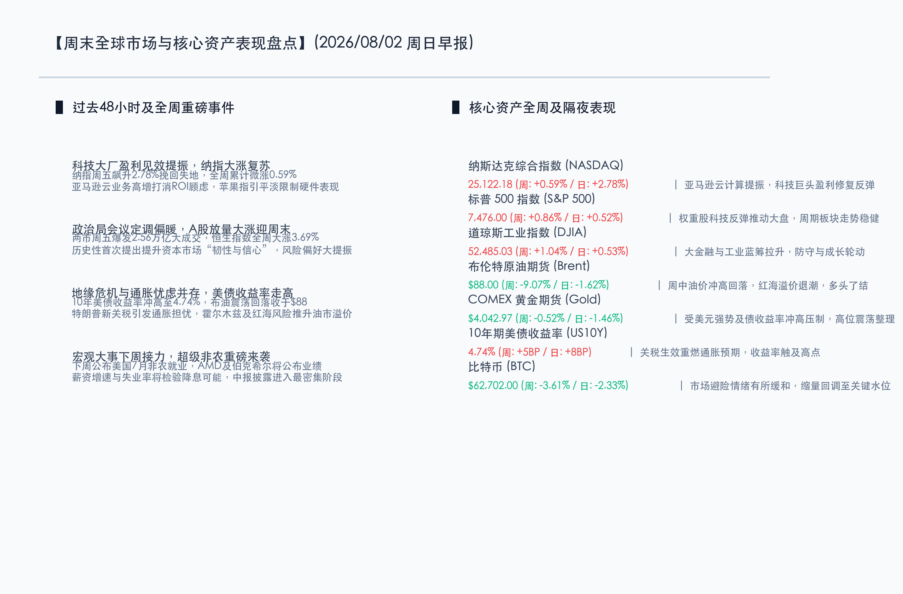

# 全球科技大厂盈利见效重振纳指，粘性通胀与中东乱局致债收益率冲高；下周迎来超级非农“期中考”与中报季洪流

**日期：2026年08月02日 (星期日)** &nbsp; **时段：早报 (周末复盘模式)**

> **核心摘要**：本周全球金融市场展现出震荡整固与局部分化的态势。美股方面，虽然前期科技板块估值承压，但周五亚马逊云计算及强劲财报重振了AI赛道信心，纳指单日暴涨2.78%平稳收官，全球科技大厂的ROI博弈逐步走入盈利兑现期；国内方面，政治局会议定调逆周期调节与投融资综合改革，大幅提振了市场风险偏好，A股周五爆发2.56万亿级别的成交额大涨，港股恒指全周卓越上涨3.69%领跑全球。同时，中东地缘局势的暗流涌动与美国新关税政策生效令通胀担忧难消，美国10年期国债收益率攀升至4.74%的高位，限制了高估值资产的成长弹性，下周的美国7月非农就业报告与中报披露洪流将成为市场方向判定的关键试金石。

## 核心资产周度/日度表现回顾

本周全球金融市场在复杂的地缘冲突、关税博弈以及科技股估值重塑的多重力量拉扯下宽幅震荡。美股科技板块持续释放风险后在周尾迎来盈利支撑的强劲反弹，而国内市场则在重磅政策指引下爆发出极强的多头信心。

*   **纳斯达克综合指数 (NASDAQ)**：收报 **25,122.18点** (全周: **+0.59%** / 周五单日: **+2.78%**) 🔴。受亚马逊靓丽财报及云业务高增提振，周五单日暴涨，扭转了先前的持续跌势，周线成功翻红。
*   **标普 500 指数 (S&P 500)**：收报 **7,476.00点** (全周: **+0.86%** / 周五单日: **+0.52%**) 🔴。科技权重股在盈利预期修复下的走强，与传统防御、周期板块企稳共振，平稳跨周。
*   **道琼斯工业指数 (DJIA)**：收报 **52,485.03点** (全周: **+1.04%** / 周五单日: **+0.53%**) 🔴。金融与工业蓝筹表现稳健，显示出宏观高利率环境下红利防御板块的韧性。
*   **布伦特原油期货 (Brent)**：收报 **$88.00/桶** (全周: **-9.07%** / 周五单日: **-1.62%**) 🟢。红海与霍尔木兹海峡的地缘溢价周中有所冲高，但周五多头于高位平仓获利了结，致周度大跌。
*   **COMEX 黄金期货 (Gold)**：收报 **$4,042.97/盎司** (全周: **-0.52%** / 周五单日: **-1.46%**) 🟢。美债收益率冲高及美元坚挺对无息资产黄金构成压力，高位进行健康修正。
*   **10年期美债收益率 (US10Y)**：收报 **4.74%** (全周: **+5.0BP** / 周五单日: **+8BP**) 🔴。关税正式生效落地，加剧全球供应链重组与美国二次通胀忧虑，收益率冲至高水位。
*   **比特币 (BTC)**：收报 **$62,702.00** (全周: **-3.61%** / 周五单日: **-2.33%**) 🟢。避险情绪降温，流动性重压及关税阴霾致加密资产缩量，处于关键支撑位附近。

## 过去 48 小时重磅事件深度复盘

> **事件一：政治局会议定调提升资本市场“韧性与信心”，A股放量爆发2.56万亿**
> 
> 7月30日中共中央政治局会议研究部署下半年经济工作，政策基调显著偏暖。会议要求“加大逆周期调节力度”并“及时谋划出台务实管用的增量政策”，财政金融协同发力促内需。针对资本市场，会议历史性地首次提出“深化资本市场投融资综合改革，提升资本市场韧性和信心”。这一权威表态为耐心资本、中长期资金入市扫清了制度障碍，极大提升了中外资金对中国资产的信心，促成周五A股两市爆发2.56万亿级别的放量大涨行情，恒指周线上涨3.69%，大盘底部夯实。

> **事件二：亚马逊AWS盈利兑现，平息AI Capex泡沫疑虑，科技权重强力托底**
> 
> 本周美股科技股经历估值洗牌。亚马逊发布的二季度财报表现强劲，特别是AWS云计算服务在AI基建投入的直接拉动下录得高速增长，证明了科技巨头高昂的AI资本开支（Capex）能够转化为实质的云业务收入。虽然苹果对下一财季的业绩指引略显平淡拖累盘中表现，但亚马逊云业务盈利的确定性大幅消除了市场对“AI无法变现”的泡沫担忧。周五美股科技股迎来集体大反攻，纳指大涨2.78%，带领主要国际市场企稳反弹。

> **事件三：特朗普新一轮关税正式落地，粘性通胀风险推升美债收益率至高位**
> 
> 美国政府宣布对包括中国、欧盟等60多个贸易伙伴加征10%-12.5%关税的操作已正式生效。该政策落地引起市场对美国二次通胀和供应链重组的担忧。受此影响，10年期美债收益率在周五上升8个基点至4.74%的阶段高位。债市高企的收益率及强势美元对黄金、加密资产形成估值挤压，黄金回落至$4042.97，比特币失守$63000。油价方面虽然周五因高位获利了结而回调，但地缘溢价和供给收紧预期仍为油市提供了较强底座。

## 下周全球宏观大事预警

下周全球金融市场将迎来制造业数据、劳动力市场以及核心企业财报的密集考验：

*   **8月3日 (周一)**：中国7月财新制造业PMI，以及欧美主要国家7月制造业PMI终值。市场将重点评估全球制造业基本面的复苏底色。
*   **8月5日 (周三)**：美国7月ADP就业报告（“小非农”）及7月ISM非制造业PMI数据发布。此外，SpaceX（上市后首份财报）、AMD将发布业绩，关注先进封装与AI硬件的产业催化。
*   **8月7日 (周五)**：**美国7月非农就业报告（超级非农）**重磅落地。作为美联储政策路径的关键锚点，失业率和薪资增速将直接决定市场对9月是否重回降息或维持高利率的定价。同日，伯克希尔·哈撒韦将公布中报。

## 顶级机构周末策略内参摘要

*   **高盛集团 (Goldman Sachs)**：**“AI基础设施建设进入盈利兑现期，建议关注有确定性指引的龙头”**。高盛指出，亚马逊AWS的高速增长打消了关于AI基建投入ROI（投资回报率）的疑虑。虽然短期估值高企带来重置，但AI算力硬件和大模型软件的支出仍在增长。虽然降息预期受高通胀和关税掣肘推迟，但科技巨头的内生性增长仍是指数向上的主引擎。
*   **摩根士丹利 (Morgan Stanley)**：**“关税落地加剧通胀担忧，加码低估值、高现金流的传统防御资产”**。大摩策略团队认为，美国加征关税政策的生效对全球供应链形成冲击，并将高利率（Higher-for-Longer）的时间拉长。在利率重压下，高估值科技板块的筹码仍显拥挤。建议超配防御性消费、金融及军工等受地缘及高收益率环境冲击较小的“硬资产”。
*   **中信证券 (CITIC Securities)**：**“投融资改革提升资本市场信心，A股与港股配置聚焦新质生产力”**。中信证券认为，政治局会议定调非常积极，首次提出提升市场“韧性与信心”，随着后续财政增量工具和投融资综合改革落地，市场交投情绪将持续活跃。配置上，建议关注有中报业绩支撑的AI硬件、半导体、出海链，以及提供高股息的国央企。

## 今日市场情绪：固海金龙，破浪迎曦

今日的市场情绪在政策暖风与科技大反弹的宏景中得以体现。画面中，一条由璀璨碧玉与发光电路板路径编织而成的精美中国巨龙腾空而起，代表着政治局会议赋予市场的韧性与信心。巨龙身下是波涛汹涌但微带红绿K线光芒的数字海洋。在远处，一座黑色服务器机架组成的峭壁上，一把由集成电路组成的巨大金色钥匙（代表亚马逊AWS云盈利）解锁了沉重的铁门，洒出温暖耀眼的金色光芒，穿透了风暴离去后的阴影。海平面上，一轮金灿灿的太阳正从海天交接处缓缓升起，万道金光铺满波光粼粼的数字海面，昭示着金融多头力量在绝地反击后迎来了破局的破晓曙光。

> Prompt: Surrealism style, Subject: A majestic Chinese jade dragon, wrapped in glowing golden circuit boards and illuminated data streams, is soaring upward from a turbulent ocean of red and green K-line candlestick charts. In the background: a massive golden key is unlocking a dark metallic gate on a server cliff, while a winding pipeline of black oil flows down a steep rocky peak under a dark starry sky. No humans. No text., masterpiece, high detail, intricate composition, cinematic lighting, 8k resolution

---

*免责声明：内容仅供参考，不构成投资建议。*
