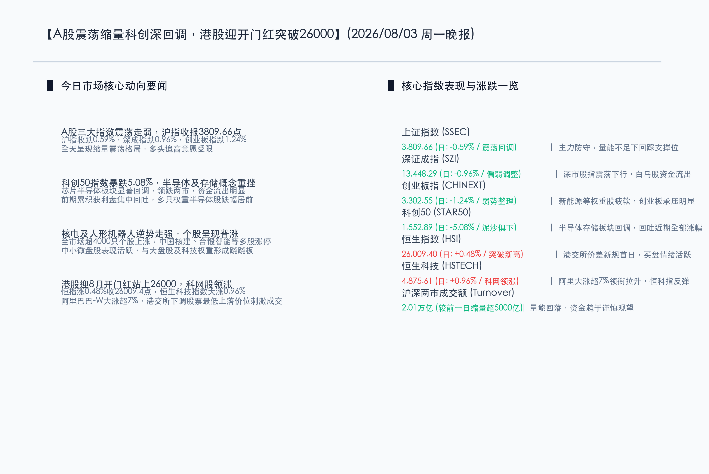

# 科创50重挫5%半导体承压回调，核电机器人逆势突围，港股迎开门红站上26000点

**日期：2026年08月03日 (星期一)** &nbsp; **时段：晚报 (常规交易日模式)**

> **核心摘要**：今日沪深两市呈现震荡分化格局，受半导体及存储芯片板块大跌拖累，科创50指数重挫 5.08%，大盘整体缩量整理，成交额回落至 2.01 万亿元。然而，市场个股涨多跌少，核电及机器人概念股掀起涨停潮；同时，港股在股票最低上落价位下调新规首日表现强劲，恒生指数成功站上 26,000 点关口实现“八月开门红”。随着中报业绩披露进入深水区，市场资金正显现出明显的“哑铃型”防御特征，精细博弈业绩兑现度。

## 核心行情复盘

今日国内A股与港股市场出现显著的板块轮动与分化走势，具体行情数据如下：

*   **上证指数 (SSEC)**：收报 **3,809.66点**，下跌 **22.60点**，跌幅 **0.59%** 🟢。指数全天在 3800 点关口上方窄幅震荡，回踩近期支撑线。
*   **深证成指 (SZI)**：收报 **13,448.29点**，下跌 **130.64点**，跌幅 **0.96%** 🟢。深市白马股资金有所流出，指数走势偏弱。
*   **创业板指 (CHINEXT)**：收报 **3,302.55点**，下跌 **41.41点**，跌幅 **1.24%** 🟢。新能源与部分医药权重走低拖累指数。
*   **科创50 (STAR50)**：收报 **1,552.89点**，暴跌 **83.07点**，跌幅 **5.08%** 🟢。半导体、集成电路及存储芯片板块全线回调，领跌两市。
*   **恒生指数 (HSI)**：收报 **26,009.40点**，上涨 **124.97点**，涨幅 **0.48%** 🔴。盘中成功突破 26000 点整数关口，创下近两个半月新高。
*   **恒生科技 (HSTECH)**：收报 **4,875.61点**，上涨 **46.39点**，涨幅 **0.96%** 🔴。科网股普遍走强支撑港股大盘。
*   **两市成交额**：今日沪深两市合计成交额约为 **2.01万亿元**，较前一交易日大幅萎缩超 **5,000亿元**，显示出资金追高意愿减弱，观望情绪增浓。
*   **个股涨跌幅**：尽管大盘指数收跌，但全市场个股却呈现普涨格局，超 **4000只** 个股录得上涨，微盘股与中小市值股票表现极为活跃。

> **行业板块表现**：
> *   **领涨行业**：**核电板块**逆势走强，中国核建、合锻智能、久盛电气等多只个股强力封涨停；此外，受世界机器人大会临近刺激，**人形机器人概念**、**电力板块**、**光伏概念**也表现活跃。
> *   **领跌行业**：**半导体产业链**与**存储芯片概念**全天深跌，科创板权重芯片股遭获利盘集中回吐，拖累科创50指数单日创下深幅调整。

## 核心解读与市场逻辑

今日市场的大分化走势背后，交织着资金在业绩窗口期的战术调整与事件催化的短期博弈：

*   **逻辑一：中报窗口期的“业绩证真”与估值回吐**
    > 随着8月份进入上市公司中报披露的最密集期，此前由于AI算力和国产替代叙事而高歌猛进的半导体及科创板板块，面临着极高的估值容错度拷问。在缺乏超预期强劲基本面订单支撑的背景下，高位获利筹码选择在报表公布前夕集中回吐锁定收益。这种“见光死”或避险回踩的资金行为导致了科创50指数今日的深幅下挫，显示出市场资金的博弈焦点已彻底转向对微观业绩的严格拷问。
*   **逻辑二：电力核电概念的“算力能源底底座”支撑与防御性特征**
    > 核电板块今日的暴发并非偶然，一方面受下半年电网建设与新型能源政策预期推动；另一方面，AI算力爆发带来的“电力饥渴”正令清洁、稳定的核能成为科技产业中长期的终极能源底座。在科技权重股回调的背景下，具备红利防御属性且带有利好预期的电力、核电板块自然成为存量资金“避风港”，形成了典型的市场“跷跷板效应”。
*   **逻辑三：港股交易新规落地，交易差价收窄激活买盘**
    > 8月3日港交所股票最低上落价位下调的第二阶段安排正式落地，这对于高频交易者以及大额资金而言，直接降低了摩擦成本并收窄了报价价差。在此催化下，港股的流动性效率明显提升。加之阿里巴巴-W（大涨超7%）等科技互联网龙头由于估值偏低、回购政策加码，吸引了中资及外资的长线资金回补，助推恒指大涨并成功突破26000点整数关口，率先斩获开门红。

## 政策脉动

*   **适度宽松货币基调不改，央行资金操作呵护流动性**：中国人民银行8月1日下半年工作会议继续实施好**适度宽松的货币政策**。今日（8月3日）央行在公开市场开展了 **630亿元** 7天期逆回购（利率1.40%）及 **3000亿元** 隔夜逆回购操作，精准平抑月初资金面波动，向市场传递积极的政策托底信号。
*   **扩大内需实施方案加紧制定，逆周期调节力度加大**：国家发改委等部门正加紧起草《扩大内需战略实施方案（2026-2030年）》，下半年将重点围绕挖掘服务消费和智能消费潜力展开。同时，配合三季度施工黄金属期，新型政策性金融工具 **8,000亿元** 资金以及地方专项债 the 发行使用速度将显著加快，以投资拉动优化供给，为实体基本面注入强心针。
*   **跨境贸易汇率结算服务优化，外汇防风险筑牢底座**：外汇局召开的半年工作会议中，重点强调优化跨境贸易汇率结算服务，支持跨境电商等外贸新业态，便利跨境投融资。同时，会议表示将持续化解地方政府融资平台债务风险，推动其市场化转型，提高对外部宏观冲击的抵御能力。

## 最新机构观点

*   **中信证券 (CITIC)**：**“市场底部明确，8月修复窗口开启”**。中信证券分析认为，虽然今日半导体板块出现局部巨幅震荡，但这属于交易拥挤度的健康出清，而非基本面恶化。央行工作会议定调适度宽松，奠定了市场充足的流动性底座。当前A股市场筑底已经基本完成，8月份将进入普遍性的温和轮动修复通道。在策略上，建议采取“哑铃型”防御反击，以公用红利股防守，并在调整中逢低布局半年报业绩兑现度高、有硬订单支撑的AI算力及高景气出海链龙头。
*   **中金公司 (CICC)**：**“轻指数重结构，围绕中报业绩主线精耕细作”**。中金公司指出，成交量今日回落至2.01万亿的低位，暗示了市场追高意愿退潮，进入存量资金的结构博弈期。中报披露期市场会逐步剔除概念炒作，回归业绩本质。短期内，建议注重高股息底仓与高景气成长股之间的平衡。对于大跌的科技半导体板块，其长期的国产替代逻辑并未动摇，中线可关注在本次回调中估值被错杀的芯片设备及材料细分龙头。
*   **申万宏源 (SWS)**：**“缩量磨底确认地量区间，以时间换空间”**。申万宏源强调，周一两市较上周五大幅缩量超5000亿元，说明市场情绪在此前释放后已进入地量区间，下探空间极其有限。投资者无需在底部区域盲目杀跌，应以静制动。核电与机器人等板块今日逆势走强，反映了政策与事件性催化在存量市场中的高敏感度，短期内可继续留意这类高政策能见度赛道的脉冲机会，但中线布局仍需紧扣半年报有扎实利润增长的目标。

## 今日市场情绪：铁骨熔心，开门承曦

在超现实主义的奇幻视野中，今日的市场情绪被描绘为一幅“铁骨熔心，开门承曦”的壮丽画面。画面中央，一尊线条流畅的超现实主义人形机器人昂然伫立，其胸口的核心是一颗由核电能转化而来的绿色荧光反应堆（象征核电与机器人板块逆势突围，成为今天市场最亮眼的科技奇兵）。在它的周围，原本由半导体集成电路构成的晶莹硅片和芯片，正如同秋天的红叶般碎裂、随风飘零（象征科创50与半导体板块在情绪回落中面临的深幅回调）。而远处的背景中，一扇宏伟庄严的红色拱门在波澜不惊的金色交易图表海洋上高高耸立（象征港股在新规首日迎来的开门红，恒生指数强势站上26000点）。暖金色的夕阳将温润的红光洒向地平线，机器人站在微风中神情坚毅，目光投向那一抹温暖的曙光，预示着市场在剧烈分化与缩量筑底中正积蓄着蓄势待发的破局力量。

> Prompt: Surrealism style, Subject: A sleek humanoid robot powered by a glowing green nuclear core, standing firm as crystalline silicon wafers and microchips fracture and float away like glowing leaves. Background: A colossal, ornate red archway rises from a calm ocean of golden charts under a warm sunset, casting a gentle red glow. No humans. No text., masterpiece, high detail, intricate composition, cinematic lighting, 8k resolution

---

免责声明：内容仅供参考，不构成投资建议。
