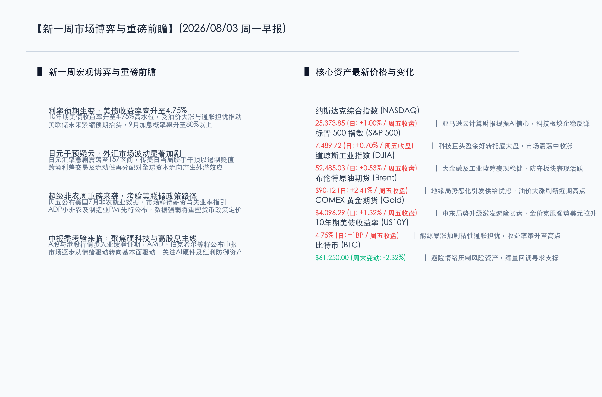

# 能源价格飙升与通胀粘性推高债市收益率，外汇市场静待日元干预靴子落地；新一周迎来“超级非农”与中报披露洪流

**日期：2026年08月03日 (星期一)** &nbsp; **时段：早报 (新周展望模式)**

> **核心摘要**：新一周全球金融市场步入关键博弈窗口。商品与能源市场方面，受地缘政治风云突变及供给忧虑推动，布伦特原油上周暴涨，加剧了粘性通胀风险，导致美债10年期收益率拉升至 **4.75%** 高位，9月联储加息预期被重新定价（概率升至 **80%** 以上）。同时，日元汇率剧烈波动至 **157** 区间，引发美日联合干预疑云。美股凭借科技大厂云业务强劲盈利支撑，在周尾走出估值修复的反弹行情；国内市场受资本市场“韧性与信心”政策利好提振，A股港股信心底部正在形成。展望本周，市场核心博弈点将围绕周五重磅公布的美国7月非农就业数据，以及以AMD、伯克希尔为首的跨国巨头中报披露洪流展开。

## 周末财经要闻终极汇总

*   **纳斯达克综合指数 (NASDAQ)**：收报 **25,373.85点** (日: **+1.00%** / 周五收盘) 🔴。受亚马逊等科技巨头靓丽财报及云业务高增提振，市场对于AI基建开支的泡沫化担忧得到显著缓解。
*   **标普 500 指数 (S&P 500)**：收报 **7,489.72点** (日: **+0.70%** / 周五收盘) 🔴。权重科技股估值修复反弹，传统价值板块震荡整固，指数重拾上行动能。
*   **道琼斯工业指数 (DJIA)**：收报 **52,485.03点** (日: **+0.53%** / 周五收盘) 🔴。工业蓝筹与大金融防御力量表现强劲，市场风格轮动迹象明显。
*   **布伦特原油期货 (Brent)**：收报 **$90.12/桶** (日: **+2.41%** / 周五收盘) 🔴。中东地缘博弈升级叠加黑海航路遇袭，短期供给吃紧预期推升油价突破90美元大关，单月录得超 **26%** 涨幅。
*   **COMEX 黄金期货 (Gold)**：收报 **$4,096.29/盎司** (日: **+1.32%** / 周五收盘) 🔴。地缘政治冲突导致的强烈避险需求盖过了美元高企与美债收益率攀升带来的负面效应，金价重回升途。
*   **10年期美债收益率 (US10Y)**：收报 **4.75%** (日: **+1BP** / 周五收盘) 🔴。关税正式执行以及能源价格暴涨不断加剧“粘性通胀”预期，美债承受强烈抛压。
*   **比特币 (BTC)**：收报 **$61,250.00** (周末变动: **-2.32%**) 🟢。避险情绪转向传统硬资产，风险偏好回落，加密货币缩量整固，在6万美元关键关口寻求支撑。

- **要闻一：美日外汇市场掀起干预风暴，日元剧烈震荡引发 carry trade 调整担忧**
  > **核心解读**：在上周末外汇市场中，日元对美元在 **157** 区间出现了罕见的剧烈震荡。有市场传言指出，日本政府和日本银行（BOJ）协调美方官员实施了定向外汇干预，以此打击投机性做空日元的行为。随着全球最大 carry trade（套息交易）的池子面临重新定价，跨境资本流动的潜在回流将对高估值风险资产形成资金压力。
- **要闻二：地缘风险阴云重重，美伊紧张对峙与黑海局势助推布油突破90美元大关**
  > **核心解读**：中东方面，美以与伊朗在能源基础设施攻击预案上的博弈仍在发酵，虽然白宫尚未给直接军事行动放行，但德黑兰已发出“全方位反制计划”警告；同时，乌克兰对俄罗斯在黑海的航道实施无人机突袭并击沉一艘集装箱轮，导致黑海航路风险溢价攀升。多重地缘事件共振，使得布伦特原油主力合约拉升 **2.41%** 收于 **$90.12/桶**，全月更是实现超 **26%** 的惊人暴涨。
- **要闻三：美国大选关税靴子落地，供给链重塑与二次通胀担忧重塑美联储加息预期**
  > **核心解读**：随着美国政府宣布对全球60多个贸易伙伴加征的 **10%-12.5%** 的关税正式开始在口岸执行，全球跨国供应链开始承受直接关税成本。市场对美国未来几个季度发生“二次通胀”的担忧迅速升温，这直接推动了美国10年期国债收益率冲高至 **4.75%**。市场互换合约显示，9月美联储非但不会降息，加息25BP的隐性概率甚至被部分头寸交易至 **80%** 以上。

## 新一周市场核心博弈逻辑

- **博弈点一：通胀与利率政策的纠缠，非农数据能否重估联储路线？**
  > **核心解读**：原油的大涨与关税落地的双重通胀效应对高利率起到了“固化”甚至“推升”的作用。周五的非农数据将不仅是一份就业报告，更是验证美国就业市场是否出现温和疲软、是否能让联储获得足够“降息底气”的最后试金石。如果非农大超预期、薪资增速仍有粘性，那么全球金融市场将面临实质性的“更高更久（Higher-forLonger）”利率重压。
- **博弈点二：科技股财报进入深水区，AI高昂资本开支能否持续变现？**
  > **核心解读**：虽然亚马逊AWS和微软的靓丽财报对“AI泡沫”论起到了定海神针的作用，但本周AMD的业绩以及更多科技中报的披露将继续考验芯片制造与AI应用端的供求匹配。目前市场对于高市盈率（PE）成长股的估值容错度极低，任何不及预期的云开支指引都会引发局部的筹码拥挤踩踏。
- **博弈点三：政策驱动与基本面交织，A股与港股在震荡中寻找估值底**
  > **核心解读**：7月政治局会议首次提出“深化资本市场投融资综合改革，提升资本市场韧性和信心”，对中国资产起到了决定性的托底作用。随着8月3日港交所实施下调最低上落价位（第二阶段），两地市场的流动性交易环境进一步得到改善。8月份也是中报业绩的最密集披露期，市场将从先前的题材偏好转向有硬核业绩支撑的AI硬件链、半导体以及高红利红利资产。

## 本周重磅经济数据与会议前瞻

*   **8月3日 (周一)**：中国7月财新制造业PMI，以及欧美主要国家7月制造业PMI终值。市场将直接根据制造业数据评估三季度全球实体经济的活跃度。
*   **8月5日 (周三)**：美国7月ADP就业报告（“小非农”）及7月ISM非制造业PMI。同日美股AMD将发布重要中报，其AI加速器芯片的营收指引将对全球半导体板块产生巨大催化。
*   **8月7日 (周五)**：**美国7月季调后非农就业人口及失业率（超级非农）**重磅落地。作为美联储政策路径的关键锚点，失业率和薪资增速将直接决定市场对未来利率政策的定价。同日，巴菲特旗下的伯克希尔·哈撒韦公司将公布其中报，关注其最新的现金储备及对美股各板块的增减仓动作。

## 头部券商/投行开盘策略点睛

*   **高盛集团 (Goldman Sachs)**：**“AI基础设施的景气度依然坚固，科技板块正处于中期整合而非破位阶段”**。高盛最新的全球资产策略指出，上周虽然科技板块发生局部洗牌，但AWS及云巨头在AI领域的资本支出表明投资回报正在显性化。我们维持全球主要科技龙头的超配建议，并认为应利用利率预期重置带来的调整机会，逢低吸纳基本面强劲的硬件与算力芯片巨头。
*   **摩根士丹利 (Morgan Stanley)**：**“防范8月中报季的高溢价个股波动，增加低杠杆、高现金流的防守头寸”**。大摩认为，关税正式执行后通胀压力短期难以消退，加上杰克逊霍尔会议前夕的流动性敏感期，市场可能面临获利回吐。在整体宏观博弈进入明朗化之前，建议超配金融、基建公用事业等在高利率下受益或受冲击较小的行业。
*   **中信证券 (CITIC Securities)**：**“8月A股迎来左侧修复的战略窗口，哑铃型策略依然是防守反击的最佳方式”**。中信策略团队认为，7月的调整已经充分释放了微观结构拥挤的风险，政治局会议定调的务实逆周期政策将逐步兑现。配置上，建议以红利资产（煤炭、公用事业、银行）作为稳健底仓，并逐步增加对具有中报业绩超预期潜力的AI设备、出海链龙头的弹性配置。

## 今日市场情绪：狂澜引渡，破雾迎曦

在今日的市场情绪图景中，一尊庄严而古老的石造灯塔巍然屹立在由冰冷金属与无数发光服务器机架筑成的万仞峭壁之上，代表着全球科技巨头在云与AI算力领域展现出的坚韧支柱。灯塔顶端，一束强烈的翡翠绿色光芒如利剑般穿透浓浓的迷雾，投射在由粘性通胀与供给担忧交织而成的漆黑油浪上。这片波涛汹涌的黑色原油海洋中，隐隐浮现出由红绿相间的K线蜡烛图所组成的数字化波纹。深邃的天空中，一把巨大的金色钥匙正缓缓转动，解锁了盘踞天际的墨色雷云，使一轮如熔金般的朝阳得以破土而出，用万道金光给阴霾重重的数字地平线铺上了一层充满希望的金色大道，预示着新一周全球资本在利率博弈的大浪淘沙中，将迎风破雾、破眼成曦。

> Prompt: Surrealism style, Subject: A colossal, ancient stone lighthouse stands on a steep cliff made of dark metallic server racks. The lighthouse casts a powerful emerald-green beam across a stormy, swirling ocean of black liquid crude oil with glowing red and green candlestick chart patterns on the waves. In the sky: a giant golden key floats, unlocking dark thundering clouds to reveal a brilliant rising golden sun that illuminates the horizon. No humans. No text., masterpiece, high detail, intricate composition, cinematic lighting, 8k resolution

---

*免责声明：内容仅供参考，不构成投资建议。*
