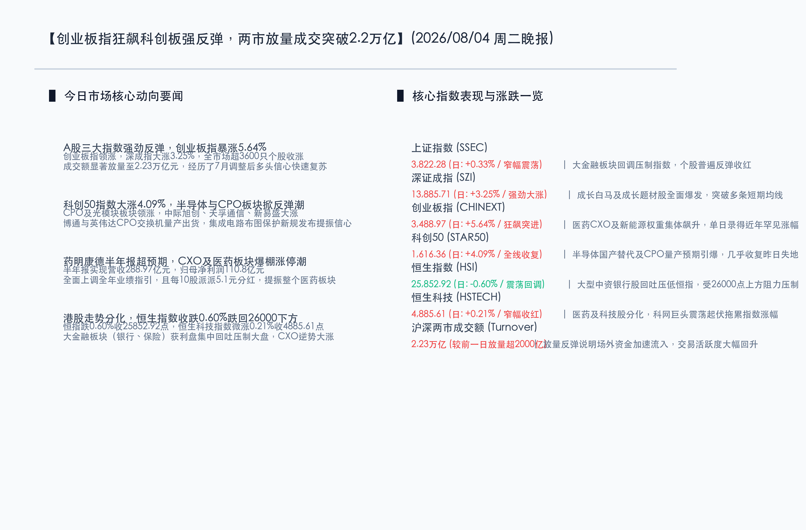

# 创业板指狂飙5.6%科创板全线反弹，CPO与医药CXO双翼齐飞，大金融回调沪深两市放量成交2.23万亿

**日期：2026年08月04日 (星期二)** &nbsp; **时段：晚报 (常规交易日模式)**

> **核心摘要**：今日沪深两市呈现显著的普涨与放量反弹格局，创业板指狂飙 5.64%，科创50指数大涨 4.09%。在药明康德超预期半年报及全年业绩指引大幅上调的刺激下，医药CXO板块掀起涨停潮；同时，英伟达与博通CPO交换机进入量产出货阶段，推动CPO及算力硬件板块强势爆发。尽管大金融板块受获利回吐压力表现疲弱，拖累上证指数仅微涨 0.33%，但全市场超 3600 只个股上涨，沪深两市成交额显著放量至 2.23 万亿元。这显示出市场在经历7月深幅调整后信心快速复苏，行情正由超跌反弹步入“业绩兑现”与“产业逻辑”双轮驱动的修复阶段。

## 核心行情复盘

今日国内A股与港股市场出现显著的板块分化与强劲反弹，具体行情数据如下：

*   **上证指数 (SSEC)**：收报 **3,822.28点**，上涨 **12.62点**，涨幅 **0.33%** 🔴。受大型银行、保险股获利回吐拖累，沪指表现相对克制，但在小盘股活跃度极高的提振下依然收红。
*   **深证成指 (SZI)**：收报 **13,885.71点**，上涨 **437.42点**，涨幅 **3.25%** 🔴。成长白马及题材股全面爆发，指数一举收复多条短期均线。
*   **创业板指 (CHINEXT)**：收报 **3,488.97点**，上涨 **186.42点**，涨幅 **5.64%** 🔴。医药CXO权重股（如药明康德等）和新能源板块集体飙升，录得近年来罕见的单日涨幅。
*   **科创50 (STAR50)**：收报 **1,616.36点**，上涨 **63.47点**，涨幅 **4.09%** 🔴。半导体、光模块及CPO概念股迎来报复性反弹，几乎收复了前一交易日的全部失地。
*   **恒生指数 (HSI)**：收报 **25,852.92点**，下跌 **156.48点**，跌幅 **0.60%** 🟢。恒指受26000点整数关口上方的强阻力压制，加之金融权重股回踩，导致指数震荡收跌。
*   **恒生科技 (HSTECH)**：收报 **4,885.61点**，上涨 **10.00点**，涨幅 **0.21%** 🔴。医药及部分科技股分化，互联网龙头震荡盘整压低指数涨幅。
*   **两市成交额**：今日沪深两市合计成交额约为 **2.23万亿元**，较前一交易日显著放量超 **2,000亿元**，显示市场信心明显回暖，场外资金回补迹象突出。
*   **个股涨跌幅**：全市场呈现出明显的普涨格局，超 **3600只** 个股录得上涨，百股涨停，短线赚钱效应爆棚。

> **行业板块表现**：
> *   **领涨行业**：**医药CXO概念**集体暴发，药明康德大涨超11%并强势封涨停；同时，**CPO（共封装光学）与光模块板块**强势领涨，光库科技、中际旭创、天孚通信、新易盛等均录得大涨；**半导体、光芯片及AI应用**亦表现强势。
> *   **领领跌行业**：**大金融板块**（如大型银行、保险）全天呈现震荡回落，大型银行股跌幅较为明显，资金出现高低切行为。

## 核心解读与市场逻辑

今日市场的报复性反弹与板块的强烈切割，展现了资金在“政策红利”与“业绩实证”双重共振下的核心交易逻辑：

*   **逻辑一：药明康德“中报大超预期”激活CXO与医药板块情绪**
    > 8月3日晚药明康德公布2026年中报，营业收入达 288.97 亿元，同比增长 38.93%；归母净利润 110.8 亿元，同比增长 29.43%，并全面上调了全年营收和增速指引。这一超预期的基本面直接打消了此前市场对于跨国政策环境和行业景气度下滑的恐慌，为医药板块树立了坚实的估值锚。CXO板块爆棚涨停潮，代表了被压抑已久的估值修复与资金的强烈回踩。
*   **逻辑二：产业化量产提速，CPO光模块验证硬科技算力基本面**
    > 英伟达新一代 Spectrum-X CPO 交换机已出货，且博通 51.2T Bailly CPO 交换机持续小量出货，标志着 CPO（共封装光学）技术由前期的概念阶段正式迈向规模化量产阶段。北美云厂商持续上调资本开支验证了全球算力基础设施的高景气度。经历了7月份的历史级回调后，高带宽互联硬科技的基本面逻辑未改，量产消息刺激了硬科技算力链在科创板的全面暴发。
*   **逻辑三：大金融板块“获利出逃”与成长科技“高低切换”**
    > 前期银行、煤炭等高股息、红利板块积累了极为丰厚的获利盘。在市场流动性适度宽松、成长股基本面好转的背景下，避险资金主动从大型银行等高位股撤出，流向医药、科技等超跌高弹性的板块。这种典型的“高低切换”导致了大金融走低而创业板、科创板暴涨的极致跷跷板格局。

## 政策脉动

*   **央行操作释放温和暖意，适度宽松基调延续**：中国人民银行8月4日以固定利率、数量招标方式开展了 **465亿元** 7天期逆回购操作（利率1.40%），全额满足市场需求。在近期增加隔夜逆回购等举措后，央行精准调控短期流动性，进一步压降金融机构负债成本，契合下半年“适度宽松”的稳增长主线。
*   **深港两地合作深化10条发布，资本市场互联互通迈向纵深**：证监会与香港证监会联合公布深化两地市场务实合作的 10 项具体举措，包括对常规股票 ETF 产品实施快速注册机制、支持企业赴港及港股境内上市、优化两地指数及期货产品等。新举措将显著提升中国资产对国际长线资金的吸引力，提升资本市场整体流动性。
*   **集成电路布图设计保护条例公布，芯片知识产权保护大幅加码**：李强签署国务院令，公布修订后的《集成电路布图设计保护条例》，自2026年10月15日起施行。条例扩展了保护范围，强化了芯片专有权保护，并加大了侵权赔偿力度。政策加码将极大地保护芯片研发主体的合法权益，提振半导体国产替代的自主创新信心。

## 最新机构观点

*   **中信证券 (CITIC)**：**“业绩锚已确立，震荡修复窗口全面开启”**。中信证券认为，药明康德的超预期财报为成长板块筑牢了“业绩底”，而英伟达与博通CPO交换机的出货则验证了“产业底”。当前A股估值出清较为彻底，8月将进入普遍的震荡修复窗口。建议采取“哑铃型”反击策略：一方面紧扣业绩高兑现、有订单支撑的算力硬件、CPO及半导体设备龙头；另一方面保留适量低估值红利资产以降低波动。
*   **中金公司 (CICC)**：**“两市显著放量，关注‘业绩兑现’与‘产业地位’”**。中金公司指出，今日两市成交显著放量至 2.23 万亿元，说明抄底与回补资金正加速入场。中报披露期，唯有扎实的微观业绩能支持反弹高度。在光模块、CXO等超跌板块全面反弹的背景下，投资者应理性评估细分龙头的核心产业壁垒与半年报业绩兑现度，避免盲目追涨概念股。
*   **申万宏源 (SWS)**：**“创业板强反弹确立中期底部，科创板反弹势头强劲”**。申万宏源强调，创业板指单日大涨超5%并伴随放量，从技术面和资金面上强烈确认了市场底部的形成。国务院新修订的集成电路保护条例与CPO的量产预期共振，促成科创50几乎收复昨日失地。市场已由此前的缩量磨底步入良性的高弹性轮动，短期内科技与医药的做多动力依然充沛。

## 今日市场情绪：药谷新绿，光影织网

在超现实主义的奇幻视野中，今日的市场情绪被描绘为一幅“药谷新绿，光影织网”的壮丽画面。画面中央，一个巨大的绿色生物制药结晶瓶漂浮在半空中，瓶内闪烁着荧光绿色的双螺旋DNA链条与蓬勃生长的幼苗，数束激光交织穿透瓶身（象征CXO板块与药明康德在中报超预期提振下强势爆发，迎来医药行业的绿色新生）。在其周围，由无数条散发着青蓝色光芒的微型光纤和光导纤维织就的巨大数据网络如繁星般铺开，在硅片和芯片阵列上流转交织（象征CPO光模块与算力硬件板块在量产消息推动下强势大反弹）。背景中，一轮温暖的旭日从地平线缓缓升起，将金色的霞光洒在波澜不惊的数字海面上，预示着市场在深幅回调后，随着业绩底与政策底的确认，正迎来破晓的曙光。

> Prompt: Surrealism style, Subject: A glowing green bio-organic medicinal crystal vial filled with pulsing DNA double-helix structures, woven with shimmering emerald fiber optic cables and laser beams. Background: In the background, a network of sleek microchips and data grids under a calm starry sky, illuminated by a warm sunrise. No humans. No text., masterpiece, high detail, intricate composition, cinematic lighting, 8k resolution

---

免责声明：内容仅供参考，不构成投资建议。
