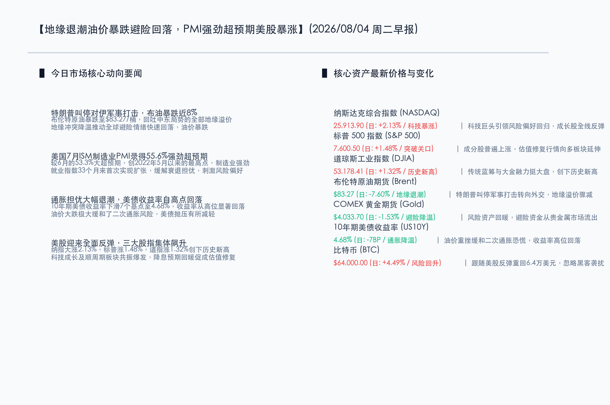

# 特朗普叫停对伊军事打击助推布油暴跌近8%，美国7月ISM制造业PMI强劲超预期激发风险偏好，美股迎全面暴涨三大股指飙升超1%

**日期：2026年08月04日 (星期二)** &nbsp; **时段：早报 (常规交易日模式)**

> **核心摘要**：昨日全球市场风险偏好显著回暖。受特朗普叫停对伊军事打击以求外交解决的消息影响，国际原油价格大幅暴跌，布伦特原油重挫 7.60% 至 83.27 美元/桶，地缘溢价大幅回落，直接缓解了通胀预期，促使 10 年期美债收益率下滑 7 个基点至 4.68%。同时，美国 7 月 ISM 制造业 PMI 录得 55.6%，大幅超出市场预期，显示实体经济强劲。多重利好共振下美股录得大捷，纳指大涨 2.13%，标普涨 1.48%，道指飙升 1.32% 创历史新高；金价因避险资金流出回落 1.53%；比特币在风险资产回暖带动下大涨 4.49% 突破 64,000 美元。

## 核心行情复盘

昨日国际市场在利多共振下呈现出强劲的普涨格局。地缘政治局势的降温和强劲的宏观经济指标共同推动了风险偏好的回归。

*   **纳斯达克综合指数 (NASDAQ)**：收报 **25,913.90点** (日: **+2.13%**) 🔴。科技巨头领涨，市场情绪因地缘局势降温和宏观经济韧性大幅好转。
*   **标普 500 指数 (S&P 500)**：收报 **7,600.50点** (日: **+1.48%**) 🔴。各板块普遍上涨，成长与周期股共振上行，站稳7600点关口。
*   **道琼斯工业指数 (DJIA)**：收报 **53,178.41点** (日: **+1.32%**) 🔴。大涨近700点，创下历史新高，工业与金融股为大盘提供强力支撑。
*   **布伦特原油期货 (Brent)**：收报 **$83.27/桶** (日: **-7.60%**) 🟢。特朗普宣布应中东盟国请求暂缓军事行动以推进外交谈判，油价地缘溢价迅速退潮。
*   **COMEX 黄金期货 (Gold)**：收报 **$4,033.70/盎司** (日: **-1.53%**) 🟢。避险情绪降温，资金从黄金等防御资产流出，转向风险资产。
*   **10年期美债收益率 (US10Y)**：收报 **4.68%** (日: **-7BP**) 🟢。油价大跌缓解了“二次通胀”担忧，债市收益率自高位明显回落。
*   **比特币 (BTC)**：收报 **$64,000.00** (日: **+4.49%**) 🔴。随着市场风险偏好全面提升，尽管传出加密平台遭遇黑客袭击，但依然跟随美股强势反弹。

-   **领涨行业**：半导体、科技硬件、互联网服务、非必需消费品以及交通运输等行业全线大涨。以苹果、英伟达为首的大型科技股带领纳指拉升，零售与消费巨头因经济前景向好也表现抢眼。
-   **领退行业**：受地缘紧张局势降温拖累，传统的防御性公用事业板块以及上游能源采掘、贵金属黄金开发板块表现偏弱。

## 核心解读与市场逻辑

> **地缘风险退潮与油价暴跌是核心催化剂**：总统特朗普表示应沙特、阿联酋和卡塔尔等盟国请求，决定搁置大规模对伊军事打击计划，转向外交解决并寻求在海湾地区达成长期协议。这一消息使此前紧绷的地缘局势瞬间缓和，油价大幅暴跌 7.60% 至 $83.27/桶，直接抽走了原油价格中的“地缘风险溢价”。油价重挫极大地缓解了市场对“二次通胀”的担忧，直接推动 10 年期美债收益率自高位滑落至 4.68%，为高估值的科技成长股扫清了利率层面的障碍。

> **ISM制造业PMI强劲超预期，击碎经济衰退谣言**：7月美国 ISM 制造业 PMI 录得 55.6%，较6月的53.3%大幅跃升，创下自 2022 年 5 月以来的最高值。其中，新订单指数与生产指数均呈现强劲扩张，而最引人注目的是制造业就业指数在经历了连续 32 个月的收缩后，首次录得正向增长。这一数据表明即使在当前的高利率环境下，实体经济仍具有极高韧性，彻底打消了市场对美联储延迟降息将导致硬着陆的顾虑，激发了强烈的风险偏好。

## 政策脉动

*   **美联储货币政策预期**：虽然 PMI 数据的走强在一定程度上降低了9月降息的迫切性，但油价大跌带来的通胀降温预期对冲了这一影响。互换市场对美联储下半年政策路径的定价有所松动，年内降息 50BP 的概率小幅回升，但多位联储官员仍公开强调将以最新核心通胀指标（PCE）作为最终决策依据。
*   **中东多边外交谈判框架**：随着美国搁置打击，白宫正在联合海湾国家起草针对霍尔木兹海峡航行安全及伊朗去核化的多边谈判框架，地缘博弈的中心由“军事交锋”转为“外交谈判”，有望为下半年的能源供给提供更具预测性的环境。

## 最新机构观点

*   **高盛集团 (Goldman Sachs)**：**“经济扩张韧性超出预期，维持对风险资产的超配建议”**。高盛最新的全球策略周报指出，7月 ISM 制造业数据的大幅超预期进一步佐证了美国经济“无着陆”的可能性。高产出的 AI Capex 投入和制造业就业指数的触底反弹表明，由人工智能硬件和先进制造驱动的资本开支周期正对宏观经济形成实质支撑。我们建议在利率走势明朗化后，进一步加大对软件、半导体及先进工业龙头的配置。
*   **摩根士丹利 (Morgan Stanley)**：**“油价暴跌缓解了短期通胀压力，但需谨防高PMI固化美联储高利率立场”**。大摩策略团队指出，地缘政治风险阶段性拆弹以及原油价格的大幅回落，对债市和股票估值是直接利好。然而，55.6%的强劲PMI意味着实体经济并无失速风险，这可能导致美联储在降息决策上更加谨慎。建议投资者仍应聚焦具有强劲现金流、高分红能力的优质企业，并通过哑铃型策略在科技成长与价值股之间进行均衡配置。

## 今日市场情绪：息鼓铸犁，翠芒破云

在今日的市场情绪图景中，一尊巨大而古老的金色天平巍然屹立于波涛渐息的海滩上。天平左侧，一顶沉重、暗淡且刻满战争伤痕的铁制军盔，正被一群闪烁着纯净白光的和平之鸽缓缓托起、移出盘面，象征着地缘军事对抗风险的降温与外交努力的开启。随着左侧重量的减轻，天平右侧盛放着的一颗璀璨夺目、内部充盈着翠绿色数字光栅与 K 线脉络的科技水晶球，以无可阻挡之势稳稳沉落，并向天际迸发出耀眼的翡翠色光束。这束光芒犹如利剑，将原本密布于天空的墨色暴风雨雷云无情撕裂，露出其后一轮熔金般冉冉升起的朝阳，为平静下来的黑色原油浪潮铺上了一条灿烂的黄金通道，昭示着全球资本正告别战争阴霾，在坚韧的实体经济和科技浪潮中迎风破浪，重迎曙光。

> Prompt: Surrealism style, Subject: A giant golden scale stands on a rocky shore. The left pan holds a heavy, dark iron military helmet, which is being lifted upwards by a flock of glowing white doves. The right pan holds a brilliant, glowing crystal sphere filled with green digital data streams, plunging down as the weight shifts. The shifting scale casts a bright emerald light that cuts through parting storm clouds, revealing a warm rising sun. In the background, a dark, churning sea of black crude oil is calming, its waves smoothing out. No humans, no text., masterpiece, high detail, intricate composition, cinematic lighting, 8k resolution

---

*免责声明：内容仅供参考，不构成投资建议。*
