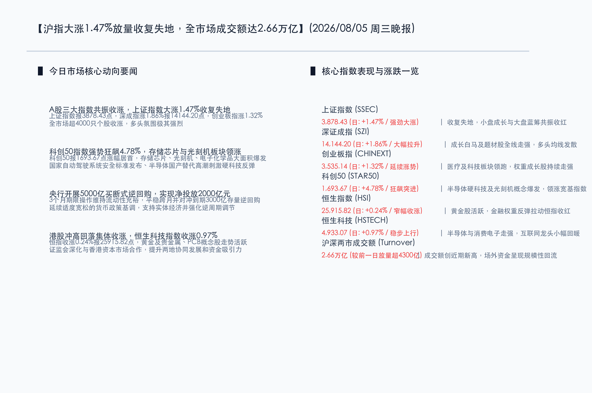

# 沪指大涨1.47%收复失地，两市成交额爆量至2.66万亿，科创50狂飙4.78%，存储芯片与光刻机板块领涨

**日期：2026年08月05日 (星期三)** &nbsp; **时段：晚报 (常规交易日模式)**

> **核心摘要**：今日沪深两市全天单边走强，市场信心显著复苏，上证指数大涨1.47%，科创50指数强劲狂飙4.78%。央行开展5000亿元买断式逆回购操作，实现净投放2000亿元护航流动性，叠加证监会年中会议明确将“稳市场”列为下半年工作之首并深化跨境协作，极大稳定了多头预期。盘面上，存储芯片、光刻机及电子化学品等半导体硬科技板块掀起涨停潮，两市成交额爆量拉升至2.66万亿元，场外资金呈现规模性回流。整体市场在政策底与资金面双重利好提振下，展现出强烈的向上反弹攻势。

## 核心行情复盘

今日国内市场在利好共振下呈现出单边上扬的普涨格局。半导体国产替代与硬科技算力产业链全线狂飙，权重与成长题材共振走强，成交额创近期新高。

*   **上证指数 (SSEC)**：收报 **3,878.43点**，上涨 **56.15点**，涨幅 **1.47%** 🔴。指数早盘略微低开后单边走高，午后加速拉升，成功收复前一交易日大半失地。
*   **深证成指 (SZI)**：收报 **14,144.20点**，上涨 **258.49点**，涨幅 **1.86%** 🔴。白马白马股与小盘题材题材集体发力，短期均线系统发散向上。
*   **创业板指 (CHINEXT)**：收报 **3,535.14点**，上涨 **46.17点**，涨幅 **1.32%** 🔴。权重医药及新能源稳步收红，指数全天维持红盘震荡。
*   **科创50 (STAR50)**：收报 **1,693.67点**，上涨 **77.31点**，涨幅 **4.78%** 🔴。存储芯片、光刻机等半导体硬科技爆发，在宽基指数中涨幅居首，赚钱效应极佳。
*   **恒生指数 (HSI)**：收报 **25,915.82点**，上涨 **62.90点**，涨幅 **0.24%** 🔴。恒指受26000点整数关口阻力压制，午后冲高回落，但大盘在黄金和资源股拉升下成功收红。
*   **恒生科技 (HSTECH)**：收报 **4,933.07点**，上涨 **47.46点**，涨幅 **0.97%** 🔴。半导体与消费电子产业链走强，科网巨头走势震荡分化。
*   **两市成交额**：今日沪深两市合计成交额约为 **2.66万亿元**，较前一交易日继续显著放量超 **4300亿元**，场外增量资金进场信号明确。
*   **个股涨跌幅**：全市场呈现出明显的极强普涨格局，超 **4000只** 个股录得上涨，涨停个股数量激增。

> **行业板块表现**：
> *   **领涨行业**：**半导体硬科技板块**全线暴发，**存储芯片**、**光刻机**、**电子化学品**等细分领域涨幅居前，洛阳钼业等拉动**黄金及贵金属**板块走强，PCB概念表现抢眼。
> *   **领跌行业**：**银行**、**医药商业**等防守板块全天偏弱，资金呈现明显的从避险红利资产向高弹性科技成长板块切换的态势。

## 核心解读与市场逻辑

今日市场的单边拉升与放量上涨，体现了资金在“政策利好”、“流动性护航”与“标准落地”三重共振下的核心交易逻辑：

*   **逻辑一：央行净投放2000亿买断式逆回购，资金宽松夯实多头底气**
    > 中国人民银行今日开展5000亿元3个月期买断式逆回购操作，净投放2000亿元流动性。作为创新的流动性管理工具，买断式逆回购精准调控中期流动性，平稳跨月预期，并降低了金融机构负债成本。央行呵护资金面的坚决态度确立了宽松的基调，为今日两市放量普涨夯实了估值根基。
*   **逻辑二：监管明确把“稳市场”列为首位，深港跨境合作催化风险偏好**
    > 证监会年中会议明确将“稳市场”置于下半年工作七大重点之首，并与香港证监会联合推出深化跨境ETF、企业融资等10项深层举措。监管层呵护市场及扩大双向开放的表态，极大提升了中外资的风险偏好，尤其是中东等增量长线资金对中国核心优质资产的关注度提升，推动场外活跃资金大规模回流。
*   **逻辑三：自动驾驶系统安全国标出炉，智能半导体与国产替代逻辑共振**
    > 国家标准委正式发布首个针对自动驾驶的强制性国标《智能网联汽车自动驾驶系统安全要求》，规定将于2027年起正式实施。这标志着我国智能汽车产业步入规范化发展新阶段，直接催化了车载传感器、控制芯片及存储芯片的需求预期。在硬科技国产替代浪潮下，相关科技白马迎来业绩与估值的双重重估，促成科创50暴涨。

## 政策脉动

*   **买断式逆回购大额工具落地，央行资金面护航平稳跨月**：中国人民银行8月5日开展了5000亿元买断式逆回购操作（期限为92天），利率1.40%保持稳定。在对冲今日到期的3000亿存量逆回购后，本次操作净投放流动性2000亿元，旨在维护银行体系流动性合理充裕，强化逆周期调节。
*   **证监会年中重点部署“稳市场”，深化深港合作举措见效**：证监会年中工作部署中强调，要把“稳市场”防风险置于核心位置，综合施策维护资本市场平稳运行。同时，证监会与香港证监会联合发布了10项推进深港两地资本市场协同发展的举措，为市场引入中长线境外增量资金。
*   **国家自动驾驶系统安全强制性标准发布，智能网联车载芯片迎利好**：国家标准委正式发布强制性国家标准《智能网联汽车自动驾驶系统安全要求》，自2027年7月1日起正式实施。新国标规范了系统失效、碰撞避险等核心安全参数，将显著提高我国智能网联车产业的高质量合规发展，极大拉动车载半导体产业链需求。

## 最新机构观点

*   **高盛 (Goldman Sachs)**：**“AI价值链与硬科技制造具备卓越的配置价值”**。高盛指出，中国经济正加速经历从房地产驱动向科技制造业驱动的重大转型。在此转型期，AI硬件算力、半导体国产替代及半导体设备链条的资本开支景气度保持强劲。经过前期的风险出清，科技龙头估值性价比凸显，是资产配置的首选方向。
*   **中信证券 (CITIC)**：**“全市场增量放量，建议顺应风格切换拥抱硬科技”**。中信证券认为，今日两市成交额爆量突破2.6万亿，表明观望资金正批量进场抄底。央行流动性投放与稳市场政策形成合力，市场底部确立。建议投资者顺应“弃守为攻”的风格切换，重点布局具有订单和业绩兑现支撑的存储芯片、光刻机、自动驾驶芯片及CPO龙头。
*   **中金公司 (CICC)**：**“政策与资金共振，关注业绩兑现与高弹性科技龙头”**。中金公司指出，央行买断式逆回购的大额投放与监管稳增长取向为市场筑牢了流动性防线。全市场放量反弹显示做多意愿强烈，建议在科技主线中精选硬科技壁垒深厚、半年报业绩超预期的细分龙头，同时合理配置红利防守资产以平衡日内跷跷板效应。

## 今日市场情绪：金扉涌泉，硅海新芽

在超现实主义的奇幻视野中，今日的市场情绪被描绘为一幅“金扉涌泉，硅海新芽”的壮丽画面。画面中央，一扇巨大而神圣的中央银行黄金宝库大门在云雾中缓缓开启，从中喷涌出一股清澈、散发着荧光绿色的金融活水（象征央行大额逆回购操作带来流动性的极度合理充裕，滋养着干涸的市场）。在这条奔腾不息的绿色河流之上，无数个闪耀着精细电路图案的硅片和集成电路板如莲花般漂浮，它们在活水的滋润下，竟生出了一片片生机勃勃的翠绿新芽和金色的科技花朵（象征存储芯片、光刻机等半导体板块在产业政策提振下强势崛起，展现出顽强的生命力与国产替代希望）。在背景中，一轮温暖的旭日自地平线缓缓升起，将万道金光投射在一座由K线图组成的未来科技城市轮廓上，驱散了所有的阴霾，预示着市场在流动性与基本面的支持下正迎来蓬勃的新周期。

> Prompt: Surrealism style, Subject: A colossal, glowing golden gate of a central bank vault, opening to release a flowing river of glowing emerald-green liquid light. Floating upon this river are complex, shining silicon wafers and microchip structures that are budding with green leaves and golden flowers. Background: In the background, a warm rising sun casts a brilliant golden light on a futuristic tech city skyline with soaring green candlestick charts. No humans. No text., masterpiece, high detail, intricate composition, cinematic lighting, 8k resolution

---

免责声明：内容仅供参考，不构成投资建议。
