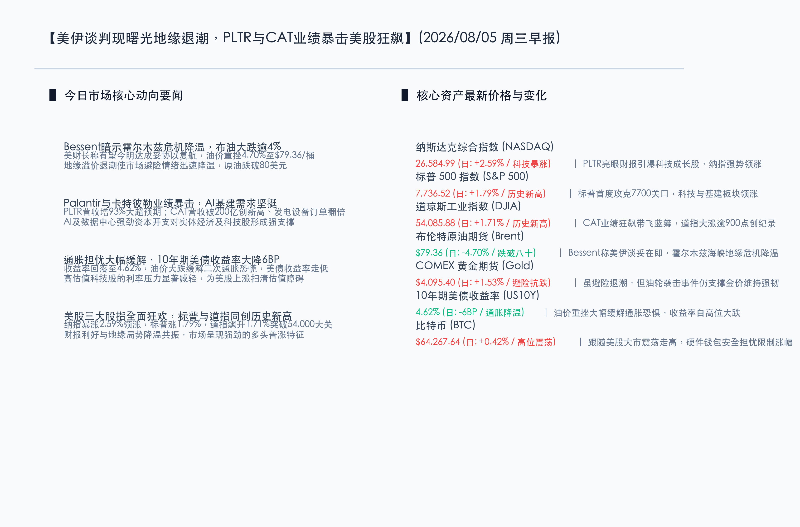

# 美伊谈判现曙光霍尔木兹复航在即，PLTR与CAT业绩暴击引爆AI基建热潮，美股三大股指全面狂飙标普道指同创历史新高

**日期：2026年08月05日 (星期三)** &nbsp; **时段：早报 (常规交易日模式)**

> **核心摘要**：昨日全球市场风险偏好迎来强劲爆发。美财长贝森特暗示美伊有望在今明两天就霍尔木兹海峡复航达成协议，地缘危机降温促使国际原油价格大跌，布伦特原油重挫 4.70% 至 79.36 美元/桶，10年期美债收益率应声大降 6BP 至 4.62%。与此同时，Q2 财报季爆出巨大利好，Palantir 营收同比激增 93% 推动股价暴涨近 30%，卡特彼勒营收首次冲破 200 亿美元大关并创历史新高，AI 数据中心电力发电设备在手订单翻倍，股价大涨 5.6%，证实了 AI 算力与电力物理基建的实质性强劲需求。地缘局势解冻与财报利好共振，美股三大股指全面狂飙，纳指暴涨 2.59%，标普和道指同创收盘历史新高；黄金受避险回补与多因素交织，上涨 1.53% 收报 $4,095.40/盎司；比特币微涨 0.42% 报 $64,267.64。

## 核心行情复盘

昨日国际市场在多重利好共振下呈现出强劲的普涨格局。地缘局势的降温和宏观财报的史诗级表现共同推动了风险资产的大捷。

*   **纳斯达克综合指数 (NASDAQ)**：收报 **26,584.99点** (日: **+2.59%**) 🔴。科技成长板块全线爆发，Palantir 史诗级财报点燃市场对 AI 应用端的想象空间，带领纳指强势领涨。
*   **标普 500 指数 (S&P 500)**：收报 **7,736.52点** (日: **+1.79%**) 🔴。历史首次突破 7700 点关口，各主要板块均呈现出良好的普涨健康特征。
*   **道琼斯工业指数 (DJIA)**：收报 **54,085.88点** (日: **+1.71%**) 🔴。暴涨逾 900 点，传统机械巨头卡特彼勒大涨 5.6% 带来强力托举，指数同创历史新高。
*   **布伦特原油期货 (Brent)**：收报 **$79.36/桶** (日: **-4.70%**) 🟢。美财长释放谈判积极信号，中东海峡局势有望达成暂时妥协，油价地缘溢价大幅退潮，跌破 80 美元。
*   **COMEX 黄金期货 (Gold)**：收报 **$4,095.40/盎司** (日: **+1.53%**) 🔴。虽然整体避险情绪有所缓和，但在中东地缘博弈尘埃落定前，多头依然依靠局部的霍尔木兹海峡货轮袭扰事件维持了强韧的买盘支持。
*   **10年期美债收益率 (US10Y)**：收报 **4.62%** (日: **-6BP**) 🟢。油价大跌极大程度缓解了“二次通胀”忧虑，美债多头回补，收益率自高点显著回落，为科技股估值释放压力。
*   **比特币 (BTC)**：收报 **$64,267.64** (日: **+0.42%**) 🔴。虽受美股狂飙的外溢红利带动，但对于部分硬件钱包出现严重安全漏洞的警惕情绪压制了涨幅。

-   **领涨行业**：半导体设备与先进制程、企业级 AI 应用软件、重型基建机械、重型发电设备、清洁能源基础设施。
-   **领退行业**：制药、基础电信公用事业、防守型日常消费品。

## 核心解读与市场逻辑

> **美伊谈判现曙光，霍尔木兹海峡地缘危机缓解，油价暴跌扫清通胀隐忧**：昨日美东时间，美国财政部长斯科特·贝森特（Scott Bessent）在接受 CNBC 采访时明确表示，美国与伊朗方面的沟通正处于关键期，甚至有可能在“今天或明天”就霍尔木兹海峡的复航及通海安全协议达成某种共识，确保自由通航。虽然伊朗官方随即公开发声否认与美国直接接触，但多国调停机构证实技术层面接触的确在进行。地缘紧张态势的瞬间降温引发原油多头离场，布伦特原油大跌 4.70% 至 $79.36/桶。油价的回落极大地瓦解了市场对于下半年“二次通胀再起”的忧虑，推动 10 年期美债收益率深跌 6 个基点至 4.62%，高估值科技板块的贴现率压力就此消除。

> **AI 基建由算力向电力物理端延伸，PLTR与CAT暴击式财报确立需求神话**：本季财报披露正式证明了 AI 并非空中楼阁。Palantir Q2 营收激增 93% 至 1.94 亿美元，其中美国商业软件营收大涨 149%，标志着 AI 正在以超预期的速度进入企业工作流并转化为实际收入。而传统重工业代表卡特彼勒（Caterpillar）更是交出了历史性答卷——季度营收首次突破 200 亿大关（录得 205 亿美元），调整后 EPS 达 $8.17 远超预期的 $6.17。卡特彼勒指出，用于人工智能大型数据中心的电力发电机组、涡轮机订单面临狂热增长，在手 backlog 堆积至 720 亿美元（同比几乎翻倍）。这两份财报从“算力应用层”和“物理电力基建层”双向论证了 AI 强资本开支周期的持续有效性。

## 政策脉动

*   **美联储货币路径定价重置**：尽管 ISM 制造业与就业强劲，但因为油价深跌压制了通胀预期的传导，美债收益率并未上升反而回落。芝商所 FedWatch 预测 9 月降息的概率定价小幅抬升，分析普遍认为，能源价格的大幅下行为联储提供了宽裕的软着陆缓冲空间。
*   **中东海运多边框架仍在博弈**：尽管贝森特释放乐观表态，但海峡地缘政治仍有暗流。昨日霍尔木兹海峡有货轮遭遇不明炮弹袭击，凸显出各方围绕“海峡管控权”的幕后交易尚有分歧，局部的避险需求仍在保护黄金的底部价格。

## 最新机构观点

*   **高盛集团 (Goldman Sachs)**：**“AI资本支出的物理映射已经确立，继续维持重型基建与科技板块的杠铃配置”**。高盛最新的快评指出，卡特彼勒极其亮眼的数据中心发电机组订单翻倍，直接回应了关于“AI用电短缺和基建跟不上”的质疑。AI 算力的高额消耗正在实质性转化为上游重工和传统制造的订单。我们建议继续超配芯片、AI软件以及重型基建机械龙头。
*   **摩根士丹利 (Morgan Stanley)**：**“油价下行消除贴现率利空，但强劲的财报数据仍令美联储有鹰派底气”**。大摩策略团队表示，美伊谈判促成的利率下行是短期的核心利好。然而，企业极高的盈利弹性和高企的 backlog 意味着即使维持高利率，美国实体经济依旧强劲，美联储可能并不急于开启陡峭的降息通道。建议投资者以现金流出色的 AI 先驱以及具有确定性基础设施订单的基建龙头作为双向组合配置。

## 今日市场情绪：洪荒解冻，神算擎天

在今日的市场情绪图景中，一尊巨大、浑身散发着翠绿色硅基电路与金色液压齿轮微光的半机械泰坦（Atlas）巍然伫立在平静的黑色石油海面上。泰坦以坚不可摧的机械双臂稳稳地擎起一颗璀璨夺目的巨大全息水晶球，球体内部奔流着高速闪烁的数字光栅与 K 线脉络，向高空喷涌出耀眼的翡翠光芒，驱散了天空密布的阴霾，象征着以 Palantir 与 Caterpillar 财报为代表的 AI 算力与基建巨力正在重构世界经济的底层支撑。在背景中，原本冰封的霍尔木兹海峡海面上，一扇古老、巨大的白色石门正伴随着海水的缓缓退潮而徐徐开启，一轮灿烂的暖金朝阳从石门背后冉冉升起，将波光粼粼的海面染成一片金黄，寓意着紧张的地缘海峡冲突危机在外交曙光中逐步消退，全球贸易与资本巨轮正在坚挺实体经济的保驾护航下重拾希望，驶向新天。

> Prompt: Surrealism style, Subject: A colossal, glowing robotic atlas made of green silicon circuits and golden hydraulic gears, standing on a calm, dark sea of black crude oil. The robot holds a massive glowing crystal sphere representing AI computation, which casts a bright emerald light onto the sky. Background: In the background, a giant stone gate at a strait is opening, letting a warm golden sunrise illuminate the calm waters. No humans. No text., masterpiece, high detail, intricate composition, cinematic lighting, 8k resolution

---

*免责声明：内容仅供参考，不构成投资建议。*
