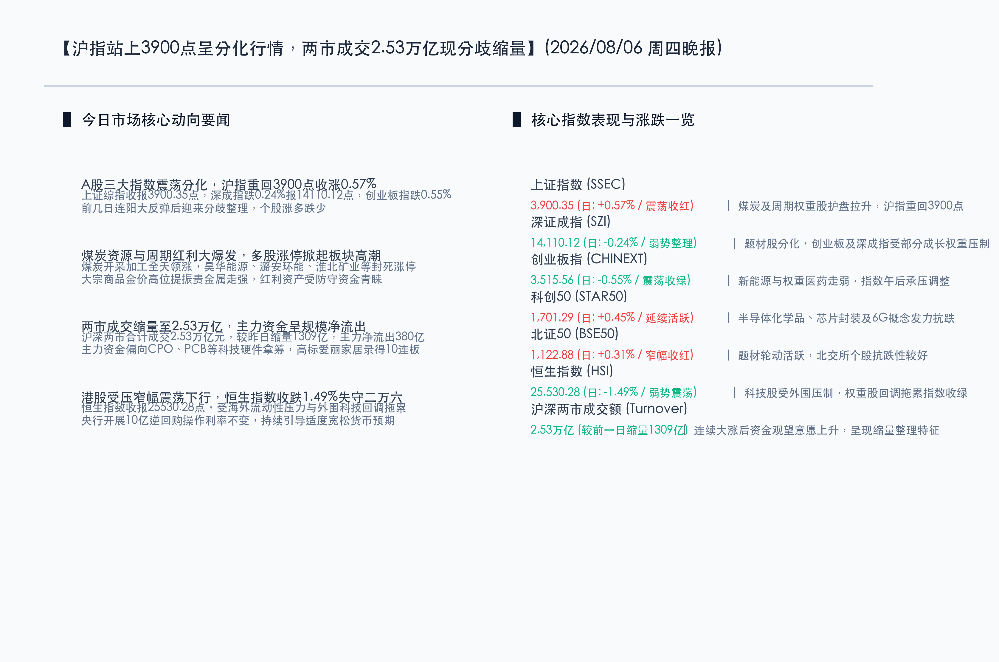

# 沪指收复3900点呈分化行情，煤炭开采与周期红利强势爆发，两市成交缩量至2.53万亿现分歧

**日期：2026年08月06日 (星期四)** &nbsp; **时段：晚报 (常规交易日模式)**

> **核心摘要**：今日沪深两市在连续反弹后步入结构性分化，上证指数在煤炭、贵金属等周期红利资产的带动下小幅走强，成功站上 **3900.35点**，而深成指与创业板指则双双震荡收跌。两市成交额收缩至 **2.53万亿元**，资金在大涨后呈现一定的观望防御态势，主力资金净流出约380亿元。外围及港股科技板块回调令恒指大跌 **1.49%**，国内市场在适度宽松货币预期下，煤炭开采等传统价值资产表现亮眼，高标个股投机热度不减，爱丽家居录得10连板。

## 核心行情复盘

今日国内市场呈现出明显的冷热不均与结构性分化特征。以煤炭为代表的红利大周期资产全天单边拉升，而白马股与科技成长板块则在近期反弹后迎来了分歧调整。

*   **上证指数 (SSEC)**：收报 **3,900.35点**，上涨 **21.92点**，涨幅 **0.57%** 🔴。指数全天在周期权重的护盘下稳步上行，成功收复3900点整数关口。
*   **深证成指 (SZI)**：收报 **14,110.12点**，下跌 **34.08点**，跌幅 **0.24%** 🟢。题材股活跃度有所下降，深成指主要受到科技及新能源成长板块调整的拖累。
*   **创业板指 (CHINEXT)**：收报 **3,515.56点**，下跌 **19.58点**，跌幅 **0.55%** 🟢。权重成长股分化，创业板指全天在红绿线边缘徘徊，尾盘受部分医药和新能源权重股走弱拖累收跌。
*   **科创50 (STAR50)**：收报 **1,701.29点**，上涨 **7.62点**，涨幅 **0.45%** 🔴。半导体化学品、芯片封装及6G概念概念发力抗跌，科创板在窄幅整理中逆市收红。
*   **恒生指数 (HSI)**：收报 **25,530.28点**，下跌 **385.54点**，跌幅 **1.49%** 🟢。受海外流动性压力与外围高位震荡的压制，恒指表现较弱，跌破二万六大关。
*   **北证50 (BSE50)**：收报 **1,122.88点**，上涨 **3.46点**，涨幅 **0.31%** 🔴。北交所个股保持轮动活跃，指数在均线系统上方窄幅整理。
*   **成交额表现**：今日沪深两市全天合计成交额约为 **2.53万亿元**，较昨日小幅缩量约 **1,309亿元**。两市在经历连续暴涨反弹后呈现分歧缩量，资金观望情绪有所上升。
*   **个股涨跌幅**：全市场约 **2,700只** 个股录得上涨，约 **2,590只** 个股录得下跌，个股涨跌基本参半。高标个股爱丽家居复牌录得 **10连板**，市场投机热度依然活跃。

> **行业板块表现**：
> *   **领领涨行业**：**煤炭开采加工板块**全天爆发掀起涨停潮，**昊华能源**、**潞安环能**、**淮北矿业**、**平煤股份**等多股封涨停；**电子化学品/工业气体**延续强势，中巨芯、天通股份等大涨；**贵金属**受金价提振走强；通信设备、数字货币概念活跃。
> *   **领领跌行业**：**教育**、**汽车整车**、**证券**、**保险**、**电网设备**及部分**消费服务**板块跌幅居前，防守属性较强的周期红利与科技硬件板块形成跷跷板效应。

## 核心解读与市场逻辑

今日市场的震荡分化与缩量整理，折射出资金在大涨之后进行“高低切换”与“防御防守”的核心逻辑：

*   **逻辑一：煤炭及大周期红利板块爆发，避险防守成为资金共识**
    > 今日煤炭开采加工板块掀起大面积涨停潮，昊华能源、潞安环能等龙头封死板。这不仅是受大宗商品价格高位企稳的提振，更反映出在市场经过前几日爆发性大涨、短期科技硬件出现分歧的背景下，主力资金主动选择估值偏低、业绩确定性强的“高股息红利资产”作为防风港，实现高低切换。
*   **逻辑二：连续反弹后步入成交额分歧日，缩量整理洗筹待选方向**
    > 沪深两市今日合计成交2.53万亿元，较前一交易日缩量超1300亿，主力资金净流出约380亿元。在科技与医药等核心主线快速拉升后，场内资金在3900点上方追高意愿有所收敛，短期市场转入震荡洗筹与结构性整固期，成交量虽然较昨日减少，但依然维持在2.5万亿上方的高位。
*   **逻辑三：央行微量逆回购凸显资金面平稳，政策强调提升金融机构抗风险能力**
    > 央行开展10亿元7天期逆回购操作，利率维持1.40%不变，对冲到期量后符合每日平稳投放特征。随着四部门联合发布《关于健全金融机构治理的实施意见》，监管层对金融体系长效化险与质量提升的态度进一步明确，这也促使部分稳健的长线资金向银行、保险等大金融板块进行重构性布局。

## 政策脉动

*   **央行微量操作利率持平，政策基调适度宽松不变**：中国人民银行8月6日开展10亿元7天期逆回购操作，中标利率1.40%持平。监管层日前强调“实施好适度宽松的货币政策”，通过创新工具与常规流动性管理，确保全市场资金流动性保持在合理充裕区间。
*   **四部门印发金融机构治理实施意见，强化底线防化险要求**：央行、金融监管总局等四部门联合发布《关于健全金融机构治理的实施意见》，旨在全面提升金融体系的治理效能与防范化解系统性金融风险的能力，护航资本市场长期高质量稳健发展。

## 最新机构观点

*   **中信建投 (CSC)**：**“AI算力产业链景气度不减，市场指数上行节奏或有反复”**。中信建投指出，AI算力硬件尤其是光通信与PCB等板块具备中长周期景气支撑，下游强劲的需求持续倒逼上游产能爆发。虽然大市在前期大涨后可能会出现结构性分歧与节奏反复，但算力硬科技依然是成长股的配置核心，建议在震荡回调中吸纳优质筹码。
*   **中金公司 (CICC)**：**“关注商业核聚变及科技硬核的左侧机会，把握业绩确定性”**。中金公司认为，随着全球在核聚变等前沿物理与清洁能源领域的投资增长，该产业链商业化前景值得期待。对于A股及港股，中金表示外围波动短期内会通过流动性对港股造成一定压制，但国内适度宽松的流动性环境下，应重点关注中报业绩确定性高、估值合理的科技与制造龙头。
*   **中欧基金 (Lombard Odier)**：**“高低切换持续，红利防守与资源品板块具较强配置性价比”**。中欧基金策略团队认为，在指数连续大涨、遭遇短期分歧整理的阶段，高股息的煤炭、银行、公用事业等红利资产，以及受全球大宗商品涨价催化的资源品板块（如贵金属），具备优秀的夏普比率和防御配置性价比，可作为底仓防守工具。

## 今日市场情绪：负隅盘旋，流光待发

今日市场在分化整理的格局中展现出多空博弈的情绪面。虽然科技硬件在连续上涨后步伐稍歇，但以煤炭、周期红利为代表的坚实防线巍然伫立，为全市场重回3900点提供了强大的底托力量。

> Prompt: Surrealism style, Subject: A colossal, ornate stone scale balancing a towering mound of glowing black coal blocks that are blossoming with fiery golden lilies on one side, and a floating, cracked emerald silicon circuit board with fading green light on the other. Background: In the background, a majestic golden gate of a financial treasury is illuminated by a warm rising sun, with swirling red and green clouds of market indices in the sky. No humans. No text., masterpiece, high detail, intricate composition, cinematic lighting, 8k resolution

---

*免责声明：内容仅供参考，不构成投资建议。*
