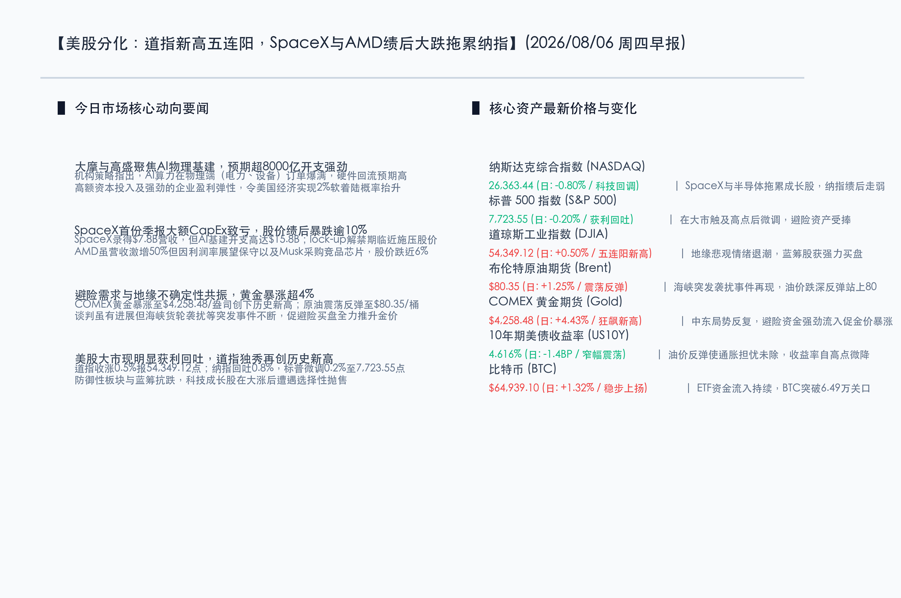
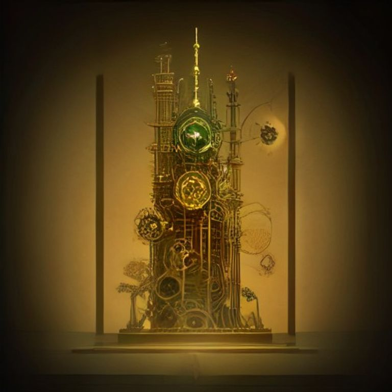

# 美股分化：道指新高五连阳，SpaceX与AMD绩后大跌拖累纳指，避险风骤起黄金暴涨破4.4%创历史新高

**日期：2026年08月06日 (星期四)** &nbsp; **时段：早报 (常规交易日模式)**

> **核心摘要**：昨日全球市场呈现明显分化。虽然中东地缘谈判有所进展，但霍尔木兹海峡袭击事件仍频发，引发强烈的避险买盘，黄金期货狂飙 4.43% 至 \$4,258.48/盎司，创下历史新高；美债收益率窄幅震荡收于 4.616%。美股市场方面，科技成长股在大涨后遭遇获利回吐，SpaceX 首份季报因 AI 基建资本开支翻倍而录得净亏并面临解禁压力，股价暴跌逾 10%；AMD 虽然营收激增 50% 但因利润率展望保守且受 Musk 芯片采购言论影响而大跌近 6%。科技股回调拖累纳指下跌 0.80%，标普微跌 0.20%，而传统蓝筹与防守板块表现坚挺，推动道指上涨 0.50% 并实现收盘历史新高“五连阳”。

## 核心行情复盘

昨日国际市场在科技股获利了结与地缘避险买盘博弈下呈现出明显的分化态势。科技巨头财报利空拖累成长板块，而传统蓝筹与贵金属避险资产则大放异彩。

*   **纳斯达克综合指数 (NASDAQ)**：收报 **26,363.44点** (日: **-0.80%**) 🟢。SpaceX 季报大额资本开支致亏及半导体股走弱拖累科技股，成长板块遭遇选择性获利回吐。
*   **标普 500 指数 (S&P 500)**：收报 **7,723.55点** (日: **-0.20%**) 🟢。指数自历史高位小幅微调，科技板块的回调基本被蓝筹及防御板块的强势所抵消。
*   **道琼斯工业指数 (DJIA)**：收报 **54,349.12点** (日: **+0.50%**) 🔴。实现“五连阳”并创下历史收盘新高，地缘政治走向协议的乐观预期与蓝筹股的坚韧为其提供了有力支撑。
*   **布伦特原油期货 (Brent)**：收报 **\$80.35/桶** (日: **+1.25%**) 🔴。尽管多边通航谈判取得进展，但海峡突发袭扰摩擦仍现，油价呈现探底反弹走势。
*   **COMEX 黄金期货 (Gold)**：收报 **\$4,258.48/盎司** (日: **+4.43%**) 🔴。受局势反复引起的避险买盘推升，金价单日暴涨逾 180 美元，强劲攻克 4250 关口创历史新高。
*   **10年期美债收益率 (US10Y)**：收报 **4.616%** (日: **-1.4BP**) 🟢。由于油价反弹使得通胀隐忧难以迅速退散，美债收益率自高点窄幅震荡微降。
*   **比特币 (BTC)**：收报 **\$64,939.10** (日: **+1.32%**) 🔴。主要得益于美国现货 BTC ETF 资金的持续净流入以及宏观大市对数字黄金的避险配置需求。

-   **领涨行业**：黄金采掘与贵金属、公用事业与电力设备、医疗保健、防守型日常消费品。
-   **领退行业**：半导体设计与制造、商业航天与高成长科技软件、清洁能源基建。

## 核心解读与市场逻辑

> **SpaceX与AMD绩后暴跌重创科技板块，AI基建高昂支出与估值剪刀差引关注**：SpaceX（NASDAQ: SPCX）公布了其上市后的第一份季度财务报告。虽然第二季度实现营收 \$7.8B 接近同比翻倍，但为了推进其 AI 模型和 Starlink 的全球算力网络，其 AI 资本开支大幅攀升至惊人的 \$15.8B，导致当季录得严重净亏损。此外，由于 lock-up 禁售期即将于 8 月 6 日到期，911.5M 股潜在可售股票压顶，促使 SpaceX 股价绩后重挫逾 10%。同时，半导体巨头 AMD 虽然公布了 \$11.5B 营收（同比激增 50%）略超预期，但因分析师对其利润率提升前景表示担忧，加之埃隆·马斯克关于倾向于为 SpaceX 采购 Nvidia 芯片的表态，AMD 股价大跌近 6%。两家公司的表现反映出市场目前对“高投入、高估值但利润率尚未显现”的 AI 软硬件公司开始产生审美疲劳，导致纳指及标普科技板块出现阶段性获利回吐。

> **地缘政治暗流涌动与避险资金狂涌，黄金暴涨 4.4% 续写神话**：尽管美国财长贝森特前一日暗示美伊有望快速达成协议以实现霍尔木兹海峡复航，但实际上航道冲突并未绝迹。昨日海峡周边再次传出货轮遭遇袭扰的消息，凸显出该项多边协议在最终落地前仍有巨大变数。这刺激了避险多头的大举归来。COMEX 黄金期货在买盘疯狂推升下大涨 4.43% 冲至 \$4,258.48/盎司，创下历史新高。与此同时，原油价格也自低位反弹 1.25% 站回 80 美元/桶关口。黄金的爆发性上涨说明在当前高通胀、多极地缘摩擦并存的宏观大环境中，作为终极避险资产的黄金依然拥有最坚固的资金共识。

## 政策脉动

*   **大摩高盛对 AI 基建高资本开支维持长效乐观**：尽管科技股出现阶段性回吐，但主流机构认为 hyperscalers 的算力与物理电力基建开支并未见顶，预计今年全球 AI 核心开支将达到 \$800B。AI 投资由应用层向上游物理端传导的链条依然稳固，这为实体经济增长提供了 2% 左右的良性支撑，但也预示着美联储不会轻易实施快速、陡峭的降息。
*   **霍尔木兹海峡地缘协议仍在极限拉扯**：美伊谈判虽然处于关键窗口期，但局部摩擦频发。协议推进的曲折和不确定性是原油价格剧烈波动和金价长盛不衰的根本驱动力。市场目前高度关注多边通航协议的白纸黑字细节。

## 最新机构观点

*   **高盛集团 (Goldman Sachs)**：**“AI基础设施投资并未过载，云巨头高投入的 ROI 正在逐步兑现”**。高盛最新的报告指出，全球最大的科技公司和云服务提供商今年的资本开支将接近 \$800B。这表明关于 AI 投资泡沫和用电缺口的质疑是不合时宜的，硬件和电力的回流收益正在给上游企业带来巨额订单，继续建议维持大科技与重型基建的杠铃式组合。
*   **摩根士丹利 (Morgan Stanley)**：**“科技股回调属于高位获利了结，AI 骨干网络（Computing Backbone）提供商将笑到最后”**。大摩策略团队指出，无论未来 AI 是走向闭源垄断还是开源混战，提供物理算力底座和基建支撑（服务器、电力配网、核心半导体设备）的公司其成长确定性最高。在当前科技估值局部震荡阶段，建议将仓位向具有强现金流和清晰订单能见度的基础设施龙头靠拢。

## 今日市场情绪：金钟长鸣，铁骑徘徊

在今日的市场情绪图景中，一尊巨大、古老且饰有精美浮雕的黄金巨钟悬挂在黑色的夜空中央，钟摆徐徐摆动，钟面上折射出温润且耀眼的金色波光，钟鸣之声仿佛跨越千山万水，在大地上扩散出层层金色的避险光晕。在黄金巨钟的下方，是一片由无数泛着冰冷寒光的绿色硅基电路板与黑色齿轮交织而成的寂静荒原。一艘代表着 SpaceX 与高科技梦想的银色火箭飞船，正因遭遇暴风雨的侵袭而半倾斜地搁浅在由暗红与翠绿烛线交错而成的岩石堆中，火箭周身散发出闪烁不定的幽蓝电光，象征着科技板块在巨额开支与现实利润考量下的阶段性受阻与徘徊。而在地平线尽头，一轮灿烂的暖金朝阳正在地缘政治的消解迷雾中缓缓升起，将远处波光粼粼的黑色石油海面染成一片金黄，昭示着实体蓝筹与避险资产正在这片狂风骤雨后的荒原上，默默积蓄着下一次扬帆起航的确定性力量。

> Prompt: Surrealism style, Subject: A colossal golden clock tower with its intricate cogs and gears turning, holding a giant balance scale. On one side of the scale, a sleek space rocket model is tilting downward under a heavy stack of glowing green circuit boards. On the other side, a massive, brilliant block of solid gold is shining intensely and tilting upward, casting a warm protective glow. Background: In the background, a dark, stormy ocean of black liquid crude oil under purple lightning clouds is beginning to calm as a bright golden sunrise rises behind a range of traditional stone pillars. No humans. No text., masterpiece, high detail, intricate composition, cinematic lighting, 8k resolution

---

*免责声明：内容仅供参考，不构成投资建议。*
