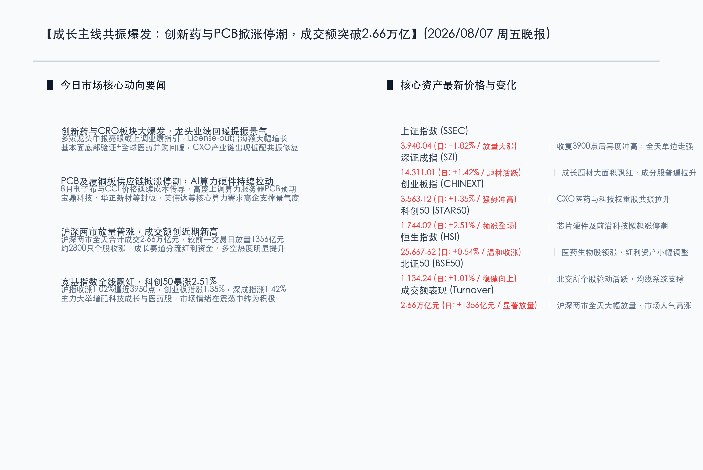

# 核心主线共振爆发：创新药与PCB掀涨停潮，成交额突破2.66万亿

**日期：2026年08月07日 (星期五)** &nbsp; **时段：晚报 (常规交易日模式)**

> **核心摘要**：今日A股与港股主要指数震荡单边走强，市场交投极其活跃，沪深两市全天合计成交额突破 **2.66万亿元**，较前一交易日放量 **1,356亿元**。盘面上，成长题材主线共振爆发，创新药与CRO板块因基本面筑底、业绩预期上调及出海提振大面积涨停；同时，受AI算力拉动与上游电子布涨价成本传导影响，PCB及覆铜板供应链掀起涨停潮。科创50指数大涨 **2.51%** 领涨全场，上证指数重回 **3,940.04点**，创业板指涨 **1.35%**。市场大单资金高低切换，大科技及大医药强力吸筹，红利资产与传统行业则呈现防御回调。

## 核心行情复盘

今日国内市场多空力量在放量普涨中达成共识，成长风格在资金大举重构下成为全天核心主导。创新药和AI算力硬件两条硬核心主线交织暴涨，赚钱效应极佳。

*   **上证指数 (SSEC)**：收报 **3,940.04点**，上涨 **39.69点**，涨幅 **1.02%** 🔴。指数早盘震荡走高后全天维持单边上行趋势，再度刷新近期新高，剑指4000点。
*   **深证成指 (SZI)**：收报 **14,311.01点**，上涨 **200.89点**，涨幅 **1.42%** 🔴。题材股及科技成长板块多点开花，全天大幅拉升。
*   **创业板指 (CHINEXT)**：收报 **3,563.12点**，上涨 **47.56点**，涨幅 **1.35%** 🔴。医药与科技权重共振拉抬，带领指数在日均线系统上方强势走高。
*   **科创50 (STAR50)**：收报 **1,744.02点**，上涨 **42.73点**，涨幅 **2.51%** 🔴。半导体化学品、芯片封装及6G等前沿硬科技全线发力，板块录得超额回报。
*   **恒生指数 (HSI)**：收报 **25,667.62点**，上涨 **137.34点**，涨幅 **0.54%** 🔴。港股在医药生物股强势领涨下探底回升，温和收红。
*   **北证50 (BSE50)**：收报 **1,134.24点**，上涨 **11.36点**，涨幅 **1.01%** 🔴。北交所优质成长标的保持强势轮动，指数稳定攀升。
*   **成交额表现**：今日沪深两市全天合计成交额达到 **2.66万亿元**，较昨日放量增长 **1,356亿元**，反映出活跃的资金换手和新增资金的流入。
*   **个股涨跌幅**：全市场共有约 **2,800只** 个股录得上涨，个股涨跌呈现一定的二八轮动与结构化分歧。资金主要沉淀在成长赛道，前期表现强劲的红利板块适度失血。

> **行业板块表现**：
> *   **领涨行业**：**医药生物/CXO/创新药**板块掀起涨停狂潮，药明康德、药明生物大涨，CXO细分个股普遍封板；**PCB与覆铜板**供应链强力拉升，宝鼎科技、华正新材等涨停；**有色金属（稀土与能源金属）**受益于供给侧消息大幅抗跌。
> *   **领跌行业**：**家用电器**、**房地产**、**银行**、**非银金融**等周期防御性资产小幅回调；**信息安全**概念股如绿盟科技、飞天诚信、天融信等集体调整。

## 核心解读与市场逻辑

今日市场的普涨大阳线与成交量新高，体现了机构大资金在成长主线上的高度共识：

*   **逻辑一：CXO与创新药迎业绩筑底与出海双催化，低配赛道迎暴力修复**
    > 医药板块今日录得全市场最强的赚钱效应。不仅是由于包括药明康德在内的多家龙头披露半年报业绩底已现、全球跨国药企并购回暖，更在于上半年我国创新药License-out出海交易额的大幅增长，验证了国内创新药的全球竞争力。资金在极度低配的状态下，触发了医药板块基本面验证与低估值修复的共振。
*   **逻辑二：AI算力景气度坚实，上游涨价传导助推覆铜板与PCB全线暴发**
    > AI算力依然是数字经济时代最稳健的核心成长主线。高盛等外资机构日前大幅调高AI服务器PCB及CCL（覆铜板）的市场需求规模；叠加8月份电子布等覆铜板原材料价格延续大幅度上涨，产业内部实现了非常顺畅的成本向上转导，直接刺激覆铜板和PCB龙头录得量价齐升的超额涨幅。
*   **逻辑三：成交量重回2.66万亿，大资金调仓换手助推成长赛道彻底激活**
    > 两市总成交额冲上2.66万亿元，显著放量1350余亿。这表明在大市重回3900点上方后，场内资金并未产生严重的恐高撤退，而是完成了从中报预期不佳的防守红利（如煤炭、大金融）向高成长景气度板块（医药、算力硬件）的顺利调仓，极大地提振了市场的做多热情。

## 政策脉动

*   **网信办发布个人信息保护新规征求意见稿，引导数字经济平台高质量发展**：国家互联网信息办公室8月7日发布《大型个人信息处理者个人信息保护规定（征求意见稿）》，进一步明确了大型处理者的合规监管界限。市场认为，这有助于在法制合规框架下规范平台数据治理，消除了政策层面的潜在摩擦，引导互联网与金融科技企业转向更规范的长期发展。
*   **发改委加速布局新质生产力与民间投资，奠定下半年算力硬件支持力度**：国家发改委近期频频部署下半年经济工作，在强调“实施好适度宽松的货币政策”与保障资金面流动性的同时，重点在统筹布局算力基础设施和加快人工智能赋能实体产业上大加鞭策，这直接奠定了下半年电子信息与算力基建板块的政策温床。

## 最新机构观点

*   **中信证券 (CITIC)**：**“License-out订单景气确立，医药估值迎来历史性低配修复”**。中信证券认为，目前国内创新药及医疗服务板块整体处于极端的低配置与低估值双重底部。随着半年报验证核心药企订单回暖、跨国并购景气度确认，License-out交易额的大幅上行有望带来长周期景气。建议投资者把握这一难得的共振反弹机会。
*   **中金公司 (CICC)**：**“算力硬件需求长周期高景气，PCB及覆铜板龙头业绩弹性凸显”**。中金公司指出，AI算力是确定性最强的科技主线。受益于高层算力网部署与海外大客户硬件升级，覆铜板及PCB龙头的订单可视度极高。上游电子布等材料价格上行能够被下游顺畅消化，展现出极强的业绩弹性，大市盘整期是吸纳AI硬科技板块的良机。

## 今日市场情绪：生命涌流，翠网交织

今日市场展现出极为生机勃勃的情绪状态。代表医药健康的生命科学力量与代表AI算力的精微硬件在市场深处共振共生，筑起坚实的翠绿能量网，拉动全市场指数和成交量冲破前期关口，释放出强烈的做多生机。

> Prompt: Surrealism style, Subject: A massive, glowing glass crucible in the center of a futuristic laboratory, filled with emerald-green liquid and floating double-helix DNA structures. Ornate gold vines made of flexible silicon circuit boards and tiny glowing microchips wrap around the crucible. Background: In the background, a giant digital ticker display shows a sharp upward-climbing green graph, illuminated by a warm golden sunrise breaking through morning mist. No humans. No text., masterpiece, high detail, intricate composition, cinematic lighting, 8k resolution

---

*免责声明：内容仅供参考，不构成投资建议。*
