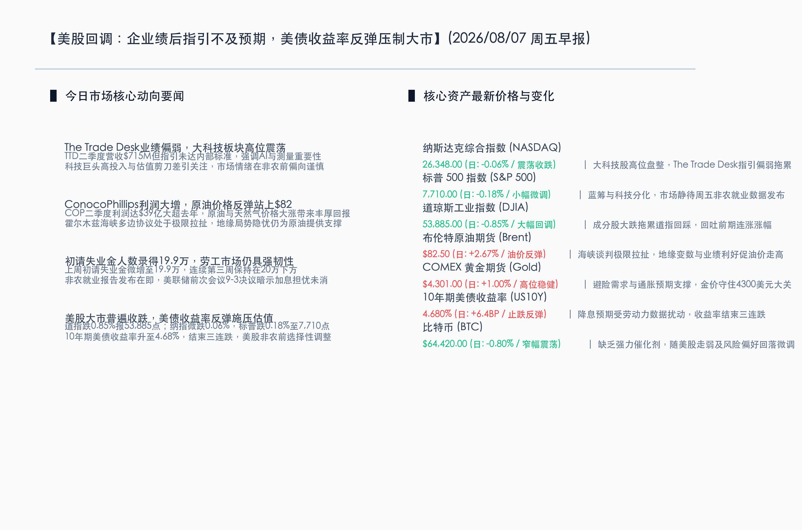

# 美股回调：企业绩后指引不及预期，美债收益率反弹压制大市

**日期：2026年08月07日 (星期五)** &nbsp; **时段：早报 (常规交易日模式)**

> **核心摘要**：昨日全球市场小幅分化，受企业绩后指引不及预期与降息预期受扰影响，美股主要指数普遍收跌。The Trade Desk 因 Q2 业绩未达内部标准引发大科技板块高位震荡，道指大跌 0.85% 回踩 53,885 点，标普和纳指分别微跌 0.18% 和 0.06%。与此相对，能源板块在 ConocoPhillips 利润倍增提振下表现强劲，地缘极限博弈支撑原油价格反弹 2.67% 站上 $82.50/桶。美联储 7 月会议 9-3 表决结果及 19.9 万的强韧初请失业金数据，推动 10 年期美债收益率止跌反弹至 4.680%。在周五重磅非农就业数据发布前夕，市场情绪整体偏向谨慎，避险买盘推动黄金高位企稳于 $4,301.00/盎司。

## 核心行情复盘

昨日国际市场在非农报告公布前夕呈现防御性调整态势。企业财报指引分化以及美债收益率的止跌反弹，使得大盘估值承压，传统蓝筹与大科技板块表现不一。

*   **纳斯达克综合指数 (NASDAQ)**：收报 **26,348.00点** (日: **-0.06%**) 🟢。大科技股高位盘整，The Trade Desk 指引偏弱令成长板块承压，但整体跌幅受限。
*   **标普 500 指数 (S&P 500)**：收报 **7,710.00点** (日: **-0.18%**) 🟢。指数自高点微幅回调，成分股表现分化，非农就业报告前市场态度谨慎。
*   **道琼斯工业指数 (DJIA)**：收报 **53,885.00点** (日: **-0.85%**) 🟢。成分股大跌拖累道指大幅回踩，回吐了前几日的部分累积涨幅。
*   **布伦特原油期货 (Brent)**：收报 **$82.50/桶** (日: **+2.67%**) 🔴。中东地缘极限拉扯持续，受 ConocoPhillips 财报利好与地缘摩擦提振，油价强势反弹。
*   **COMEX 黄金期货 (Gold)**：收报 **$4,301.00/盎司** (日: **+1.00%**) 🔴。由于降息预期博弈及地缘不确定性，避险资金支持金价站上 $4,300 关口。
*   **10年期美债收益率 (US10Y)**：收报 **4.680%** (日: **+6.4BP**) 🔴。劳动市场数据表现强韧使得降息预期推迟，收益率结束了连续三日的下跌。
*   **比特币 (BTC)**：收报 **$64,420.00** (日: **-0.80%**) 🟢。随整体风险偏好微调，由于缺乏重磅宏观催化剂，价格在 6.4 万美元上方窄幅震荡。

-   **领涨行业**：原油开采与天然气、传统重工业、黄金采掘、航运物流。
-   **领退行业**：广告技术与数字营销、软件与SaaS服务、高估值成长型科技、金融地产蓝筹。

## 核心解读与市场逻辑

> **The Trade Desk业绩偏软与高开支，科技股面临估值与AI回报的二次拷问**：广告技术龙头 The Trade Desk（NASDAQ: TTD）第二季度录得营收 $715M，虽然在宏观变局中仍有增长，但其 CEO Jeff Green 直言这一业绩未能达到公司内部标准，并强调将继续在 AI 智能测量和平台架构上加大投入。这一消息进一步激发了市场对科技股估值虚高的担忧。在经历了前几个交易日的大涨后，投资者对高投入、缓回报的科技股产生选择性疲劳，加之市场静待周五的7月非农就业报告，大科技板块整体维持高位盘整态势，纳指和标普微幅收跌。

> **ConocoPhillips利润倍增与地缘极限拉扯，油价反弹站上82美元**：能源巨头 ConocoPhillips（NYSE: COP）公布的 Q2 财报极其亮眼，当季利润达到 $3.9B（折合每股 $3.23），相比去年同期的 $2.0B 几乎翻倍。其业绩的爆发主要归功于全球原油及天然气价格的大幅上升。与此同时，中东关于霍尔木兹海峡复航的多边协议谈判正处于极其曲折的极限博弈期，海峡内偶尔发生的袭扰摩擦继续为油价托底。受此提振，布伦特原油期货单日暴涨 2.67%，成功站稳每桶 $82.50。

## 政策脉动

*   **美联储7月决议票委分歧严重，加息幽灵并未散去**：美联储虽然在7月会议上将基准利率维持在 3.5%-3.75% 的水平，但最新公布的 9-3 票委表决细节显示出内部存在极大的偏鹰分歧。Beth Hammack、Neel Kashkari 和 Lorie Logan 三位票委投下了反对票，坚持主张应该加息以彻底击退顽固的通胀。市场对美联储未来政策路径的预期正在重构，9月份加息概率升至60%附近。降息预期的后延导致10年期美债收益率单日大涨 6.4BP 至 4.680%，这在一定程度上压制了美股估值。
*   **初请失业金数据透露就业市场强韧，非农报告成短期风向标**：美国劳工部周四公布的数据显示，上周初请失业金人数录得 19.9 万，已连续三周低于 20 万关口，反映出美国企业裁员速度依然较缓，劳动力市场依然极具韧性。然而，强韧的劳动力数据也从侧面印证了通胀黏性的由来。目前市场的全部焦点已转移至即将于周五上午 8:30（北京时间周五晚 20:30）发布的7月综合非农就业报告，这成为判断美联储9月是否被迫加息的决定性依据。

## 最新机构观点

*   **中金公司 (CICC)**：**“原油及大宗商品供需格局在震荡中重塑，油气企业现金流弹性依然充沛”**。中金研究指出，以 ConocoPhillips 为代表的能源龙头由于拥有极高的物理资产与定价权，在通胀及地缘冲突交织的市况下，能为投资者提供极为丰厚的现金红利。尽管短期宏观情绪随加息预期反复而摇摆，但在能源和黄金上的配置价值依然十分凸显。
*   **摩根大通 (J.P. Morgan)**：**“美债收益率重回 4.6% 上方，科技股多头需防范估值溢价收缩”**。小摩策略团队表示，美联储内部 9-3 的表决裂痕意味着政策紧缩压力远未结束。如果周五的非农就业数据再度超预期强劲，9月份加息将从可能变为现实。在这种情况下，以高估值、大资本开支为特征的 AI 概念股与广告软件行业将面临进一步的估值压缩，建议降低成长股仓位，向高防御性资产进行配置。

## 今日市场情绪：天平倾侧，曙光微露

在今日的市场情绪图景中，一尊巨大、呈沙褐色的古老石质天平静静伫立在龟裂的荒原之上。天平的左端是一只沉重的黑色油桶，正向外缓缓渗漏着粘稠的黑色原油，而原油在滴落地面时，竟奇迹般地化作一枚枚散发着温润金光的钱币；天平的右端则是一只散发着幽绿与湛蓝光芒的透明玻璃钥匙，钥匙内部包裹着一块精密的绿色微芯片和一只转动的蓝色齿轮，此刻这端正微微抬起，象征着在高利率反弹及不及预期的业绩压力下，科技与AI板块的成长动能正受到阶段性压制。背景中，巨大的数字行情显示屏在滚滚阴云与赤红色雷电中若隐若现，透露出非农数据公布前夜市场的极度焦虑与谨慎。然而，在翻滚的雷云下方，一轮金黄色的朝阳已于地平线上探出边缘，将天际染成一片温暖的橘红，投射出破开阴霾的曙光，昭示着在这场关于通胀、利率与产业变革的博弈中，新的市场平衡点正在被孕育与铸就。

> Prompt: Surrealism style, Subject: A giant, sand-colored stone scales of justice standing on a cracked desert floor. On one side of the scale, a heavy, dark oil barrel is leaking black crude oil that turns into glowing gold coins as it drips. On the other side, a glowing, transparent glass key containing a miniature green microchip and a glowing blue gear is slightly lifted. Background: In the background, a massive digital ticker display is partially obscured by dark, stormy clouds with red lightning. Under the clouds, a brilliant sunrise is starting to peek over the horizon, casting a warm golden light. No humans. No text., masterpiece, high detail, intricate composition, cinematic lighting, 8k resolution

---

*免责声明：内容仅供参考，不构成投资建议。*
