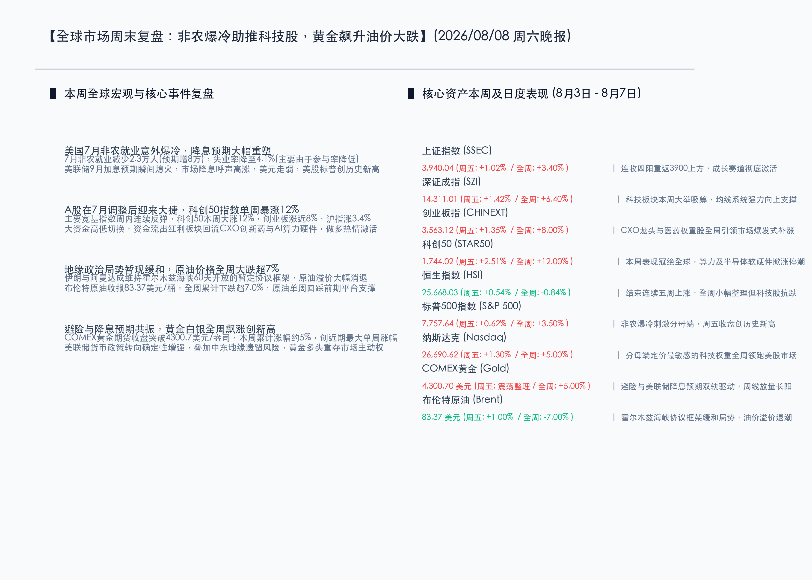

# 非农爆冷重塑加息预期：黄金本周狂飙，A股大反弹科创50单周大涨12%

**日期：2026年08月08日 (星期六)** &nbsp; **时段：晚报 (周末复盘模式)**

> **核心摘要**：本周全球金融市场迎来重磅拐点，美国7月非农就业数据意外大爆冷（非农就业减少2.3万人），直接导致美联储9月加息预期瞬间降温。受此分母端利好提振，美股周五全线上涨，标普500指数再创历史收盘新高；避险与降息预期双轨驱动黄金白银周内疯狂走高，COMEX黄金冲破 **4300.70美元/盎司**，创下单周暴涨5%的佳绩。国内市场在经历7月调整后迎来大反弹，主力资金大举回流成长主线，科创50指数全周累计狂飙 **12.00%**，创业板指大涨近 **8.00%**。地缘局势方面，霍尔木兹海峡暂露缓和曙光，油价全周大跌超7.0%。

## 核心资产周度/日度表现回顾

本周全球核心资产在流动性预期改善下普遍录得大幅反弹。国内成长股表现冠绝全球，港股小幅整理，美股在非农数据后再度冲高。

*   **上证指数 (SSEC)**：收报 **3,940.04点**，周五单日上涨 **1.02%** 🔴，全周累计上涨 **3.40%** 🔴。指数连收四阳重返3900点上方，做多热度显著回暖。
*   **深证成指 (SZI)**：收报 **14,311.01点**，周五单日上涨 **1.42%** 🔴，全周累计上涨 **6.40%** 🔴。均线系统重新转入强力向上支撑通道。
*   **创业板指 (CHINEXT)**：收报 **3,563.12点**，周五单日上涨 **1.35%** 🔴，全周累计上涨 **8.00%** 🔴。医药与科技权重全周共振大涨，引领补涨行情。
*   **科创50 (STAR50)**：收报 **1,744.02点**，周五单日上涨 **2.51%** 🔴，全周累计狂飙 **12.00%** 🔴。硬科技板块本周爆发涨停潮，领跑全市场。
*   **恒生指数 (HSI)**：收报 **25,668.03点**，周五单日上涨 **0.54%** 🔴，全周累计微跌 **0.84%** 🟢。恒指本周面临短期整理，但科技板块依然抗跌。
*   **标普500指数 (S&P 500)**：收报 **7,757.64点**，周五单日上涨 **0.62%** 🔴，全周累计上涨 **3.50%** 🔴。非农就业爆冷缓解紧缩担忧，周五收盘创历史新高。
*   **纳斯达克指数 (Nasdaq)**：收报 **26,690.62点**，周五单日上涨 **1.30%** 🔴，全周累计大涨 **5.00%** 🔴。对流动性定价极其敏感的科技巨头全周表现亮眼。
*   **COMEX黄金 (Gold)**：收报 **4,300.70美元/盎司**，周五单日震荡整理，全周累计暴涨 **5.00%** 🔴。创下近期最大单周涨幅。
*   **布伦特原油 (Brent)**：收报 **83.37美元/桶**，周五单日小幅回升 **1.00%** 🔴，全周累计大跌 **7.00%** 🟢。地缘溢价消退令油价回踩前期平台。
*   **比特币 (BTC)**：收报 **64,914.70美元**，周五单日上涨 **0.95%** 🔴。在6.5万美元关口附近持续博弈。

## 过去 48 小时重磅事件深度复盘

*   **美国7月非农就业意外爆冷，美联储加息终局明朗化**
    > 北京时间8月7日晚间公布的美国7月非农就业人口录得减少2.3万人，远不及市场预期的增加8万人，同时此前两个月的数据亦被大幅下修10.3万人。虽失业率小幅降至4.1%（受劳动参与率降低主导），但极度疲软的就业大盘令美联储9月继续加息的概率大幅下降。全球分母端流动性压力显著缓解，美元指数走弱，直接刺激了以美股纳指、黄金为主的无风险与成长性资产大涨。
*   **霍尔木兹海峡局势阶段性降温，油价全周大跌超7%**
    > 消息指出，伊朗与阿曼就维持霍尔木兹海峡60天开放达成一项暂定协议框架。该项地缘政治危机的阶段性降温直接打压了原油的风险溢价，WTI与布伦特原油本周皆录得7%以上的深幅调整。原油价格的大幅回落，从分子端极大地消除了全球市场对于输入性通胀反弹的担忧。
*   **关税行政令落地与光模块禁令传闻博弈，外资重仓中国“硬科技”**
    > 特朗普于8月6日签署了根据《1962年贸易扩展法》第232条对进口多晶硅及衍生品加征15%从价关税的行政令，将于2026年12月生效。另外，虽然有美方考虑对中国新型号光模块实施限制的传闻，但华尔街外资主力反应冷淡，部分知名投资机构更于近期推出光通信主题ETF并重仓中国龙头企业，显示全球资本对中国光器件与硬科技产业垄断级竞争力的持续认可。

## 下周全球宏观大事预警

*   **美国7月CPI通胀数据即将出炉**
    > 在7月非农大爆冷之后，下周市场焦点将迅速转移至最新的CPI物价指数。如果CPI数据进一步确认通胀的下行态势，那么美联储9月份加息将彻底退出历史舞台，市场甚至会开启对下半年多次降息的博弈，届时全球成长资产将迎更大弹性。
*   **多位美联储官员将密集公开表态**
    > 下周将有数位美联储核心票委及地方行长发表公开讲话。市场将全方位剖析其对于“7月就业意外萎缩”的态度，评估美联储政策指引是否会向偏宽松或温和的态度做进一步修正。
*   **国内中小银行存款利率波动与宇树科技IPO询价落地**
    > 国内中小银行近期存款利率的小幅波动备受关注，需防范市场对下半年流动性风向产生过度担忧。此外，机器人行业独角兽宇树科技IPO初步询价及发行定价将尘埃落定，其估值表现将直接影响国内智能机器人和AI硬件资产的估值溢价锚。

## 顶级机构周末策略内参摘要

*   **中信证券 (CITIC)**：**“大资金高低切换已成趋势，看好CXO与创新药低配置历史级修复”**。中信证券分析，目前A股整体估值与情绪底已构筑完毕。从周末的资金流向来看，大单资金正果断从防御性强的红利资产、传统基建中流出，转而重配前期超跌且中报订单筑底改善的医药CXO、创新药板块。License-out出海的景气度已获验证，当前极低的机构配置度意味着这一轮估值修复行情有着较长的生命周期。
*   **中金公司 (CICC)**：**“全球分母端红利期来临，硬科技依然是成长主线”**。中金公司指出，非农就业暴冷带来的最大改变是全球流动性宽松预期的回暖，这将使黄金、美股科技巨头以及中国科创成长股共同迎来估值扩张。AI算力基础设施（如算力服务器PCB、光模块及存储芯片）在中报披露期基本面坚挺，下周大市若因宏观数据产生颠簸，将是增配国内科技硬件龍头的重要时点。
*   **高盛集团 (Goldman Sachs)**：**“油价阶段性溢价退潮，黄金长期牛市动能犹存”**。高盛在大宗商品策略中指出，由于霍尔木兹海峡地缘危机因开放框架协议获得降温，原油的溢价短期已充分释放，布油将在80-85美元/桶的合理区间震荡。与此同时，美联储被迫停止加息甚至降息的前景是确定性的，这将成为黄金再创历史新高的最强催化剂，建议长线资金继续超配贵金属。

## 今日市场情绪：希望破晓，金钥启扉

本周市场在剧烈波动后迎来曙光。非农爆冷如同一股清风，扫去了悬在市场上空的持续加息阴霾；国内科技成长主线的报复性反弹，更是为市场注入了强烈的做多生机。金钥开启，万象更新。

> Prompt: Surrealism style, Subject: A massive, glowing golden key woven from shiny silicon circuits floats in the center, unlocking a colossal ancient stone gateway built on a mountain peak. Through the gateway, a tranquil golden valley filled with warm sunlight is revealed. Background: In the background, a dark, receding storm with faint red lightning dissipates into the horizon. A single white dove carrying an olive branch made of fiber optics glides peacefully. No humans. No text., masterpiece, high detail, intricate composition, cinematic lighting, 8k resolution

---

*免责声明：内容仅供参考，不构成投资建议。*
