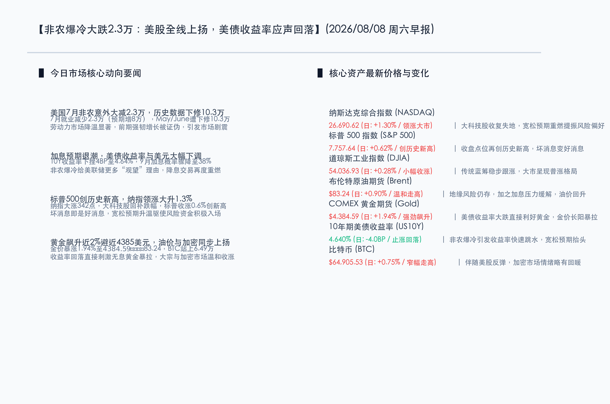

# 非农爆冷大跌2.3万：美股全线上扬，美债收益率应声回落

**日期：2026年08月08日 (星期六)** &nbsp; **时段：早报 (常规交易日模式)**

> **核心摘要**：美国7月非农就业数据意外爆冷流失2.3万个工作岗位（预期增加8.0万），创近年来罕见负增长，且历史数据遭大幅下修。这一数据显著缓解了美联储加息的担忧，促使市场对9月加息概率锐减至38%左右。在宽松预期重燃的推动下，美股三大股指全线飘红，标普500再创历史新高；美债收益率大幅回吐至4.640%，黄金长阳反弹近2%逼近4385美元/盎司，原油与比特币同步收涨，大市风险偏好整体重获提振。

## 核心行情复盘

昨日非农就业数据的“大爆冷”重塑了短期的宏观交易逻辑，市场资金普遍践行“坏消息即是好消息”的逻辑，对宽松的定价再次升温，大类资产全线走强。

*   **纳斯达克综合指数 (NASDAQ)**：收报 **26,690.62点** (日: **+1.30%**) 🔴。大科技股收复失地，宽松预期重燃提振风险偏好。
*   **标普 500 指数 (S&P 500)**：收报 **7,757.64点** (日: **+0.62%**) 🔴。收盘点位再创历史新高，坏消息变好消息。
*   **道琼斯工业指数 (DJIA)**：收报 **54,036.93点** (日: **+0.28%**) 🔴。传统蓝筹稳步跟涨，大市呈现普涨格局。
*   **布伦特原油期货 (Brent)**：收报 **$83.24/桶** (日: **+0.90%**) 🔴。地缘风险仍存，加之加息压力缓解，油价回升。
*   **COMEX 黄金期货 (Gold)**：收报 **$4,384.59/盎司** (日: **+1.94%**) 🔴。美债收益率大跌直接利好黄金，金价长阳暴拉。
*   **10年期美债收益率 (US10Y)**：收报 **4.640%** (日: **-4.0BP**) 🟢。非农爆冷引发收益率快速跳水，宽松预期抬头。
*   **比特币 (BTC)**：收报 **$64,905.53** (日: **+0.75%**) 🔴。伴随美股反弹，加密市场情绪略有回暖。

-   **领涨行业**：有色金属与黄金采掘、互联网科技、半导体与软件服务、清洁能源板块。
-   **领退行业**：地方政府教育及公共事业服务、高防御性消费蓝筹、部分零售贸易板块。

## 核心解读与市场逻辑

> **非农大爆冷引发“坏消息是好消息”的经典交易逻辑重现**：美国劳工部周五公布的7月非农就业报告显示，全美在7月份意外流失了2.3万个就业岗位，远不及市场原先预估的增加8.0万，这也是劳动力市场近年来极罕见的负增长信号。此外，5月和6月份的就业数据也被合计下修了10.3万人。这一疲弱甚至有些暗淡的劳动力数据瞬间引爆了降息交易的热潮，投资者深信这份报告将促使美联储在9月份采取更为温和的政策，进一步削减了此前仍悬在头顶的加息威胁。这促使道指、标普、纳指全线拉升，标普500指数甚至创下了历史收盘新高。

> **美债收益率大幅回踩，黄金暴拉近2%成为最大赢家**：受非农数据爆冷刺激，美债收益率应声大跌。10年期国债收益率在数据发布后直线下跌4个基点，最终收报4.640%，回吐了前一交易日的大部分涨幅。这使得作为无息资产的黄金压制骤降。COMEX黄金期货在避险与降息双重流动性预期改善下暴涨1.94%，强劲逼近4385美元/盎司。同时，布伦特原油和比特币也随整体宏观流动性偏松的预期分别上涨0.90%和0.75%。

## 政策脉动

*   **9月加息概率骤减，美联储下月会议风向转为“按兵不动”**：在疲软的7月非农报告出炉后，利率衍生品市场定价发生了剧烈逆转。此前因7月会议中3位偏鹰票委坚持加息而一度升温的9月加息概率从接近60%骤降至约38%。市场共识迅速向“9月继续暂停加息”靠拢，预计美联储将在疲软的劳动市场信号面前保持观望，并等待更多数据指引。
*   **失业率微降至4.1%掩盖了劳动参与率下滑的隐忧**：尽管失业率数据从6月份的4.2%小幅回落至4.1%，但多位分析师和研究机构指出，这并不意味着就业状况有所改善，而是由于7月份劳动参与率滑坡至61.4%所致（即部分失业人员退出了求职市场，不再计入失业基数）。这种被动的失业率下降，叠加上周初请失业金连续处于偏低状态，证实美国就业市场正呈现结构性不均与转冷趋势。

## 最新机构观点

*   **摩根士丹利 (Morgan Stanley)**：摩根士丹利财富管理首席经济策略师 Ellen Zentner 指出，非农报告毫无疑问透露了劳动力市场的加速转冷，这给了美联储在9月份会议上维持利率不变的充分理由。但她同时警告称，下周即将公布的CPI和PPI通胀数据才是最终的裁判（ultimate arbiter）。如果通胀数据出现超预期反弹，美联储内部主张加息的声音可能依然不会完全消失。
*   **高盛集团 (Goldman Sachs)**：高盛资产管理业务的 Lindsay Rosner 表示，这份大跌眼镜的就业数据基本上为9月份美联储“按兵不动”（hold）铺平了道路。虽然劳动力数据为政策宽松提供了绝佳的契机，但在通胀率尚未完全回落到美联储2%的目标值之前，任何关于降息时点的判断都需要极为谨慎，即将到来的通胀指标才是核心观测点。

## 今日市场情绪：希望微光，迷雾暂散

在今日的市场情绪图景中，一把由绿色晶体电路和闪烁的金色钱币交织而成的巨大钥匙高悬于半空中，正严丝合缝地插入一扇由深色粗糙岩石筑成的巍峨拱门中。随着钥匙的转动，紧闭的石门裂开缝隙，释放出耀眼的翠绿色生机。背景中，原本翻滚着紫红色雷电的漫天阴霾与风暴正在被狂风吹散，一轮万道霞光的金色旭日从地平线上冉冉升起，将天空染成温暖的橙红与金黄色。在下方平静下来的深蓝色海洋上，巨幅的全息数字股票指数显示屏折射在水面上，倒影中的K线图正以绿色为主调稳步上扬。整幅画面散发着穿透迷雾的希望之光，昭示着劳动力数据虽冷，却化作了解锁宏观流动性枷锁的钥匙，为市场引来新一轮的破晓生机。

> Prompt: Surrealism style, Subject: A massive, glowing emerald key made of digital circuits unlocking a colossal stone gate on a calm blue ocean. Background: In the background, a stormy sky of dark purple clouds is parting, revealing a brilliant golden sunrise that casts rays of light. A giant digital stock ticker screen displays rising green and red candlestick patterns, reflecting on the water. No humans. No text., masterpiece, high detail, intricate composition, cinematic lighting, 8k resolution

---

*免责声明：内容仅供参考，不构成投资建议。*
