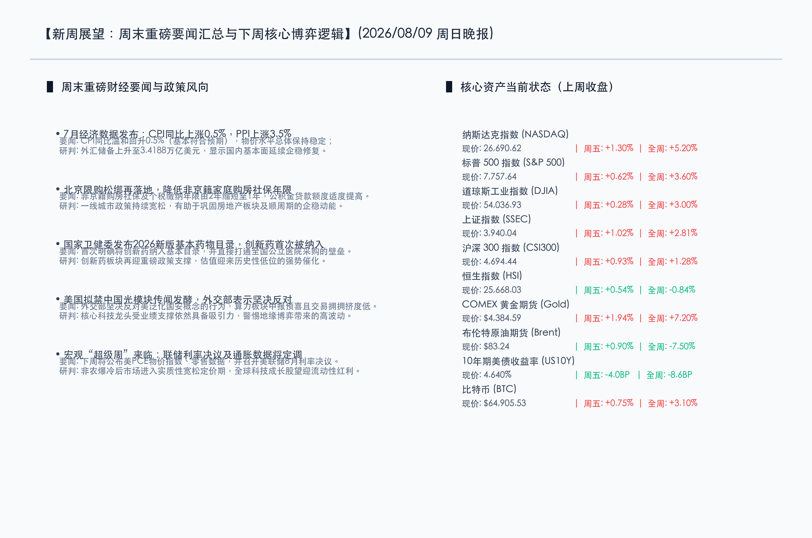

# 楼市新政共振基本药物大改版：新周A股开启估值修复，创新药与科技硬核迎重磅催化

**日期：2026年08月09日 (星期日)** &nbsp; **时段：晚报 (新周展望模式)**

> **核心摘要**：本周末全球及国内金融市场迎来多重政策与经济数据共振。国内方面，7月CPI同比上涨0.5%表现温和，北京等一线城市购房限购进一步降低门槛（社保个税由2年下调至1年）；更具标志性的是，2026版国家基本药物目录首次将创新药纳入公立采购通道，为创新药板块带来历史级估值重塑契机。面对美国拟禁止中国光模块的摩擦传闻，外交部发出严正反对态度。新的一周，随着美联储8月利率决议及PCE通胀数据即将揭晓，全球市场将在非农大冷后进入实质性降息定价期。券商普遍看好8月A股进入中报验证下的结构性修复行情。

## 周末财经要闻终极汇总

本周末，一系列事关宏观经济、房地产调控以及行业政策的重磅消息密集发布，为下周市场的开盘定下了基调：

*   **国家统计局公布7月通胀数据：CPI同比温和上涨0.5%**
    > 国家统计局最新数据显示，2026年7月份全国居民消费价格（CPI）同比上涨0.5%，总体呈现温和回升态势；工业生产者出厂价格（PPI）同比上涨3.5%，涨幅较上月略有回落。外汇储备方面，7月末我国外汇储备规模为34188亿美元，较6月末上升25亿美元，宏观基本面维持平稳运行，为资本市场提供了稳健的底部环境。
*   **北京限购门槛再降：非京籍家庭购房社保及个税年限由2年下调至1年**
    > 北京市住建委等部门出台房地产新政，明确非京籍家庭在京购房的社保或个税缴纳年限由原来的2年缩短至1年，同时适当调高住房公积金的最高贷款额度。这是一线城市限购政策的持续宽松，旨在支持刚性和改善性住房需求，有助于改善市场对顺周期及房地产链条的悲观预期。
*   **国家卫健委发布2026新版国家基本药物目录：创新药首次被纳入**
    > 国家卫健委联合多部门发布了2026年版国家基本药物目录，最大的看点在于首次明确将国产及出海创新药纳入目录，打通全国公立医院采购的“绿色通道”。此举不仅有利于创新药在医院终端的放量，也极大地改善了创新药企的研发变现周期，医药板块将迎来估值和业绩的双重红利。
*   **外交部表态：坚决反对美国泛化国家安全概念禁止中国光模块**
    > 针对此前美方考虑对中国新型号光模块实施限制的传闻及相关关税政策，外交部在周末例行记者会上重申，中方坚决反对美方泛化国家安全概念、无理打压中国企业的行径。中方将采取必要措施，坚定维护中国企业的合法权益。尽管面临外部博弈，但全球资本对中国光模块等硬科技硬件的垄断优势依然高度认可。
*   **中国央行连续增持黄金，宇树科技8月10日正式开启IPO申购**
    > 官方数据显示，中国央行黄金储备已实现连续第21个月增持，长期去美元化和避险资产配置的底层逻辑未改。此外，国内人形机器人独角兽宇树科技（Unitree）将于8月10日（周一）开启IPO网下与网上申购，其发行定价与上市表现将直接影响国内智能机器人和AI硬件资产的估值溢价锚。

## 新一周市场核心博弈逻辑

展望新的一周，大盘运行与资金流向将受以下三大核心博弈逻辑的主导：

1.  **从“题材叙事”转向“业绩驱动”的验证期**
    > 随着8月份中报披露进入密集期，前期纯题材炒作的标的将面临业绩证伪压力，而有实质性订单支撑的硬科技与低估值景气成长股将获得更多资金青睐。7月政治局会议释放了明确的流动性维稳和促进消费与科技创新的政策信号，市场已进入底部确立后的业绩验证阶段。
2.  **拥挤交易修正后，科技硬件迎来高性价比配置期**
    > 过去几周以半导体、光模块、PCB为代表的科技硬件板块经历了较为深幅的回调，板块内的交易拥挤度得到了充分出清，筹码结构大幅优化。在算力需求暴增以及中报普遍预喜的底色下，核心龙头的估值已回落至合理甚至偏低区间，具备较强的性价比和反弹弹性。
3.  **资金“跷跷板”效应显著，增量成交活跃**
    > 上周五两市成交量突破2.68万亿，资金呈现显著的“跷跷板”特征：大单资金果断从防守型的红利资产和公用事业板块流出，向科技硬件和创新药方向聚集。成交的放大意味着做多热度全面回归，行情有望由前期的缩量轮动转变为有主线的结构性反弹。

## 本周重磅经济数据与会议前瞻

下周全球市场将迎来密集的重要经济指标和央行决议，全球降息逻辑将进入实质性定价：

*   **美国8月利率决议与鲍威尔表态（核心焦点）**：美联储将公布最新的利率决议，由于7月非农惨淡负增长，市场将高度关注鲍威尔对于“9月开始降息”以及“年内降息次数”的政策暗示。
*   **重磅宏观数据落地**：美国PCE物价指数、零售销售数据以及PMI终值将陆续公布，这将直接决定降息轨道的斜率，若通胀数据确认下行，全球流动性将进一步释放。
*   **海外央行年会（杰克逊霍尔会议）临近**：全球央行行长将就下半年货币政策走向进行闭门商讨，多国央行可能集体释放偏鸽派的货币指引。
*   **中报爆雷防范与期指交割**：A股市场进入中报披露高峰期，须警惕个别业绩不及预期标的对板块产生的拖累，此外周五的期指交割可能加大盘中波动率。

## 头部券商/投行开盘策略点睛

*   **中信证券 (CITIC)**：**“拥挤出清筑就黄金底，看好创新药历史级估值修复”**。中信证券分析，前期A股由于拥挤交易引发的技术性回调已彻底告一段落。周末新版基本药物目录首次纳入创新药，对超跌的创新药、CXO板块将是历史级的政策红利催化。大资金正从传统红利高低切换，中报景气度优异的光模块、服务器及国产半导体设备龙头依然是科技成长的配置核心。
*   **招商证券 (CMS)**：**“8月修复行情开启，重视‘哑铃型’景气配置”**。招商证券认为，上周五突破2.68万亿的成交说明市场悲观情绪已释放完毕，A股已进入政治局会议政策落地及中报预告验证的上升轨道。建议投资者采用“哑铃型”策略：一手布局公用事业、高股息红利股作为底仓防守，一手积极增配算力硬件、国产半导体及有出海红利的创新药龙头。
*   **中金公司 (CICC)**：**“分母端流动性红利开启，短期颠簸不改科技硬件中长线价值”**。中金公司指出，非农就业负增长确立了全球流动性转向的大趋势。随着美债收益率快速下行，中国资产的性价比大幅凸显。虽然面临贸易摩擦传闻等短期扰动，但具备算力刚性需求和明确业绩支撑的硬件龙头（如PCB、光通信、高端存储）在回调后具有极高的安全边际，任何因宏观数据导致的颠簸都是增配核心科技资产的良机。

## 今日市场情绪：解密新局，迎风破晓

在今日的市场情绪图景中，一扇由青砖砌成的厚重 barrier 墙壁前，一扇由古老巨石雕琢而成的房屋形状 gateway 正在缓缓向两侧退开。一把散发着耀眼金光的巨型 Key 插在 gateway 的正中心，其锁扣和齿轮上密布着精密的数字硅片电路，正不断向四周流淌出绿色和金色的能量源泉。随着大门完全解锁，门后展现出一片充满生机的平静谷地，无数发光的绿色 neon 药用植株和微型 microchip 电子叶片在风中摇曳。背景中，曾经笼罩着市场的乌云、连同夹杂着红色加息闪电的暴风雨天气正朝地平线深处极速退散，取而代之的是远方城市群落上空缓缓升起的一轮金黄色旭日，把整片天空染成了温暖的橙黄色。一轮明亮的光导纤维和平鸽衔着一枚芯片形状的卷轴，平稳地滑翔穿过雨后初晴的天空，标志着在一系列政策和降息预期的解密下，饱受流动性之苦的金融市场正迎来万象更新的破晓生机。

> Prompt: Surrealism style, Subject: A massive ancient stone gateway shaped like a housing key unlocks a wall of red brick barriers, revealing a green neon valley of thriving medicinal plants and circuit trees. Background: A warm golden sunrise over a modern city skyline with rising green chart lines. A glowing fiber-optic dove carrying a scroll glides across the clear sky. No humans. No text., masterpiece, high detail, intricate composition, cinematic lighting, 8k resolution

---

*免责声明：内容仅供参考，不构成投资建议。*

---
*Powered by Finance-Auto-Gen Pipeline (v3)*
