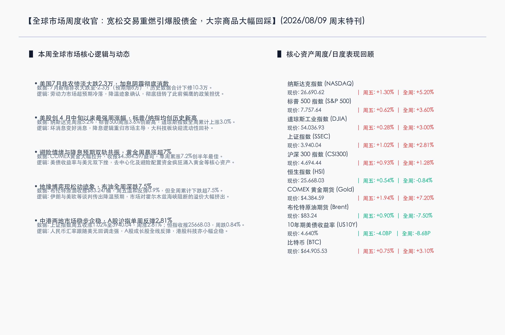

# 宽松预期重燃引爆股债金：美股创四月最大周涨幅，黄金飙涨大宗深调

**日期：2026年08月09日 (星期日)** &nbsp; **时段：周末特刊 (周末复盘模式)**

> **核心摘要**：本周全球金融市场迎来重大拐点。美国7月非农就业人数超预期大跌2.3万，创近年来罕见负增长，彻底打消了市场的加息阴霾并激活降息交易。在这股“降息风”吹拂下，美股录得4月中旬以来的最大单周涨幅，标普500再创历史新高；美债收益率应声下行，黄金全周大涨逾7%创半年最佳表现。与此相对，因霍尔木兹海峡地缘局势现缓和预期，布伦特原油重挫逾7.5%，加密与A股市场同步展现韧性。

## 核心资产周度/日度表现回顾

本周宏观数据的爆冷彻底激活了降息交易，海外股、债、金市全线走强，而大宗商品因地缘局势缓和而深幅回调。

*   **纳斯达克综合指数 (NASDAQ)**：收报 **26,690.62点** (周五单日: **+1.30%**, 全周累计: **+5.20%**) 🔴。大科技股从前期抛售中大幅反弹，政策宽松预期回升重振了市场对高成长股的风险偏好。
*   **标普 500 指数 (S&P 500)**：收报 **7,757.64点** (周五单日: **+0.62%**, 全周累计: **+3.60%**) 🔴。收盘再创历史新高，降息预期再度主导美股估值修复。
*   **道琼斯工业指数 (DJIA)**：收报 **54,036.93点** (周五单日: **+0.28%**, 全周累计: **+3.00%**) 🔴。传统价值蓝筹稳健跟涨，美股呈现大市普涨的健康格局。
*   **上证指数 (SSEC)**：收报 **3,940.04点** (周五单日: **+1.02%**, 全周累计: **+2.81%**) 🔴。伴随人民币汇率走强和成长风格大幅反弹，国内市场延续稳步回升之势。
*   **沪深 300 指数 (CSI300)**：收报 **4,694.44点** (周五单日: **+0.93%**, 全周累计: **+1.28%**) 🔴。大盘权重股企稳，主要受科技成长与消费龙头回暖提振。
*   **恒生指数 (HSI)**：收报 **25,668.03点** (周五单日: **+0.54%**, 全周累计: **-0.84%**) 🟢。周五在海外利好下企稳反弹，但全周在科技及中资金融走弱下录得小幅下跌。
*   **COMEX 黄金期货 (Gold)**：收报 **$4,384.59/盎司** (周五单日: **+1.94%**, 全周累计: **+7.20%**) 🔴。无息黄金在美债收益率骤降与避险资金加持下，录得半年多以来最佳周度表现。
*   **布伦特原油期货 (Brent)**：收报 **$83.24/桶** (周五单日: **+0.90%**, 全周累计: **-7.50%**) 🟢。尽管周五温和反弹，但地缘谈判进展顺利使前期的海峡阻断溢价遭大幅挤出。
*   **10年期美债收益率 (US10Y)**：收报 **4.640%** (周五单日: **-4.0BP**, 全周累计: **-8.6BP**) 🟢。非农爆冷直接扭转了此前的收益率升势，收益率自高位快速滑坡。
*   **比特币 (BTC)**：收报 **$64,905.53** (周五单日: **+0.75%**, 全周累计: **+3.10%**) 🔴。成功收复 6.5 万关口并在阻力下方整固，整体跟随风险资产回暖。

## 过去 48 小时重磅事件深度复盘

> **美国7月非农意外大减2.3万，历史数据遭遇重挫下修**：美国劳工部周五公布的7月非农就业报告爆出冷门，非农就业人数出乎意料地下滑了2.3万人，大幅低于市场原先预计的增加8.0万人，这也是劳动力市场近年来极罕见的负增长信号。此外，5月和6月份的就业数据亦被合计下修了10.3万人。虽然由于劳动参与率下滑至61.4%使失业率微调至4.1%，但就业市场转冷已确证无疑。这一弱势指标令市场对美联储下半年继续加息的担忧彻底消散，降息预期大涨，直接推动了周五及全周美股的爆发。

> **霍尔木兹海峡通道博弈现松动，布油溢价回落大挫7.5%**：本周末地缘局势传出积极信号，关于伊朗、阿曼和西方在霍尔木兹海峡通道安全及宏观框架上的多边谈判取得实质性突破。市场此前高度担忧的原油航道中断危险降温，促使原油价格中含有的地缘政治风险溢价被挤出。即便布油周五随大宗商品温和反弹0.9%，其全周累计跌幅仍达到7.5%，大大释放了二次通胀的潜在威胁，也为美联储随后的利率决策解绑。

> **富国银行拟推 corporate 代币化存款，实现 24/7 实时跨境结算**：据银行业周末消息，富国银行（Wells Fargo）正计划面向大中型企业及商业客户推出代币化存款服务。该计划旨在利用私有区块链技术，协助企业级客户在任何时段（包括周末和夜间）执行实时资金转移和多币种跨境结算。这预示着数字化代币资产在传统商业银行业务中的实际应用场景正迎来重要突破。

## 下周全球宏观大事预警

下周将是今年下半年宏观数据发布最密集的“超级周”之一，市场将直接面临多项重磅经济与央行利率事件的洗礼：

*   **周一（08月10日）**：美国将公布 PMI 数据（包含制造业与服务业终值），为研判下半年实体经济开局提供最新温度。
*   **周二（08月11日）**：美国零售销售（Retail Sales）数据出炉，被称为“恐怖数据”的零售表现将直接印证非农降温后消费信心的成色。
*   **周三（08月12日）**：**美联储公布最新利率决议及政策声明**。主席鲍威尔将召开新闻发布会。本次会议将成为美联储消化本次疲软非农数据后首次公开亮相，对下半年货币政策的定调至关重要。
*   **周四（08月13日）**：英国央行（BoE）与日本央行（BoJ）将公布最新利率决议。此外，美国第二季度 GDP 修正值将公布，市场重点观察美国经济的潜在动能。
*   **周五（08月14日）**：美国将公布最新 PCE 物价指数。作为美联储最看重的通胀指标，该数据将决定通胀回落的轨道是否如期通向 2% 政策目标。

## 顶级机构周末策略内参摘要

*   **摩根士丹利 (Morgan Stanley)**：Ellen Zentner 指出，非农就业负增长确认了劳动力市场降温提速，这为美联储在 9 月维持利率不变扫清了道路。但下周即将公布的通胀数据（CPI、PPI）才是真正的“终局裁判”。如果通胀依然坚挺，则加息讨论可能很难真正平息。
*   **高盛集团 (Goldman Sachs)**：Lindsay Rosner 强调，尽管惨淡的非农就业数据基本确立了 9 月政策按兵不动的方向，但美联储绝不会在通胀率彻底回踩至 2% 目标前急于降息。通胀的走势依然是未来开启政策周期的终极指引。
*   **摩根大通 (J.P. Morgan)**：重点提示企业客户需注意 AI 资本开支带动的债券供给和产业链硬件紧缺。小摩将 2026 全年 TMT 行业投资级债券发行预期上调至 5400 亿美元；并表示 DRAM 内存的缺口因 AI 数据中心需求暴增而持续扩大，估测 2024 年至 2026 年底其价格累涨或达 400%。
*   **花旗集团 (Citi)**：虽短期海峡局势缓和，但花旗因长期风险考量将 Q3 布油价格预测由 $75 上调至 $80/桶，Q4 仍维持在 $70/桶。花旗认为全球经济下半年的内生增长依然具有韧性，并非走向衰退，建议投资者关注 AI、云安全和实体基建。
*   **瑞士联合银行 (UBS)**：瑞银对全球股指保持乐观，但警告投资者应警惕科技板块占比过大带来的集中度风险，推荐在投资组合中轮动至美股金融、工业、医疗等防守兼备的行业。同时瑞银重申看多黄金，预计随着各大央行储备多元化，黄金在 2027 年上半年将触及 $5000/盎司。

## 今日市场情绪：破晓生机，锁链消融

在今日的市场情绪图景中，一把由发光的数字硅片电路编织而成的巨大金色钥匙，正插在位于险峻山巅的巍峨古石门上。随着石门缓缓向两侧退开，耀眼的金色与翠绿色光芒从缝隙中迸发，照亮了门后一片充满生机与翠绿的平静山谷。背景中，原本阴云密布、夹杂着赤红色加息闪电的暴风雨天空正在往地平线深处退散，一轮万道霞光的初升旭日将天空染成了温暖的橙黄色。在天际的一角，一只由光导纤维构成的白色和平鸽在平稳的气流中舒展羽翼，正衔着一枚芯片形状的橄榄枝滑翔过清晨的天空。画面没有人类的踪迹，却处处洋溢着从冰冷禁锢中破晓而出的流动性生机，标志着降息预期的解锁为饱受折磨的市场带来了和煦春风。

> Prompt: Surrealism style, Subject: A massive, glowing golden key woven from silicon circuits unlocking a colossal ancient stone gateway built on a mountain peak. Through the gateway, a tranquil green valley filled with warm sunlight is revealed. Background: In the background, a dark, receding storm with faint red lightning dissipates into the horizon. A single white dove carrying an olive branch made of fiber optics glides peacefully. No humans. No text., masterpiece, high detail, intricate composition, cinematic lighting, 8k resolution

---

*免责声明：内容仅供参考，不构成投资建议。*
