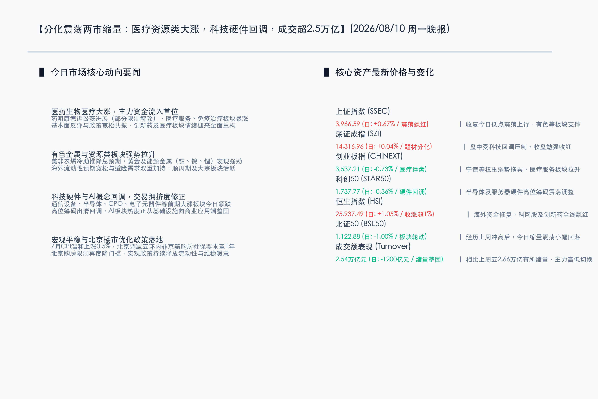

# 医疗资源股共振走强与科技硬件整固：A股分化上行两市成交2.54万亿，北京楼市限购优化与美加息预期回落筑牢底部

**日期：2026年08月10日 (星期一)** &nbsp; **时段：晚报 (常规交易日模式 A)**

> **核心摘要**：今日A股市场呈现分化震荡格局，上证指数在医药生物与资源类板块强势拉升下收涨0.67%报3966.59点，而科技硬件板块受高位获利回吐影响回调。宏观政策层面，7月CPI温和上涨0.5%显示通胀平稳，北京市进一步缩短非京籍五环内购房社保年限至1年释放维稳暖意。受美国非农爆冷影响，美联储9月加息概率降至44%左右，全球流动性环境进一步宽松。整体两市成交达2.54万亿元，市场在高低切换中完成震荡整固，估值底部逻辑愈发夯实。

## 核心行情复盘

*   **三大指数表现**：上证指数全天震荡上行，收盘上涨 **0.67%** 报 **3,966.59点**；深证成指微涨 **0.04%** 报 **14,316.96点**；创业板指震荡回落，收盘下跌 **0.73%** 报 **3,537.21点**；科创50指数收跌 **0.36%** 报 **1,737.77点**；北证50指数收跌 **1.00%** 报 **1,122.88点**。
*   **港股市场表现**：港股主要指数集体走强，恒生指数收涨 **1.05%** 报 **25,937.49点**，恒生科技指数收涨 **1.26%** 报 **4,919.46点**，科网股与医药出海概念大涨。
*   **成交额与资金面**：沪深京三市全天成交总额约 **2.54万亿元**，较上一交易日的2.66万亿元缩量约1200亿元，资金呈现明显的高低切换与防守整固态势。
*   **行业板块表现**：
    *   **领涨行业**：医药生物医疗板块（尤其是医疗服务、免疫治疗、基因概念等方向）全天表现抢眼，位居主力资金净流入首位；有色金属与资源类（贵金属、钴、镍、锂矿等能源金属）表现强劲，军贸、养殖、食品饮料板块亦走势活跃。
    *   **领跌行业**：科技硬件（通信设备、半导体、CPO、电子元器件、互联网等）遭遇获利回吐，玻璃纤维等板块亦有回调。

## 核心解读与市场逻辑

1.  **医药板块情绪重塑与药明康德诉讼进展**：
    > 药明康德美国法庭传来进展，部分解除了将其列入“中国军工企业”的限制。这一重大边际利好为持续回调的CXO及创新药板块注入强心针。配合行业中报基本面筑底验证与药企License-out出海的强势表现，主力资金大举流入医药领域，重塑了医药资产的估值信心。
2.  **科技硬件高位分歧与资金高低切换**：
    > 通信设备、半导体、CPO等科技硬件板块在此前大涨中累积了较为丰厚的获利筹码，今日面临交易拥挤度修整与资金高低切换。流出资金部分流入了具备防守及避险属性的有色金属与医药生物板块，这属于良性的结构性轮动与情绪消化。
3.  **人形机器人第一股申购催化具身智能**：
    > 人形机器人独角兽宇树科技（Unitree）今日在科创板开启申购，发行价150.80元。作为具身智能领域的头部代表，其上市进程不仅丰富了A股AI硬件的投资体系，更激发了资金对于AI硬件及具身智能产业商业化落地的远期展望。

## 政策脉动

1.  **北京限购门槛再降，释放宏观维稳信号**：
    > 北京市住建委等部门出台房地产优化新政，将五环内非京籍购房社保或个税缴纳年限由2年调减为1年。这是继此前各一线城市优化政策后的延续，有利于稳固房地产交易量，逐步改善市场对顺周期及房地产链条的悲观预期。
2.  **通胀数据保持温和，货币宽松政策底座扎实**：
    > 国家统计局发布的7月CPI同比上涨0.5%，物价走势平稳温和；PPI同比上涨3.5%，涨幅环比回落。结合央行近期部署下半年工作、强调继续落实适度宽松的货币政策并连续21个月增持黄金，国内流动性供给与降息空间依旧开阔。
3.  **美非农意外爆冷，紧缩担忧消退全球流动性改善**：
    > 受美国7月非农就业大幅减少2.3万人影响，美联储9月利率决议加息25个基点的概率大幅回落至44%左右，首次跌破50%分水岭。这极大打消了市场对美联储长期保持鹰派的顾虑，美元指数与美债收益率下行，有利于人民币资产汇率企稳和海外资金配置回流。

## 最新机构观点

*   **中信证券 (CITIC)**：
    > 认为市场当前处于超跌反弹的筑底阶段，前期跌幅较大的成长品种弹性更大。建议科技持仓向核心资产集中；非科技部分增配能化、有色金属、创新药以及头部券商龙头。量化评估显示，虽然板块有所分化，但成长赛道的整体交投热度并未出现根本性回落。
*   **招商证券 (CMS)**：
    > 认为A股反弹窗口已正式开启，市场正经历从前期ETF托底资金主导向民间融资接力过渡的良性阶段。建议沿“科技创新+企业出海+传统低估值再平衡”三条主线均衡配置，重点关注电子、电力设备、化学制药、有色金属及非银金融。
*   **中金公司 (CICC)**：
    > 分析认为前期的市场回调已过度反映了悲观预期，当前指数正在进入震荡修复阶段。中长期依然看好高景气成长板块（如AI基础设施、半导体算力）以及基本面处于周期底部的顺周期行业（如电网设备、石化化工、工程机械等）。

## 今日市场情绪：医道问鼎，金石开花

在今日的市场情绪图景中，一尊巨大且精致的绿色水晶药剂烧瓶静静地矗立在厚实的翠绿苔原上。烧瓶内部，双螺旋结构的DNA金色链条如藤蔓般盘旋上升，并与一座座由微缩黄金、锂矿和钴矿堆砌而成的金色矿山交织共生，代表着生命医疗与资源矿产板块的盎然生机与财富共振。瓶身折射着温润的光泽，仿佛在汇聚着市场重构的元气。背景中，一面巨大且复杂的银色半导体集成电路网格正缓缓降低其亮度，其冷蓝色的导电通路在雨后初晴的暮光下隐约闪烁，代表着高位科技硬件板块的合理回撤与能量转移。天空中，一羽散发着微光的导纤维和平鸽衔着一枚由绿色集成电路叶片组成的橄榄枝滑翔而过，预赛着在地缘政策和美联储流动性松绑的前景下，市场在高低切换后正跨入一个休养生息、均衡发展的新阶段。

> Prompt: Surrealism style, Subject: A giant glowing green crystal pharmaceutical flask containing miniature golden mountains of mineral ore (lithium, gold) and double-helix DNA patterns, resting on a field of moss. Background: In the background, a massive silver semiconductor microchip grid dims down with cool blue circuits under a clearing twilight sky. A glowing dove carrying a green olive branch made of fiber optics glides above. No humans. No text., masterpiece, high detail, intricate composition, cinematic lighting, 8k resolution

---

*免责声明：内容仅供参考，不构成投资建议。*

---
*Powered by Finance-Auto-Gen Pipeline (v3)*
